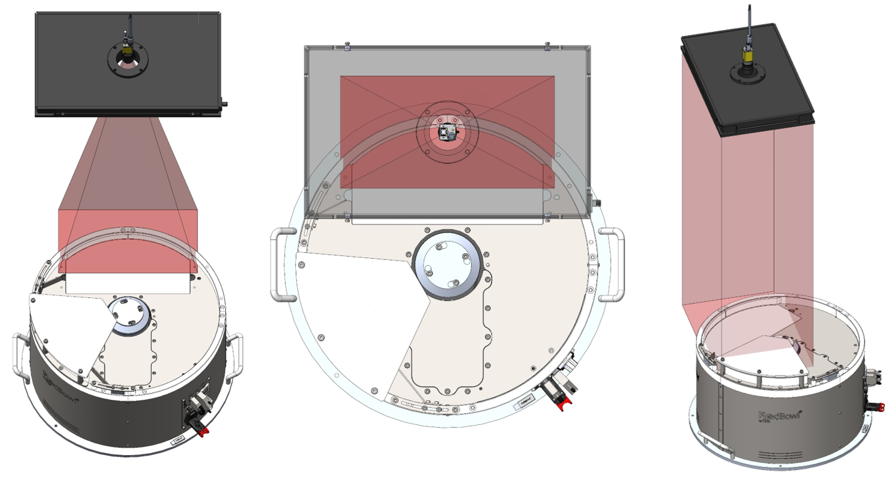

# **Lighting**

(backlight)=
# **Backlight**

Il Backlight è una luce localizzata sotto la finestra di lexan del piano di scorrimento, così che la sua luce possa colpire la superficie o il disco rigido e che la silhouette dei componenti al di sopra diventi visibile al sistema di visione. 
Il Backlight è disponibile con luce: 
- Bianca
- Rossa
- Infrarossa

:::{important}
Il Backlight infrarosso emette luce non visibile e perciò può apparire non funzionante. Controllare con una telecamera con un filtro ad infrarossi installato per verificarne il funzionamento. La maggior parte degli smartphone visualizzano gli infrarossi.
:::

Esistono inoltre due tipi di Backlight:
- Standard: viene alimentato in modo continuo internamente ed è possibile ocmandarne l'accensione e lo spegnimento tramite software o I/O digitali;
- Strobe: viene controllato esternamente tramite l'ingresso "strobe" del connettore input. Sarà cura del cliente portare la corretta alimentazione 24Vdc per accenderlo.

## Caratteristiche dei Backlight

```{dropdown} Backlight per FB200


| Articoli | CE001136 | CE001132 | CE001134 |
|--|--|--|--|
| Colore LED | rosso | infrarosso | bianco |
| Lunghezza d’onda | 630 nm | 850 nm | N/D |
| Tensione | 24VDC | 24VDC | 24VDC |
| Corrente | 0.17A | 0.12A | 0.17A |
| Area di illuminazione | 155x75 mm^2 |  |  |
| Materiale struttura | Lega di alluminio |  |  |
| Temperatura di esercizio | -40 / +85 °C |  |  |
| Lunghezza cavo | 0.2 m |  |  |
| Metodo di raffreddamento | Aria naturale |  |  |
| Materiale opalino | Vetro 3+3 con plastico bianco latte |  |  |
```

```{dropdown} Backlight per FB350


| Articoli | CE001142 | CE001139 | CE001140 |
|--|--|--|--|
| Colore LED | rosso | infrarosso | bianco |
| Lunghezza d’onda | 630 nm | 850 nm | N/D |
| Tensione | 24VDC | 24VDC | 24VDC |
| Corrente | 0.18A | 0.13A | 0.18A |
| Area di illuminazione | 220x100 mm^2 |  |  |
| Materiale struttura | Lega di alluminio |  |  |
| Temperatura di esercizio | -40 / +85 °C |  |  |
| Lunghezza cavo | 0.2 m |  |  |
| Metodo di raffreddamento | Aria naturale |  |  |
| Materiale opalino | Vetro 3+3 con plastico bianco latte |  |  |
```

```{dropdown} Backlight per FB500


| Articoli | CE001148 | CE001144 | CE001146 |
|--|--|--|--|
| Colore LED | rosso | infrarosso | bianco |
| Lunghezza d’onda | 630 nm | 850 nm | N/D |
| Tensione | 24VDC | 24VDC | 24VDC |
| Corrente | 0.46A | 0.31A | 0.46A |
| Area di illuminazione | 330x170 mm^2 |  |  |
| Materiale struttura | Lega di alluminio |  |  |
| Temperatura di esercizio | -40 / +85 °C |  |  |
| Lunghezza cavo | 0.2 m |  |  |
| Metodo di raffreddamento | Aria naturale |  |  |
| Materiale opalino | Vetro 3+3 con plastico bianco latte |  |  |
```

```{dropdown} Backlight per FB650


| Articoli | CE000306 | CE000273 | CE000305 |
|--|--|--|--|
| Articoli alternativi | GM000591 | GM000592 | GM000590 |
| Colore LED | rosso | infrarosso | bianco |
| Lunghezza d’onda | 630 nm | 850 nm | N/D |
| Tensione | 24VDC | 24VDC | 24VDC |
| Corrente | 0.86A | 0.56A | 0.94A |
| Area di illuminazione | 400x240 mm^2 |  |  |
| Materiale struttura | Lega di alluminio |  |  |
| Temperatura di esercizio | -40 / +85 °C |  |  |
| Lunghezza cavo | 0.2 m |  |  |
| Metodo di raffreddamento | Aria naturale |  |  |
| Materiale opalino | Vetro 3+3 con plastico bianco latte |  |  |
```

```{dropdown} Backlight per FB800


| Articoli | CE001154 | CE001150 | CE001152 |
|--|--|--|--|
| Colore LED | rosso | infrarosso | bianco |
| Lunghezza d’onda | 630 nm | 850 nm | N/D |
| Tensione | 24VDC | 24VDC | 24VDC |
| Corrente | 1.15A | 0.76A | 1.2A |
| Area di illuminazione | 400x315 mm^2 |  |  |
| Materiale struttura | Lega di alluminio |  |  |
| Temperatura di esercizio | -40 / +85 °C |  |  |
| Lunghezza cavo | 0.2 m |  |  |
| Metodo di raffreddamento | Aria naturale |  |  |
| Materiale opalino | Vetro 3+3 con plastico bianco latte |  |  |
```

```{dropdown} Backlight per FB1200


| Articoli | GE000051 | GE000052 | GE000050 |
|--|--|--|--|
| Colore LED | rosso | infrarosso | bianco |
| Lunghezza d’onda | 630 nm | 850 nm | N/D |
| Tensione | 24VDC | 24VDC | 24VDC |
| Corrente | 4A | 2.6A | 4.2A |
| Area di illuminazione | 917x525 mm^2 |  |  |
| Materiale struttura | Lega di alluminio |  |  |
| Temperatura di esercizio | -40 / +85 °C |  |  |
| Lunghezza cavo | 0.2 m |  |  |
| Metodo di raffreddamento | Aria naturale |  |  |
| Materiale opalino | Vetro 3+3 con plastico bianco latte |  |  |
```

## Colori dei Backlight

:::{list-table}
:widths: 15 15 70
:header-rows: 1

* - Colore
  - Lunghezza d'onda
  - Utilizzo consigliato

* - Red
  - 630 nm
  - Utilizzato per componenti metallici speciali. Lunghezza d’onda: 630 nm. È necessario schermare la cella da qualsiasi fonte di luce esterna e dalla luce solare.

* - IR
  - 850 nm
  - Preferito per la maggior parte dei tipi di applicazioni. Non è visibile all’occhio umano. Lunghezza d’onda: 850 nm. Si consiglia di schermare la cella per evitare interferenze con la luce solare.

* - White
  - N/D
  - Utilizzato con componenti trasparenti. È necessario schermare la cella da qualsiasi fonte di luce esterna e dalla luce solare.

:::


(toplight)=
# **Toplight**

Il Toplight è un illuminatore separato che viene montato all'altezza della telecamera e illumina l'area di visione del FlexiBowl® dall'alto, così che le features del componente che sono rivolte verso la telecamera siano messe in evidenza. È indicato principalmente per superfici lisce e non riflettenti, o superfici che presentano qualche tipo di marcatura distinguibile.
Il Toplight è disponibile con luce: 
- Bianca
- Rossa
- Infrarossa

:::{important}
Il Toplight infrarosso emette luce non visibile e perciò può apparire non funzionante. Controllare con una telecamera con un filtro ad infrarossi installato per verificarne il funzionamento. La maggior parte degli smartphone visualizzano gli infrarossi.
:::

## Caratteristiche dei Toplight

```{dropdown} TopLight 500x300 - White
Questa dimensione di Toplight è indicata per i modelli: FlexiBowl® 200, FlexiBowl® 350, FlexiBowl® 500

 
| Lunghezza | Larghezza | Altezza | Altezza con piastra di fissaggio | Diametro foro centrale | Superficie utile max [AxB] | Perimetro utile max |
|--|--|--|--|--|--|--|
| **A** | **B** | **C** | **C + 10mm** | **D** | - | - |
| 500 | 300 | 45 | 55 | 65 | 0.15 m^2 | 1.6 m |
 
:::{list-table}
:widths: 35 65
:header-rows: 0
 
* - **Codice**
  - CM002316
 
* - **Elettronica**
  -
 
* - Alimentazione
  - 24 VDC ±10%
 
* - Modalità di controllo
  - Continua
 
* - Tempo massimo di salita
  - 15 µs
 
* - Tempo massimo di discesa
  - 10 µs
 
* - Controllo
  - [Connettore M12](cablaggio_illuminatore)
 
* - Configurazione pin connettore
  - 1: 24VDC / 3: GND / 4: PNP
 
* - Consumo
  - 96.6W
 
* - Tensione minima di funzionamento
  - 20V sull’ingresso luce
 
* - Tensione nominale di funzionamento
  - 24V sull’ingresso luce (±10%)
 
* - Tensione massima di funzionamento
  - 30V sull’ingresso luce
 
* - Lunghezza d'onda
  -
 
* - Classe di Rischio
  - 0 (nesusn rischio)
 
* - **Meccanica**
  -
 
* - Spessore
  - 45mm + 10mm con piastra di fissaggio
 
* - Diametro interno
  - 65mm
 
* - Peso
  - 23.8 Kg/m² ±15%
 
* - Materiali
  - Alluminio e ABS caricato
 
* - Diffusore
  - PMMA bianco
 
* - Fissaggio
  - 4 dadi M4 (forniti) da inserire nella scanalatura
    oppure 4 viti M4x20 (non fornite) applicate agli angoli
 
* - **Ambiente**
  -
 
* - Temperatura di esercizio
  - -10°C a +40°C / 80% di umidità senza condensa
    Nessuno shock termico (variazione massima: 10°C in 24h)
 
* - Temperatura di stoccaggio
  - -20°C a +60°C / 80% di umidità senza condensa
    Nessuno shock termico (variazione massima: 10°C in 24h)
 
* - Grado di protezione IP
  - IP 50
 
* - Marcature
  - RoHS-CE-DEEE, UL
:::
 
```
```{dropdown} TopLight 500x300 - Red  
Questa dimensione di Toplight è indicata per i modelli: FlexiBowl® 200, FlexiBowl® 350, FlexiBowl® 500

 
| Lunghezza | Larghezza | Altezza | Altezza con piastra di fissaggio | Diametro foro centrale | Superficie utile max [AxB] | Perimetro utile max |
|--|--|--|--|--|--|--|
| **A** | **B** | **C** | **C + 10mm** | **D** | - | - |
| 500 | 300 | 45 | 55 | 65 | 0.15 m^2 | 1.6 m |
 
:::{list-table}
:widths: 35 65
:header-rows: 0
 
* - **Codice**
  - CM002401
 
* - **Elettronica**
  -
 
* - Alimentazione
  - 24 VDC ±10%
 
* - Modalità di controllo
  - Continua
 
* - Tempo massimo di salita
  - 15 µs
 
* - Tempo massimo di discesa
  - 10 µs
 
* - Controllo
  - [Connettore M12](cablaggio_illuminatore)
 
* - Configurazione pin connettore
  - 1: 24VDC / 3: GND / 4: PNP
 
* - Consumo
  - 96.6W @24 Vdc
 
* - Tensione minima di funzionamento
  - 20V sull’ingresso luce
 
* - Tensione nominale di funzionamento
  - 24V sull’ingresso luce (±10%)
 
* - Tensione massima di funzionamento
  - 30V sull’ingresso luce
 
* - Lunghezza d'onda
  - 630 nm
 
* - Classe di Rischio
  - 0 (nesusn rischio)
 
 
* - **Meccanica**
  -
 
* - Spessore
  - 45mm + 10mm con piastra di fissaggio
 
* - Diametro interno
  - 65mm
 
* - Peso
  - 23.8 Kg/m² ±15%
 
* - Materiali
  - Alluminio e ABS caricato
 
* - Diffusore
  - PMMA bianco
 
* - Fissaggio
  - 4 dadi M4 (forniti) da inserire nella scanalatura
    oppure 4 viti M4x20 (non fornite) applicate agli angoli
 
* - **Ambiente**
  -
 
* - Temperatura di esercizio
  - -10°C a +40°C / 80% di umidità senza condensa
    Nessuno shock termico (variazione massima: 10°C in 24h)
 
* - Temperatura di stoccaggio
  - -20°C a +60°C / 80% di umidità senza condensa
    Nessuno shock termico (variazione massima: 10°C in 24h)
 
* - Grado di protezione IP
  - IP 50
 
* - Marcature
  - RoHS-CE-DEEE, UL
:::
 
```
 
```{dropdown} TopLight 500x300 - Infrared
Questa dimensione di Toplight è indicata per i modelli: FlexiBowl® 200, FlexiBowl® 350, FlexiBowl® 500

 
| Lunghezza | Larghezza | Altezza | Altezza con piastra di fissaggio | Diametro foro centrale | Superficie utile max [AxB] | Perimetro utile max |
|--|--|--|--|--|--|--|
| **A** | **B** | **C** | **C + 10mm** | **D** | - | - |
| 500 | 300 | 45 | 55 | 65 | 0.15 m^2 | 1.6 m |
 
:::{list-table}
:widths: 35 65
:header-rows: 0
 
* - **Codice**
  - CM002405
 
* - **Elettronica**
  -
 
* - Alimentazione
  - 24 VDC ±10%
 
* - Modalità di controllo
  - Continua
 
* - Tempo massimo di salita
  - 15 µs
 
* - Tempo massimo di discesa
  - 10 µs
 
* - Controllo
  - [Connettore M12](cablaggio_illuminatore)
 
* - Configurazione pin connettore
  - 1: 24VDC / 3: GND / 4: PNP
 
* - Consumo
  - 96.6W @24 Vdc
 
* - Tensione minima di funzionamento
  - 20V sull’ingresso luce
 
* - Tensione nominale di funzionamento
  - 24V sull’ingresso luce (±10%)
 
* - Tensione massima di funzionamento
  - 30V sull’ingresso luce
 
* - Lunghezza d'onda
  - 850 nm
 
* - Classe di Rischio
  - 1 (basso rischio)
 
* - **Meccanica**
  -
 
* - Spessore
  - 45mm + 10mm con piastra di fissaggio
 
* - Diametro interno
  - 65mm
 
* - Peso
  - 23.8 Kg/m² ±15%
 
* - Materiali
  - Alluminio e ABS caricato
 
* - Diffusore
  - PMMA bianco
 
* - Fissaggio
  - 4 dadi M4 (forniti) da inserire nella scanalatura
    oppure 4 viti M4x20 (non fornite) applicate agli angoli
 
* - **Ambiente**
  -
 
* - Temperatura di esercizio
  - -10°C a +40°C / 80% di umidità senza condensa
    Nessuno shock termico (variazione massima: 10°C in 24h)
 
* - Temperatura di stoccaggio
  - -20°C a +60°C / 80% di umidità senza condensa
    Nessuno shock termico (variazione massima: 10°C in 24h)
 
* - Grado di protezione IP
  - IP 50
 
* - Marcature
  - RoHS-CE-DEEE, UL
:::
 
```
 
```{dropdown} TopLight 700x300 - White
Questa dimensione di Toplight è indicata per i modelli: FlexiBowl® 650, FlexiBowl® 800

 
| Lunghezza | Larghezza | Altezza | Altezza con piastra di fissaggio | Diametro foro centrale | Superficie utile max [AxB] | Perimetro utile max |
|--|--|--|--|--|--|--|
| **A** | **B** | **C** | **C + 10mm** | **D** | - | - |
| 700 | 300 | 45 | 55 | 65 | 0.21 m^2 | 2 m |
 
:::{list-table}
:widths: 35 65
:header-rows: 0
 
* - **Codice**
  - CM002317
 
* - **Elettronica**
  -
 
* - Alimentazione
  - 24 VDC ±10%
 
* - Modalità di controllo
  - Continua
 
* - Tempo massimo di salita
  - 15 µs
 
* - Tempo massimo di discesa
  - 10 µs
 
* - Controllo
  - [Connettore M12](cablaggio_illuminatore)
 
* - Configurazione pin connettore
  - 1: 24VDC / 3: GND / 4: PNP
 
* - Consumo
  - 135.6W @24 Vdc
 
* - Tensione minima di funzionamento
  - 20V sull’ingresso luce
 
* - Tensione nominale di funzionamento
  - 24V sull’ingresso luce (±10%)
 
* - Tensione massima di funzionamento
  - 30V sull’ingresso luce
 
* - Lunghezza d'onda
  -
 
* - Classe di Rischio
  - 0 (nesusn rischio)
 
* - **Meccanica**
  -
 
* - Spessore
  - 45mm + 10mm con piastra di fissaggio
 
* - Diametro interno
  - 65mm
 
* - Peso
  - 23.8 Kg/m² ±15%
 
* - Materiali
  - Alluminio e ABS caricato
 
* - Diffusore
  - PMMA bianco
 
* - Fissaggio
  - 4 dadi M4 (forniti) da inserire nella scanalatura
    oppure 4 viti M4x20 (non fornite) applicate agli angoli
 
* - **Ambiente**
  -
 
* - Temperatura di esercizio
  - -10°C a +40°C / 80% di umidità senza condensa
    Nessuno shock termico (variazione massima: 10°C in 24h)
 
* - Temperatura di stoccaggio
  - -20°C a +60°C / 80% di umidità senza condensa
    Nessuno shock termico (variazione massima: 10°C in 24h)
 
* - Grado di protezione IP
  - IP 50
 
* - Marcature
  - RoHS-CE-DEEE, UL
:::
```
 
```{dropdown} TopLight 700x300 - Red
Questa dimensione di Toplight è indicata per i modelli: FlexiBowl® 650, FlexiBowl® 800

 
| Lunghezza | Larghezza | Altezza | Altezza con piastra di fissaggio | Diametro foro centrale | Superficie utile max [AxB] | Perimetro utile max |
|--|--|--|--|--|--|--|
| **A** | **B** | **C** | **C + 10mm** | **D** | - | - |
| 700 | 300 | 45 | 55 | 65 | 0.21 m^2 | 2 m |
 
:::{list-table}
:widths: 35 65
:header-rows: 0
 
 * - **Codice**
   - CM002402
 
* - **Elettronica**
  -
 
* - Alimentazione
  - 24 VDC ±10%
 
* - Modalità di controllo
  - Continua
 
* - Tempo massimo di salita
  - 15 µs
 
* - Tempo massimo di discesa
  - 10 µs
 
* - Controllo
  - [Connettore M12](cablaggio_illuminatore)
 
* - Configurazione pin connettore
  - 1: 24VDC / 3: GND / 4: PNP
 
* - Consumo
  - 135.6W @24 Vdc
 
* - Tensione minima di funzionamento
  - 20V sull’ingresso luce
 
* - Tensione nominale di funzionamento
  - 24V sull’ingresso luce (±10%)
 
* - Tensione massima di funzionamento
  - 30V sull’ingresso luce
 
* - Lunghezza d'onda
  - 630 nm
 
* - Classe di Rischio
  - 0 (nesusn rischio)
 
* - **Meccanica**
  -
 
* - Spessore
  - 45mm + 10mm con piastra di fissaggio
 
* - Diametro interno
  - 65mm
 
* - Peso
  - 23.8 Kg/m² ±15%
 
* - Materiali
  - Alluminio e ABS caricato
 
* - Diffusore
  - PMMA bianco
 
* - Fissaggio
  - 4 dadi M4 (forniti) da inserire nella scanalatura
    oppure 4 viti M4x20 (non fornite) applicate agli angoli
 
* - **Ambiente**
  -
 
* - Temperatura di esercizio
  - -10°C a +40°C / 80% di umidità senza condensa
    Nessuno shock termico (variazione massima: 10°C in 24h)
 
* - Temperatura di stoccaggio
  - -20°C a +60°C / 80% di umidità senza condensa
    Nessuno shock termico (variazione massima: 10°C in 24h)
 
* - Grado di protezione IP
  - IP 50
 
* - Marcature
  - RoHS-CE-DEEE, UL
:::
```
 
```{dropdown} TopLight 700x300 - Infrared
Questa dimensione di Toplight è indicata per i modelli: FlexiBowl® 650, FlexiBowl® 800

 
| Lunghezza | Larghezza | Altezza | Altezza con piastra di fissaggio | Diametro foro centrale | Superficie utile max [AxB] | Perimetro utile max |
|--|--|--|--|--|--|--|
| **A** | **B** | **C** | **C + 10mm** | **D** | - | - |
| 700 | 300 | 45 | 55 | 65 | 0.21 m^2 | 2 m |
 
:::{list-table}
:widths: 35 65
:header-rows: 0
 
* - **Codice**
  - CM002406
 
* - **Elettronica**
  -
 
* - Alimentazione
  - 24 VDC ±10%
 
* - Modalità di controllo
  - Continua
 
* - Tempo massimo di salita
  - 15 µs
 
* - Tempo massimo di discesa
  - 10 µs
 
* - Controllo
  - [Connettore M12](cablaggio_illuminatore)
 
* - Configurazione pin connettore
  - 1: 24VDC / 3: GND / 4: PNP
 
* - Consumo
  - 135.6W @24 Vdc
 
* - Tensione minima di funzionamento
  - 20V sull’ingresso luce
 
* - Tensione nominale di funzionamento
  - 24V sull’ingresso luce (±10%)
 
* - Tensione massima di funzionamento
  - 30V sull’ingresso luce
 
* - Lunghezza d'onda
  - 850 nm
 
* - Classe di Rischio
  - 1 (basso rischio)
 
* - **Meccanica**
  -
 
* - Spessore
  - 45mm + 10mm con piastra di fissaggio
 
* - Diametro interno
  - 65mm
 
* - Peso
  - 23.8 Kg/m² ±15%
 
* - Materiali
  - Alluminio e ABS caricato
 
* - Diffusore
  - PMMA bianco
 
* - Fissaggio
  - 4 dadi M4 (forniti) da inserire nella scanalatura
    oppure 4 viti M4x20 (non fornite) applicate agli angoli
 
* - **Ambiente**
  -
 
* - Temperatura di esercizio
  - -10°C a +40°C / 80% di umidità senza condensa
    Nessuno shock termico (variazione massima: 10°C in 24h)
 
* - Temperatura di stoccaggio
  - -20°C a +60°C / 80% di umidità senza condensa
    Nessuno shock termico (variazione massima: 10°C in 24h)
 
* - Grado di protezione IP
  - IP 50
 
* - Marcature
  - RoHS-CE-DEEE, UL
:::
```
 
```{dropdown} TopLight 700x500 - White
Questa dimensione di Toplight è indicata per i modelli: FlexiBowl® 650, FlexiBowl® 800

 
| Lunghezza | Larghezza | Altezza | Altezza con piastra di fissaggio | Diametro foro centrale | Superficie utile max [AxB] | Perimetro utile max |
|--|--|--|--|--|--|--|
| **A** | **B** | **C** | **C + 10mm** | **D** | - | - |
| 700 | 500 | 45 | 55 | 65 | 0.35 m^2 | 2.4 m |
 
:::{list-table}
:widths: 35 65
:header-rows: 0
 
* - **Codice**
  - CM002318
 
* - **Elettronica**
  -
 
* - Alimentazione
  - 24 VDC ±10%
 
* - Modalità di controllo
  - Continua
 
* - Tempo massimo di salita
  - 15 µs
 
* - Tempo massimo di discesa
  - 10 µs
 
* - Controllo
  - [Connettore M12](cablaggio_illuminatore)
 
* - Configurazione pin connettore
  - 1: 24VDC / 3: GND / 4: PNP
 
* - Consumo
  - 252.6W @24 Vdc
 
* - Tensione minima di funzionamento
  - 20V sull’ingresso luce
 
* - Tensione nominale di funzionamento
  - 24V sull’ingresso luce (±10%)
 
* - Tensione massima di funzionamento
  - 30V sull’ingresso luce
 
* - Lunghezza d'onda
  -
 
* - Classe di Rischio
  - 0 (nesusn rischio)
 
* - **Meccanica**
  -
 
* - Spessore
  - 45mm + 10mm con piastra di fissaggio
 
* - Diametro interno
  - 65mm
 
* - Peso
  - 23.8 Kg/m² ±15%
 
* - Materiali
  - Alluminio e ABS caricato
 
* - Diffusore
  - PMMA bianco
 
* - Fissaggio
  - 4 dadi M4 (forniti) da inserire nella scanalatura
    oppure 4 viti M4x20 (non fornite) applicate agli angoli
 
* - **Ambiente**
  -
 
* - Temperatura di esercizio
  - -10°C a +40°C / 80% di umidità senza condensa
    Nessuno shock termico (variazione massima: 10°C in 24h)
 
* - Temperatura di stoccaggio
  - -20°C a +60°C / 80% di umidità senza condensa
    Nessuno shock termico (variazione massima: 10°C in 24h)
 
* - Grado di protezione IP
  - IP 50
 
* - Marcature
  - RoHS-CE-DEEE, UL
:::
```
 
```{dropdown} TopLight 700x500 - Red
Questa dimensione di Toplight è indicata per i modelli: FlexiBowl® 650, FlexiBowl® 800

 
| Lunghezza | Larghezza | Altezza | Altezza con piastra di fissaggio | Diametro foro centrale | Superficie utile max [AxB] | Perimetro utile max |
|--|--|--|--|--|--|--|
| **A** | **B** | **C** | **C + 10mm** | **D** | - | - |
| 700 | 500 | 45 | 55 | 65 | 0.35 m^2 | 2.4 m |
 
:::{list-table}
:widths: 35 65
:header-rows: 0
 
* - **Codice**
  - CM002403
 
* - **Elettronica**
  -
 
* - Alimentazione
  - 24 VDC ±10%
 
* - Modalità di controllo
  - Continua
 
* - Tempo massimo di salita
  - 15 µs
 
* - Tempo massimo di discesa
  - 10 µs
 
* - Controllo
  - [Connettore M12](cablaggio_illuminatore)
 
* - Configurazione pin connettore
  - 1: 24VDC / 3: GND / 4: PNP
 
* - Consumo
  - 252.6W @24 Vdc
 
* - Tensione minima di funzionamento
  - 20V sull’ingresso luce
 
* - Tensione nominale di funzionamento
  - 24V sull’ingresso luce (±10%)
 
* - Tensione massima di funzionamento
  - 30V sull’ingresso luce
 
* - Lunghezza d'onda
  - 630 nm
 
* - Classe di Rischio
  - 0 (nesusn rischio)
 
* - **Meccanica**
  -
 
* - Spessore
  - 45mm + 10mm con piastra di fissaggio
 
* - Diametro interno
  - 65mm
 
* - Peso
  - 23.8 Kg/m² ±15%
 
* - Materiali
  - Alluminio e ABS caricato
 
* - Diffusore
  - PMMA bianco
 
* - Fissaggio
  - 4 dadi M4 (forniti) da inserire nella scanalatura
    oppure 4 viti M4x20 (non fornite) applicate agli angoli
 
* - **Ambiente**
  -
 
* - Temperatura di esercizio
  - -10°C a +40°C / 80% di umidità senza condensa
    Nessuno shock termico (variazione massima: 10°C in 24h)
 
* - Temperatura di stoccaggio
  - -20°C a +60°C / 80% di umidità senza condensa
    Nessuno shock termico (variazione massima: 10°C in 24h)
 
* - Grado di protezione IP
  - IP 50
 
* - Marcature
  - RoHS-CE-DEEE, UL
:::
```
 
```{dropdown} TopLight 700x500 - Infrared
Questa dimensione di Toplight è indicata per i modelli: FlexiBowl® 650, FlexiBowl® 800

 
| Lunghezza | Larghezza | Altezza | Altezza con piastra di fissaggio | Diametro foro centrale | Superficie utile max [AxB] | Perimetro utile max |
|--|--|--|--|--|--|--|
| **A** | **B** | **C** | **C + 10mm** | **D** | - | - |
| 700 | 500 | 45 | 55 | 65 | 0.35 m^2 | 2.4 m |
 
:::{list-table}
:widths: 35 65
:header-rows: 0
 
* - **Codice**
  - CM002407
 
* - **Elettronica**
  -
 
* - Alimentazione
  - 24 VDC ±10%
 
* - Modalità di controllo
  - Continua
 
* - Tempo massimo di salita
  - 15 µs
 
* - Tempo massimo di discesa
  - 10 µs
 
* - Controllo
  - [Connettore M12](cablaggio_illuminatore)
 
* - Configurazione pin connettore
  - 1: 24VDC / 3: GND / 4: PNP
 
* - Consumo
  - 252.6W @24 Vdc
 
* - Tensione minima di funzionamento
  - 20V sull’ingresso luce
 
* - Tensione nominale di funzionamento
  - 24V sull’ingresso luce (±10%)
 
* - Tensione massima di funzionamento
  - 30V sull’ingresso luce
 
* - Lunghezza d'onda
  - 850 nm
 
* - Classe di Rischio
  - 1 (basso rischio)
 
* - **Meccanica**
  -
 
* - Spessore
  - 45mm + 10mm con piastra di fissaggio
 
* - Diametro interno
  - 65mm
 
* - Peso
  - 23.8 Kg/m² ±15%
 
* - Materiali
  - Alluminio e ABS caricato
 
* - Diffusore
  - PMMA bianco
 
* - Fissaggio
  - 4 dadi M4 (forniti) da inserire nella scanalatura
    oppure 4 viti M4x20 (non fornite) applicate agli angoli
 
* - **Ambiente**
  -
 
* - Temperatura di esercizio
  - -10°C a +40°C / 80% di umidità senza condensa
    Nessuno shock termico (variazione massima: 10°C in 24h)
 
* - Temperatura di stoccaggio
  - -20°C a +60°C / 80% di umidità senza condensa
    Nessuno shock termico (variazione massima: 10°C in 24h)
 
* - Grado di protezione IP
  - IP 50
 
* - Marcature
  - RoHS-CE-DEEE, UL
:::
```
 
```{dropdown} TopLight 900x600 - White
Questa dimensione di Toplight è indicata per il modelli FlexiBowl® 1200

 
| Lunghezza | Larghezza | Altezza | Altezza con piastra di fissaggio | Diametro foro centrale | Superficie utile max [AxB] | Perimetro utile max |
|--|--|--|--|--|--|--|
| **A** | **B** | **C** | **C + 10mm** | **D** | - | - |
| 900 | 600 | 45 | 55 | 65 | 0.54 m^2 | 3 m |
 
:::{list-table}
:widths: 35 65
:header-rows: 0
 
* - **Codice**
  - CM002319
 
* - **Elettronica**
  -
 
* - Alimentazione
  - 24 VDC ±10%
 
* - Modalità di controllo
  - Continua
 
* - Tempo massimo di salita
  - 15 µs
 
* - Tempo massimo di discesa
  - 10 µs
 
* - Controllo
  - [Connettore M12](cablaggio_illuminatore)
 
* - Configurazione pin connettore
  - 1: 24VDC / 3: GND / 4: PNP
 
* - Consumo
  - 345.6W @24 Vdc
 
* - Tensione minima di funzionamento
  - 20V sull’ingresso luce
 
* - Tensione nominale di funzionamento
  - 24V sull’ingresso luce (±10%)
 
* - Tensione massima di funzionamento
  - 30V sull’ingresso luce
 
* - Lunghezza d'onda
  -
 
* - Classe di Rischio
  - 0 (nesusn rischio)
 
* - **Meccanica**
  -
 
* - Spessore
  - 45mm + 10mm con piastra di fissaggio
 
* - Diametro interno
  - 65mm
 
* - Peso
  - 23.8 Kg/m² ±15%
 
* - Materiali
  - Alluminio e ABS caricato
 
* - Diffusore
  - PMMA bianco
 
* - Fissaggio
  - 4 dadi M4 (forniti) da inserire nella scanalatura
    oppure 4 viti M4x20 (non fornite) applicate agli angoli
 
* - **Ambiente**
  -
 
* - Temperatura di esercizio
  - -10°C a +40°C / 80% di umidità senza condensa
    Nessuno shock termico (variazione massima: 10°C in 24h)
 
* - Temperatura di stoccaggio
  - -20°C a +60°C / 80% di umidità senza condensa
    Nessuno shock termico (variazione massima: 10°C in 24h)
 
* - Grado di protezione IP
  - IP 50
 
* - Marcature
  - RoHS-CE-DEEE, UL
:::
```
```{dropdown} TopLight 900x600 - Red
Questa dimensione di Toplight è indicata per il modelli FlexiBowl® 1200

 
| Lunghezza | Larghezza | Altezza | Altezza con piastra di fissaggio | Diametro foro centrale | Superficie utile max [AxB] | Perimetro utile max |
|--|--|--|--|--|--|--|
| **A** | **B** | **C** | **C + 10mm** | **D** | - | - |
| 900 | 600 | 45 | 55 | 65 | 0.54 m^2 | 3 m |
 
:::{list-table}
:widths: 35 65
:header-rows: 0
 
* - **Codice**
  - CM002404
 
* - **Elettronica**
  -
 
* - Alimentazione
  - 24 VDC ±10%
 
* - Modalità di controllo
  - Continua
 
* - Tempo massimo di salita
  - 15 µs
 
* - Tempo massimo di discesa
  - 10 µs
 
* - Controllo
  - [Connettore M12](cablaggio_illuminatore)
 
* - Configurazione pin connettore
  - 1: 24VDC / 3: GND / 4: PNP
 
* - Consumo
  - 345.6W @24 Vdc
 
* - Tensione minima di funzionamento
  - 20V sull’ingresso luce
 
* - Tensione nominale di funzionamento
  - 24V sull’ingresso luce (±10%)
 
* - Tensione massima di funzionamento
  - 30V sull’ingresso luce
 
* - Lunghezza d'onda
  - 630 nm
 
* - Classe di Rischio
  - 0 (nesusn rischio)
 
* - **Meccanica**
  -
 
* - Spessore
  - 45mm + 10mm con piastra di fissaggio
 
* - Diametro interno
  - 65mm
 
* - Peso
  - 23.8 Kg/m² ±15%
 
* - Materiali
  - Alluminio e ABS caricato
 
* - Diffusore
  - PMMA bianco
 
* - Fissaggio
  - 4 dadi M4 (forniti) da inserire nella scanalatura
    oppure 4 viti M4x20 (non fornite) applicate agli angoli
 
* - **Ambiente**
  -
 
* - Temperatura di esercizio
  - -10°C a +40°C / 80% di umidità senza condensa
    Nessuno shock termico (variazione massima: 10°C in 24h)
 
* - Temperatura di stoccaggio
  - -20°C a +60°C / 80% di umidità senza condensa
    Nessuno shock termico (variazione massima: 10°C in 24h)
 
* - Grado di protezione IP
  - IP 50
 
* - Marcature
  - RoHS-CE-DEEE, UL
:::
```
 
```{dropdown} TopLight 900x600 - Infrared
Questa dimensione di Toplight è indicata per il modelli FlexiBowl® 1200

 
| Lunghezza | Larghezza | Altezza | Altezza con piastra di fissaggio | Diametro foro centrale | Superficie utile max [AxB] | Perimetro utile max |
|--|--|--|--|--|--|--|
| **A** | **B** | **C** | **C + 10mm** | **D** | - | - |
| 900 | 600 | 45 | 55 | 65 | 0.54 m^2 | 3 m |
 
:::{list-table}
:widths: 35 65
:header-rows: 0
 
* - **Codice**
  - CM002408
 
* - **Elettronica**
  -
 
* - Alimentazione
  - 24 VDC ±10%
 
* - Modalità di controllo
  - Continua
 
* - Tempo massimo di salita
  - 15 µs
 
* - Tempo massimo di discesa
  - 10 µs
 
* - Controllo
  - [Connettore M12](cablaggio_illuminatore)
 
* - Configurazione pin connettore
  - 1: 24VDC / 3: GND / 4: PNP
 
* - Consumo
  - 345.6W @24 Vdc
 
* - Tensione minima di funzionamento
  - 20V sull’ingresso luce
 
* - Tensione nominale di funzionamento
  - 24V sull’ingresso luce (±10%)
 
* - Tensione massima di funzionamento
  - 30V sull’ingresso luce
 
* - Lunghezza d'onda
  - 850 nm
 
* - Classe di Rischio
  - 1 (basso rischio)
 
* - **Meccanica**
  -
 
* - Spessore
  - 45mm + 10mm con piastra di fissaggio
 
* - Diametro interno
  - 65mm
 
* - Peso
  - 23.8 Kg/m² ±15%
 
* - Materiali
  - Alluminio e ABS caricato
 
* - Diffusore
  - PMMA bianco
 
* - Fissaggio
  - 4 dadi M4 (forniti) da inserire nella scanalatura
    oppure 4 viti M4x20 (non fornite) applicate agli angoli
 
* - **Ambiente**
  -
 
* - Temperatura di esercizio
  - -10°C a +40°C / 80% di umidità senza condensa
    Nessuno shock termico (variazione massima: 10°C in 24h)
 
* - Temperatura di stoccaggio
  - -20°C a +60°C / 80% di umidità senza condensa
    Nessuno shock termico (variazione massima: 10°C in 24h)
 
* - Grado di protezione IP
  - IP 50
 
* - Marcature
  - RoHS-CE-DEEE, UL
:::
```

## Colori dei Toplight

:::{list-table}
:widths: 15 15 70
:header-rows: 1

* - Colore
  - Lunghezza d'onda
  - Utilizzo consigliato

* - Red
  - 630 nm
  - Utilizzato per componenti metallici speciali. Lunghezza d’onda: 630 nm. È necessario schermare la cella da qualsiasi fonte di luce esterna e dalla luce solare.

* - IR
  - 850 nm
  - Preferito per la maggior parte dei tipi di applicazioni. Non è visibile all’occhio umano. Lunghezza d’onda: 850 nm. Si consiglia di schermare la cella per evitare interferenze con la luce solare.

* - White
  - N/D
  - Utilizzato con componenti trasparenti. È necessario schermare la cella da qualsiasi fonte di luce esterna e dalla luce solare.

:::

### *Cavo Alimentazione Toplight* 

```{image} ../../../../_shared/media/images/cavoalimtoplight1.png
:align: center
:width: 60%
```

| Codice   | Descrizione              | Connettore |
|----------|--------------------------|------------|
| CE001337 | Cavo Alimentazione Toplight 2M  | M12 4 Pin Female |
| CE001338 | Cavo Alimentazione Toplight power 5M | M12 4 Pin Female |
| CE001339 | Cavo Alimentazione Toplight power 10M | M12 4 Pin Female |

(staffa)=
### *Staffa per Montaggio Toplight* 
Per il [montaggio del toplight sul lato](montaggio_staffa) è possibile acquistare **a parte** un'apposita staffa. 

```{image} ../../../../_shared/media/images/staffa_montaggio.png
:align: center
:width: 80%
```
## Montaggio Toplight

Se l'ordine include un Toplight (illuminatore dall'alto), questo deve essere montato sulla stessa struttura di supporto della telecamera per garantire un'illuminazione uniforme della superficie di lavoro.

:::{attention}
Durante il montaggio, l'apparecchio deve essere spento e staccato dalla corrente.
:::
### *Dimensioni Toplight* 


| Lunghezza x Larghezza (mm) | Altezza (mm) | Altezza con piastra di fissaggio (mm) | Diametro foro centrale | Superficie utile massima [A x B] | Perimetro utile massimo |
|:---:|:---:|:---:|:---:|:---:|:---:|
| **A x B** | **C** | **C + 10 mm** | **D** | **–** | **–** |
| 500x300 | 45 | 55 | 65 | 0,15 m² | 1,6 m |
| 700x300 | 45 | 55 | 65 | 0,21 m² | 2 m |
| 700x500 | 45 | 55 | 65 | 0,35 m² | 2,4 m |
| 900x600 | 45 | 55 | 65 | 0,54 m² | 3 m |

### *Posizionamento Toplight* 
Il toplight deve essere posizionato centralmente rispetto alla superficie utile del pannello luminoso,
con l'ottica della telecamera montata all'interno del foro centrale, a filo con la superficie superiore del toplight.   
Le frecce rosse indicano le viti di fissaggio delle ghiere dell'obiettivo, una per la regolazione del fuoco e una per la regolazione del diaframma. Come mostrato nella figura, il toplight deve essere montato in modo che le due viti restino accessibili dall'alto. 


Il campo visivo della telecamera e il fascio luminoso del toplight (in verde) devono essere allineati concentricamente e perpendicolarmente rispetto all'area di visione sul FlexiBowl®.    
Come mostrato nelle tre viste (frontale, dall'alto e assonometrica), il toplight deve illuminare esattamente l'area inquadrata dalla telecamera, con entrambi i componenti centrati sull'asse ottico verticale del sistema.  


Un posizionamento errato si verifica quando il toplight e la telecamera non sono centrati sull'area di visione del FlexiBowl®.   
Come illustrato (in rosso), due errori tipici sono:  
- spostarsi in avanti o indietro rispetto all'area di visione.  
- ruotare il toplight rispetto ad essa.   
  
In entrambi i casi, l'illuminazione risulta disassata e non perpendicolare, compromettendo la qualità dell'acquisizione.



### *Procedura di installazione*
```{list-table}
:header-rows: 1
:widths: 35 65

* - **Fase**
  - **Istruzioni operative**
* - **1. Posizionamento**
  - Fissare il Toplight sulla struttura di supporto in posizione concentrica rispetto alla camera.
* - **2. Distanza dalla superficie**
  - Posizionare l'illuminatore a una distanza dalla superficie del FlexiBowl® simile a quella della camera per:
    
    * Minimizzare le ombre proiettate dai pezzi
    * Massimizzare l'uniformità luminosa
    * Evitare riflessioni dirette verso la camera
* - **3. Orientamento**
  - Assicurarsi che la superficie emittente del Toplight sia parallela alla superficie di lavoro del FlexiBowl®.
* - **4. Angolo di illuminazione**
  - Perpendicolare alla superficie (0° tilt).
* - **5. Fissaggio**
  - Secondo specifiche della modalità scelta (vedi sezione seguente).
```

### *Modalità di fissaggio*

Il Toplight può essere fissato in due modalità: sull'[angolo](angolo) o sul [lato](lato).

:::{note}
I componenti di fissaggio **non sono inclusi** nella fornitura del Toplight. Il montaggio può quindi essere personalizzato in base alle esigenze dell'installazione.

- Fissaggio sul lato (scanalatura): dadi M4 **forniti**
- Fissaggio sull'angolo: viti CHC M4x20 **non fornite**

In entrambi i casi si raccomanda l'uso di un **frenafiletti** (non fornito) per evitare allentamenti nel tempo. La coppia di serraggio consigliata è compresa tra **0,5 e 1,5 Nm**.
:::

(angolo)=
#### *1. Fissaggio sull'angolo*

Il fissaggio sull'angolo utilizza viti CHC M4x20 (non fornite) applicate nei fori posizionati ai quattro angoli del Toplight.
```{figure} ../../../../_shared/media/images/fissaggio_angolo.png
:alt: Fissaggio del Toplight sull'angolo con vite CHC M4x20
:align: center
:width: 60%

Fissaggio sull'angolo tramite vite CHC M4x20 (non fornita).
```

:::{figure} ../../../../_shared/media/images/tlfix-angoli.PNG 
:align: center
:width: 100%
:::

:::{list-table}
:widths: 33 33 33
:header-rows: 1

* - Taglia
  - 500x300
  - 700x300
  - 700x500
  - 900x600

* - Distanza A
  - 498 mm
  - 698 mm
  - 698 mm
  - 898 mm

* - Distanza B
  - 298 mm
  - 298 mm
  - 498 mm
  - 598 mm

:::

(lato)=
#### *2. Fissaggio sul lato (scanalatura)*

Il fissaggio sul lato utilizza 4 dadi M4 (forniti) da inserire nella scanalatura laterale del profilo del Toplight.  
   La profondità massima di inserimento del dado nella scanalatura è di **5 mm**.  
     Le Viti consigliate sono M4x8.

```{figure} ../../../../_shared/media/images/tlfix-sezione.PNG
:alt: Fissaggio del Toplight sul lato 
:align: center
:width: 100%

Fissaggio sul lato
```
(montaggio_staffa)=
##### Fissaggio laterale con staffe 
Nel caso in cui il Toplight venisse fissato con delle staffe: 

::::::{error}
:::::{grid} 2

::::{grid-item}
:::{figure} ../../../../_shared/media/images/tlfix-alto.PNG 
:align: center
:width: 100%

Non appendere l'illuminatore da un solo fianco
:::
::::

::::{grid-item}
:::{figure} ../../../../_shared/media/images/tlfix-staffedef.PNG 
:align: center
:width: 100%

Non deformare la struttura di fissaggio del Toplight
:::
::::
::::::

::::::{tip}

Seguono alcuni esempi di corretto fissaggio del TopLight:

:::::{grid} 2

::::{grid-item}
:::{figure} ../../../../_shared/media/images/tlfix-basso.PNG 
:align: center
:width: 100%
:::
::::

::::{grid-item}
:::{figure} ../../../../_shared/media/images/tlfix-steso.PNG 
:align: center
:width: 100%
:::
::::
::::::

:::{card}
  Per il Montaggio laterale è possibile acquistare **a parte** l'apposita [staffa](staffa).
:::


### *Cablaggio illuminatore*


```{list-table} 
:header-rows: 1
:widths: 30 70

* - Parametro
  - Requisito / Azione
* - **Tensione**
  - 24V DC (±10%). Tensione minima di funzionamento: 20V DC sull'ingresso luce.
* - **Connettore**
  - M12 5 poli (T-coding).
* - **Pinout connettore**
  - Pin 1: +24V (marrone) — Pin 3: GND (blu) — Pin 4: STROBE PNP (nero)
* - **Modalità STROBE (PNP)**
  - Da 5V a 24V per accensione al 100%. Da 0V a 1V per spegnimento al 100%.
* - **Modalità CONTINUA**
  - Pin 1 (+24V) e Pin 3 (GND) collegati; Pin 4 (PNP) collegato a Pin 1.
* - **Caduta di tensione (cavo M12, 10m)**
  - 1.15V @ 5A — 2.3V @ 10A — 3.5V @ 15A — 4.6V @ 20A (max 20A)
* - **Schermatura**
  - Utilizzare cavi schermati per ridurre le interferenze elettromagnetiche (EMI).
```
```{warning}
**Sicurezza elettrica**

- Rispettare le tensioni di alimentazione e i morsetti di connessione indicati.
- Non modificare né smontare il prodotto.
- Non collegare o pulire l'apparecchio quando è sotto tensione.
- Non guardare direttamente la sorgente luminosa.
```

### Schema dei fori di fissaggio


# **Backlight o Toplight?**

```{warning}
**Impatto sul riconoscimento pezzi**

La scelta tra backlight e toplight influenza significativamente il riconoscimento:

- **Backlight**: Ottimo per profili/sagome, pezzi appaiono come silhouette scure su sfondo chiaro
- **Toplight**: Necessario per riconoscere dettagli superficiali, texture, feature interne

La calibrazione, quando si utilizza una griglia di calibrazione ARS, dev'essere eseguita utilizzando l'illuminatore backlight e spegnere il toplight se presente.
```


### *Quando usare l'uno o l'altro*

```{eval-rst}
.. list-table::
   :widths: 20 50 30
   :header-rows: 1

   * - Illuminatore
     - Quando usarlo
     - Esempio
   * - **Toplight**
     - Utilizzato quando il riconoscimento del componente non può essere effettuato dalla sola forma, ma dai dettagli presenti sull'oggetto. È indicato principalmente per superfici lisce e non riflettenti, o superfici che presentano qualche tipo di marcatura distinguibile.
     - .. image:: ../../../../_shared/media/images/TOPLIGHT.png
          :width: 150px
   * - **Backlight**
     - Il caso d'uso principale del backlight è quando l'oggetto può essere riconosciuto dalla sua silhouette/forma oppure con parti trasparenti.
     - .. image:: ../../../../_shared/media/images/BACKLIGHT.png
          :width: 150px
```
#### *Casi d'uso tipici*

- Viti, bulloni, rondelle → **Backlight**
- Pezzi con stampe sulla faccia superiore, parti opache su superfici scure → **Toplight**
- Parti trasparenti o traslucide → **Backlight**
- Pezzi lucidi con riflessi → **Backlight**

---

(colore_illuminazione)=
## Colore dell'Illuminazione

### *Quando usare ciascun colore*

````{list-table}
   :widths: 20 50 30
   :header-rows: 1

* - Colore / Lunghezza d'onda
  - Utilizzo consigliato
  - Esempi
* - **Bianco**
  - Utilizzato con componenti trasparenti. È necessario schermare la cella da qualsiasi fonte di luce esterna e dalla luce solare.
  - ```{image} ../../../../_shared/media/images/WHITELIGHT1.png
      :width: 120px
    ```
    ```{figure} ../../../../_shared/media/images/WHITELIGHT2.png
      :width: 120px
    ```
* - **Rosso (630 nm)**
  - Utilizzato per componenti metallici speciali. Lunghezza d'onda: 630 nm. È necessario schermare la cella da qualsiasi fonte di luce esterna e dalla luce solare.
  - ```{image} ../../../../_shared/media/images/REDLIGHT1.png
      :width: 120px
    ```
    ```{figure} ../../../../_shared/media/images/REDLIGHT2.png
      :width: 120px
    ```
* - **Infrarosso (850 nm)**
  - Preferito per la maggior parte dei tipi di applicazioni. Non è visibile all'occhio umano. Lunghezza d'onda: 850 nm. Si consiglia di schermare la cella per evitare interferenze con la luce solare.
  - ```{image} ../../../../_shared/media/images/INFRARED1.png
      :width: 120px
    ```
    ```{figure} ../../../../_shared/media/images/INFRARED2.png
      :width: 120px
    ```
````
Per maggiori Informazioni sulla Schermatura della Luce Ambientale visitare la sezione [Schermatura Luce Ambientale](luce_ambientale).


<br>

<!-- Versions and languages set-up -->
<style>
  .fixed-bar {
    position: fixed;
    bottom: 10px;
    right: 10px;
    background: rgba(240, 240, 240, 0.85);
    border: 1px solid rgba(100, 100, 100, 0.3);
    border-radius: 6px;
    box-shadow: 0 1px 6px rgba(0, 0, 0, 0.1);
    font-family: 'Segoe UI', Tahoma, Geneva, Verdana, sans-serif;
    font-size: 0.9rem;
    color: #222;
    display: flex;
    gap: 12px;
    padding: 6px 12px;
    align-items: center;
    z-index: 9999;
    backdrop-filter: saturate(180%) blur(10px);
  }

  @media print {
    .fixed-bar {
      display: none !important;
    }
  }

  .fixed-bar .dropdown {
    position: relative;
    user-select: none;
  }

  .fixed-bar .dropdown-toggle {
    background-color: rgba(200, 200, 200, 0.4);
    color: #222;
    padding: 6px 10px;
    border: 1px solid rgba(100, 100, 100, 0.3);
    border-radius: 4px;
    cursor: pointer;
    display: flex;
    align-items: center;
    gap: 6px;
    box-shadow: 0 1px 2px rgba(0, 0, 0, 0.05);
    white-space: nowrap;
    transition: background-color 0.3s ease;
  }

  .fixed-bar .dropdown-toggle::after {
    content: none !important;
    display: none !important;
  }

  .fixed-bar .dropdown-toggle:hover {
    background-color: rgba(100, 150, 220, 0.2);
    color: #1a3e72;
    border-color: rgba(26, 62, 114, 0.6);
  }

  .fixed-bar .dropdown-toggle .fa {
    font-size: 0.9rem;
  }

  .fixed-bar .dropdown-menu {
    position: absolute;
    bottom: 100%;
    left: 0;
    background-color: rgba(250, 250, 250, 0.95);
    border: 1px solid rgba(150, 150, 150, 0.3);
    border-radius: 4px;
    box-shadow: 0 3px 8px rgba(0, 0, 0, 0.1);
    min-width: 140px;
    max-height: 200px;
    overflow-y: auto;
    display: none;
    flex-direction: column;
    z-index: 10000;
    backdrop-filter: saturate(180%) blur(8px);
  }

  .fixed-bar .dropdown-menu.show {
    display: flex;
  }

  .fixed-bar .dropdown-menu a {
    padding: 8px 12px;
    color: #1a3e72;
    text-decoration: none;
    border-bottom: 1px solid rgba(200, 200, 200, 0.5);
    white-space: nowrap;
    transition: background-color 0.25s ease;
  }

  .fixed-bar .dropdown-menu a:last-child {
    border-bottom: none;
  }

  .fixed-bar .dropdown-menu a:hover {
    background-color: rgba(100, 150, 220, 0.15);
  }

  .dropdown-download-buttons .btn__icon-container svg {
    width: 1em;
    height: 1em;
    stroke: currentColor;
    fill: none;
    stroke-width: 1.6;
    stroke-linecap: round;
    stroke-linejoin: round;
    vertical-align: middle;
  }

  a.headerlink.manual-heading-action {
    display: inline-flex;
    align-items: center;
    justify-content: center;
    margin-left: 0.2em;
    text-decoration: none;
    color: #7b8493;
    transition: color 0.2s ease, opacity 0.2s ease;
  }

  a.headerlink.manual-heading-action svg {
    width: 0.8em;
    height: 0.8em;
    stroke: currentColor;
    fill: none;
    stroke-width: 1.6;
    stroke-linecap: round;
    stroke-linejoin: round;
    vertical-align: middle;
  }

  a.headerlink.manual-feedback-link:hover,
  a.headerlink.manual-feedback-link:focus-visible {
    color: #2563eb;
  }

  a.headerlink.manual-service-link:hover,
  a.headerlink.manual-service-link:focus-visible {
    color: #d97706;
  }
</style>

<div class="fixed-bar" role="region" aria-label="Version and language selector">
  <div class="dropdown" data-selector="version">
    <div class="dropdown-toggle" tabindex="0" aria-haspopup="listbox" aria-expanded="false">
      Version: <span class="current-value">V. 1.0</span>
      <span class="caret-icon" aria-hidden="true">&#9662;</span>
    </div>
    <div class="dropdown-menu" role="listbox">
      	<a href="#" role="option">V. 1.0</a>
    </div>
  </div>

  <div class="dropdown" data-selector="language">
    <div class="dropdown-toggle" tabindex="0" aria-haspopup="listbox" aria-expanded="false">
      Language: <span class="current-value">EN</span>
      <span class="caret-icon" aria-hidden="true">&#9662;</span>
    </div>
    <div class="dropdown-menu" role="listbox">
      	<a href="#" role="option">DE</a>
				<a href="#" role="option">EN</a>
				<a href="#" role="option">ES</a>
				<a href="#" role="option">FR</a>
				<a href="#" role="option">IT</a>
    </div>
  </div>
</div>

<script>
  (function () {
    const bar = document.querySelector('.fixed-bar');
    if (!bar) {
      return;
    }

    const inlineVersions = ["V. 1.0"];
    const inlineLanguages = ["DE", "EN", "ES", "FR", "IT"];
    const manifest = window.FV_VERSIONING || null;
    const versions = Array.isArray(manifest && manifest.versions) && manifest.versions.length
      ? manifest.versions
      : inlineVersions;
    const offlineZipEnabled = false;
    const offlineZipFileName = 'Offline manual.zip';
    const americanRegions = new Set([
      'AG', 'AR', 'AW', 'BB', 'BL', 'BM', 'BO', 'BQ', 'BR', 'BS', 'BZ', 'CA', 'CL', 'CO', 'CR',
      'CU', 'CW', 'DM', 'DO', 'EC', 'FK', 'GD', 'GF', 'GL', 'GP', 'GT', 'GY', 'HN', 'HT', 'JM',
      'KN', 'KY', 'LC', 'MF', 'MQ', 'MS', 'MX', 'NI', 'PA', 'PE', 'PM', 'PR', 'PY', 'SR', 'SV',
      'SX', 'TC', 'TT', 'US', 'UY', 'VC', 'VE', 'VG', 'VI', '419'
    ]);
    const additionalAmericanTimeZones = new Set([
      'Atlantic/Bermuda',
      'Pacific/Easter',
      'Pacific/Galapagos',
      'Pacific/Honolulu',
      'Pacific/Pitcairn'
    ]);

    function setCaret(toggle, isOpen) {
      const caret = toggle.querySelector('.caret-icon');
      if (caret) {
        caret.innerHTML = isOpen ? '&#9652;' : '&#9662;';
      }
    }

    function closeAllMenus() {
      bar.querySelectorAll('.dropdown').forEach(dropdown => {
        const menu = dropdown.querySelector('.dropdown-menu');
        const toggle = dropdown.querySelector('.dropdown-toggle');
        menu.classList.remove('show');
        toggle.setAttribute('aria-expanded', 'false');
        setCaret(toggle, false);
      });
    }

    function getLanguagesForVersion(version) {
      const manifestLanguages = manifest &&
        manifest.languagesByVersion &&
        Array.isArray(manifest.languagesByVersion[version]) &&
        manifest.languagesByVersion[version].length
          ? manifest.languagesByVersion[version]
          : null;

      if (manifestLanguages) {
        return manifestLanguages;
      }

      return inlineLanguages;
    }

    function getDefaultLanguageForVersion(version) {
      const manifestDefault = manifest &&
        manifest.defaultLanguageByVersion &&
        typeof manifest.defaultLanguageByVersion[version] === 'string'
          ? manifest.defaultLanguageByVersion[version]
          : '';

      if (manifestDefault) {
        return manifestDefault;
      }

      const availableLanguages = getLanguagesForVersion(version);
      return availableLanguages.length ? availableLanguages[0] : (inlineLanguages[0] || '');
    }

    function populateSelectorMenu(selector, values) {
      const menu = bar.querySelector(`[data-selector="${selector}"] .dropdown-menu`);
      if (!menu) {
        return;
      }

      menu.innerHTML = '';
      values.forEach(value => {
        const link = document.createElement('a');
        link.href = '#';
        link.setAttribute('role', 'option');
        link.textContent = value;
        menu.appendChild(link);
      });
    }

    function getNavigationContext() {
      const currentUrl = new URL(window.location.href);
      const rawSegments = currentUrl.pathname.split('/').filter(Boolean);
      const decodedSegments = rawSegments.map(segment => decodeURIComponent(segment));
      const currentVersionLabel = bar.querySelector('[data-selector="version"] .current-value');
      const currentLanguageLabel = bar.querySelector('[data-selector="language"] .current-value');
      const fallbackVersion = currentVersionLabel ? currentVersionLabel.textContent.trim() : '';
      const versionIndex = decodedSegments.findIndex(segment => versions.includes(segment));
      const currentVersion = versionIndex !== -1 ? decodedSegments[versionIndex] : fallbackVersion;
      const availableLanguages = getLanguagesForVersion(currentVersion);
      const fallbackLanguage = currentLanguageLabel ? currentLanguageLabel.textContent.trim() : '';
      const languageIndex = decodedSegments.findIndex(
        (segment, index) => index > versionIndex && availableLanguages.includes(segment)
      );

      return {
        currentUrl: currentUrl,
        rawSegments: rawSegments,
        versionIndex: versionIndex,
        currentVersion: currentVersion,
        currentLanguage: languageIndex !== -1 ? decodedSegments[languageIndex] : fallbackLanguage
      };
    }

    function refreshNavigationMenus() {
      const context = getNavigationContext();
      const resolvedVersion = versions.includes(context.currentVersion) ? context.currentVersion : (versions[0] || context.currentVersion);
      const availableLanguages = getLanguagesForVersion(resolvedVersion);
      const resolvedLanguage = availableLanguages.includes(context.currentLanguage)
        ? context.currentLanguage
        : (getDefaultLanguageForVersion(resolvedVersion) || context.currentLanguage);

      populateSelectorMenu('version', versions);
      populateSelectorMenu('language', availableLanguages);

      const versionLabel = bar.querySelector('[data-selector="version"] .current-value');
      const languageLabel = bar.querySelector('[data-selector="language"] .current-value');
      if (versionLabel) {
        versionLabel.textContent = resolvedVersion;
      }
      if (languageLabel) {
        languageLabel.textContent = resolvedLanguage;
      }
    }

    function buildScopedUrl(targetVersion, targetLanguage, pageName) {
      const context = getNavigationContext();
      const rootSegments = context.versionIndex !== -1 ? context.rawSegments.slice(0, context.versionIndex) : [];
      const targetPath = '/' + rootSegments.concat([
        encodeURIComponent(targetVersion),
        encodeURIComponent(targetLanguage),
        encodeURIComponent(pageName)
      ]).join('/');

      if (context.currentUrl.protocol === 'file:') {
        return 'file://' + targetPath;
      }

      return context.currentUrl.origin + targetPath;
    }

    function buildTargetUrl(targetVersion, targetLanguage) {
      return buildScopedUrl(targetVersion, targetLanguage, 'index.html');
    }

    function buildSiteRootAssetUrl(fileName) {
      const context = getNavigationContext();
      const rootSegments = context.versionIndex !== -1 ? context.rawSegments.slice(0, context.versionIndex) : [];
      const targetPath = '/' + rootSegments.concat([encodeURIComponent(fileName)]).join('/');

      if (context.currentUrl.protocol === 'file:') {
        return 'file://' + targetPath;
      }

      return context.currentUrl.origin + targetPath;
    }

    function buildClientSiteZipUrl() {
      return buildSiteRootAssetUrl(offlineZipFileName);
    }

    function getHeadingText(heading) {
      const clone = heading.cloneNode(true);
      clone.querySelectorAll('a.headerlink').forEach(link => link.remove());
      return clone.textContent.replace(/\s+/g, ' ').trim();
    }

    function normalizeMailText(text) {
      return String(text || '').replace(/\u00AE/g, '');
    }

    function getTimeZoneAmericaDecision() {
      try {
        const timeZone = String(Intl.DateTimeFormat().resolvedOptions().timeZone || '').trim();
        if (!timeZone) {
          return null;
        }
        return timeZone.startsWith('America/') || additionalAmericanTimeZones.has(timeZone);
      } catch (error) {
        return null;
      }
    }

    function isCoordinateInAmericas(latitude, longitude) {
      if (!Number.isFinite(latitude) || !Number.isFinite(longitude)) {
        return null;
      }

      return latitude >= -60 && latitude <= 85 && longitude >= -170 && longitude <= -25;
    }

    function getCurrentPosition(options) {
      return new Promise((resolve, reject) => {
        if (!navigator.geolocation || typeof navigator.geolocation.getCurrentPosition !== 'function') {
          reject(new Error('Geolocation unavailable'));
          return;
        }

        navigator.geolocation.getCurrentPosition(resolve, reject, options);
      });
    }

    async function resolveServiceAddress() {
      const timeZoneDecision = getTimeZoneAmericaDecision();
      if (timeZoneDecision === false) {
        return 'service@arsautomation.com';
      }

      const canTryGeolocation = Boolean(
        navigator.onLine &&
        window.isSecureContext &&
        navigator.geolocation &&
        typeof navigator.geolocation.getCurrentPosition === 'function'
      );

      if (canTryGeolocation) {
        try {
          const position = await getCurrentPosition({
            enableHighAccuracy: false,
            timeout: 4000,
            maximumAge: 300000
          });
          const inAmericas = isCoordinateInAmericas(position.coords.latitude, position.coords.longitude);
          if (inAmericas !== null) {
            return inAmericas ? 'us.service@arsautomation.com' : 'service@arsautomation.com';
          }
        } catch (error) {
        }
      }

      if (timeZoneDecision === true) {
        return 'us.service@arsautomation.com';
      }

      return 'service@arsautomation.com';
    }

    function buildMailtoUrl(address, subject, body) {
      return 'mailto:' + address +
        '?subject=' + encodeURIComponent(normalizeMailText(subject)) +
        '&body=' + encodeURIComponent(normalizeMailText(body));
    }

    function createHeadingActionLink(className, title, mailtoUrl, svgMarkup) {
      const link = document.createElement('a');
      link.className = 'headerlink manual-heading-action ' + className;
      link.href = mailtoUrl;
      link.title = title;
      link.setAttribute('aria-label', title);
      link.innerHTML = svgMarkup;
      return link;
    }

    function addHeadingActions() {
      const feedbackIcon = [
        '<svg viewBox="0 0 16 16" aria-hidden="true">',
        '<path d="M3 3.5h10v6.5H7.5L4.5 13v-3H3z"></path>',
        '<path d="M6 6.2h4"></path>',
        '<path d="M6 8.2h3"></path>',
        '</svg>'
      ].join('');

        const serviceIcon = [
          '<svg viewBox="0 0 16 16" aria-hidden="true">',
          '<circle cx="8" cy="8" r="5.2"></circle>',
          '<path d="M6.4 6.1A1.9 1.9 0 0 1 8 5.2c1.1 0 1.9.7 1.9 1.7 0 .8-.4 1.3-1.2 1.8-.6.4-.9.8-.9 1.5"></path>',
          '<circle cx="8" cy="11.7" r="0.45" style="fill:currentColor;stroke:none"></circle>',
          '</svg>'
        ].join('');

      document.querySelectorAll('h1 > a.headerlink, h2 > a.headerlink, h3 > a.headerlink, h4 > a.headerlink, h5 > a.headerlink, h6 > a.headerlink').forEach(link => {
        const heading = link.parentElement;
        if (!heading || heading.querySelector('.manual-feedback-link') || heading.querySelector('.manual-service-link')) {
          return;
        }

        const sectionTitle = getHeadingText(heading);
        const sectionUrl = new URL(link.getAttribute('href'), window.location.href).href;
        const pageUrl = window.location.href.split('#')[0];
        const feedbackBody = [
          'Hello Documentation Team,',
          '',
          'I would like to suggest an improvement for this section of the manual.',
          '',
          'Section: ' + sectionTitle,
          'Page: ' + pageUrl,
          'Section link: ' + sectionUrl,
          '',
          'Suggestion:',
          ''
        ].join('\n');
          const serviceBody = [
            'Hello Service Team,',
            '',
            'I need support related to this section of the manual.',
            '',
            'Section: ' + sectionTitle,
            'Page: ' + pageUrl,
            'Section link: ' + sectionUrl,
            '',
            'FlexiBowl serial number:',
            '',
            'Photos or videos of the issue attached:',
            '',
            'Issue description:',
            ''
          ].join('\n');

        const feedbackLink = createHeadingActionLink(
          'manual-feedback-link',
          'Suggest an improvement for this section',
          buildMailtoUrl('documentation@arsautomation.com', 'Documentation suggestion: ' + sectionTitle, feedbackBody),
          feedbackIcon
        );
          const serviceLink = createHeadingActionLink(
            'manual-service-link',
            'Contact service about this section',
            '#',
            serviceIcon
          );
          serviceLink.addEventListener('click', async event => {
            event.preventDefault();
            const serviceAddress = await resolveServiceAddress();
            window.location.href = buildMailtoUrl(serviceAddress, 'Service request: ' + sectionTitle, serviceBody);
          });

          heading.appendChild(feedbackLink);
          heading.appendChild(serviceLink);
        });
    }

    function enhancePrintMenu() {
      const dropdown = document.querySelector('.dropdown-download-buttons');
      if (!dropdown || dropdown.dataset.printMenuEnhanced === 'true') {
        return;
      }

      dropdown.dataset.printMenuEnhanced = 'true';

      const toggleButton = dropdown.querySelector('.dropdown-toggle');
      const hasReleaseDownloads = offlineZipEnabled;

      if (toggleButton) {
        const toggleLabel = hasReleaseDownloads ? 'Export options' : 'Print options';
        toggleButton.setAttribute('aria-label', toggleLabel);
        toggleButton.setAttribute('title', toggleLabel);
        toggleButton.setAttribute('data-bs-original-title', toggleLabel);
        const toggleIcon = toggleButton.querySelector('i');
        if (toggleIcon) {
          toggleIcon.className = hasReleaseDownloads ? 'fas fa-download' : 'fas fa-print';
        }
      }

      dropdown.querySelectorAll('.btn-download-source-button').forEach(sourceButton => {
        const sourceItem = sourceButton.closest('li');
        if (sourceItem) {
          sourceItem.remove();
        }
      });

      const pagePrintButton = dropdown.querySelector('.btn-download-pdf-button');
      if (pagePrintButton) {
        pagePrintButton.setAttribute('title', 'Print this page');
        pagePrintButton.setAttribute('aria-label', 'Print this page');
        pagePrintButton.setAttribute('data-bs-original-title', 'Print this page');
        const textContainer = pagePrintButton.querySelector('.btn__text-container');
        if (textContainer) {
          textContainer.textContent = 'Print this page';
        }
      }

      const menu = dropdown.querySelector('.dropdown-menu');
      if (!menu) {
        return;
      }

      menu.querySelectorAll('.btn-download-client-site-zip-button').forEach(button => {
        const item = button.closest('li');
        if (item) {
          item.remove();
        }
      });

      if (offlineZipEnabled) {
        const siteZipItem = document.createElement('li');
        const siteZipLink = document.createElement('a');
        siteZipLink.className = 'btn btn-sm dropdown-item btn-download-client-site-zip-button';
        siteZipLink.title = 'Download offline manual';
        siteZipLink.setAttribute('aria-label', 'Download offline manual');
        siteZipLink.setAttribute('download', offlineZipFileName);
        siteZipLink.href = buildClientSiteZipUrl();
        siteZipLink.innerHTML = [
          '<span class="btn__icon-container">',
          '<svg viewBox="0 0 16 16" aria-hidden="true">',
          '<path d="M4 3.5h8v2.5H4z"></path>',
          '<path d="M4 6h8v6.5H4z"></path>',
          '<path d="M8 3.5v9"></path>',
          '<path d="M6.3 9.2L8 10.9l1.7-1.7"></path>',
          '</svg>',
          '</span>',
          '<span class="btn__text-container">Download offline manual</span>'
        ].join('');
        siteZipItem.appendChild(siteZipLink);
        menu.appendChild(siteZipItem);
      }
    }

    refreshNavigationMenus();

    bar.querySelectorAll('.dropdown').forEach(dropdown => {
      const toggle = dropdown.querySelector('.dropdown-toggle');
      const menu = dropdown.querySelector('.dropdown-menu');
      const selector = dropdown.getAttribute('data-selector');

      toggle.addEventListener('click', event => {
        event.stopPropagation();
        const willOpen = toggle.getAttribute('aria-expanded') !== 'true';
        closeAllMenus();

        if (willOpen) {
          menu.classList.add('show');
          toggle.setAttribute('aria-expanded', 'true');
          setCaret(toggle, true);
        }
      });

      menu.addEventListener('click', event => {
        const link = event.target.closest('a');
        if (!link) {
          return;
        }

        event.preventDefault();
        const selectedValue = link.textContent.trim();
        const context = getNavigationContext();
        if (!selectedValue) {
          return;
        }

        if (selector === 'version') {
          const targetVersion = selectedValue;
          const availableLanguages = getLanguagesForVersion(targetVersion);
          const targetLanguage = availableLanguages.includes(context.currentLanguage)
            ? context.currentLanguage
            : getDefaultLanguageForVersion(targetVersion);
          if (targetLanguage) {
            window.location.href = buildTargetUrl(targetVersion, targetLanguage);
          }
          return;
        }

        window.location.href = buildTargetUrl(context.currentVersion, selectedValue);
      });
    });

    window.addEventListener('click', closeAllMenus);
    window.addEventListener('keydown', event => {
      if (event.key === 'Escape') {
        closeAllMenus();
      }
    });

    addHeadingActions();
    enhancePrintMenu();
  })();
</script>
