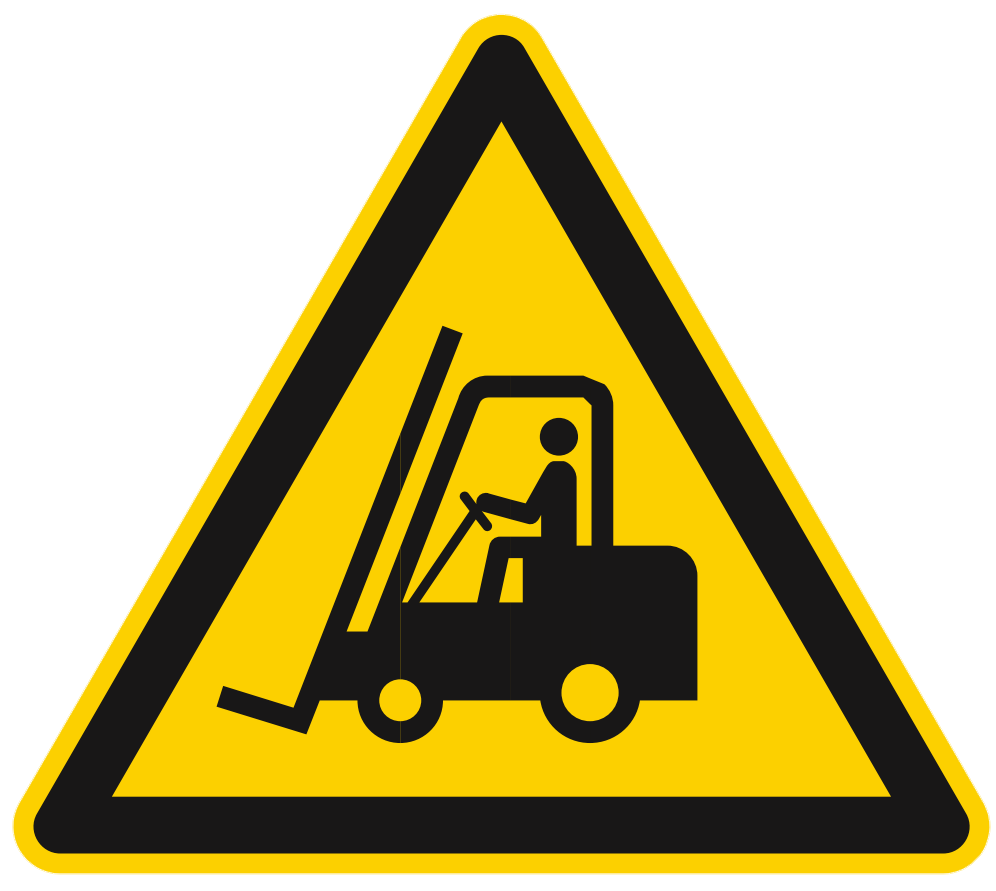
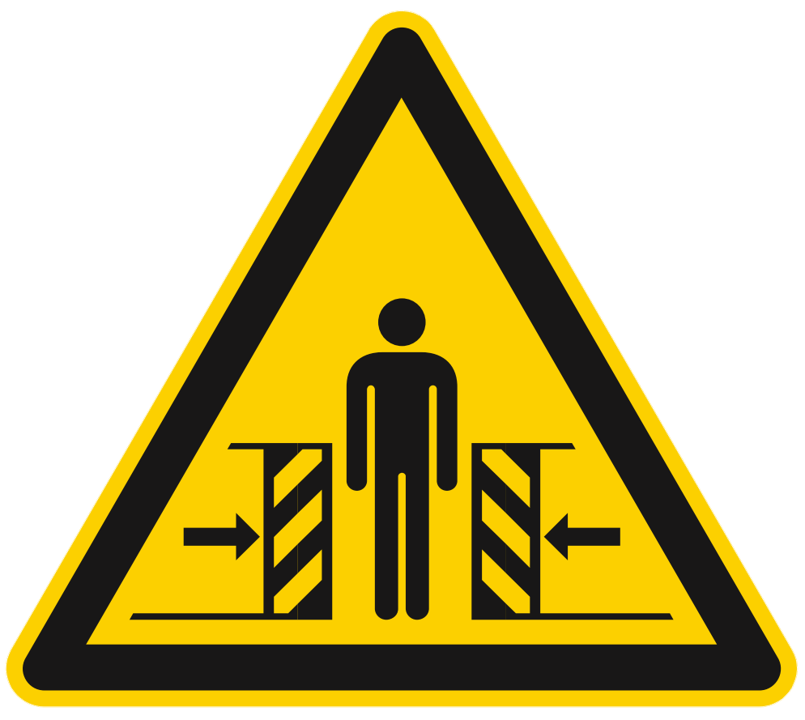
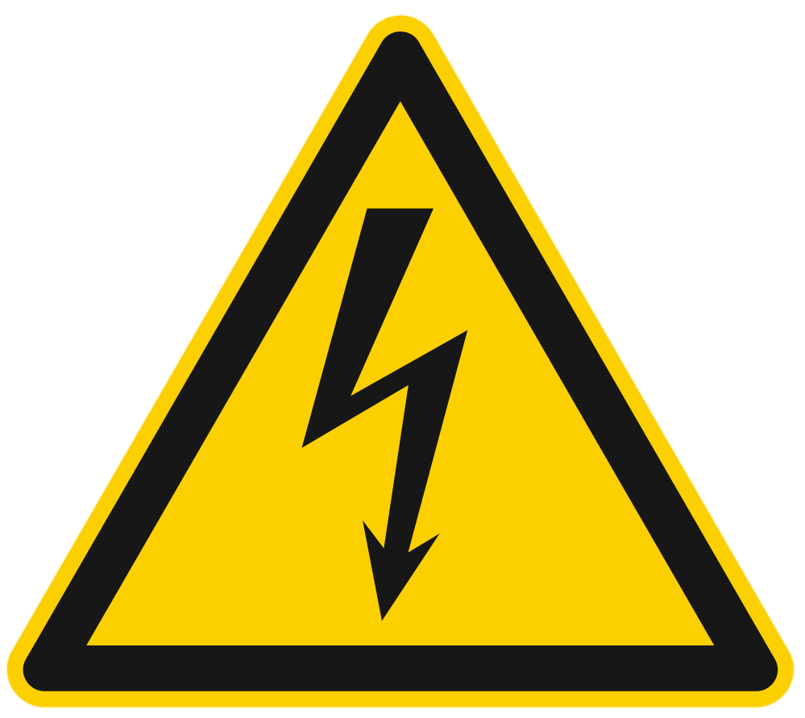

# **Informations de sécurité**

Le seguenti istruzioni di sicurezza, precauzioni generali e norme relative alla movimentazione e all'ambiente operativo devono essere scrupolosamente rispettate per garantire la sicurezza del personale, l'integrità del prodotto e il corretto funzionamento dell'impianto.

```{warning}
**Responsabilità dell'utente**

Il rispetto di tutte le norme di sicurezza riportate in questa sezione è obbligatorio e di responsabilità dell'utilizzatore finale. Il mancato rispetto può causare danni a persone, apparecchiature o compromettere il funzionamento del sistema.
```

---

## Area di sicurezza dell'operatore

Le zone intorno alla macchina vengono suddivise nel seguente modo: 

:::{list-table}
:widths: 20 60
:header-rows: 1

* - Termine
  - Descrizione

* - Zone di comando 
  - Sono le zone in cui l’utilizzatore e gli altri operatori possono eseguire le operazioni di comando e controllo delle funzioni cicliche della macchina (“postazione di guida”), sia in automatico che in semiautomatico, agendo sugli appositi pannelli di comando o per l’esecuzione delle operazioni manuali. 

* - Zone di manutenzione/regolazione 
  - Sono le zone in cui i manutentori meccanici possono eseguire le operazioni di manutenzione o regolazione. Queste zone sono considerate a rischio e non accessibili durante il normale funzionamento della macchina. Gli operatori devono essere perfettamente a conoscenza delle avvertenze riguardante la sicurezza e dei dispositivi individuali da indossare. 

* - Zone pericolose
  - Sono considerate tali tutte le zone all’interno (o circostanti) alla macchina con la presenza di rischi residui che possono provocare danni alle persone. In queste zone è vietato l’accesso a chiunque, durante il funzionamento della macchina. 

:::

I pericoli ed i rischi esistenti in queste zone sono protetti, per quanto possibile, con ripari (carter, portelli) e con dispositivi di sicurezza (sensori, microinterruttori, barriere fotoelettriche) che, in caso di attivazione, provvedono ad un totale arresto della macchina stessa. Tuttavia, quando la macchina è in funzione, è assolutamente vietato operare nelle zone pericolose in quanto alcuni rischi potrebbero non essere stati totalmente annullati.

(dpi)=
## Dispositivi di protezione individuale (D.P.I.)

Quando si opera vicino al FlexiBowl®, sia per le operazioni di montaggio, che per quelle di manutenzione e/o regolazione, bisogna 
strettamente attenersi alle norme generali antinfortunistiche, per questo sarà importante utilizzare i dispositivi di protezione 
individuale (D.P.I.) richiesti per ogni singola operazione. 
Riportiamo l’elenco completo dei dispositivi di protezione individuale (D.P.I.) che potranno essere richiesti per le diverse 
procedure: 

:::: {list-table}
:header-rows: 1
:widths: 20 60

* - Simbolo
  - Descrizione

* - ::: {figure} ../../../../_shared/media/images/guanti.png
    :align: center
    :width: 50%
    :::

  - **Obbligo ad utilizzare guanti protettivi o isolanti.**

    Indica una prescrizione per il personale di utilizzare guanti protettivi o isolanti. 

* - ::: {figure} ../../../../_shared/media/images/occhiali.png
    :align: center
    :width: 50%
    :::

  - **Obbligo ad utilizzare occhiali di protezione.**

    Indica una prescrizione per il personale di utilizzare occhiali protettivi per gli occhi. 

* - ::: {figure} ../../../../_shared/media/images/scarpe.png
    :align: center
    :width: 50%
    :::

  - **Obbligo ad utilizzare scarpe antinfortunistiche.**

    Indica una prescrizione per il personale di utilizzare scarpe antinfortunistiche a protezione dei piedi. 

* - ::: {figure} ../../../../_shared/media/images/rumore.png
    :align: center
    :width: 50%
    :::

  - **Obbligo ad utilizzare dispositivi di protezione dal rumore.**

    Indica una prescrizione per il personale di utilizzare cuffie o tappi isolanti a protezione dell'udito. 

* - ::: {figure} ../../../../_shared/media/images/tuta.png
    :align: center
    :width: 50%
    :::

  - **Obbligo ad utilizzare indumenti protettivi.**

    Indica una prescrizione per il personale di utilizzare specifici indumenti protettivi. 

* - ::: {figure} ../../../../_shared/media/images/casco.png
    :align: center
    :width: 50%
    :::

  - **Obbligo ad utilizzare un elmetto protettivo.**

    Indica una prescrizione per il personale di utilizzare un elmetto a protezione della testa. 

* - ::: {figure} ../../../../_shared/media/images/manuale.png
    :align: center
    :width: 50%
    :::

  - **Obbligo consultare il manuale/libretto delle istruzioni.**

    Indica una prescrizione per il personale di consultare (e comprendere) le istruzioni d’uso e di avvertenza della macchina prima di operare con essa. 

::::

L’abbigliamento di chi opera o effettua manutenzione sulla linea deve essere conforme ai requisiti essenziali di sicurezza definiti dal **Reg. UE 2016/425** e alle leggi vigenti nel paese in cui la stessa viene installata. 

## Dispositivi di sicurezza

Allo scopo di garantire una totale sicurezza dell’operatore e impedire l’accesso all’interno della macchina quando questa è in movimento, la macchina è stata dotata di una serie di dispositivi di sicurezza che, in caso di attivazione, provvedono al suo totale arresto. La macchina è stata progettata e dotata di sistemi di sicurezza per ridurre al minimo i rischi dell’operatore.  La macchina è provvista dei dispositivi di sicurezza descritti nella seguente tabella. Per la posizione di tali dispositivi, fare riferimento allo schema seguente.

:::{list-table}
:widths: 10 20 60
:header-rows: 1

* - N.
  - Elemento
  - Descrizione

* - 1
  - Carter
  - È costituito da protezioni perimetrali fisse (carterature), le quali hanno funzione di impedire l’accesso ai movimenti delle varie parti della macchina durante il ciclo di funzionamento e richiedono utensili specifici per la loro rimozione.

* - 2
  - Interruttore elettrico
  - È posizionato sul pannello comandi e permette di interrompere l’alimentazione elettrica in caso di:

    * pericolo per l’incolumità dell’operatore;
    * pericolo elettrico sulla macchina;
    * interventi di natura meccanica o elettrica sulla macchina.

:::

:::{figure} ../../../../_shared/media/images/AS000006_DispSicurezza.PNG
:align: center
:width: 80%
:::

:::{warning}
A causa della presenza di sporgenze appuntite sulle superfici o dischi rigidi con Spike, l’operatore potrebbe essere esposto 
al pericolo di abrasione e/o taglio in caso di contatto con esse. Indossare gli opportuni D.P.I. in caso di operazioni 
nelle vicinanze di tali superfici o dischi rigidi.
:::

:::{warning}
In caso di emergenza, togliere l’alimentazione connessa al pannello comandi per disabilitare in sicurezza i 
comandi del FlexiBowl®.
:::

## Pericoli e rischi

### Rumore
Le misurazioni di rumore sono state effettuate in accordo con quanto stabilito dalle norme UNI EN ISO 11200:2020 – “Rumore emesso dalle macchine e dalle apparecchiature - Linee guida per l'uso delle norme di base per la determinazione dei livelli di pressione sonora al posto di lavoro e in altre specifiche posizioni” e la UNI EN ISO 3746:2011 “Determinazione dei livelli di potenza sonora e dei livelli di energia sonora delle sorgenti di rumore mediante misurazione della pressione sonora - Metodo di controllo con una superficie avvolgente su un piano riflettente”. Abbiamo effettuato anche la valutazione seguendo le procedure riportate nella DIRETTIVA 2006/42/CE punto 1.5.8 – punto 1.7.4.2 lettera u.

La relazione completa è contenuta nella documentazione perntinente la quasi macchina custodita da ARS. Il report di misura è disponibile su richiesta per utilizzatori e integratori.

Le misure sono state effettuate in 3 differenti condizioni operative:

- FlexiBowl in funzione (MOVE, SHAKE, FLIP) senza la presenza di componenti (“funzionamento a vuoto”);
- FlexiBowl in funzione (MOVE, SHAKE, FLIP) con la presenza di componenti sul disco rotante, componenti in plastica rigida; 
- FlexiBowl in funzione (MOVE, SHAKE, FLIP) con la presenza di componenti sul disco rotante, componenti in metallo;

Durante i cicli di funzionamento a vuoto, il livello di pressione acustica continuo equivalente ponderato A nel posto di lavoro è pari a 73.3 dB(A). Per i cicli di funzionamento con componenti, dato che il livello di pressione acustica dell'emissione ponderato A nei posti di lavoro supera 80 dB(A), si riporta nella tabella seguente anche il livello di potenza acustica ponderato A emesso dalla macchina.

:::{list-table} Valori emissioni sonore valutate ai sensi della norma UNI EN ISO 3746:2011 - UNI EN ISO 11202:2021
:widths: 30 30 30 30 30
:header-rows: 1

* - FlexiBowl® 800
  - Livello di potenza sonora ponderata A Lw(A)
  - Incertezza di misura K
  - Livello di potenza sonora lineare Lw(z)
  - Incertezza di misura K

* - Funzionamento a vuoto
  - 82.6 dB(A)
  - 8.9
  - 87.7 dB
  - 8.9

* - Funzionamento con pezzi in plastica rigida
  - 89.7 dB(A)
  - 6.0
  - 90.7 dB
  - 6.0

* - Funzionamento con pezzi staffe metalliche
  - 85.0
  - 6.0
  - 88.5
  - 6.0

:::

Il livello di rumore effettivo della macchina installata durante il funzionamento presso il sito in un processo produttivo potrebbe 
essere diverso da quello sopra riportato poiché il rumore è influenzato da vari fattori quali:

- componenti movimentati dal FlexiBowl e parametri operativi;  
- tipo e caratteristiche del sito; 
- caratteristiche della macchina su cu il FlexiBowl® è integrato; 
- altre macchine adiacenti in funzione.

::::{warning}
<table style="width: 100%; border: none; background: transparent;">
  <tr style="background: transparent !important; border: none !important;">
    <td style="width: 20%; border: none; vertical-align: middle; text-align: center; background: transparent !important;">
      
    </td>
    <td style="width: 80%; border: none; vertical-align: middle; background: transparent !important; padding-left: 15px;">
      Per livelli di esposizione quotidiana superiori a 80 dB(A), è obbligatorio utilizzare gli appositi dispositivi di protezione individuale.
    </td>
  </tr>
</table>
::::

### Backlight e Toplight

Fare riferimento alla seguente tabella per la classificazione del livello di rischio dovuto all'utilizzo degli illuminatori Toplight e Backlight, in base alla norma EN-62471:

:::{list-table} Toplight
:widths: 30 15 15
:header-rows: 1

* - Colore
  - Classe
  - Rischio

* - Bianco
  - 0
  - Nessuno

* - Rosso
  - 0
  - Nessuno

* - IR
  - 1
  - Basso

:::

:::{list-table} Backlight
:widths: 30 15 15
:header-rows: 1

* - Colore
  - Classe
  - Rischio

* - Bianco
  - 0
  - Nessuno

* - Rosso
  - 0
  - Nessuno

* - IR
  - 1
  - Basso

:::

:::{note}
Gli illuminatori infrarossi emettono luce non visibile e perciò possono apparire non funzionanti. Controllare con una telecamera con un filtro ad infrarossi installato per verificarne il funzionamento. La maggior parte degli smartphone visualizzano gli infrarossi.
:::

(temp)=
### Temperatura

::::{warning}
In condizioni di utilizzo intenso o ambienti caldi, alcuni componenti del sistema possono raggiungere temperature elevate:

- Calotta stringi-disco: fino a 65°C
- Motore: fino a 80°C

Il pianale superiore del telaio può presentare una zona calda ampia circa quanto il foro centrale ampliato del 25%:

:::{figure} ../../../../_shared/media/images/FB800_zone-calde.PNG
    :width: 80%
    :align: center
:::

{strong}`NOTA:` Questi valori sono stati ottenuti facendo funzionare il FlexiBowl® in maniera continuativa per due settimane in un ambiente ristretto e privo di ventilazione utilizzando i seguenti parametri:

:::{raw} html
<p class="centered-params">
  Move 90° <br>
  Pause 1000 ms <br>
  Shake +45° -45° <br>
  Pause 1000 ms
</p>
:::

::::

### Vibrazioni

Le vibrazioni prodotte dalla macchina, in funzione delle modalità di conduzione della stessa, non sono pericolose alla salute degli 
operatori.

:::{warning}
Un’ eccessiva vibrazione può solo essere causata da un guasto meccanico che deve essere immediatamente segnalato ed eliminato, per non pregiudicare la sicurezza della linea e degli operatori.
:::

### Compatibilità elettromagnetica

La macchina fornita contiene componenti elettronici soggetti alle normative sulla Compatibilità Elettromagnetica, condizionati da emissioni condotte e irradiate.

I valori delle emissioni rientrano nelle esigenze normative grazie all’impiego di componenti conformi alla direttiva Compatibilità Elettromagnetica, collegamenti idonei e installazione di filtri dove necessario. La macchina risulta quindi conforme alla direttiva sulla Compatibilità Elettromagnetica (EMC).

:::{warning}
Eventuali attività manutentive sull’apparecchiatura elettrica realizzate in modo non conforme o sostituzioni errate di componenti possono compromettere l’efficienza delle soluzioni adottate.
:::

### Rischi residui

La progettazione della macchina è stata eseguita in modo da garantire i requisiti essenziali di sicurezza per l’operatore. La sicurezza, per quanto possibile, è stata integrata nel progetto e nella costruzione della macchina; tuttavia permangono rischi dai quali gli operatori devono essere protetti soprattutto in fase di:

- trasporto e installazione; 
- funzionamento normale; 
- regolazione e messa a punto, 
- manutenzione e pulizia; 
- smontaggio e smantellamento.

Di seguito per ogni rischio residuo viene fornita una descrizione, la zona o parte di macchina oggetto del rischio (a meno che non 
ne sia oggetto tutta la macchina) e le informazioni procedurali su come poterlo evitare:

:::{raw} html
<style>
  .custom-safety-table {
    width: 100%;
    border-collapse: collapse;
    font-family: sans-serif;
    font-size: 0.95em;
    color: #333;
    border: 1px solid #e0e6ed;
  }

  /* Riga intestazione */
  .custom-safety-table thead tr {
    background-color: #f8f9fa;
    border-bottom: 3px solid #176de8; /* Il tuo blu specifico */
  }

  .custom-safety-table th {
    padding: 15px;
    text-align: left;
    font-weight: bold;
    color: #1a202c;
    border-right: 1px solid #e0e6ed; /* Linea verticale nell'header */
  }

  .custom-safety-table th:last-child {
    border-right: none;
  }

  /* Righe alternate (Zebra) */
  .custom-safety-table tbody tr:nth-child(even) {
    background-color: #f1f5f9;
  }

  .custom-safety-table tbody tr:nth-child(odd) {
    background-color: #ffffff;
  }

  /* Effetto Hover */
  .custom-safety-table tbody tr:hover {
    background-color: #dbeafe !important;
    transition: background-color 0.2s ease !important;
  }

  .custom-safety-table td {
    padding: 15px;
    vertical-align: top;
    border-bottom: 1px solid #e0e6ed;
    border-right: 1px solid #e0e6ed; /* Linea verticale tra le colonne */
  }

  .custom-safety-table td:last-child {
    border-right: none; /* Rimuove l'ultima linea a destra */
  }

  .pittogrammi-container {
    display: flex;
    justify-content: center;
    gap: 8px;
    margin-top: 10px;
  }
</style>

<table class="custom-safety-table">
  <thead>
    <tr>
      <th style="width: 25%;">Rischio</th>
      <th>Descrizione ed informazioni procedurali</th>
    </tr>
  </thead>
  <tbody>
    <tr>
      <td style="text-align: center;">
        <strong>PERICOLI DOVUTI ALLA MOVIMENTAZIONE</strong><br><br>
        <small style="color: #666;">PITTOGRAMMI:</small>
        <div class="pittogrammi-container">
          
          
          
        </div>
      </td>
      <td>
        Le procedure di movimentazione sono descritte al capitolo <strong>"Trasporto e installazione"</strong> del presente manuale d'istruzioni.<br>
        <strong>Rischio residuo:</strong><br>
        Le operazioni di:
        <ul>
            <li>scarico degli imballi,</li>
            <li>apertura degli imballi,</li>
            <li>movimentazione della macchina</li>
        </ul>
        espongono gli operatori al rischio di carichi sospesi e schiacciamento. Tali operazioni devono essere svolte esclusivamente da personale specializzato nella conduzione di mezzi di sollevamento e che sia stato opportunamente addestrato allo scopo.
      </td>
    </tr>
    <tr>
      <td style="text-align: center;">
        <strong>PERICOLO DI ABRASIONE, TAGLIO, URTO</strong><br><br>
        <small style="color: #666;">PITTOGRAMMI:</small>
        <div class="pittogrammi-container">
          
          
        </div>
      </td>
      <td>
        A causa della presenza di sporgenze appuntite sui <strong>"Rotary Disc"</strong> con Spike, l'operatore potrebbe essere esposto al pericolo di abrasione e/o taglio in caso di contatto con esse.<br>
        Indossare gli opportuni D.P.I. in caso di operazioni nelle vicinanze di tali <strong>"Rotary Disc"</strong>.
      </td>
    </tr>
    <tr>
      <td style="text-align: center;">
        <strong>PERICOLO ELETTRICO</strong><br><br>
        <small style="color: #666;">PITTOGRAMMI:</small>
        <div class="pittogrammi-container">
          
          
        </div>
      </td>
      <td>
        Le operazioni di accesso e manutenzione della macchina espongono gli operatori al rischio elettrico. Gli interventi sulle apparecchiature sotto tensione devono essere effettuati esclusivamente da personale esperto e qualificato.<br>
        Si raccomandano le seguenti misure di sicurezza:
        <ul>
            <li>prestare la massima attenzione ai pittogrammi di sicurezza relativi al rischio elettrico;</li>
            <li>non effettuare interventi di manutenzione senza aver preventivamente sezionato l'energia elettrica;</li>
            <li>consultare i manuali delle attrezzature commerciali per eventuali raccomandazioni specifiche;</li>
            <li>ispezionare periodicamente il circuito di protezione equipotenziale.</li>
        </ul>
      </td>
    </tr>
    <tr>
      <td style="text-align: center;">
        <strong>PERICOLO DERIVANTE DA DISTURBI DI ILLUMINAZIONE</strong><br><br>
        <small style="color: #666;">PITTOGRAMMI:</small>
        <div class="pittogrammi-container">
          
        </div>
      </td>
      <td>
        Il <strong>"Backlight"</strong> è posto nella parte interna del corpo macchina, fuori dalla vista dell'operatore ed è schermata quasi totalmente dai ripari del corpo macchina.<br>
        <strong>Rischio residuo:</strong><br>
        L'operatore può subire danni alla vista se osserva per un lasso di tempo prolungato l'intensa luce del <strong>"Backlight"</strong>.
      </td>
    </tr>
    <tr>
      <td style="text-align: center;">
        <strong>PERICOLO DERIVANTE DA POLVERI, SCHEGGE, ECC.</strong><br><br>
        <small style="color: #666;">PITTOGRAMMI:</small>
        <div class="pittogrammi-container">
          
        </div>
      </td>
      <td>
        Al termine del ciclo di lavoro potrebbero restare sul <strong>"Rotary Disc"</strong> della macchina una serie di residui delle parti alimentate o accumuli di polveri.<br>
        Procedere ad un'accurata pulizia del <strong>"Rotary Disc"</strong> dopo ogni utilizzo, come descritto all'interno del cap.7 del presente manuale.
      </td>
    </tr>
  </tbody>
</table>
:::

:::{warning}
Non effettuare attività di manutenzione e pulizia se prima non si è provveduto a de-energizzare le energie 
presenti.
:::

:::{warning}
È assolutamente vietato rimuovere le protezioni di sicurezza installate sulla macchina o aprire i ripari fissi senza 
prima aver sezionato l’alimentazione elettrica e pneumatica della macchina.
:::

Sarà cura dell’utilizzatore provvedere a: 
- analizzare i rischi che potrebbero verificarsi durante una fase di movimentazione e di installazione all’interno della 
propria sede (le analisi fatte sulla movimentazione della macchina sono state fatte solo in considerazioni delle 
caratteristiche della stessa); 
- sensibilizzare ed istruire il personale addetto alle operazioni sulle postazioni di lavoro e il personale addetto alla 
conduzione della macchina; 
- applicare le segnaletiche visive di sicurezza nell’ambiente di lavoro dopo aver valutato i rischi all’interno delle aree di 
transito o di comando.

## Pittogrammi di sicurezza apllicati alla macchina

Nella tabella di seguito sono elencati i pittogrammi presenti sulla macchina, solitamente presenti accanto al pannello comandi.

::::{list-table}
:widths: 30 60
:header-rows: 1

* - Pittogramma
  - Descrizione

* - :::{figure} ../../../../_shared/media/images/manutenzione.png
    :width: 80%
    :align: center
    :::
  - **PERICOLO! SOLO IL PERSONALE AUTORIZZATO PUÒ ESEGUIRE LAVORI DI MANUTENZIONE O RIPARAZIONE.**

    Indica un divieto ad eseguire lavori di manutenzione o riparazione a personale non autorizzato. 

* - :::{figure} ../../../../_shared/media/images/disconnettere.png
    :width: 80%
    :align: center
    :::
  - **ATTENZIONE! DISCONNETTERE L’ALIMENTAZIONE ELETTRICA PRIMA DI ESEGUIRE OPERAZIONI DI PULIZIA O MANUTENZIONE.**

    Indica un divieto ad eseguire lavori di manutenzione o pulizia non prima di aver staccato l’alimentazione elettrica.

::::

## Integrazione con sistemi robotizzati

### **Requisiti di sicurezza della cella**

:::{warning}
Il FlexiBowl® opera in stretta connessione con sistemi robotizzati di terze parti. L'utente deve garantire che l'area di lavoro sia dotata di tutte le misure di sicurezza necessarie imposte dalle normative pertinenti
:::

### **Attenzione durante l'operatività**

:::{warning}

Durante il funzionamento del sistema, tenere sempre conto di:

- Ingombri fisici del robot e del FlexiBowl
- Traiettorie e velocità dei movimenti robotici
- Possibili situazioni impreviste (caduta pezzi, errori di prelievo)
- Zone di pericolo durante le fasi di vibrazione del FlexiBowl
:::

## Precauzioni generali prima degli interventi

### **Disconnessione alimentazioni**

```{warning}
Prima di eseguire qualsiasi intervento di manutenzione, modifica o ispezione sul sistema, assicurarsi sempre che:

- Tutte le fonti di alimentazione elettrica siano disconnesse (VisionController, FlexiBowl, Camera, Illuminatore)
- L'alimentazione pneumatica sia scaricata e disconnessa (se presente)
- I cavi di collegamento siano fisicamente scollegati
- Il robot sia in modalità di sicurezza o completamente spento
```
### **Procedure di sicurezza**

```{warning}

Non affidarsi esclusivamente agli interruttori: utilizzare procedure di lockout/tagout (LOTO) quando disponibili.
```

## Modifiche e manomissioni

### **Divieto di modifiche non autorizzate**

```{warning}
Non modificare mai il prodotto o i suoi componenti senza espressa autorizzazione scritta di ARS S.r.l.
```
### **Conseguenze delle modifiche**

```{warning}
Modifiche non autorizzate possono:

- Causare malfunzionamenti del sistema
- Invalidare la garanzia
- Creare rischi di lesioni, scosse elettriche o incendi
- Compromettere le certificazioni di sicurezza del prodotto
```


<br>

<!-- Versions and languages set-up -->
<style>
  .fixed-bar {
    position: fixed;
    bottom: 10px;
    right: 10px;
    background: rgba(240, 240, 240, 0.85);
    border: 1px solid rgba(100, 100, 100, 0.3);
    border-radius: 6px;
    box-shadow: 0 1px 6px rgba(0, 0, 0, 0.1);
    font-family: 'Segoe UI', Tahoma, Geneva, Verdana, sans-serif;
    font-size: 0.9rem;
    color: #222;
    display: flex;
    gap: 12px;
    padding: 6px 12px;
    align-items: center;
    z-index: 9999;
    backdrop-filter: saturate(180%) blur(10px);
  }

  @media print {
    .fixed-bar {
      display: none !important;
    }
  }

  .fixed-bar .dropdown {
    position: relative;
    user-select: none;
  }

  .fixed-bar .dropdown-toggle {
    background-color: rgba(200, 200, 200, 0.4);
    color: #222;
    padding: 6px 10px;
    border: 1px solid rgba(100, 100, 100, 0.3);
    border-radius: 4px;
    cursor: pointer;
    display: flex;
    align-items: center;
    gap: 6px;
    box-shadow: 0 1px 2px rgba(0, 0, 0, 0.05);
    white-space: nowrap;
    transition: background-color 0.3s ease;
  }

  .fixed-bar .dropdown-toggle::after {
    content: none !important;
    display: none !important;
  }

  .fixed-bar .dropdown-toggle:hover {
    background-color: rgba(100, 150, 220, 0.2);
    color: #1a3e72;
    border-color: rgba(26, 62, 114, 0.6);
  }

  .fixed-bar .dropdown-toggle .fa {
    font-size: 0.9rem;
  }

  .fixed-bar .dropdown-menu {
    position: absolute;
    bottom: 100%;
    left: 0;
    background-color: rgba(250, 250, 250, 0.95);
    border: 1px solid rgba(150, 150, 150, 0.3);
    border-radius: 4px;
    box-shadow: 0 3px 8px rgba(0, 0, 0, 0.1);
    min-width: 140px;
    max-height: 200px;
    overflow-y: auto;
    display: none;
    flex-direction: column;
    z-index: 10000;
    backdrop-filter: saturate(180%) blur(8px);
  }

  .fixed-bar .dropdown-menu.show {
    display: flex;
  }

  .fixed-bar .dropdown-menu a {
    padding: 8px 12px;
    color: #1a3e72;
    text-decoration: none;
    border-bottom: 1px solid rgba(200, 200, 200, 0.5);
    white-space: nowrap;
    transition: background-color 0.25s ease;
  }

  .fixed-bar .dropdown-menu a:last-child {
    border-bottom: none;
  }

  .fixed-bar .dropdown-menu a:hover {
    background-color: rgba(100, 150, 220, 0.15);
  }

  .dropdown-download-buttons .btn__icon-container svg {
    width: 1em;
    height: 1em;
    stroke: currentColor;
    fill: none;
    stroke-width: 1.6;
    stroke-linecap: round;
    stroke-linejoin: round;
    vertical-align: middle;
  }

  a.headerlink.manual-heading-action {
    display: inline-flex;
    align-items: center;
    justify-content: center;
    margin-left: 0.2em;
    text-decoration: none;
    color: #7b8493;
    transition: color 0.2s ease, opacity 0.2s ease;
  }

  a.headerlink.manual-heading-action svg {
    width: 0.8em;
    height: 0.8em;
    stroke: currentColor;
    fill: none;
    stroke-width: 1.6;
    stroke-linecap: round;
    stroke-linejoin: round;
    vertical-align: middle;
  }

  a.headerlink.manual-feedback-link:hover,
  a.headerlink.manual-feedback-link:focus-visible {
    color: #2563eb;
  }

  a.headerlink.manual-service-link:hover,
  a.headerlink.manual-service-link:focus-visible {
    color: #d97706;
  }
</style>

<div class="fixed-bar" role="region" aria-label="Version and language selector">
  <div class="dropdown" data-selector="version">
    <div class="dropdown-toggle" tabindex="0" aria-haspopup="listbox" aria-expanded="false">
      Version: <span class="current-value">V. 1.0</span>
      <span class="caret-icon" aria-hidden="true">&#9662;</span>
    </div>
    <div class="dropdown-menu" role="listbox">
      	<a href="#" role="option">V. 1.0</a>
    </div>
  </div>

  <div class="dropdown" data-selector="language">
    <div class="dropdown-toggle" tabindex="0" aria-haspopup="listbox" aria-expanded="false">
      Language: <span class="current-value">FR</span>
      <span class="caret-icon" aria-hidden="true">&#9662;</span>
    </div>
    <div class="dropdown-menu" role="listbox">
      	<a href="#" role="option">DE</a>
				<a href="#" role="option">EN</a>
				<a href="#" role="option">ES</a>
				<a href="#" role="option">FR</a>
				<a href="#" role="option">IT</a>
    </div>
  </div>
</div>

<script>
  (function () {
    const bar = document.querySelector('.fixed-bar');
    if (!bar) {
      return;
    }

    const inlineVersions = ["V. 1.0"];
    const inlineLanguages = ["DE", "EN", "ES", "FR", "IT"];
    const manifest = window.FV_VERSIONING || null;
    const versions = Array.isArray(manifest && manifest.versions) && manifest.versions.length
      ? manifest.versions
      : inlineVersions;
    const offlineZipEnabled = false;
    const offlineZipFileName = 'Offline manual.zip';
    const americanRegions = new Set([
      'AG', 'AR', 'AW', 'BB', 'BL', 'BM', 'BO', 'BQ', 'BR', 'BS', 'BZ', 'CA', 'CL', 'CO', 'CR',
      'CU', 'CW', 'DM', 'DO', 'EC', 'FK', 'GD', 'GF', 'GL', 'GP', 'GT', 'GY', 'HN', 'HT', 'JM',
      'KN', 'KY', 'LC', 'MF', 'MQ', 'MS', 'MX', 'NI', 'PA', 'PE', 'PM', 'PR', 'PY', 'SR', 'SV',
      'SX', 'TC', 'TT', 'US', 'UY', 'VC', 'VE', 'VG', 'VI', '419'
    ]);
    const additionalAmericanTimeZones = new Set([
      'Atlantic/Bermuda',
      'Pacific/Easter',
      'Pacific/Galapagos',
      'Pacific/Honolulu',
      'Pacific/Pitcairn'
    ]);

    function setCaret(toggle, isOpen) {
      const caret = toggle.querySelector('.caret-icon');
      if (caret) {
        caret.innerHTML = isOpen ? '&#9652;' : '&#9662;';
      }
    }

    function closeAllMenus() {
      bar.querySelectorAll('.dropdown').forEach(dropdown => {
        const menu = dropdown.querySelector('.dropdown-menu');
        const toggle = dropdown.querySelector('.dropdown-toggle');
        menu.classList.remove('show');
        toggle.setAttribute('aria-expanded', 'false');
        setCaret(toggle, false);
      });
    }

    function getLanguagesForVersion(version) {
      const manifestLanguages = manifest &&
        manifest.languagesByVersion &&
        Array.isArray(manifest.languagesByVersion[version]) &&
        manifest.languagesByVersion[version].length
          ? manifest.languagesByVersion[version]
          : null;

      if (manifestLanguages) {
        return manifestLanguages;
      }

      return inlineLanguages;
    }

    function getDefaultLanguageForVersion(version) {
      const manifestDefault = manifest &&
        manifest.defaultLanguageByVersion &&
        typeof manifest.defaultLanguageByVersion[version] === 'string'
          ? manifest.defaultLanguageByVersion[version]
          : '';

      if (manifestDefault) {
        return manifestDefault;
      }

      const availableLanguages = getLanguagesForVersion(version);
      return availableLanguages.length ? availableLanguages[0] : (inlineLanguages[0] || '');
    }

    function populateSelectorMenu(selector, values) {
      const menu = bar.querySelector(`[data-selector="${selector}"] .dropdown-menu`);
      if (!menu) {
        return;
      }

      menu.innerHTML = '';
      values.forEach(value => {
        const link = document.createElement('a');
        link.href = '#';
        link.setAttribute('role', 'option');
        link.textContent = value;
        menu.appendChild(link);
      });
    }

    function getNavigationContext() {
      const currentUrl = new URL(window.location.href);
      const rawSegments = currentUrl.pathname.split('/').filter(Boolean);
      const decodedSegments = rawSegments.map(segment => decodeURIComponent(segment));
      const currentVersionLabel = bar.querySelector('[data-selector="version"] .current-value');
      const currentLanguageLabel = bar.querySelector('[data-selector="language"] .current-value');
      const fallbackVersion = currentVersionLabel ? currentVersionLabel.textContent.trim() : '';
      const versionIndex = decodedSegments.findIndex(segment => versions.includes(segment));
      const currentVersion = versionIndex !== -1 ? decodedSegments[versionIndex] : fallbackVersion;
      const availableLanguages = getLanguagesForVersion(currentVersion);
      const fallbackLanguage = currentLanguageLabel ? currentLanguageLabel.textContent.trim() : '';
      const languageIndex = decodedSegments.findIndex(
        (segment, index) => index > versionIndex && availableLanguages.includes(segment)
      );

      return {
        currentUrl: currentUrl,
        rawSegments: rawSegments,
        versionIndex: versionIndex,
        currentVersion: currentVersion,
        currentLanguage: languageIndex !== -1 ? decodedSegments[languageIndex] : fallbackLanguage
      };
    }

    function refreshNavigationMenus() {
      const context = getNavigationContext();
      const resolvedVersion = versions.includes(context.currentVersion) ? context.currentVersion : (versions[0] || context.currentVersion);
      const availableLanguages = getLanguagesForVersion(resolvedVersion);
      const resolvedLanguage = availableLanguages.includes(context.currentLanguage)
        ? context.currentLanguage
        : (getDefaultLanguageForVersion(resolvedVersion) || context.currentLanguage);

      populateSelectorMenu('version', versions);
      populateSelectorMenu('language', availableLanguages);

      const versionLabel = bar.querySelector('[data-selector="version"] .current-value');
      const languageLabel = bar.querySelector('[data-selector="language"] .current-value');
      if (versionLabel) {
        versionLabel.textContent = resolvedVersion;
      }
      if (languageLabel) {
        languageLabel.textContent = resolvedLanguage;
      }
    }

    function buildScopedUrl(targetVersion, targetLanguage, pageName) {
      const context = getNavigationContext();
      const rootSegments = context.versionIndex !== -1 ? context.rawSegments.slice(0, context.versionIndex) : [];
      const targetPath = '/' + rootSegments.concat([
        encodeURIComponent(targetVersion),
        encodeURIComponent(targetLanguage),
        encodeURIComponent(pageName)
      ]).join('/');

      if (context.currentUrl.protocol === 'file:') {
        return 'file://' + targetPath;
      }

      return context.currentUrl.origin + targetPath;
    }

    function buildTargetUrl(targetVersion, targetLanguage) {
      return buildScopedUrl(targetVersion, targetLanguage, 'index.html');
    }

    function buildSiteRootAssetUrl(fileName) {
      const context = getNavigationContext();
      const rootSegments = context.versionIndex !== -1 ? context.rawSegments.slice(0, context.versionIndex) : [];
      const targetPath = '/' + rootSegments.concat([encodeURIComponent(fileName)]).join('/');

      if (context.currentUrl.protocol === 'file:') {
        return 'file://' + targetPath;
      }

      return context.currentUrl.origin + targetPath;
    }

    function buildClientSiteZipUrl() {
      return buildSiteRootAssetUrl(offlineZipFileName);
    }

    function getHeadingText(heading) {
      const clone = heading.cloneNode(true);
      clone.querySelectorAll('a.headerlink').forEach(link => link.remove());
      return clone.textContent.replace(/\s+/g, ' ').trim();
    }

    function normalizeMailText(text) {
      return String(text || '').replace(/\u00AE/g, '');
    }

    function getTimeZoneAmericaDecision() {
      try {
        const timeZone = String(Intl.DateTimeFormat().resolvedOptions().timeZone || '').trim();
        if (!timeZone) {
          return null;
        }
        return timeZone.startsWith('America/') || additionalAmericanTimeZones.has(timeZone);
      } catch (error) {
        return null;
      }
    }

    function isCoordinateInAmericas(latitude, longitude) {
      if (!Number.isFinite(latitude) || !Number.isFinite(longitude)) {
        return null;
      }

      return latitude >= -60 && latitude <= 85 && longitude >= -170 && longitude <= -25;
    }

    function getCurrentPosition(options) {
      return new Promise((resolve, reject) => {
        if (!navigator.geolocation || typeof navigator.geolocation.getCurrentPosition !== 'function') {
          reject(new Error('Geolocation unavailable'));
          return;
        }

        navigator.geolocation.getCurrentPosition(resolve, reject, options);
      });
    }

    async function resolveServiceAddress() {
      const timeZoneDecision = getTimeZoneAmericaDecision();
      if (timeZoneDecision === false) {
        return 'service@arsautomation.com';
      }

      const canTryGeolocation = Boolean(
        navigator.onLine &&
        window.isSecureContext &&
        navigator.geolocation &&
        typeof navigator.geolocation.getCurrentPosition === 'function'
      );

      if (canTryGeolocation) {
        try {
          const position = await getCurrentPosition({
            enableHighAccuracy: false,
            timeout: 4000,
            maximumAge: 300000
          });
          const inAmericas = isCoordinateInAmericas(position.coords.latitude, position.coords.longitude);
          if (inAmericas !== null) {
            return inAmericas ? 'us.service@arsautomation.com' : 'service@arsautomation.com';
          }
        } catch (error) {
        }
      }

      if (timeZoneDecision === true) {
        return 'us.service@arsautomation.com';
      }

      return 'service@arsautomation.com';
    }

    function buildMailtoUrl(address, subject, body) {
      return 'mailto:' + address +
        '?subject=' + encodeURIComponent(normalizeMailText(subject)) +
        '&body=' + encodeURIComponent(normalizeMailText(body));
    }

    function createHeadingActionLink(className, title, mailtoUrl, svgMarkup) {
      const link = document.createElement('a');
      link.className = 'headerlink manual-heading-action ' + className;
      link.href = mailtoUrl;
      link.title = title;
      link.setAttribute('aria-label', title);
      link.innerHTML = svgMarkup;
      return link;
    }

    function addHeadingActions() {
      const feedbackIcon = [
        '<svg viewBox="0 0 16 16" aria-hidden="true">',
        '<path d="M3 3.5h10v6.5H7.5L4.5 13v-3H3z"></path>',
        '<path d="M6 6.2h4"></path>',
        '<path d="M6 8.2h3"></path>',
        '</svg>'
      ].join('');

        const serviceIcon = [
          '<svg viewBox="0 0 16 16" aria-hidden="true">',
          '<circle cx="8" cy="8" r="5.2"></circle>',
          '<path d="M6.4 6.1A1.9 1.9 0 0 1 8 5.2c1.1 0 1.9.7 1.9 1.7 0 .8-.4 1.3-1.2 1.8-.6.4-.9.8-.9 1.5"></path>',
          '<circle cx="8" cy="11.7" r="0.45" style="fill:currentColor;stroke:none"></circle>',
          '</svg>'
        ].join('');

      document.querySelectorAll('h1 > a.headerlink, h2 > a.headerlink, h3 > a.headerlink, h4 > a.headerlink, h5 > a.headerlink, h6 > a.headerlink').forEach(link => {
        const heading = link.parentElement;
        if (!heading || heading.querySelector('.manual-feedback-link') || heading.querySelector('.manual-service-link')) {
          return;
        }

        const sectionTitle = getHeadingText(heading);
        const sectionUrl = new URL(link.getAttribute('href'), window.location.href).href;
        const pageUrl = window.location.href.split('#')[0];
        const feedbackBody = [
          'Hello Documentation Team,',
          '',
          'I would like to suggest an improvement for this section of the manual.',
          '',
          'Section: ' + sectionTitle,
          'Page: ' + pageUrl,
          'Section link: ' + sectionUrl,
          '',
          'Suggestion:',
          ''
        ].join('\n');
          const serviceBody = [
            'Hello Service Team,',
            '',
            'I need support related to this section of the manual.',
            '',
            'Section: ' + sectionTitle,
            'Page: ' + pageUrl,
            'Section link: ' + sectionUrl,
            '',
            'FlexiBowl serial number:',
            '',
            'Photos or videos of the issue attached:',
            '',
            'Issue description:',
            ''
          ].join('\n');

        const feedbackLink = createHeadingActionLink(
          'manual-feedback-link',
          'Suggest an improvement for this section',
          buildMailtoUrl('documentation@arsautomation.com', 'Documentation suggestion: ' + sectionTitle, feedbackBody),
          feedbackIcon
        );
          const serviceLink = createHeadingActionLink(
            'manual-service-link',
            'Contact service about this section',
            '#',
            serviceIcon
          );
          serviceLink.addEventListener('click', async event => {
            event.preventDefault();
            const serviceAddress = await resolveServiceAddress();
            window.location.href = buildMailtoUrl(serviceAddress, 'Service request: ' + sectionTitle, serviceBody);
          });

          heading.appendChild(feedbackLink);
          heading.appendChild(serviceLink);
        });
    }

    function enhancePrintMenu() {
      const dropdown = document.querySelector('.dropdown-download-buttons');
      if (!dropdown || dropdown.dataset.printMenuEnhanced === 'true') {
        return;
      }

      dropdown.dataset.printMenuEnhanced = 'true';

      const toggleButton = dropdown.querySelector('.dropdown-toggle');
      const hasReleaseDownloads = offlineZipEnabled;

      if (toggleButton) {
        const toggleLabel = hasReleaseDownloads ? 'Export options' : 'Print options';
        toggleButton.setAttribute('aria-label', toggleLabel);
        toggleButton.setAttribute('title', toggleLabel);
        toggleButton.setAttribute('data-bs-original-title', toggleLabel);
        const toggleIcon = toggleButton.querySelector('i');
        if (toggleIcon) {
          toggleIcon.className = hasReleaseDownloads ? 'fas fa-download' : 'fas fa-print';
        }
      }

      dropdown.querySelectorAll('.btn-download-source-button').forEach(sourceButton => {
        const sourceItem = sourceButton.closest('li');
        if (sourceItem) {
          sourceItem.remove();
        }
      });

      const pagePrintButton = dropdown.querySelector('.btn-download-pdf-button');
      if (pagePrintButton) {
        pagePrintButton.setAttribute('title', 'Print this page');
        pagePrintButton.setAttribute('aria-label', 'Print this page');
        pagePrintButton.setAttribute('data-bs-original-title', 'Print this page');
        const textContainer = pagePrintButton.querySelector('.btn__text-container');
        if (textContainer) {
          textContainer.textContent = 'Print this page';
        }
      }

      const menu = dropdown.querySelector('.dropdown-menu');
      if (!menu) {
        return;
      }

      menu.querySelectorAll('.btn-download-client-site-zip-button').forEach(button => {
        const item = button.closest('li');
        if (item) {
          item.remove();
        }
      });

      if (offlineZipEnabled) {
        const siteZipItem = document.createElement('li');
        const siteZipLink = document.createElement('a');
        siteZipLink.className = 'btn btn-sm dropdown-item btn-download-client-site-zip-button';
        siteZipLink.title = 'Download offline manual';
        siteZipLink.setAttribute('aria-label', 'Download offline manual');
        siteZipLink.setAttribute('download', offlineZipFileName);
        siteZipLink.href = buildClientSiteZipUrl();
        siteZipLink.innerHTML = [
          '<span class="btn__icon-container">',
          '<svg viewBox="0 0 16 16" aria-hidden="true">',
          '<path d="M4 3.5h8v2.5H4z"></path>',
          '<path d="M4 6h8v6.5H4z"></path>',
          '<path d="M8 3.5v9"></path>',
          '<path d="M6.3 9.2L8 10.9l1.7-1.7"></path>',
          '</svg>',
          '</span>',
          '<span class="btn__text-container">Download offline manual</span>'
        ].join('');
        siteZipItem.appendChild(siteZipLink);
        menu.appendChild(siteZipItem);
      }
    }

    refreshNavigationMenus();

    bar.querySelectorAll('.dropdown').forEach(dropdown => {
      const toggle = dropdown.querySelector('.dropdown-toggle');
      const menu = dropdown.querySelector('.dropdown-menu');
      const selector = dropdown.getAttribute('data-selector');

      toggle.addEventListener('click', event => {
        event.stopPropagation();
        const willOpen = toggle.getAttribute('aria-expanded') !== 'true';
        closeAllMenus();

        if (willOpen) {
          menu.classList.add('show');
          toggle.setAttribute('aria-expanded', 'true');
          setCaret(toggle, true);
        }
      });

      menu.addEventListener('click', event => {
        const link = event.target.closest('a');
        if (!link) {
          return;
        }

        event.preventDefault();
        const selectedValue = link.textContent.trim();
        const context = getNavigationContext();
        if (!selectedValue) {
          return;
        }

        if (selector === 'version') {
          const targetVersion = selectedValue;
          const availableLanguages = getLanguagesForVersion(targetVersion);
          const targetLanguage = availableLanguages.includes(context.currentLanguage)
            ? context.currentLanguage
            : getDefaultLanguageForVersion(targetVersion);
          if (targetLanguage) {
            window.location.href = buildTargetUrl(targetVersion, targetLanguage);
          }
          return;
        }

        window.location.href = buildTargetUrl(context.currentVersion, selectedValue);
      });
    });

    window.addEventListener('click', closeAllMenus);
    window.addEventListener('keydown', event => {
      if (event.key === 'Escape') {
        closeAllMenus();
      }
    });

    addHeadingActions();
    enhancePrintMenu();
  })();
</script>
