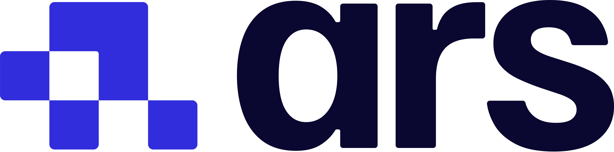

# **Manuel FlexiBowl**

## **Bienvenue dans le manuel FlexiBowl® !**   
Nous sommes ravis de vous souhaiter la bienvenue dans votre nouveau guide FlexiBowl® !
Ce manuel a été spécialement conçu pour être votre point de référence clair et fiable. Nous espérons qu'en le consultant, vous pourrez profiter pleinement de tous les avantages de notre système.
Votre avis est essentiel pour nous : n'hésitez pas à nous faire part de vos commentaires en [nous contactant](https://www.arsautomation.com/contact) ! 

*- L'équipe d'Ars Automation*  

 <a href="https://www.arsautomation.com" target="_blank">
  
  
</a>
  
## **Qu'est-ce que FlexiBowl ?**  
 Le FlexiBowl® est un système d'alimentation flexible à disque rotatif ou vibrant destiné au positionnement et à l'orientation aléatoire des composants pour le prélèvement robotique.

## **Présentation du système**  
 L'espace de travail du FlexiBowl® est virtuellement divisé en quatre parties, chacune dédiée à une phase du cycle de travail :

:::{list-table}
:widths: 20 50
:header-rows: 1

* - Phase
  - Description

* - **Alimentation**
  - Une trémie décharge iIes composants sur l'espace de travail du FlexiBowl®.

* - **Séparation**
  - Une action combinée du {ref}`groupe flip <panoramica>` et du mouvement de la surface ou du disque rigide sépare les composants et les retourne afin d'en avoir toujours au moins un dans la bonne position pour la saisie.

* - **Saisie**
  - Le système de vision reconnaît les pièces pouvant être saisies et envoie leurs coordonnées au robot, qui procède aux opérations de pick and place.

* - **Recirculation**
  - Les composants non saisis recommencent leur parcours dans le FlexiBowl® jusqu'à ce qu'ils soient saisis par le robot.

:::

:::{figure} ../../_shared/media/images/Funz-standard.PNG
:align: center
:width: 50%

Exemple de schéma du système FlexiBowl® en fonctionnement standard.
:::

:::{note}
Le cycle {ref}`Flexitracking <tracking>` est sensiblement identique au cycle traditionnel, à la différence que toutes les phases se déroulent simultanément et en continu.
:::

  
## **Comment lire le manuel**  
 Ce manuel a été conçu pour accompagner aussi bien la phase de conception et d'intégration du système que la phase d'installation et de mise en service sur le terrain. 
Pour cette raison, il est divisé en macro-sections ayant des destinataires et des objectifs distincts.
  
## **Quelle est la section que vous recherchez ?**  
 ```{list-table}
:widths: 40 60
:header-rows: 1

* - Si vous devez...
  - L'information se trouve dans...

* - Vérifier les dimensions, les poids, les exigences électriques et les protocoles de communication
  - [**RÉFÉRENCE TECHNIQUE ET SPÉCIFICATIONS**](specifiche_tecniche)

* - Installer les composants, câbler le système, configurer le réseau ou calibrer la caméra/le robot
  - [**INSTALLATION DU SYSTÈME**](Installazione_Meccanica) et [**QUICKSTART**](quickstart)

* - Programmer un nouveau modèle de pièce ou configurer le système d'alimentation
  - [**QUICKSTART**](quickstart)

* - Résoudre des problèmes ou demander de l'assistance
  - [**TROUBLESHOOTING**](troubleshooting) et [**SUPPORT**](support)
```

## **Conventions et symboles utilisés**

Tout au long du manuel, des bannières d'information sont utilisées pour mettre en évidence les contenus importants :

```{list-table}
:widths: 20 80
:header-rows: 1

* - Type
  - Signification

* - ```{warning}
    Avertissement
    ```
  - Indique une situation potentiellement dangereuse ou une procédure critique qui, si elle n'est pas correctement exécutée, pourrait provoquer des dommages à l'équipement ou de graves dysfonctionnements du système.

* - ```{important}
    Important
    ```
  - Met en évidence des informations fondamentales qui ne doivent pas être ignorées pour garantir le bon fonctionnement du système ou la sécurité de l'opération.

* - ```{note}
    Note informative
    ```
  - Fournit des informations essentielles pour le bon déroulement de la procédure, des clarifications techniques ou des renvois à des chapitres connexes.

* - ```{tip}
    Conseil
    ```
  - Suggère une pratique optimale, une alternative ou un conseil pouvant simplifier l'installation ou améliorer les performances du système.

* - ```{error}
    Erreur
    ```
  - Indique une erreur critique ou une condition de panne nécessitant une intervention immédiate. Signale des situations qui compromettent le fonctionnement du système et exigent une action corrective.
```


:::{toctree}
:hidden:
:caption: AVANT DE COMMENCER 
FlexiBowl_manual/PRIMA DI INIZIARE/01_informazioni_preliminari.md
FlexiBowl_manual/PRIMA DI INIZIARE/02_informazioni_sicurezza.md
FlexiBowl_manual/PRIMA DI INIZIARE/03_trasporto.md
FlexiBowl_manual/PRIMA DI INIZIARE/04_cond-util.md
FlexiBowl_manual/PRIMA DI INIZIARE/05_glossario.md
FlexiBowl_manual/PRIMA DI INIZIARE/06_support.md
FlexiBowl_manual/PRIMA DI INIZIARE/07_garanzia.md
:::
  
:::{toctree}
:hidden:
:caption: DONNÉES TECHNIQUES
FlexiBowl_manual/DATI TECNICI/01_panoramica.md
FlexiBowl_manual/DATI TECNICI/02_dati-tecnici-meccanici.md
FlexiBowl_manual/DATI TECNICI/03_dati-tecnici-elettrici.md
FlexiBowl_manual/DATI TECNICI/04_dati-tecnici-pneumatici.md
FlexiBowl_manual/DATI TECNICI/05_dati-tecnici-applicativi.md
:::

:::{toctree}
:hidden:
:caption: INSTALLATION
FlexiBowl_manual/INSTALLAZIONE/01_interfaccia-meccanica.md
FlexiBowl_manual/INSTALLAZIONE/02_interfaccia-elettrica.md
FlexiBowl_manual/INSTALLAZIONE/03_interfaccia-pneumatica.md
FlexiBowl_manual/INSTALLAZIONE/04_interfaccia-software.md
:::

:::{toctree}
:hidden:
:caption: PRÉSENTATION LOGICIEL
FlexiBowl_manual/INTERFACCIA SOFTWARE/04_home.md
FlexiBowl_manual/INTERFACCIA SOFTWARE/04b_maincommand.md
FlexiBowl_manual/INTERFACCIA SOFTWARE/04c_sequence.md
FlexiBowl_manual/INTERFACCIA SOFTWARE/04d_monitor.md
FlexiBowl_manual/INTERFACCIA SOFTWARE/04e_jogmotor.md
FlexiBowl_manual/INTERFACCIA SOFTWARE/04f_wizard.md
FlexiBowl_manual/INTERFACCIA SOFTWARE/04h_graphs.md
FlexiBowl_manual/INTERFACCIA SOFTWARE/04i_filetransfer.md
FlexiBowl_manual/INTERFACCIA SOFTWARE/04l_setup.md
FlexiBowl_manual/INTERFACCIA SOFTWARE/04m_hopper.md
:::

:::{toctree}  
:hidden:
:caption: QUICKSTART
FlexiBowl_manual/QUICKSTART/panoramica.md
FlexiBowl_manual/QUICKSTART/installazione_meccanica.md
FlexiBowl_manual/QUICKSTART/cablaggio_FB.md
FlexiBowl_manual/QUICKSTART/conf_interfaccia.md
FlexiBowl_manual/QUICKSTART/FB_wizard.md
FlexiBowl_manual/QUICKSTART/conf_tramoggia.md
:::

:::{toctree}  
:hidden:
:caption: MODES DE FONCTIONNEMENT 
FlexiBowl_manual/MODALITA FUNZIONAMENTO/modalita_standard.md
FlexiBowl_manual/MODALITA FUNZIONAMENTO/modalita_mix.md
FlexiBowl_manual/MODALITA FUNZIONAMENTO/modalita_tracking.md
:::

:::{toctree}  
:hidden:
:caption: PLUG-IN 
FlexiBowl_manual/PLUG-IN/01_PlugIn.md
:::

:::{toctree}
:hidden:
:caption: BONNES PRATIQUES DE LAYOUT
FlexiBowl_manual/LAYOUT BEST PRACTICE/01_layoutbp.md
:::

:::{toctree}
:hidden:
:caption: ACCESSOIRES
FlexiBowl_manual/ACCESSORI/00_ACCESSORI.md
FlexiBowl_manual/ACCESSORI/01_SUPERFICI.md
FlexiBowl_manual/ACCESSORI/03_04_illuminazione.md
FlexiBowl_manual/ACCESSORI/05_DEVIATORE.md
FlexiBowl_manual/ACCESSORI/06_SOFFI.md
FlexiBowl_manual/ACCESSORI/07_BRUSH_DIVERTER.md
FlexiBowl_manual/ACCESSORI/08_WEDGE.md
FlexiBowl_manual/ACCESSORI/09_SVUOTAMENTO.md
:::

:::{toctree}  
:hidden:
:caption: MAINTENANCE 
FlexiBowl_manual/MANUTENZIONE/01_ordinaria.md
FlexiBowl_manual/MANUTENZIONE/02_straordinaria.md
:::

:::{toctree}  
:hidden:
:caption: GARANTIE 
FlexiBowl_manual/Garanzia.md
:::

:::{toctree}  
:hidden:
:caption: DÉPANNAGE
FlexiBowl_manual/TROUBLESHOOTING/01_risoluzione-problemi.md
FlexiBowl_manual/TROUBLESHOOTING/02_problemi_meccanici.md
FlexiBowl_manual/TROUBLESHOOTING/03_problemi_elettrici.md
FlexiBowl_manual/TROUBLESHOOTING/04_problemi_pneumatici.md
FlexiBowl_manual/TROUBLESHOOTING/05_problemi_software.md
:::

:::{toctree}  
:hidden:
:caption: ÉLIMINATION
FlexiBowl_manual/SMALTIMENTO/smaltimento.md
:::

:::{toctree}  
:hidden:
:caption: CERTIFICATIONS 
FlexiBowl_manual/CERTIFICAZIONI/01_certificazioni.md
:::

:::{toctree}  
:hidden:
:caption: TRÉMIES
FlexiBowl_manual/TRAMOGGE/TRAMOGGE VIBRANTI/tramogge_vibranti.md
FlexiBowl_manual/TRAMOGGE/TRAMOGGE A NASTRO/tramogge_nastro.md

:::

:::{toctree}
:hidden:
:caption: FLEXIBOWL 2.0 VS FLEXIBOWL 3.0
FlexiBowl_manual/COMPARATIVA/panoramica.md
FlexiBowl_manual/COMPARATIVA/comparativa_meccanica.md
FlexiBowl_manual/COMPARATIVA/comparativa_elettrica.md
FlexiBowl_manual/COMPARATIVA/comparativa_pneumatica.md
FlexiBowl_manual/COMPARATIVA/comparativa_software.md
:::


<br>

<!-- Versions and languages set-up -->
<style>
  .fixed-bar {
    position: fixed;
    bottom: 10px;
    right: 10px;
    background: rgba(240, 240, 240, 0.85);
    border: 1px solid rgba(100, 100, 100, 0.3);
    border-radius: 6px;
    box-shadow: 0 1px 6px rgba(0, 0, 0, 0.1);
    font-family: 'Segoe UI', Tahoma, Geneva, Verdana, sans-serif;
    font-size: 0.9rem;
    color: #222;
    display: flex;
    gap: 12px;
    padding: 6px 12px;
    align-items: center;
    z-index: 9999;
    backdrop-filter: saturate(180%) blur(10px);
  }

  @media print {
    .fixed-bar {
      display: none !important;
    }
  }

  .fixed-bar .dropdown {
    position: relative;
    user-select: none;
  }

  .fixed-bar .dropdown-toggle {
    background-color: rgba(200, 200, 200, 0.4);
    color: #222;
    padding: 6px 10px;
    border: 1px solid rgba(100, 100, 100, 0.3);
    border-radius: 4px;
    cursor: pointer;
    display: flex;
    align-items: center;
    gap: 6px;
    box-shadow: 0 1px 2px rgba(0, 0, 0, 0.05);
    white-space: nowrap;
    transition: background-color 0.3s ease;
  }

  .fixed-bar .dropdown-toggle::after {
    content: none !important;
    display: none !important;
  }

  .fixed-bar .dropdown-toggle:hover {
    background-color: rgba(100, 150, 220, 0.2);
    color: #1a3e72;
    border-color: rgba(26, 62, 114, 0.6);
  }

  .fixed-bar .dropdown-toggle .fa {
    font-size: 0.9rem;
  }

  .fixed-bar .dropdown-menu {
    position: absolute;
    bottom: 100%;
    left: 0;
    background-color: rgba(250, 250, 250, 0.95);
    border: 1px solid rgba(150, 150, 150, 0.3);
    border-radius: 4px;
    box-shadow: 0 3px 8px rgba(0, 0, 0, 0.1);
    min-width: 140px;
    max-height: 200px;
    overflow-y: auto;
    display: none;
    flex-direction: column;
    z-index: 10000;
    backdrop-filter: saturate(180%) blur(8px);
  }

  .fixed-bar .dropdown-menu.show {
    display: flex;
  }

  .fixed-bar .dropdown-menu a {
    padding: 8px 12px;
    color: #1a3e72;
    text-decoration: none;
    border-bottom: 1px solid rgba(200, 200, 200, 0.5);
    white-space: nowrap;
    transition: background-color 0.25s ease;
  }

  .fixed-bar .dropdown-menu a:last-child {
    border-bottom: none;
  }

  .fixed-bar .dropdown-menu a:hover {
    background-color: rgba(100, 150, 220, 0.15);
  }

  .dropdown-download-buttons .btn__icon-container svg {
    width: 1em;
    height: 1em;
    stroke: currentColor;
    fill: none;
    stroke-width: 1.6;
    stroke-linecap: round;
    stroke-linejoin: round;
    vertical-align: middle;
  }

  a.headerlink.manual-heading-action {
    display: inline-flex;
    align-items: center;
    justify-content: center;
    margin-left: 0.2em;
    text-decoration: none;
    color: #7b8493;
    transition: color 0.2s ease, opacity 0.2s ease;
  }

  a.headerlink.manual-heading-action svg {
    width: 0.8em;
    height: 0.8em;
    stroke: currentColor;
    fill: none;
    stroke-width: 1.6;
    stroke-linecap: round;
    stroke-linejoin: round;
    vertical-align: middle;
  }

  a.headerlink.manual-feedback-link:hover,
  a.headerlink.manual-feedback-link:focus-visible {
    color: #2563eb;
  }

  a.headerlink.manual-service-link:hover,
  a.headerlink.manual-service-link:focus-visible {
    color: #d97706;
  }
</style>

<div class="fixed-bar" role="region" aria-label="Version and language selector">
  <div class="dropdown" data-selector="version">
    <div class="dropdown-toggle" tabindex="0" aria-haspopup="listbox" aria-expanded="false">
      Version: <span class="current-value">V. 1.0</span>
      <span class="caret-icon" aria-hidden="true">&#9662;</span>
    </div>
    <div class="dropdown-menu" role="listbox">
      	<a href="#" role="option">V. 1.0</a>
    </div>
  </div>

  <div class="dropdown" data-selector="language">
    <div class="dropdown-toggle" tabindex="0" aria-haspopup="listbox" aria-expanded="false">
      Language: <span class="current-value">FR</span>
      <span class="caret-icon" aria-hidden="true">&#9662;</span>
    </div>
    <div class="dropdown-menu" role="listbox">
      	<a href="#" role="option">DE</a>
				<a href="#" role="option">EN</a>
				<a href="#" role="option">ES</a>
				<a href="#" role="option">FR</a>
				<a href="#" role="option">IT</a>
    </div>
  </div>
</div>

<script>
  (function () {
    const bar = document.querySelector('.fixed-bar');
    if (!bar) {
      return;
    }

    const inlineVersions = ["V. 1.0"];
    const inlineLanguages = ["DE", "EN", "ES", "FR", "IT"];
    const manifest = window.FV_VERSIONING || null;
    const versions = Array.isArray(manifest && manifest.versions) && manifest.versions.length
      ? manifest.versions
      : inlineVersions;
    const offlineZipEnabled = false;
    const offlineZipFileName = 'Offline manual.zip';
    const americanRegions = new Set([
      'AG', 'AR', 'AW', 'BB', 'BL', 'BM', 'BO', 'BQ', 'BR', 'BS', 'BZ', 'CA', 'CL', 'CO', 'CR',
      'CU', 'CW', 'DM', 'DO', 'EC', 'FK', 'GD', 'GF', 'GL', 'GP', 'GT', 'GY', 'HN', 'HT', 'JM',
      'KN', 'KY', 'LC', 'MF', 'MQ', 'MS', 'MX', 'NI', 'PA', 'PE', 'PM', 'PR', 'PY', 'SR', 'SV',
      'SX', 'TC', 'TT', 'US', 'UY', 'VC', 'VE', 'VG', 'VI', '419'
    ]);
    const additionalAmericanTimeZones = new Set([
      'Atlantic/Bermuda',
      'Pacific/Easter',
      'Pacific/Galapagos',
      'Pacific/Honolulu',
      'Pacific/Pitcairn'
    ]);

    function setCaret(toggle, isOpen) {
      const caret = toggle.querySelector('.caret-icon');
      if (caret) {
        caret.innerHTML = isOpen ? '&#9652;' : '&#9662;';
      }
    }

    function closeAllMenus() {
      bar.querySelectorAll('.dropdown').forEach(dropdown => {
        const menu = dropdown.querySelector('.dropdown-menu');
        const toggle = dropdown.querySelector('.dropdown-toggle');
        menu.classList.remove('show');
        toggle.setAttribute('aria-expanded', 'false');
        setCaret(toggle, false);
      });
    }

    function getLanguagesForVersion(version) {
      const manifestLanguages = manifest &&
        manifest.languagesByVersion &&
        Array.isArray(manifest.languagesByVersion[version]) &&
        manifest.languagesByVersion[version].length
          ? manifest.languagesByVersion[version]
          : null;

      if (manifestLanguages) {
        return manifestLanguages;
      }

      return inlineLanguages;
    }

    function getDefaultLanguageForVersion(version) {
      const manifestDefault = manifest &&
        manifest.defaultLanguageByVersion &&
        typeof manifest.defaultLanguageByVersion[version] === 'string'
          ? manifest.defaultLanguageByVersion[version]
          : '';

      if (manifestDefault) {
        return manifestDefault;
      }

      const availableLanguages = getLanguagesForVersion(version);
      return availableLanguages.length ? availableLanguages[0] : (inlineLanguages[0] || '');
    }

    function populateSelectorMenu(selector, values) {
      const menu = bar.querySelector(`[data-selector="${selector}"] .dropdown-menu`);
      if (!menu) {
        return;
      }

      menu.innerHTML = '';
      values.forEach(value => {
        const link = document.createElement('a');
        link.href = '#';
        link.setAttribute('role', 'option');
        link.textContent = value;
        menu.appendChild(link);
      });
    }

    function getNavigationContext() {
      const currentUrl = new URL(window.location.href);
      const rawSegments = currentUrl.pathname.split('/').filter(Boolean);
      const decodedSegments = rawSegments.map(segment => decodeURIComponent(segment));
      const currentVersionLabel = bar.querySelector('[data-selector="version"] .current-value');
      const currentLanguageLabel = bar.querySelector('[data-selector="language"] .current-value');
      const fallbackVersion = currentVersionLabel ? currentVersionLabel.textContent.trim() : '';
      const versionIndex = decodedSegments.findIndex(segment => versions.includes(segment));
      const currentVersion = versionIndex !== -1 ? decodedSegments[versionIndex] : fallbackVersion;
      const availableLanguages = getLanguagesForVersion(currentVersion);
      const fallbackLanguage = currentLanguageLabel ? currentLanguageLabel.textContent.trim() : '';
      const languageIndex = decodedSegments.findIndex(
        (segment, index) => index > versionIndex && availableLanguages.includes(segment)
      );

      return {
        currentUrl: currentUrl,
        rawSegments: rawSegments,
        versionIndex: versionIndex,
        currentVersion: currentVersion,
        currentLanguage: languageIndex !== -1 ? decodedSegments[languageIndex] : fallbackLanguage
      };
    }

    function refreshNavigationMenus() {
      const context = getNavigationContext();
      const resolvedVersion = versions.includes(context.currentVersion) ? context.currentVersion : (versions[0] || context.currentVersion);
      const availableLanguages = getLanguagesForVersion(resolvedVersion);
      const resolvedLanguage = availableLanguages.includes(context.currentLanguage)
        ? context.currentLanguage
        : (getDefaultLanguageForVersion(resolvedVersion) || context.currentLanguage);

      populateSelectorMenu('version', versions);
      populateSelectorMenu('language', availableLanguages);

      const versionLabel = bar.querySelector('[data-selector="version"] .current-value');
      const languageLabel = bar.querySelector('[data-selector="language"] .current-value');
      if (versionLabel) {
        versionLabel.textContent = resolvedVersion;
      }
      if (languageLabel) {
        languageLabel.textContent = resolvedLanguage;
      }
    }

    function buildScopedUrl(targetVersion, targetLanguage, pageName) {
      const context = getNavigationContext();
      const rootSegments = context.versionIndex !== -1 ? context.rawSegments.slice(0, context.versionIndex) : [];
      const targetPath = '/' + rootSegments.concat([
        encodeURIComponent(targetVersion),
        encodeURIComponent(targetLanguage),
        encodeURIComponent(pageName)
      ]).join('/');

      if (context.currentUrl.protocol === 'file:') {
        return 'file://' + targetPath;
      }

      return context.currentUrl.origin + targetPath;
    }

    function buildTargetUrl(targetVersion, targetLanguage) {
      return buildScopedUrl(targetVersion, targetLanguage, 'index.html');
    }

    function buildSiteRootAssetUrl(fileName) {
      const context = getNavigationContext();
      const rootSegments = context.versionIndex !== -1 ? context.rawSegments.slice(0, context.versionIndex) : [];
      const targetPath = '/' + rootSegments.concat([encodeURIComponent(fileName)]).join('/');

      if (context.currentUrl.protocol === 'file:') {
        return 'file://' + targetPath;
      }

      return context.currentUrl.origin + targetPath;
    }

    function buildClientSiteZipUrl() {
      return buildSiteRootAssetUrl(offlineZipFileName);
    }

    function getHeadingText(heading) {
      const clone = heading.cloneNode(true);
      clone.querySelectorAll('a.headerlink').forEach(link => link.remove());
      return clone.textContent.replace(/\s+/g, ' ').trim();
    }

    function normalizeMailText(text) {
      return String(text || '').replace(/\u00AE/g, '');
    }

    function getTimeZoneAmericaDecision() {
      try {
        const timeZone = String(Intl.DateTimeFormat().resolvedOptions().timeZone || '').trim();
        if (!timeZone) {
          return null;
        }
        return timeZone.startsWith('America/') || additionalAmericanTimeZones.has(timeZone);
      } catch (error) {
        return null;
      }
    }

    function isCoordinateInAmericas(latitude, longitude) {
      if (!Number.isFinite(latitude) || !Number.isFinite(longitude)) {
        return null;
      }

      return latitude >= -60 && latitude <= 85 && longitude >= -170 && longitude <= -25;
    }

    function getCurrentPosition(options) {
      return new Promise((resolve, reject) => {
        if (!navigator.geolocation || typeof navigator.geolocation.getCurrentPosition !== 'function') {
          reject(new Error('Geolocation unavailable'));
          return;
        }

        navigator.geolocation.getCurrentPosition(resolve, reject, options);
      });
    }

    async function resolveServiceAddress() {
      const timeZoneDecision = getTimeZoneAmericaDecision();
      if (timeZoneDecision === false) {
        return 'service@arsautomation.com';
      }

      const canTryGeolocation = Boolean(
        navigator.onLine &&
        window.isSecureContext &&
        navigator.geolocation &&
        typeof navigator.geolocation.getCurrentPosition === 'function'
      );

      if (canTryGeolocation) {
        try {
          const position = await getCurrentPosition({
            enableHighAccuracy: false,
            timeout: 4000,
            maximumAge: 300000
          });
          const inAmericas = isCoordinateInAmericas(position.coords.latitude, position.coords.longitude);
          if (inAmericas !== null) {
            return inAmericas ? 'us.service@arsautomation.com' : 'service@arsautomation.com';
          }
        } catch (error) {
        }
      }

      if (timeZoneDecision === true) {
        return 'us.service@arsautomation.com';
      }

      return 'service@arsautomation.com';
    }

    function buildMailtoUrl(address, subject, body) {
      return 'mailto:' + address +
        '?subject=' + encodeURIComponent(normalizeMailText(subject)) +
        '&body=' + encodeURIComponent(normalizeMailText(body));
    }

    function createHeadingActionLink(className, title, mailtoUrl, svgMarkup) {
      const link = document.createElement('a');
      link.className = 'headerlink manual-heading-action ' + className;
      link.href = mailtoUrl;
      link.title = title;
      link.setAttribute('aria-label', title);
      link.innerHTML = svgMarkup;
      return link;
    }

    function addHeadingActions() {
      const feedbackIcon = [
        '<svg viewBox="0 0 16 16" aria-hidden="true">',
        '<path d="M3 3.5h10v6.5H7.5L4.5 13v-3H3z"></path>',
        '<path d="M6 6.2h4"></path>',
        '<path d="M6 8.2h3"></path>',
        '</svg>'
      ].join('');

        const serviceIcon = [
          '<svg viewBox="0 0 16 16" aria-hidden="true">',
          '<circle cx="8" cy="8" r="5.2"></circle>',
          '<path d="M6.4 6.1A1.9 1.9 0 0 1 8 5.2c1.1 0 1.9.7 1.9 1.7 0 .8-.4 1.3-1.2 1.8-.6.4-.9.8-.9 1.5"></path>',
          '<circle cx="8" cy="11.7" r="0.45" style="fill:currentColor;stroke:none"></circle>',
          '</svg>'
        ].join('');

      document.querySelectorAll('h1 > a.headerlink, h2 > a.headerlink, h3 > a.headerlink, h4 > a.headerlink, h5 > a.headerlink, h6 > a.headerlink').forEach(link => {
        const heading = link.parentElement;
        if (!heading || heading.querySelector('.manual-feedback-link') || heading.querySelector('.manual-service-link')) {
          return;
        }

        const sectionTitle = getHeadingText(heading);
        const sectionUrl = new URL(link.getAttribute('href'), window.location.href).href;
        const pageUrl = window.location.href.split('#')[0];
        const feedbackBody = [
          'Hello Documentation Team,',
          '',
          'I would like to suggest an improvement for this section of the manual.',
          '',
          'Section: ' + sectionTitle,
          'Page: ' + pageUrl,
          'Section link: ' + sectionUrl,
          '',
          'Suggestion:',
          ''
        ].join('\n');
          const serviceBody = [
            'Hello Service Team,',
            '',
            'I need support related to this section of the manual.',
            '',
            'Section: ' + sectionTitle,
            'Page: ' + pageUrl,
            'Section link: ' + sectionUrl,
            '',
            'FlexiBowl serial number:',
            '',
            'Photos or videos of the issue attached:',
            '',
            'Issue description:',
            ''
          ].join('\n');

        const feedbackLink = createHeadingActionLink(
          'manual-feedback-link',
          'Suggest an improvement for this section',
          buildMailtoUrl('documentation@arsautomation.com', 'Documentation suggestion: ' + sectionTitle, feedbackBody),
          feedbackIcon
        );
          const serviceLink = createHeadingActionLink(
            'manual-service-link',
            'Contact service about this section',
            '#',
            serviceIcon
          );
          serviceLink.addEventListener('click', async event => {
            event.preventDefault();
            const serviceAddress = await resolveServiceAddress();
            window.location.href = buildMailtoUrl(serviceAddress, 'Service request: ' + sectionTitle, serviceBody);
          });

          heading.appendChild(feedbackLink);
          heading.appendChild(serviceLink);
        });
    }

    function enhancePrintMenu() {
      const dropdown = document.querySelector('.dropdown-download-buttons');
      if (!dropdown || dropdown.dataset.printMenuEnhanced === 'true') {
        return;
      }

      dropdown.dataset.printMenuEnhanced = 'true';

      const toggleButton = dropdown.querySelector('.dropdown-toggle');
      const hasReleaseDownloads = offlineZipEnabled;

      if (toggleButton) {
        const toggleLabel = hasReleaseDownloads ? 'Export options' : 'Print options';
        toggleButton.setAttribute('aria-label', toggleLabel);
        toggleButton.setAttribute('title', toggleLabel);
        toggleButton.setAttribute('data-bs-original-title', toggleLabel);
        const toggleIcon = toggleButton.querySelector('i');
        if (toggleIcon) {
          toggleIcon.className = hasReleaseDownloads ? 'fas fa-download' : 'fas fa-print';
        }
      }

      dropdown.querySelectorAll('.btn-download-source-button').forEach(sourceButton => {
        const sourceItem = sourceButton.closest('li');
        if (sourceItem) {
          sourceItem.remove();
        }
      });

      const pagePrintButton = dropdown.querySelector('.btn-download-pdf-button');
      if (pagePrintButton) {
        pagePrintButton.setAttribute('title', 'Print this page');
        pagePrintButton.setAttribute('aria-label', 'Print this page');
        pagePrintButton.setAttribute('data-bs-original-title', 'Print this page');
        const textContainer = pagePrintButton.querySelector('.btn__text-container');
        if (textContainer) {
          textContainer.textContent = 'Print this page';
        }
      }

      const menu = dropdown.querySelector('.dropdown-menu');
      if (!menu) {
        return;
      }

      menu.querySelectorAll('.btn-download-client-site-zip-button').forEach(button => {
        const item = button.closest('li');
        if (item) {
          item.remove();
        }
      });

      if (offlineZipEnabled) {
        const siteZipItem = document.createElement('li');
        const siteZipLink = document.createElement('a');
        siteZipLink.className = 'btn btn-sm dropdown-item btn-download-client-site-zip-button';
        siteZipLink.title = 'Download offline manual';
        siteZipLink.setAttribute('aria-label', 'Download offline manual');
        siteZipLink.setAttribute('download', offlineZipFileName);
        siteZipLink.href = buildClientSiteZipUrl();
        siteZipLink.innerHTML = [
          '<span class="btn__icon-container">',
          '<svg viewBox="0 0 16 16" aria-hidden="true">',
          '<path d="M4 3.5h8v2.5H4z"></path>',
          '<path d="M4 6h8v6.5H4z"></path>',
          '<path d="M8 3.5v9"></path>',
          '<path d="M6.3 9.2L8 10.9l1.7-1.7"></path>',
          '</svg>',
          '</span>',
          '<span class="btn__text-container">Download offline manual</span>'
        ].join('');
        siteZipItem.appendChild(siteZipLink);
        menu.appendChild(siteZipItem);
      }
    }

    refreshNavigationMenus();

    bar.querySelectorAll('.dropdown').forEach(dropdown => {
      const toggle = dropdown.querySelector('.dropdown-toggle');
      const menu = dropdown.querySelector('.dropdown-menu');
      const selector = dropdown.getAttribute('data-selector');

      toggle.addEventListener('click', event => {
        event.stopPropagation();
        const willOpen = toggle.getAttribute('aria-expanded') !== 'true';
        closeAllMenus();

        if (willOpen) {
          menu.classList.add('show');
          toggle.setAttribute('aria-expanded', 'true');
          setCaret(toggle, true);
        }
      });

      menu.addEventListener('click', event => {
        const link = event.target.closest('a');
        if (!link) {
          return;
        }

        event.preventDefault();
        const selectedValue = link.textContent.trim();
        const context = getNavigationContext();
        if (!selectedValue) {
          return;
        }

        if (selector === 'version') {
          const targetVersion = selectedValue;
          const availableLanguages = getLanguagesForVersion(targetVersion);
          const targetLanguage = availableLanguages.includes(context.currentLanguage)
            ? context.currentLanguage
            : getDefaultLanguageForVersion(targetVersion);
          if (targetLanguage) {
            window.location.href = buildTargetUrl(targetVersion, targetLanguage);
          }
          return;
        }

        window.location.href = buildTargetUrl(context.currentVersion, selectedValue);
      });
    });

    window.addEventListener('click', closeAllMenus);
    window.addEventListener('keydown', event => {
      if (event.key === 'Escape') {
        closeAllMenus();
      }
    });

    addHeadingActions();
    enhancePrintMenu();
  })();
</script>
