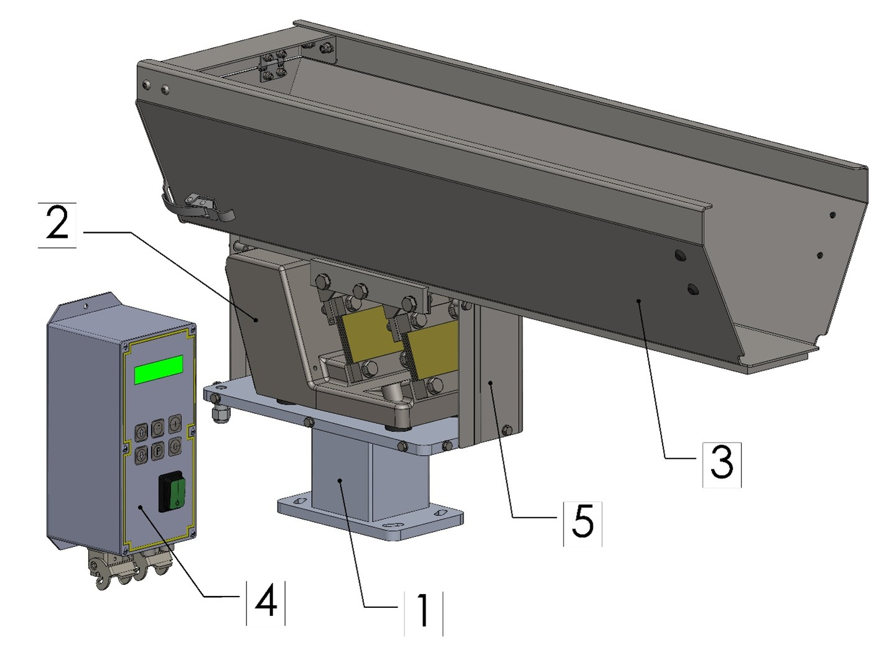

# **Descrizione Macchina** 

<p style="line-height: 1.6; border-left: 4px solid #34495e; padding-left: 15px; margin-bottom: 25px;">
  Le tramogge sono particolarmente adatte per alimentare e pre-dosare particolari di piccole, medie e grandi dimensioni. Sono azionate da una base lineare vibrante, il cui modello varia a seconda della dimensione della tramoggia stessa.
</p>

La macchina standard è composta dalle seguenti parti fondamentali:



| Pos. | Elemento | Descrizione |
|------|-----------|--------------|
| 1 | SUPPORTO | È il componente che viene staffato sulla macchina e su cui viene posizionata la tramoggia. |
| 2 | BASE VIBRANTE | È il componente principale della tramoggia; tramite un elettromagnete effettua la vibrazione che permette l’avanzamento dei pezzi sulla vasca. |
| 3 | VASCA | Può essere da 1,5lt, 5lt, 10lt, 20lt, 40lt a seconda del componente da lavorare. Su richiesta, sono realizzabili anche di dimensioni personalizzate. La vasca da 1,5lt è costruita in materiale plastico mentre le altre sono in acciaio INOX. |
| 4 | CONTROLLER | Viene utilizzato per regolare la vibrazione della tramoggia. |
| 5 | CARTER | Componenti di protezione della base vibrante da urti, sporco e polvere. |

:::{attention}
Nel caso di modelli personalizzati i componenti potrebbero differire, parzialmente o totalmente, da quelli indicati. Per modelli di questo genere è necessario fare riferimento al fascicolo tecnico di progetto. 
:::

## Componenti e Funzionamento

* **Struttura della base:** La base lineare vibrante è composta da due corpi uniti tra loro da molle a balestra.
* **Meccanismo di vibrazione:** Il funzionamento è affidato ad un elettromagnete solidale al corpo fisso che attrae e rilascia il corpo mobile. Questa azione genera la vibrazione che permette l’avanzamento dei particolari contenuti all’interno della vasca (posizionata sul corpo mobile e bloccata tramite l’utilizzo di ganasce).
* **Controllo elettrico:** Per assolvere a questo scopo i vibratori necessitano di un controller che converte la corrente alternata in corrente di impulso, oltre a regolare la velocità del sistema stesso.

---

## Uso Previsto 

La tramoggia è disponibile in sei modelli base. Modelli personalizzati, derivanti da quelli di base ma differenti dal punto di vista dimensionale e prestazionale, sono realizzabili previo confronto con le richieste dell’utilizzatore. 

:::{note} 
**Nota di validità:** Le informazioni contenute nel presente manuale sono da ritenersi valide anche per modelli di natura personalizzata.
:::

**Capacità dei modelli standard disponibili:**

| Modello Base | Capacità della Vasca |
|:--- |:--- |
| **Modello 1** | 1,5 litri |
| **Modello 2** | 3 litri |
| **Modello 3** | 5 litri |
| **Modello 4** | 10 litri |
| **Modello 5** | 20 litri |
| **Modello 6** | 40 litri |


La macchina in oggetto è destinata ad uso industriale per: 

::::{list-table}
:widths: 25 25 25 25
:header-rows: 1
:class: custom-safety-table

* - <span style="font-weight: bold; color: #2c3e50;">Operazione</span>
  - <span style="font-weight: bold; color: #27ae60;">Consentita</span>
  - <span style="font-weight: bold; color: #c0392b;">Non Consentita</span>
  - <span style="font-weight: bold; color: #2c3e50;">Ambiente di lavorazione</span>

* - <div style="padding: 8px 0;"><span style="font-weight: 600; text-transform: uppercase; font-size: 0.9em; ">Movimentazione volta all'alimentazione di:</span></div>
  - <div style="background-color: #e8f8f5; border-left: 4px solid #2ecc71; padding: 10px; margin: 5px 0; border-radius: 4px; font-size: 0.95em; color: #117a65;">
      Componentistica di peso e dimensioni massime variabili in base al modello di macchina.
    </div>
  - <div style="background-color: #fdf2f2; border-left: 4px solid #e74c3c; padding: 10px; margin: 5px 0; border-radius: 4px; font-size: 0.95em; color: #78281f;">
      Qualsiasi altro componente non compreso all'interno del range di peso e dimensioni massime consentite.
    </div>
  - <div style="background-color: #f4f6f7; padding: 10px; margin: 5px 0; border-radius: 4px; font-size: 0.95em; text-align: center; font-weight: 500; color: #566573;">
      Industriale
    </div>
::::

:::{IMPORTANT}
Per maggiori informazioni sulla tipologia di componentistica consentita, consultare il paragrafo “Dati tecnici” del presente manuale.
:::

<div style="display: flex; flex-direction: column; gap: 20px; margin: 20px 0;">

  <!-- Card 1: Destinazione d'Uso -->
  <div style="border-left: 5px solid #2980b9; background-color: #ebf5fb; padding: 20px; border-radius: 4px 8px 8px 4px; box-shadow: 0 2px 8px rgba(0,0,0,0.05);">
    <h3 style="color: #2980b9; margin-top: 0; font-size: 1.2em; border-bottom: none;"> Destinazione d'Uso</h3>
    <p style="margin-bottom: 10px; color: #2c3e50;">La macchina è stata creata per:</p>
    <ul style="color: #34495e; margin-bottom: 0; padding-left: 20px;">
      <li style="margin-bottom: 5px;">soddisfare le <strong>esigenze specifiche</strong> menzionate sul contratto di vendita;</li>
      <li>essere utilizzata secondo le <strong>istruzioni ed i limiti d’impiego</strong> riportati nel presente manuale.</li>
    </ul>
  </div>

  <!-- Card 2: Condizioni per la Sicurezza -->
  <div style="border-left: 5px solid #27ae60; background-color: #eafaf1; padding: 20px; border-radius: 4px 8px 8px 4px; box-shadow: 0 2px 8px rgba(0,0,0,0.05);">
    <h3 style="color: #27ae60; margin-top: 0; font-size: 1.2em; border-bottom: none;"> Condizioni per la Sicurezza</h3>
    <p style="margin-bottom: 10px; color: #2c3e50;">La macchina è progettata e costruita per lavorare in sicurezza <strong>esclusivamente se</strong>:</p>
    <ul style="color: #34495e; margin-bottom: 0; padding-left: 20px;">
      <li style="margin-bottom: 5px;">viene impiegata entro i limiti dichiarati sul contratto e sul presente manuale;</li>
      <li style="margin-bottom: 5px;">vengono seguite scrupolosamente le procedure del manuale d’uso;</li>
      <li style="margin-bottom: 5px;">viene effettuata la manutenzione ordinaria nei tempi e nei modi indicati;</li>
      <li style="margin-bottom: 5px;">viene fatta eseguire tempestivamente la manutenzione straordinaria in caso di necessità;</li>
      <li><strong style="color: #c0392b;">NON vengono mai rimossi e/o bypassati i dispositivi di sicurezza.</strong></li>
    </ul>
  </div>

</div>

## Uso Scorretto (Ragionevolmente Prevedibile)

<div style="border-left: 5px solid #c0392b; background-color: #fdf2f2; padding: 20px; border-radius: 4px; margin: 15px 0; box-shadow: 0 2px 5px rgba(0,0,0,0.03);">
  <ul style="color: #2c3e50; margin: 0; padding-left: 20px; line-height: 1.6;">
    <li style="margin-bottom: 8px;">Lavorare componenti liquidi e graniglie fini;</li>
    <li style="margin-bottom: 8px;">Modificare i parametri di lavoro inficianti la sicurezza;</li>
    <li style="margin-bottom: 8px;">Trasporto di persone;</li>
    <li style="margin-bottom: 8px;">Sfruttare la macchina come punto d’appoggio;</li>
    <li style="margin-bottom: 8px;">Utilizzare la macchina in modo da ottenere valori di produzione superiori ai limiti prescritti;</li>
    <li style="margin-bottom: 8px;">Modificare / manomettere i collegamenti elettrici e pneumatici della macchina o ogni altro suo componente;</li>
    <li style="margin-bottom: 8px;">Utilizzare la macchina con prodotto diverso da quello elencato nell’“Uso previsto (corretto)”;</li>
    <li style="margin-bottom: 0;">Utilizzare la macchina diversamente da quanto previsto al paragrafo “Uso previsto (corretto)”.</li>
  </ul>
</div>

:::{warning}
Qualsiasi altro impiego della macchina rispetto a quello previsto deve essere preventivamente autorizzato per iscritto dal Costruttore. In mancanza di tale autorizzazione scritta, l’impiego è da considerare “uso improprio”; pertanto il Costruttore declina ogni responsabilità in relazione ai danni eventualmente provocati a cose o persone e ritiene decaduta ogni tipo di garanzia sulla macchina.  
:::

:::{important}
Un uso improprio della macchina esclude qualsiasi responsabilità del Costruttore.
:::

## Obblighi e Divieti 

### Obblighi degli utilizzatori 

L’utilizzatore (imprenditore o datore di lavoro) deve:

<div style="border-left: 5px solid #2980b9; background-color: #ebf5fb; padding: 20px; border-radius: 4px; margin: 15px 0; box-shadow: 0 2px 5px rgba(0,0,0,0.03);">
  <ul style="color: #2c3e50; margin: 0; padding-left: 20px; line-height: 1.6;">
    <li style="margin-bottom: 8px;">Tenere conto delle capacità e delle condizioni degli operatori in rapporto alla loro salute e alla loro sicurezza;</li>
    <li style="margin-bottom: 8px;">Fornire i mezzi di protezione individuale (DPI) adeguati alle singole procedure;</li>
    <li style="margin-bottom: 8px;">Fornire mezzi e procedure di sollevamento a norma;</li>
    <li style="margin-bottom: 8px;">Richiedere l’osservanza da parte dei singoli lavoratori delle norme e delle disposizioni aziendali in materia di sicurezza e di uso dei mezzi di protezione collettivi e individuali messi a loro disposizione;</li>
    <li style="margin-bottom: 8px;">Istruire il personale sulle procedure da seguire in caso di infortunio;</li>
    <li style="margin-bottom: 8px;">Istruire il personale sui rischi residui presenti;</li>
    <li style="margin-bottom: 8px;">Istruire il personale sui dispositivi predisposti per la sicurezza degli operatori;</li>
    <li style="margin-bottom: 8px;">Istruire il personale sui rischi di emissione da rumore nell’ambiente di lavoro;</li>
    <li style="margin-bottom: 0;">Istruire il personale sulle regole antinfortunistiche generali previste da direttive europee e dalla legislazione del Paese di destinazione della macchina.</li>
  </ul>
</div>

:::{note} 
Fare operare sulla macchina solo personale che abbia preso visione del presente manuale e che sia stato opportunamente addestrato.
:::

### Obblighi del personale addetto (operatori/manutentori/tecnici)

Il personale deve:

<div style="border-left: 5px solid #27ae60; background-color: #eafaf1; padding: 20px; border-radius: 4px; margin: 15px 0; box-shadow: 0 2px 5px rgba(0,0,0,0.03);">
  <ul style="color: #2c3e50; margin: 0; padding-left: 20px; line-height: 1.6;">
    <li style="margin-bottom: 8px;"><strong>Effettuare gli interventi di manutenzione sempre a macchina spenta.</strong> Non lubrificare mai organi in moto;</li>
    <li style="margin-bottom: 8px;">Quando la macchina è in funzione, evitare di operare nei pressi con catene, braccialetti, cravatte o altri indumenti che possano impigliarsi nei meccanismi;</li>
    <li style="margin-bottom: 8px;">Raccogliere obbligatoriamente i capelli lunghi per evitare il rischio di trascinamento;</li>
    <li style="margin-bottom: 8px;">Effettuare interventi sul quadro elettrico, cassette di derivazione, cavi e componenti elettrici <strong>esclusivamente con l’interruttore generale spento</strong>;</li>
    <li style="margin-bottom: 8px;">Sincerarsi che non vi sia nessuna persona all'interno delle zone pericolose prima di avviare la macchina;</li>
    <li style="margin-bottom: 8px;">Prestare la massima attenzione durante il funzionamento affinché nessuno possa accedere direttamente alle parti in movimento;</li>
    <li style="margin-bottom: 8px;">Utilizzare in modo appropriato i dispositivi di protezione messi a disposizione dal datore di lavoro;</li>
    <li style="margin-bottom: 0;">Segnalare immediatamente al datore di lavoro, al dirigente o al preposto qualsiasi deficienza o anomalia nei dispositivi di sicurezza.</li>
  </ul>
</div>

### Divieti del personale addetto 

In particolare, il personale non deve:

<div style="border-left: 5px solid #c0392b; background-color: #fdf2f2; padding: 20px; border-radius: 4px; margin: 15px 0; box-shadow: 0 2px 5px rgba(0,0,0,0.03);">
  <ul style="color: #2c3e50; margin: 0; padding-left: 20px; line-height: 1.6;">
    <li style="margin-bottom: 8px;">Utilizzare la macchina in modo improprio (ovvero per usi diversi da quelli indicati nel paragrafo “Uso Previsto”);</li>
    <li style="margin-bottom: 8px;">Rimuovere o modificare senza preventiva autorizzazione i dispositivi di sicurezza o di segnalazione;</li>
    <li style="margin-bottom: 8px;">Compiere di propria iniziativa operazioni o manovre fuori dalla propria competenza o che possano compromettere la sicurezza propria o di altri lavoratori;</li>
    <li style="margin-bottom: 8px;">Indossare bracciali, anelli o catenine che possano ciondolare ed essere trascinati da organi in movimento;</li>
    <li style="margin-bottom: 8px;">Sostituire o modificare le velocità dei componenti della macchina senza l'esplicito consenso di un responsabile;</li>
    <li style="margin-bottom: 8px;">Modificare in alcun modo il ciclo programmato della macchina;</li>
    <li style="margin-bottom: 8px;">Modificare gli allacciamenti elettrici con lo scopo di escludere o bypassare le sicurezze interne;</li>
    <li style="margin-bottom: 8px;">Utilizzare la macchina se non è stata installata in totale conformità con le normative vigenti;</li>
    <li style="margin-bottom: 8px;">Sfruttare la macchina come punto di appoggio, anche se non funzionante (pena il rischio di caduta dell'operatore e/o il danneggiamento della struttura);</li>
    <li style="margin-bottom: 0;">Utilizzare la macchina al di fuori delle condizioni ambientali permesse (consultare il “Capitolo 5”).</li>
  </ul>
</div>

:::{attention}
ARS S.r.l. non risponde per danni causati a cose o persone nel caso:  
•	si accerti che la macchina sia stata utilizzata in uno degli ambienti non ammessi;  
•	non siano stati rispettati gli obblighi ed i divieti qui descritti.  
:::

## Dati Tecnici 

```{list-table}
:header-rows: 1

* - Dati alimentazione elettrica
  - 1,5lt
  - 3lt
  - 5lt
  - 10lt
  - 20lt
  - 40lt
* - Alimentazione elettrica
  - :span: 6
  - 230Vac +/- 5% (115Vac su richiesta)
* - Frequenza / Fase
  - :span: 6
  - 50-60 Hz / monofase
* - Assorbimento (A)
  - 0,1
  - 0,1
  - 0,25
  - 0,25
  - 0,25
  - 0,45
```

| Dati alimentazione elettrica | 1,5lt | 3lt | 5lt | 10lt | 20lt | 40lt |
|------------------------------|--------|------|------|-------|-------|-------|
| Peso netto                   | 11 Kg | 18 Kg | 22 Kg | 24 Kg | 27 Kg | 38 Kg |

:::{attention}
Nel caso di modelli personalizzati i valori indicati potrebbero differire da quelli in tabella. Per modelli di questo genere è necessario fare riferimento al fascicolo tecnico di progetto. 
:::

## Layout 


| Dimensioni | 1,5lt | 3lt | 5lt | 10lt | 20lt | 40lt |
|------------|--------|------|------|-------|-------|-------|
| A | 350 mm | 525 mm | 435 mm | 630 mm | 760 mm | 780 mm |
| B | 65 mm | 98 mm | 135 mm | 135 mm | 180 mm | 260 mm |
| C | 90 mm | 97 mm | 140 mm | 140 mm | 220 mm | 280 mm |
| D | 211 mm | 218 mm | 247 mm | 247 mm | 262 mm | 290 mm |

:::{attention}
Nel caso di modelli personalizzati i valori indicati potrebbero differire da quelli in tabella. Per modelli di questo genere è necessario fare riferimento al fascicolo tecnico di progetto. 
:::


## Componenti Standard e Opzionali 

```{list-table} Accessori e Dotazioni delle Tramogge
:widths: 20 40 25 15
:header-rows: 1

* - **Elemento**
  - **Descrizione**
  - **Foto**
  - **Standard / Opzionale**

* - Sportello svuotamento
  - Sportello di scarico posteriore per svuotamento rapido
  - 
    :::{image} ../../../../../_shared/media/images/sportello_svuotamento.jpg
    :alt: Sportello svuotamento
    :width: 120px
    :align: center
    :::
  - STANDARD (esclusa tramoggia 1,5lt)

* - Barriera dosatrice
  - Dosatore a barriera per regolazione del flusso (registrabile)
  - 
    :::{image} ../../../../../_shared/media/images/barriera_dosatrice.jpg
    :alt: Barriera dosatrice
    :width: 120px
    :align: center
    :::
  - OPZIONALE (esclusa tramoggia 1,5lt)

* - Protezione di sicurezza
  - Protezione di sicurezza per mani
  - 
    :::{image} ../../../../../_shared/media/images/protezione_sicurezza.jpg
    :alt: Protezione di sicurezza
    :width: 120px
    :align: center
    :::
  - OPZIONALE (esclusa tramoggia 1,5lt)

* - Rivestimento
  - Rivestimento della vasca in poliuretano
  - 
    :::{image} ../../../../../_shared/media/images/rivestimento.png
        :alt: Rivestimento
        :width: 120px
        :align: center
    :::
  - OPZIONALE (esclusa tramoggia 1,5lt)

* - Fotocellula frontale
  - Ha la funzione di verificare la presenza di componenti nella zona frontale della vasca vibrante durante il processo di alimentazione. Per maggiori informazioni fare riferimento all’Appendice A: “Frontal and Rear Photocells”.
  - 
    :::{image} ../../../../../_shared/media/images/fotocellula_frontale.png
        :alt: Fotocellula frontale
        :width: 120px
        :align: center
    :::
  - OPZIONALE (esclusa tramoggia 1,5lt)

* - Fotocellula posteriore
  - Ha la funzione di monitorare il livello dei pezzi presenti dentro alla vasca. Per maggiori informazioni fare riferimento all’Appendice A: “Frontal and Rear Photocells”.
  - 
    :::{image} ../../../../../_shared/media/images/fotocellula_posteriore.png
        :alt: Fotocellula posteriore
        :width: 120px
        :align: center
    :::
  - OPZIONALE (esclusa tramoggia 1,5lt)

```

### Ciclo di lavorazione 

Di seguito viene descritto in maniera semplificata il ciclo di lavorazione, suddiviso nelle seguenti fasi operative:

<div style="display: flex; flex-direction: column; gap: 15px; margin: 20px 0; position: relative;">

  <!-- Fase 1 -->
  <div style="display: flex; background-color: #f8f9fa; border-radius: 8px; border: 1px solid #e9ecef; overflow: hidden; box-shadow: 0 2px 4px rgba(0,0,0,0.02);">
    <div style="background-color: #2c3e50; color: #ffffff; display: flex; align-items: center; justify-content: center; width: 60px; font-size: 1.4em; font-weight: bold; flex-shrink: 0;">
      1
    </div>
    <div style="padding: 15px 20px; display: flex; align-items: center; color: #2c3e50; line-height: 1.5;">
      <span>L'operatore posiziona manualmente o con un sistema di carico automatico il prodotto da lavorare all’interno della vasca.</span>
    </div>
  </div>

  <!-- Fase 2 -->
  <div style="display: flex; background-color: #f8f9fa; border-radius: 8px; border: 1px solid #e9ecef; overflow: hidden; box-shadow: 0 2px 4px rgba(0,0,0,0.02);">
    <div style="background-color: #34495e; color: #ffffff; display: flex; align-items: center; justify-content: center; width: 60px; font-size: 1.4em; font-weight: bold; flex-shrink: 0;">
      2
    </div>
    <div style="padding: 15px 20px; display: flex; align-items: center; color: #2c3e50; line-height: 1.5;">
      <span>La tramoggia effettua ciclicamente delle vibrazioni (impostate dall'operatore) per consentire l’avanzamento dei pezzi, in modo da garantire costantemente la presenza degli stessi sull’alimentatore.</span>
    </div>
  </div>

</div>


<br>

<!-- Versions and languages set-up -->
<style>
  .fixed-bar {
    position: fixed;
    bottom: 10px;
    right: 10px;
    background: rgba(240, 240, 240, 0.85);
    border: 1px solid rgba(100, 100, 100, 0.3);
    border-radius: 6px;
    box-shadow: 0 1px 6px rgba(0, 0, 0, 0.1);
    font-family: 'Segoe UI', Tahoma, Geneva, Verdana, sans-serif;
    font-size: 0.9rem;
    color: #222;
    display: flex;
    gap: 12px;
    padding: 6px 12px;
    align-items: center;
    z-index: 9999;
    backdrop-filter: saturate(180%) blur(10px);
  }

  @media print {
    .fixed-bar {
      display: none !important;
    }
  }

  .fixed-bar .dropdown {
    position: relative;
    user-select: none;
  }

  .fixed-bar .dropdown-toggle {
    background-color: rgba(200, 200, 200, 0.4);
    color: #222;
    padding: 6px 10px;
    border: 1px solid rgba(100, 100, 100, 0.3);
    border-radius: 4px;
    cursor: pointer;
    display: flex;
    align-items: center;
    gap: 6px;
    box-shadow: 0 1px 2px rgba(0, 0, 0, 0.05);
    white-space: nowrap;
    transition: background-color 0.3s ease;
  }

  .fixed-bar .dropdown-toggle::after {
    content: none !important;
    display: none !important;
  }

  .fixed-bar .dropdown-toggle:hover {
    background-color: rgba(100, 150, 220, 0.2);
    color: #1a3e72;
    border-color: rgba(26, 62, 114, 0.6);
  }

  .fixed-bar .dropdown-toggle .fa {
    font-size: 0.9rem;
  }

  .fixed-bar .dropdown-menu {
    position: absolute;
    bottom: 100%;
    left: 0;
    background-color: rgba(250, 250, 250, 0.95);
    border: 1px solid rgba(150, 150, 150, 0.3);
    border-radius: 4px;
    box-shadow: 0 3px 8px rgba(0, 0, 0, 0.1);
    min-width: 140px;
    max-height: 200px;
    overflow-y: auto;
    display: none;
    flex-direction: column;
    z-index: 10000;
    backdrop-filter: saturate(180%) blur(8px);
  }

  .fixed-bar .dropdown-menu.show {
    display: flex;
  }

  .fixed-bar .dropdown-menu a {
    padding: 8px 12px;
    color: #1a3e72;
    text-decoration: none;
    border-bottom: 1px solid rgba(200, 200, 200, 0.5);
    white-space: nowrap;
    transition: background-color 0.25s ease;
  }

  .fixed-bar .dropdown-menu a:last-child {
    border-bottom: none;
  }

  .fixed-bar .dropdown-menu a:hover {
    background-color: rgba(100, 150, 220, 0.15);
  }

  .dropdown-download-buttons .btn__icon-container svg {
    width: 1em;
    height: 1em;
    stroke: currentColor;
    fill: none;
    stroke-width: 1.6;
    stroke-linecap: round;
    stroke-linejoin: round;
    vertical-align: middle;
  }

  a.headerlink.manual-heading-action {
    display: inline-flex;
    align-items: center;
    justify-content: center;
    margin-left: 0.2em;
    text-decoration: none;
    color: #7b8493;
    transition: color 0.2s ease, opacity 0.2s ease;
  }

  a.headerlink.manual-heading-action svg {
    width: 0.8em;
    height: 0.8em;
    stroke: currentColor;
    fill: none;
    stroke-width: 1.6;
    stroke-linecap: round;
    stroke-linejoin: round;
    vertical-align: middle;
  }

  a.headerlink.manual-feedback-link:hover,
  a.headerlink.manual-feedback-link:focus-visible {
    color: #2563eb;
  }

  a.headerlink.manual-service-link:hover,
  a.headerlink.manual-service-link:focus-visible {
    color: #d97706;
  }
</style>

<div class="fixed-bar" role="region" aria-label="Version and language selector">
  <div class="dropdown" data-selector="version">
    <div class="dropdown-toggle" tabindex="0" aria-haspopup="listbox" aria-expanded="false">
      Version: <span class="current-value">V. 1.0</span>
      <span class="caret-icon" aria-hidden="true">&#9662;</span>
    </div>
    <div class="dropdown-menu" role="listbox">
      	<a href="#" role="option">V. 1.0</a>
    </div>
  </div>

  <div class="dropdown" data-selector="language">
    <div class="dropdown-toggle" tabindex="0" aria-haspopup="listbox" aria-expanded="false">
      Language: <span class="current-value">IT</span>
      <span class="caret-icon" aria-hidden="true">&#9662;</span>
    </div>
    <div class="dropdown-menu" role="listbox">
      	<a href="#" role="option">DE</a>
				<a href="#" role="option">EN</a>
				<a href="#" role="option">ES</a>
				<a href="#" role="option">FR</a>
				<a href="#" role="option">IT</a>
    </div>
  </div>
</div>

<script>
  (function () {
    const bar = document.querySelector('.fixed-bar');
    if (!bar) {
      return;
    }

    const inlineVersions = ["V. 1.0"];
    const inlineLanguages = ["DE", "EN", "ES", "FR", "IT"];
    const manifest = window.FV_VERSIONING || null;
    const versions = Array.isArray(manifest && manifest.versions) && manifest.versions.length
      ? manifest.versions
      : inlineVersions;
    const offlineZipEnabled = false;
    const offlineZipFileName = 'Offline manual.zip';
    const americanRegions = new Set([
      'AG', 'AR', 'AW', 'BB', 'BL', 'BM', 'BO', 'BQ', 'BR', 'BS', 'BZ', 'CA', 'CL', 'CO', 'CR',
      'CU', 'CW', 'DM', 'DO', 'EC', 'FK', 'GD', 'GF', 'GL', 'GP', 'GT', 'GY', 'HN', 'HT', 'JM',
      'KN', 'KY', 'LC', 'MF', 'MQ', 'MS', 'MX', 'NI', 'PA', 'PE', 'PM', 'PR', 'PY', 'SR', 'SV',
      'SX', 'TC', 'TT', 'US', 'UY', 'VC', 'VE', 'VG', 'VI', '419'
    ]);
    const additionalAmericanTimeZones = new Set([
      'Atlantic/Bermuda',
      'Pacific/Easter',
      'Pacific/Galapagos',
      'Pacific/Honolulu',
      'Pacific/Pitcairn'
    ]);

    function setCaret(toggle, isOpen) {
      const caret = toggle.querySelector('.caret-icon');
      if (caret) {
        caret.innerHTML = isOpen ? '&#9652;' : '&#9662;';
      }
    }

    function closeAllMenus() {
      bar.querySelectorAll('.dropdown').forEach(dropdown => {
        const menu = dropdown.querySelector('.dropdown-menu');
        const toggle = dropdown.querySelector('.dropdown-toggle');
        menu.classList.remove('show');
        toggle.setAttribute('aria-expanded', 'false');
        setCaret(toggle, false);
      });
    }

    function getLanguagesForVersion(version) {
      const manifestLanguages = manifest &&
        manifest.languagesByVersion &&
        Array.isArray(manifest.languagesByVersion[version]) &&
        manifest.languagesByVersion[version].length
          ? manifest.languagesByVersion[version]
          : null;

      if (manifestLanguages) {
        return manifestLanguages;
      }

      return inlineLanguages;
    }

    function getDefaultLanguageForVersion(version) {
      const manifestDefault = manifest &&
        manifest.defaultLanguageByVersion &&
        typeof manifest.defaultLanguageByVersion[version] === 'string'
          ? manifest.defaultLanguageByVersion[version]
          : '';

      if (manifestDefault) {
        return manifestDefault;
      }

      const availableLanguages = getLanguagesForVersion(version);
      return availableLanguages.length ? availableLanguages[0] : (inlineLanguages[0] || '');
    }

    function populateSelectorMenu(selector, values) {
      const menu = bar.querySelector(`[data-selector="${selector}"] .dropdown-menu`);
      if (!menu) {
        return;
      }

      menu.innerHTML = '';
      values.forEach(value => {
        const link = document.createElement('a');
        link.href = '#';
        link.setAttribute('role', 'option');
        link.textContent = value;
        menu.appendChild(link);
      });
    }

    function getNavigationContext() {
      const currentUrl = new URL(window.location.href);
      const rawSegments = currentUrl.pathname.split('/').filter(Boolean);
      const decodedSegments = rawSegments.map(segment => decodeURIComponent(segment));
      const currentVersionLabel = bar.querySelector('[data-selector="version"] .current-value');
      const currentLanguageLabel = bar.querySelector('[data-selector="language"] .current-value');
      const fallbackVersion = currentVersionLabel ? currentVersionLabel.textContent.trim() : '';
      const versionIndex = decodedSegments.findIndex(segment => versions.includes(segment));
      const currentVersion = versionIndex !== -1 ? decodedSegments[versionIndex] : fallbackVersion;
      const availableLanguages = getLanguagesForVersion(currentVersion);
      const fallbackLanguage = currentLanguageLabel ? currentLanguageLabel.textContent.trim() : '';
      const languageIndex = decodedSegments.findIndex(
        (segment, index) => index > versionIndex && availableLanguages.includes(segment)
      );

      return {
        currentUrl: currentUrl,
        rawSegments: rawSegments,
        versionIndex: versionIndex,
        currentVersion: currentVersion,
        currentLanguage: languageIndex !== -1 ? decodedSegments[languageIndex] : fallbackLanguage
      };
    }

    function refreshNavigationMenus() {
      const context = getNavigationContext();
      const resolvedVersion = versions.includes(context.currentVersion) ? context.currentVersion : (versions[0] || context.currentVersion);
      const availableLanguages = getLanguagesForVersion(resolvedVersion);
      const resolvedLanguage = availableLanguages.includes(context.currentLanguage)
        ? context.currentLanguage
        : (getDefaultLanguageForVersion(resolvedVersion) || context.currentLanguage);

      populateSelectorMenu('version', versions);
      populateSelectorMenu('language', availableLanguages);

      const versionLabel = bar.querySelector('[data-selector="version"] .current-value');
      const languageLabel = bar.querySelector('[data-selector="language"] .current-value');
      if (versionLabel) {
        versionLabel.textContent = resolvedVersion;
      }
      if (languageLabel) {
        languageLabel.textContent = resolvedLanguage;
      }
    }

    function buildScopedUrl(targetVersion, targetLanguage, pageName) {
      const context = getNavigationContext();
      const rootSegments = context.versionIndex !== -1 ? context.rawSegments.slice(0, context.versionIndex) : [];
      const targetPath = '/' + rootSegments.concat([
        encodeURIComponent(targetVersion),
        encodeURIComponent(targetLanguage),
        encodeURIComponent(pageName)
      ]).join('/');

      if (context.currentUrl.protocol === 'file:') {
        return 'file://' + targetPath;
      }

      return context.currentUrl.origin + targetPath;
    }

    function buildTargetUrl(targetVersion, targetLanguage) {
      return buildScopedUrl(targetVersion, targetLanguage, 'index.html');
    }

    function buildSiteRootAssetUrl(fileName) {
      const context = getNavigationContext();
      const rootSegments = context.versionIndex !== -1 ? context.rawSegments.slice(0, context.versionIndex) : [];
      const targetPath = '/' + rootSegments.concat([encodeURIComponent(fileName)]).join('/');

      if (context.currentUrl.protocol === 'file:') {
        return 'file://' + targetPath;
      }

      return context.currentUrl.origin + targetPath;
    }

    function buildClientSiteZipUrl() {
      return buildSiteRootAssetUrl(offlineZipFileName);
    }

    function getHeadingText(heading) {
      const clone = heading.cloneNode(true);
      clone.querySelectorAll('a.headerlink').forEach(link => link.remove());
      return clone.textContent.replace(/\s+/g, ' ').trim();
    }

    function normalizeMailText(text) {
      return String(text || '').replace(/\u00AE/g, '');
    }

    function getTimeZoneAmericaDecision() {
      try {
        const timeZone = String(Intl.DateTimeFormat().resolvedOptions().timeZone || '').trim();
        if (!timeZone) {
          return null;
        }
        return timeZone.startsWith('America/') || additionalAmericanTimeZones.has(timeZone);
      } catch (error) {
        return null;
      }
    }

    function isCoordinateInAmericas(latitude, longitude) {
      if (!Number.isFinite(latitude) || !Number.isFinite(longitude)) {
        return null;
      }

      return latitude >= -60 && latitude <= 85 && longitude >= -170 && longitude <= -25;
    }

    function getCurrentPosition(options) {
      return new Promise((resolve, reject) => {
        if (!navigator.geolocation || typeof navigator.geolocation.getCurrentPosition !== 'function') {
          reject(new Error('Geolocation unavailable'));
          return;
        }

        navigator.geolocation.getCurrentPosition(resolve, reject, options);
      });
    }

    async function resolveServiceAddress() {
      const timeZoneDecision = getTimeZoneAmericaDecision();
      if (timeZoneDecision === false) {
        return 'service@arsautomation.com';
      }

      const canTryGeolocation = Boolean(
        navigator.onLine &&
        window.isSecureContext &&
        navigator.geolocation &&
        typeof navigator.geolocation.getCurrentPosition === 'function'
      );

      if (canTryGeolocation) {
        try {
          const position = await getCurrentPosition({
            enableHighAccuracy: false,
            timeout: 4000,
            maximumAge: 300000
          });
          const inAmericas = isCoordinateInAmericas(position.coords.latitude, position.coords.longitude);
          if (inAmericas !== null) {
            return inAmericas ? 'us.service@arsautomation.com' : 'service@arsautomation.com';
          }
        } catch (error) {
        }
      }

      if (timeZoneDecision === true) {
        return 'us.service@arsautomation.com';
      }

      return 'service@arsautomation.com';
    }

    function buildMailtoUrl(address, subject, body) {
      return 'mailto:' + address +
        '?subject=' + encodeURIComponent(normalizeMailText(subject)) +
        '&body=' + encodeURIComponent(normalizeMailText(body));
    }

    function createHeadingActionLink(className, title, mailtoUrl, svgMarkup) {
      const link = document.createElement('a');
      link.className = 'headerlink manual-heading-action ' + className;
      link.href = mailtoUrl;
      link.title = title;
      link.setAttribute('aria-label', title);
      link.innerHTML = svgMarkup;
      return link;
    }

    function addHeadingActions() {
      const feedbackIcon = [
        '<svg viewBox="0 0 16 16" aria-hidden="true">',
        '<path d="M3 3.5h10v6.5H7.5L4.5 13v-3H3z"></path>',
        '<path d="M6 6.2h4"></path>',
        '<path d="M6 8.2h3"></path>',
        '</svg>'
      ].join('');

        const serviceIcon = [
          '<svg viewBox="0 0 16 16" aria-hidden="true">',
          '<circle cx="8" cy="8" r="5.2"></circle>',
          '<path d="M6.4 6.1A1.9 1.9 0 0 1 8 5.2c1.1 0 1.9.7 1.9 1.7 0 .8-.4 1.3-1.2 1.8-.6.4-.9.8-.9 1.5"></path>',
          '<circle cx="8" cy="11.7" r="0.45" style="fill:currentColor;stroke:none"></circle>',
          '</svg>'
        ].join('');

      document.querySelectorAll('h1 > a.headerlink, h2 > a.headerlink, h3 > a.headerlink, h4 > a.headerlink, h5 > a.headerlink, h6 > a.headerlink').forEach(link => {
        const heading = link.parentElement;
        if (!heading || heading.querySelector('.manual-feedback-link') || heading.querySelector('.manual-service-link')) {
          return;
        }

        const sectionTitle = getHeadingText(heading);
        const sectionUrl = new URL(link.getAttribute('href'), window.location.href).href;
        const pageUrl = window.location.href.split('#')[0];
        const feedbackBody = [
          'Hello Documentation Team,',
          '',
          'I would like to suggest an improvement for this section of the manual.',
          '',
          'Section: ' + sectionTitle,
          'Page: ' + pageUrl,
          'Section link: ' + sectionUrl,
          '',
          'Suggestion:',
          ''
        ].join('\n');
          const serviceBody = [
            'Hello Service Team,',
            '',
            'I need support related to this section of the manual.',
            '',
            'Section: ' + sectionTitle,
            'Page: ' + pageUrl,
            'Section link: ' + sectionUrl,
            '',
            'FlexiBowl serial number:',
            '',
            'Photos or videos of the issue attached:',
            '',
            'Issue description:',
            ''
          ].join('\n');

        const feedbackLink = createHeadingActionLink(
          'manual-feedback-link',
          'Suggest an improvement for this section',
          buildMailtoUrl('documentation@arsautomation.com', 'Documentation suggestion: ' + sectionTitle, feedbackBody),
          feedbackIcon
        );
          const serviceLink = createHeadingActionLink(
            'manual-service-link',
            'Contact service about this section',
            '#',
            serviceIcon
          );
          serviceLink.addEventListener('click', async event => {
            event.preventDefault();
            const serviceAddress = await resolveServiceAddress();
            window.location.href = buildMailtoUrl(serviceAddress, 'Service request: ' + sectionTitle, serviceBody);
          });

          heading.appendChild(feedbackLink);
          heading.appendChild(serviceLink);
        });
    }

    function enhancePrintMenu() {
      const dropdown = document.querySelector('.dropdown-download-buttons');
      if (!dropdown || dropdown.dataset.printMenuEnhanced === 'true') {
        return;
      }

      dropdown.dataset.printMenuEnhanced = 'true';

      const toggleButton = dropdown.querySelector('.dropdown-toggle');
      const hasReleaseDownloads = offlineZipEnabled;

      if (toggleButton) {
        const toggleLabel = hasReleaseDownloads ? 'Export options' : 'Print options';
        toggleButton.setAttribute('aria-label', toggleLabel);
        toggleButton.setAttribute('title', toggleLabel);
        toggleButton.setAttribute('data-bs-original-title', toggleLabel);
        const toggleIcon = toggleButton.querySelector('i');
        if (toggleIcon) {
          toggleIcon.className = hasReleaseDownloads ? 'fas fa-download' : 'fas fa-print';
        }
      }

      dropdown.querySelectorAll('.btn-download-source-button').forEach(sourceButton => {
        const sourceItem = sourceButton.closest('li');
        if (sourceItem) {
          sourceItem.remove();
        }
      });

      const pagePrintButton = dropdown.querySelector('.btn-download-pdf-button');
      if (pagePrintButton) {
        pagePrintButton.setAttribute('title', 'Print this page');
        pagePrintButton.setAttribute('aria-label', 'Print this page');
        pagePrintButton.setAttribute('data-bs-original-title', 'Print this page');
        const textContainer = pagePrintButton.querySelector('.btn__text-container');
        if (textContainer) {
          textContainer.textContent = 'Print this page';
        }
      }

      const menu = dropdown.querySelector('.dropdown-menu');
      if (!menu) {
        return;
      }

      menu.querySelectorAll('.btn-download-client-site-zip-button').forEach(button => {
        const item = button.closest('li');
        if (item) {
          item.remove();
        }
      });

      if (offlineZipEnabled) {
        const siteZipItem = document.createElement('li');
        const siteZipLink = document.createElement('a');
        siteZipLink.className = 'btn btn-sm dropdown-item btn-download-client-site-zip-button';
        siteZipLink.title = 'Download offline manual';
        siteZipLink.setAttribute('aria-label', 'Download offline manual');
        siteZipLink.setAttribute('download', offlineZipFileName);
        siteZipLink.href = buildClientSiteZipUrl();
        siteZipLink.innerHTML = [
          '<span class="btn__icon-container">',
          '<svg viewBox="0 0 16 16" aria-hidden="true">',
          '<path d="M4 3.5h8v2.5H4z"></path>',
          '<path d="M4 6h8v6.5H4z"></path>',
          '<path d="M8 3.5v9"></path>',
          '<path d="M6.3 9.2L8 10.9l1.7-1.7"></path>',
          '</svg>',
          '</span>',
          '<span class="btn__text-container">Download offline manual</span>'
        ].join('');
        siteZipItem.appendChild(siteZipLink);
        menu.appendChild(siteZipItem);
      }
    }

    refreshNavigationMenus();

    bar.querySelectorAll('.dropdown').forEach(dropdown => {
      const toggle = dropdown.querySelector('.dropdown-toggle');
      const menu = dropdown.querySelector('.dropdown-menu');
      const selector = dropdown.getAttribute('data-selector');

      toggle.addEventListener('click', event => {
        event.stopPropagation();
        const willOpen = toggle.getAttribute('aria-expanded') !== 'true';
        closeAllMenus();

        if (willOpen) {
          menu.classList.add('show');
          toggle.setAttribute('aria-expanded', 'true');
          setCaret(toggle, true);
        }
      });

      menu.addEventListener('click', event => {
        const link = event.target.closest('a');
        if (!link) {
          return;
        }

        event.preventDefault();
        const selectedValue = link.textContent.trim();
        const context = getNavigationContext();
        if (!selectedValue) {
          return;
        }

        if (selector === 'version') {
          const targetVersion = selectedValue;
          const availableLanguages = getLanguagesForVersion(targetVersion);
          const targetLanguage = availableLanguages.includes(context.currentLanguage)
            ? context.currentLanguage
            : getDefaultLanguageForVersion(targetVersion);
          if (targetLanguage) {
            window.location.href = buildTargetUrl(targetVersion, targetLanguage);
          }
          return;
        }

        window.location.href = buildTargetUrl(context.currentVersion, selectedValue);
      });
    });

    window.addEventListener('click', closeAllMenus);
    window.addEventListener('keydown', event => {
      if (event.key === 'Escape') {
        closeAllMenus();
      }
    });

    addHeadingActions();
    enhancePrintMenu();
  })();
</script>
