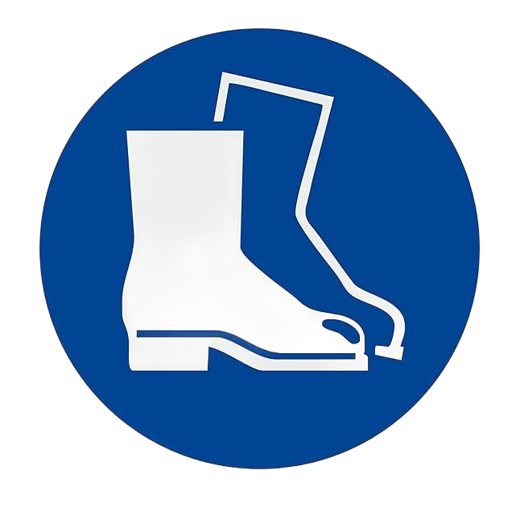
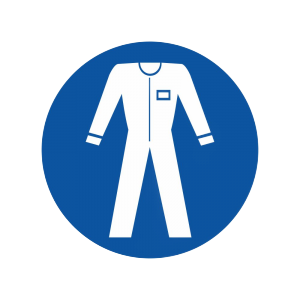

# **Trasporto e Installazione**

:::{important}
Le operazioni di sollevamento e movimentazione devono essere eseguite esclusivamente da personale specializzato ed istruito avente le idoneità a svolgere tali attività.
:::

<p style="font-size: 1.05em; color: #2c3e50; line-height: 1.6; padding: 5px 0;">
  La macchina è stata progettata in modo che nelle fasi di imballo, trasporto e montaggio sia necessario l’uso di un <strong>carrello elevatore di portata adeguata</strong>. Si segnala che la macchina non dispone di attacchi dedicati (ad esempio: golfari) per il sollevamento.
</p>

## Imballo 

La macchina è spedita a cura di ARS s.r.l. dallo stabilimento di produzione a quello del Cliente utilizzatore.

* **Modalità di spedizione standard:**
* **Imballo protettivo normale:** Indicato per corte e medie distanze.
* **Imballo protettivo speciale:** Indicato per lunghe distanze.

:::{note} 
**Nota sul trasporto:** La spedizione deve essere effettuata con mezzi di trasporto coperti o telonati in dipendenza del tipo di carico.
:::

### Ricezione e disimballo della macchina

Alla ricezione della macchina il cliente deve obbligatoriamente verificare che non ci siano danni causati dalle modalità di trasporto o dal personale incaricato. Seguire scrupolosamente le seguenti procedure:

<div style="display: flex; flex-direction: column; gap: 12px; margin: 15px 0;">
  <div style="background-color: #f8f9fa; border-left: 4px solid #34495e; padding: 12px 15px; border-radius: 0 4px 4px 0;">
    <strong> In caso di danni accertati:</strong><br>
    Lasciare l’imballo in questione nello stato in cui è stato trovato e richiedere immediatamente l’accertamento del danno da parte dell’impresa di spedizioni competente. Successivamente, comunicare con un certificato di avaria il danno rilevato all’assicurazione di trasporto competente e al punto vendita.
  </div>
  <div style="background-color: #f8f9fa; border-left: 4px solid #34495e; padding: 12px 15px; border-radius: 0 4px 4px 0;">
    <strong> Procedura di disimballo standard:</strong><br>
    Se la macchina viene consegnata in cassa su bancale o staffe di legno con eventuale protezione in cellophane termoretraibile, provvedere inizialmente alla rimozione della copertura. Per liberare completamente la macchina, rimuovere le viti e la reggettatura metallica. Successivamente sollevare la macchina tramite gru o carrello sollevatore (come descritto nei dati tecnici) e rimuovere il bancale utilizzato per il trasporto.
  </div>
</div>

### Tabella divisione gruppi e pesi - con imballo 

Seguire la seguente tabella per pesi e dimensioni comprensivi di imballo. 

| Specifica | Tramoggia 1,5lt | Tramoggia 3lt | Tramoggia 5lt | Tramoggia 10lt | Tramoggia 20lt | Tramoggia 40lt |
| :--- | :---: | :---: | :---: | :---: | :---: | :---: |
| **Peso lordo** <br>*(con imballo)* | 28 kg | 28 kg | 39 kg | 41 kg | 59 kg | *(Verificare valore)* |
| **Dimensioni cassa di legno** <br>*(L x P x H in mm)* | 700 x 700 x 500 | 700 x 700 x 500 | 700 x 700 x 500 | 700 x 700 x 500 | 1000 x 1000 x 500 | 1000 x 1000 x 500 |

:::{attention}
Nel caso di modelli personalizzati i valori potrebbero differire da quelli indicati. Per modelli di questo genere fare riferimento alla documentazione di progetto.
:::

### Movimentazione con imballo 

```{list-table} MOVIMENTAZIONE DEL CORPO MACCHINA CON IMBALLO
:widths: 30 70
:header-rows: 0

* - **Qualifica operatore**
  - Conduttore di mezzi di sollevamento

* - **DPI necessari**
  -    


* - **Mezzo di sollevamento**
  - Carrello elevatore di portata non inferiore a 50 kg
```

:::{attention}
Utilizzare solo idonei ed omologati mezzi di sollevamento; compatibili per le dimensioni e il peso della macchina. 
:::

:::{attention}
Accertarsi che nessuno sosti sotto e nel raggio d’azione del mezzo di sollevamento.  
:::

Per la movimentazione del corpo macchina con imballo, procedere come descritto:   

<div style="display: flex; flex-direction: column; gap: 12px; margin: 20px 0;">

  <!-- Passo 1 -->
  <div style="display: flex; background-color: #f8f9fa; border-radius: 6px; border: 1px solid #e9ecef; overflow: hidden;">
    <div style="background-color: #34495e; color: #ffffff; display: flex; align-items: center; justify-content: center; width: 45px; font-weight: bold; flex-shrink: 0;">1</div>
    <div style="padding: 12px 15px; color: #2c3e50; font-size: 0.95em;">
      Posizionare le forche del carrello elevatore sotto alla cassa di legno in cui è riposta la macchina.
    </div>
  </div>

  <!-- Passo 2 -->
  <div style="display: flex; background-color: #f8f9fa; border-radius: 6px; border: 1px solid #e9ecef; overflow: hidden;">
    <div style="background-color: #34495e; color: #ffffff; display: flex; align-items: center; justify-content: center; width: 45px; font-weight: bold; flex-shrink: 0;">2</div>
    <div style="padding: 12px 15px; color: #2c3e50; font-size: 0.95em;">
      Assicurarsi che le forche fuoriescano dalla parte anteriore del carico (almeno 5 cm), per una lunghezza sufficiente ad eliminare eventuali rischi di ribaltamento della parte trasportata.
    </div>
  </div>

  <!-- Passo 3 -->
  <div style="display: flex; background-color: #f8f9fa; border-radius: 6px; border: 1px solid #e9ecef; overflow: hidden;">
    <div style="background-color: #34495e; color: #ffffff; display: flex; align-items: center; justify-content: center; width: 45px; font-weight: bold; flex-shrink: 0;">3</div>
    <div style="padding: 12px 15px; color: #2c3e50; font-size: 0.95em;">
      Sollevare le forche fino al contatto col carico.<br><strong>Nota:</strong> se necessario fissare il carico alle forche con morsetti o dispositivi similari.
    </div>
  </div>

  <!-- Passo 4 -->
  <div style="display: flex; background-color: #f8f9fa; border-radius: 6px; border: 1px solid #e9ecef; overflow: hidden;">
    <div style="background-color: #34495e; color: #ffffff; display: flex; align-items: center; justify-content: center; width: 45px; font-weight: bold; flex-shrink: 0;">4</div>
    <div style="padding: 12px 15px; color: #2c3e50; font-size: 0.95em;">
      Sollevare lentamente il carico di qualche decina di centimetri e verificarne la stabilità facendo attenzione che il baricentro del carico sia posizionato al centro delle forche di sollevamento.
    </div>
  </div>

  <!-- Passo 5 -->
  <div style="display: flex; background-color: #f8f9fa; border-radius: 6px; border: 1px solid #e9ecef; overflow: hidden;">
    <div style="background-color: #34495e; color: #ffffff; display: flex; align-items: center; justify-content: center; width: 45px; font-weight: bold; flex-shrink: 0;">5</div>
    <div style="padding: 12px 15px; color: #2c3e50; font-size: 0.95em;">
      Inclinare il montante all’indietro (verso il posto guida) per avvantaggiare il momento ribaltante e garantire una maggiore stabilità del carico durante il trasporto.
    </div>
  </div>

  <!-- Passo 6 -->
  <div style="display: flex; background-color: #f8f9fa; border-radius: 6px; border: 1px solid #e9ecef; overflow: hidden;">
    <div style="background-color: #34495e; color: #ffffff; display: flex; align-items: center; justify-content: center; width: 45px; font-weight: bold; flex-shrink: 0;">6</div>
    <div style="padding: 12px 15px; color: #2c3e50; font-size: 0.95em;">
      Adeguare la velocità di trasporto in base alla pavimentazione ed al tipo di carico, evitando manovre brusche.
    </div>
  </div>

</div>

:::{image} ../../../../../_shared/media/images/muletto.png
:width: 350px
:align: center
:::

:::{attention}
Posizionare le forche del carrello elevatore come indicato in figura.
:::

### Rimozione imballo   

Per la rimozione dell’imballo, procedere come descritto:   

<div style="display: flex; flex-direction: column; gap: 12px; margin: 20px 0;">

  <div style="display: flex; background-color: #f8f9fa; border-radius: 6px; border: 1px solid #e9ecef; overflow: hidden;">
    <div style="background-color: #7f8c8d; color: #ffffff; display: flex; align-items: center; justify-content: center; width: 45px; font-weight: bold; flex-shrink: 0;">1</div>
    <div style="padding: 12px 15px; color: #2c3e50; font-size: 0.95em;">
      Posizionare la macchina nel luogo ad essa destinato.
    </div>
  </div>

  <div style="display: flex; background-color: #f8f9fa; border-radius: 6px; border: 1px solid #e9ecef; overflow: hidden;">
    <div style="background-color: #7f8c8d; color: #ffffff; display: flex; align-items: center; justify-content: center; width: 45px; font-weight: bold; flex-shrink: 0;">2</div>
    <div style="padding: 12px 15px; color: #2c3e50; font-size: 0.95em;">
      Rimuovere la reggettatura dalla base della cassa in legno usata per la spedizione.
    </div>
  </div>

  <div style="display: flex; background-color: #f8f9fa; border-radius: 6px; border: 1px solid #e9ecef; overflow: hidden;">
    <div style="background-color: #7f8c8d; color: #ffffff; display: flex; align-items: center; justify-content: center; width: 45px; font-weight: bold; flex-shrink: 0;">3</div>
    <div style="padding: 12px 15px; color: #2c3e50; font-size: 0.95em;">
      Afferrare la tramoggia dalla sua base, <strong>non dalla vasca</strong>, per sollevarla e rimuoverla dalla cassa.
    </div>
  </div>

</div>

:::{attention}
Per l’operazione di sollevamento manuale dalla cassa di legno della tramoggia è necessaria la presenza di n°2 operatori.
:::  

Per la movimentazione della macchina e/o delle sue parti, fare riferimento al paragrafo “Trasporto e movimentazione”.  

### Smaltimento imballo 

L’imballaggio è parte integrante della fornitura e non viene ritirato, per cui lo smaltimento del suddetto è a carico dell’acquirente.
L’eventuale smaltimento o distruzione deve avvenire nel rispetto delle normative vigenti nel paese dell’utilizzatore, tenendo conto della natura dei materiali:  

* **Legname:** per le casse;  
* **Film in materia plastica:** per la protezione della macchina e nastri adesivi per il fissaggio;  
* **Sacchetti di sostanza assorbente:** per la protezione dall'umidità;  
* **Altri elementi residui** (es. reggette, chiodi, ecc.).  

## Trasporto e Movimentazione 

ARS s.r.l. in funzione delle modalità di trasporto utilizza imballi e fissaggi adeguati a garantire l’integrità e la conservazione durante il trasporto.

Al ricevimento della macchina, verificare che nessuna parte abbia subito danni durante il trasporto e/o la movimentazione. **Nel caso si riscontrassero anomalie o danni, è obbligatorio segnalarli immediatamente al Costruttore.**

:::{note} 
**Nota sulle qualifiche:** Le attività di movimentazione descritte in questo paragrafo devono essere effettuate esclusivamente da personale qualificato per tali operazioni: personale appositamente addestrato per eseguire in tutta sicurezza le operazioni di carico, scarico e movimentazione mediante mezzi di sollevamento, e che sia a conoscenza delle regole di prevenzione degli infortuni.
:::

:::{attention}
Non sollevare mai l’unità tramite la vasca o la parte mobile in quanto oltre a stararsi potrebbe anche subire deformazioni o rotture.
:::

:::{attention}
ARS S.r.l. non risponde dei danni, a cose o a persone, causati da incidenti provocati dal mancato rispetto delle istruzioni riportate nel presente manuale.
:::

## Assemblaggio 

Dopo il disimballo, la tramoggia si presenta già assemblata.
Procedere con il fissaggio sulla seguente staffa con viti M8:

:::{image} ../../../../../_shared/media/images/asseblaggio_tramoggia.jpg
:width: 400px
:align: center
:::

:::{attention}
Nel caso di modelli personalizzati i gruppi potrebbero differire, parzialmente o totalmente, da quelli base. Per modelli di questo genere fare riferimento al disegno costruttivo di progetto.
:::

## Installazione 

### Predisposizioni a carico del cliente 

Fatti salvi eventuali accordi contrattuali diversi è normalmente a carico del Cliente la predisposizione di:

<div class="isw-warranty-grid">
  
  <div class="isw-meta-card">
    <div class="isw-meta-title"><i class="ph ph-blueprint"></i> Locali e opere murarie</div>
    <div class="isw-meta-content">Predisposizione degli spazi inclusi eventuali basamenti, fondazioni, canalizzazioni richieste e sistemi di illuminazione.</div>
  </div>

  <div class="isw-meta-card">
    <div class="isw-meta-title"><i class="ph ph-lightning"></i> Impianti elettrici di alimentazione</div>
    <div class="isw-meta-content">Predisposizione delle linee fino ai punti di allacciamento della macchina, in totale conformità alle norme vigenti nel paese di installazione.</div>
  </div>

  <div class="isw-meta-card">
    <div class="isw-meta-title"><i class="ph ph-globe"></i> Messa a terra</div>
    <div class="isw-meta-content">Conduttore di protezione di messa a terra, secondo le caratteristiche e tolleranze specificate nel presente manuale.</div>
  </div>

  <div class="isw-meta-card">
    <div class="isw-meta-title"><i class="ph ph-wrench"></i> Servizi e consumabili</div>
    <div class="isw-meta-content">Servizi ausiliari adeguati, utensili e materiali di consumo occorrenti per il montaggio, l'installazione e lubrificanti per la prima messa in moto.</div>
  </div>

  <div class="isw-meta-card">
    <div class="isw-meta-title"><i class="ph ph-wind"></i> Alimentazione pneumatica</div>
    <div class="isw-meta-content">Linea di aria compressa adeguata come da specifica presente al paragrafo “Dati tecnici”.</div>
  </div>

  <div class="isw-meta-card">
    <div class="isw-meta-title"><i class="ph ph-forklift"></i> Logistica</div>
    <div class="isw-meta-content">Mezzi di sollevamento e movimentazione idonei per lo scarico e il posizionamento.</div>
  </div>

</div>

:::{note}
**Nota di responsabilità:** Tutte le specifiche tecniche richieste sono contenute nel contratto di vendita. Il Costruttore declina ogni responsabilità se il cliente non garantisce le caratteristiche tecniche dell’impianto elettrico concordate.
:::

### Condizioni ambientali ammesse 

L’ambiente in cui la macchina viene installata e utilizzata deve essere **interno e al riparo da agenti atmosferici** (pioggia, grandine, neve, nebbia), polveri in sospensione o combustibili, vapori corrosivi o sorgenti di calore eccessivo. La zona **non deve essere classificata ATEX**.

In particolare, l’ambiente di installazione e utilizzo non deve presentare:  
* Esposizione a fumi corrosivi o vapori oleosi;  
* Esposizione ad umidità eccessiva (superiore all’85 %) e rapidi cambiamenti di umidità relativa (superiori a 0,005 p.u./h);   
* Esposizione a polvere eccessiva o abrasiva;  
* Esposizione a miscele esplosive di polveri o di gas oppure ad aria salmastra;  
* Esposizione a vibrazioni, urti o scosse anomali;  
* Esposizione a variazioni termiche elevate o rapide (superiori a 5K/h) o radiazioni nucleari.  

**Limiti operativi ambientali:**

| Condizioni ambientali ammesse | Valori di esercizio |
| :--- | :--- |
| **Temperatura ambiente** | 5 ÷ 40 °C |
| **Range di umidità** | 5 - 90 % (senza condensa) |
| **Illuminazione ambiente** | Luce a neon |

:::{attention}
Condizioni ambientali diverse da quelle specificate possono causare gravi danni alla macchina. Il posizionamento della macchina in ambienti non corrispondenti a quanto indicato fa decadere la garanzia per gli organi da sostituire.
:::

:::{important}
La superficie di lavoro deve essere sufficientemente illuminata. Nel caso in cui sul posto di lavoro si riscontrino zone d’ombra o dislivelli, sarà cura dell’utente predisporre dispositivi di illuminazione adeguati. Se non vengono rispettate queste prescrizioni il Costruttore declina ogni responsabilità.
:::

### Area di Installazione 

:::{attention}
Non sollevare mai l’unità tramite l’equipaggio mobile, in quanto il vibratore è stato tarato dalla fabbrica in base alle vostre specifiche esigenze e potrebbe subire starature.
:::

L’unità non deve essere installata laddove il canale possa venire in contatto con oggetti rigidi o superfici adiacenti; mantenere un **gioco di circa 3-5 cm** tra la parte vibrante e le parti statiche circostanti.

Le tramogge possono sopportare un carico massimo specifico. È fondamentale dimensionare il supporto strutturale affinché sostenga in sicurezza il peso complessivo del sistema sotto carico vibrante:

| Modello | Carico massimo ammissibile | Produzione (T/h) |
| :---: | :---: | :---: |
| **1,5lt** | 1 kg | 0,6 |
| **3lt**   | 1,5 kg | 0,6 |
| **5lt**   | 3 kg | 2 |
| **10lt**  | 3 kg | 2 |
| **20lt**  | 3 kg | 2 |
| **40lt**  | 7,5 kg | 5 |

Il gruppo di controllo dovrà essere installato il più vicino possibile alla tramoggia, in un luogo asciutto, pulito e privo di vibrazioni.

### Posizionamento tramoggia

Per il corretto posizionamento, seguire la seguente sequenza operativa:

<div style="display: flex; flex-direction: column; gap: 12px; margin: 20px 0;">
  <div style="display: flex; background-color: #f8f9fa; border-radius: 6px; border: 1px solid #e9ecef; overflow: hidden;">
    <div style="background-color: #34495e; color: #ffffff; display: flex; align-items: center; justify-content: center; width: 45px; font-weight: bold; flex-shrink: 0;">1</div>
    <div style="padding: 12px 15px; color: #2c3e50; font-size: 0.95em;">
      Posizionare la tramoggia su un piano stabile.<br><strong>Nota:</strong> se installata sulla piattaforma di una macchina sensibile alle vibrazioni, interporre del materiale isolante e antivibrante tra le superfici.
    </div>
  </div>
  <div style="display: flex; background-color: #f8f9fa; border-radius: 6px; border: 1px solid #e9ecef; overflow: hidden;">
    <div style="background-color: #34495e; color: #ffffff; display: flex; align-items: center; justify-content: center; width: 45px; font-weight: bold; flex-shrink: 0;">2</div>
    <div style="padding: 12px 15px; color: #2c3e50; font-size: 0.95em;">
      Fissare la tramoggia attraverso gli appositi fori.<br><strong>Nota:</strong> la tramoggia standard presenta 4 fori alla base per viti M8 per il serraggio alla superficie di appoggio.
    </div>
  </div>
  <div style="display: flex; background-color: #f8f9fa; border-radius: 6px; border: 1px solid #e9ecef; overflow: hidden;">
    <div style="background-color: #34495e; color: #ffffff; display: flex; align-items: center; justify-content: center; width: 45px; font-weight: bold; flex-shrink: 0;">3</div>
    <div style="padding: 12px 15px; color: #2c3e50; font-size: 0.95em;">
      Procedere con gli allacciamenti necessari facendo riferimento al paragrafo dedicato.
    </div>
  </div>
</div>

:::{attention}
Nel caso di modelli personalizzati il carico massimo ammissibile e la produzione potrebbero differire dai valori indicati. Per modelli di questo genere il Costruttore mette a disposizione i dati in esame.
:::

:::{attention}
Assicurarsi che la superficie di appoggio della macchina sia piana ed orizzontale e sia idonea a sostenerne il peso.
:::

## Allacciamenti 

Per la messa in funzione della macchina devono essere assicurati i necessari allacciamenti e collegamenti alle reti locali:  
* Allacciamento elettrico (comprensivo della connessione della messa a terra).

È responsabilità esclusiva dell’utilizzatore garantire le caratteristiche di allacciamento richieste.  

:::{attention}
Gli allacciamenti richiesti devono essere effettuati da personale qualificato ed autorizzato. 
:::

### Allacciamento Elettrico 

:::{attention}
Prima di eseguire qualsiasi operazione di allacciamento elettrico, è importante controllare che la macchina sia spenta. 
:::

:::{attention}
Assicurarsi che la linea di alimentazione elettrica cliente sia stata preventivamente sezionata.
:::

La conformità del collegamento tra macchina ed impianto di messa a terra è a totale cura e carico dell’acquirente.  

:::{attention}
L’operazione deve essere eseguita esclusivamente da personale specializzato ed autorizzato (manutentore elettrico).
:::

Prima di procedere con l’allacciamento elettrico verificare che:  
* Il manutentore sia a conoscenza delle normative vigenti nel paese d’installazione;  
* I valori della frequenza e della tensione di alimentazione corrispondano a quelli della rete locale;  
* La sezione dei cavi elettrici utilizzati sia adeguata all’assorbimento e ai massimi carichi della macchina;  
* La messa a terra del circuito sia perfettamente conforme alle norme **EN 60204-1**;  
* I materiali impiegati nell’impianto di messa a terra abbiano un'adeguata solidità o protezione meccanica.  

:::{attention}
Non operare con mani ed oggetti umidi. In caso di incendio non utilizzare acqua sui componenti elettrici.
:::

```{list-table} **ALLACCIAMENTO ELETTRICO - AC**
:widths: 30 70

* - **Qualifica operatore**
  - Manutentore elettrico 

* - **DPI necessari**
  -   

```


Per l’allacciamento alla rete elettrica - AC, procedere come descritto di seguito:  

<div style="display: flex; flex-direction: column; gap: 12px; margin: 20px 0;">
  <div style="display: flex; background-color: #f8f9fa; border-radius: 6px; border: 1px solid #e9ecef; overflow: hidden;">
    <div style="background-color: #27ae60; color: #ffffff; display: flex; align-items: center; justify-content: center; width: 45px; font-weight: bold; flex-shrink: 0;">1</div>
    <div style="padding: 12px 15px; color: #2c3e50; font-size: 0.95em;">
      Connettere il sistema all’alimentazione di rete.
    </div>
  </div>
  <div style="display: flex; background-color: #f8f9fa; border-radius: 6px; border: 1px solid #e9ecef; overflow: hidden;">
    <div style="background-color: #27ae60; color: #ffffff; display: flex; align-items: center; justify-content: center; width: 45px; font-weight: bold; flex-shrink: 0;">2</div>
    <div style="padding: 12px 15px; color: #2c3e50; font-size: 0.95em;">
      Controllare accuratamente che il conduttore di messa a terra sia correttamente installato e integro.
    </div>
  </div>
</div>

:::{important}
L’alimentazione standard è di 115 VAC o 230 VAC +/-5% (la variante 115 VAC viene fornita solo su esplicita richiesta).
:::

:::{attention}
Un'alimentazione errata può causare gravi anomalie elettroniche al sistema ed impedire il corretto funzionamento dello stesso.
:::


<br>

<!-- Versions and languages set-up -->
<style>
  .fixed-bar {
    position: fixed;
    bottom: 10px;
    right: 10px;
    background: rgba(240, 240, 240, 0.85);
    border: 1px solid rgba(100, 100, 100, 0.3);
    border-radius: 6px;
    box-shadow: 0 1px 6px rgba(0, 0, 0, 0.1);
    font-family: 'Segoe UI', Tahoma, Geneva, Verdana, sans-serif;
    font-size: 0.9rem;
    color: #222;
    display: flex;
    gap: 12px;
    padding: 6px 12px;
    align-items: center;
    z-index: 9999;
    backdrop-filter: saturate(180%) blur(10px);
  }

  @media print {
    .fixed-bar {
      display: none !important;
    }
  }

  .fixed-bar .dropdown {
    position: relative;
    user-select: none;
  }

  .fixed-bar .dropdown-toggle {
    background-color: rgba(200, 200, 200, 0.4);
    color: #222;
    padding: 6px 10px;
    border: 1px solid rgba(100, 100, 100, 0.3);
    border-radius: 4px;
    cursor: pointer;
    display: flex;
    align-items: center;
    gap: 6px;
    box-shadow: 0 1px 2px rgba(0, 0, 0, 0.05);
    white-space: nowrap;
    transition: background-color 0.3s ease;
  }

  .fixed-bar .dropdown-toggle::after {
    content: none !important;
    display: none !important;
  }

  .fixed-bar .dropdown-toggle:hover {
    background-color: rgba(100, 150, 220, 0.2);
    color: #1a3e72;
    border-color: rgba(26, 62, 114, 0.6);
  }

  .fixed-bar .dropdown-toggle .fa {
    font-size: 0.9rem;
  }

  .fixed-bar .dropdown-menu {
    position: absolute;
    bottom: 100%;
    left: 0;
    background-color: rgba(250, 250, 250, 0.95);
    border: 1px solid rgba(150, 150, 150, 0.3);
    border-radius: 4px;
    box-shadow: 0 3px 8px rgba(0, 0, 0, 0.1);
    min-width: 140px;
    max-height: 200px;
    overflow-y: auto;
    display: none;
    flex-direction: column;
    z-index: 10000;
    backdrop-filter: saturate(180%) blur(8px);
  }

  .fixed-bar .dropdown-menu.show {
    display: flex;
  }

  .fixed-bar .dropdown-menu a {
    padding: 8px 12px;
    color: #1a3e72;
    text-decoration: none;
    border-bottom: 1px solid rgba(200, 200, 200, 0.5);
    white-space: nowrap;
    transition: background-color 0.25s ease;
  }

  .fixed-bar .dropdown-menu a:last-child {
    border-bottom: none;
  }

  .fixed-bar .dropdown-menu a:hover {
    background-color: rgba(100, 150, 220, 0.15);
  }

  .dropdown-download-buttons .btn__icon-container svg {
    width: 1em;
    height: 1em;
    stroke: currentColor;
    fill: none;
    stroke-width: 1.6;
    stroke-linecap: round;
    stroke-linejoin: round;
    vertical-align: middle;
  }

  a.headerlink.manual-heading-action {
    display: inline-flex;
    align-items: center;
    justify-content: center;
    margin-left: 0.2em;
    text-decoration: none;
    color: #7b8493;
    transition: color 0.2s ease, opacity 0.2s ease;
  }

  a.headerlink.manual-heading-action svg {
    width: 0.8em;
    height: 0.8em;
    stroke: currentColor;
    fill: none;
    stroke-width: 1.6;
    stroke-linecap: round;
    stroke-linejoin: round;
    vertical-align: middle;
  }

  a.headerlink.manual-feedback-link:hover,
  a.headerlink.manual-feedback-link:focus-visible {
    color: #2563eb;
  }

  a.headerlink.manual-service-link:hover,
  a.headerlink.manual-service-link:focus-visible {
    color: #d97706;
  }
</style>

<div class="fixed-bar" role="region" aria-label="Version and language selector">
  <div class="dropdown" data-selector="version">
    <div class="dropdown-toggle" tabindex="0" aria-haspopup="listbox" aria-expanded="false">
      Version: <span class="current-value">V. 1.0</span>
      <span class="caret-icon" aria-hidden="true">&#9662;</span>
    </div>
    <div class="dropdown-menu" role="listbox">
      	<a href="#" role="option">V. 1.0</a>
    </div>
  </div>

  <div class="dropdown" data-selector="language">
    <div class="dropdown-toggle" tabindex="0" aria-haspopup="listbox" aria-expanded="false">
      Language: <span class="current-value">IT</span>
      <span class="caret-icon" aria-hidden="true">&#9662;</span>
    </div>
    <div class="dropdown-menu" role="listbox">
      	<a href="#" role="option">DE</a>
				<a href="#" role="option">EN</a>
				<a href="#" role="option">ES</a>
				<a href="#" role="option">FR</a>
				<a href="#" role="option">IT</a>
    </div>
  </div>
</div>

<script>
  (function () {
    const bar = document.querySelector('.fixed-bar');
    if (!bar) {
      return;
    }

    const inlineVersions = ["V. 1.0"];
    const inlineLanguages = ["DE", "EN", "ES", "FR", "IT"];
    const manifest = window.FV_VERSIONING || null;
    const versions = Array.isArray(manifest && manifest.versions) && manifest.versions.length
      ? manifest.versions
      : inlineVersions;
    const offlineZipEnabled = false;
    const offlineZipFileName = 'Offline manual.zip';
    const americanRegions = new Set([
      'AG', 'AR', 'AW', 'BB', 'BL', 'BM', 'BO', 'BQ', 'BR', 'BS', 'BZ', 'CA', 'CL', 'CO', 'CR',
      'CU', 'CW', 'DM', 'DO', 'EC', 'FK', 'GD', 'GF', 'GL', 'GP', 'GT', 'GY', 'HN', 'HT', 'JM',
      'KN', 'KY', 'LC', 'MF', 'MQ', 'MS', 'MX', 'NI', 'PA', 'PE', 'PM', 'PR', 'PY', 'SR', 'SV',
      'SX', 'TC', 'TT', 'US', 'UY', 'VC', 'VE', 'VG', 'VI', '419'
    ]);
    const additionalAmericanTimeZones = new Set([
      'Atlantic/Bermuda',
      'Pacific/Easter',
      'Pacific/Galapagos',
      'Pacific/Honolulu',
      'Pacific/Pitcairn'
    ]);

    function setCaret(toggle, isOpen) {
      const caret = toggle.querySelector('.caret-icon');
      if (caret) {
        caret.innerHTML = isOpen ? '&#9652;' : '&#9662;';
      }
    }

    function closeAllMenus() {
      bar.querySelectorAll('.dropdown').forEach(dropdown => {
        const menu = dropdown.querySelector('.dropdown-menu');
        const toggle = dropdown.querySelector('.dropdown-toggle');
        menu.classList.remove('show');
        toggle.setAttribute('aria-expanded', 'false');
        setCaret(toggle, false);
      });
    }

    function getLanguagesForVersion(version) {
      const manifestLanguages = manifest &&
        manifest.languagesByVersion &&
        Array.isArray(manifest.languagesByVersion[version]) &&
        manifest.languagesByVersion[version].length
          ? manifest.languagesByVersion[version]
          : null;

      if (manifestLanguages) {
        return manifestLanguages;
      }

      return inlineLanguages;
    }

    function getDefaultLanguageForVersion(version) {
      const manifestDefault = manifest &&
        manifest.defaultLanguageByVersion &&
        typeof manifest.defaultLanguageByVersion[version] === 'string'
          ? manifest.defaultLanguageByVersion[version]
          : '';

      if (manifestDefault) {
        return manifestDefault;
      }

      const availableLanguages = getLanguagesForVersion(version);
      return availableLanguages.length ? availableLanguages[0] : (inlineLanguages[0] || '');
    }

    function populateSelectorMenu(selector, values) {
      const menu = bar.querySelector(`[data-selector="${selector}"] .dropdown-menu`);
      if (!menu) {
        return;
      }

      menu.innerHTML = '';
      values.forEach(value => {
        const link = document.createElement('a');
        link.href = '#';
        link.setAttribute('role', 'option');
        link.textContent = value;
        menu.appendChild(link);
      });
    }

    function getNavigationContext() {
      const currentUrl = new URL(window.location.href);
      const rawSegments = currentUrl.pathname.split('/').filter(Boolean);
      const decodedSegments = rawSegments.map(segment => decodeURIComponent(segment));
      const currentVersionLabel = bar.querySelector('[data-selector="version"] .current-value');
      const currentLanguageLabel = bar.querySelector('[data-selector="language"] .current-value');
      const fallbackVersion = currentVersionLabel ? currentVersionLabel.textContent.trim() : '';
      const versionIndex = decodedSegments.findIndex(segment => versions.includes(segment));
      const currentVersion = versionIndex !== -1 ? decodedSegments[versionIndex] : fallbackVersion;
      const availableLanguages = getLanguagesForVersion(currentVersion);
      const fallbackLanguage = currentLanguageLabel ? currentLanguageLabel.textContent.trim() : '';
      const languageIndex = decodedSegments.findIndex(
        (segment, index) => index > versionIndex && availableLanguages.includes(segment)
      );

      return {
        currentUrl: currentUrl,
        rawSegments: rawSegments,
        versionIndex: versionIndex,
        currentVersion: currentVersion,
        currentLanguage: languageIndex !== -1 ? decodedSegments[languageIndex] : fallbackLanguage
      };
    }

    function refreshNavigationMenus() {
      const context = getNavigationContext();
      const resolvedVersion = versions.includes(context.currentVersion) ? context.currentVersion : (versions[0] || context.currentVersion);
      const availableLanguages = getLanguagesForVersion(resolvedVersion);
      const resolvedLanguage = availableLanguages.includes(context.currentLanguage)
        ? context.currentLanguage
        : (getDefaultLanguageForVersion(resolvedVersion) || context.currentLanguage);

      populateSelectorMenu('version', versions);
      populateSelectorMenu('language', availableLanguages);

      const versionLabel = bar.querySelector('[data-selector="version"] .current-value');
      const languageLabel = bar.querySelector('[data-selector="language"] .current-value');
      if (versionLabel) {
        versionLabel.textContent = resolvedVersion;
      }
      if (languageLabel) {
        languageLabel.textContent = resolvedLanguage;
      }
    }

    function buildScopedUrl(targetVersion, targetLanguage, pageName) {
      const context = getNavigationContext();
      const rootSegments = context.versionIndex !== -1 ? context.rawSegments.slice(0, context.versionIndex) : [];
      const targetPath = '/' + rootSegments.concat([
        encodeURIComponent(targetVersion),
        encodeURIComponent(targetLanguage),
        encodeURIComponent(pageName)
      ]).join('/');

      if (context.currentUrl.protocol === 'file:') {
        return 'file://' + targetPath;
      }

      return context.currentUrl.origin + targetPath;
    }

    function buildTargetUrl(targetVersion, targetLanguage) {
      return buildScopedUrl(targetVersion, targetLanguage, 'index.html');
    }

    function buildSiteRootAssetUrl(fileName) {
      const context = getNavigationContext();
      const rootSegments = context.versionIndex !== -1 ? context.rawSegments.slice(0, context.versionIndex) : [];
      const targetPath = '/' + rootSegments.concat([encodeURIComponent(fileName)]).join('/');

      if (context.currentUrl.protocol === 'file:') {
        return 'file://' + targetPath;
      }

      return context.currentUrl.origin + targetPath;
    }

    function buildClientSiteZipUrl() {
      return buildSiteRootAssetUrl(offlineZipFileName);
    }

    function getHeadingText(heading) {
      const clone = heading.cloneNode(true);
      clone.querySelectorAll('a.headerlink').forEach(link => link.remove());
      return clone.textContent.replace(/\s+/g, ' ').trim();
    }

    function normalizeMailText(text) {
      return String(text || '').replace(/\u00AE/g, '');
    }

    function getTimeZoneAmericaDecision() {
      try {
        const timeZone = String(Intl.DateTimeFormat().resolvedOptions().timeZone || '').trim();
        if (!timeZone) {
          return null;
        }
        return timeZone.startsWith('America/') || additionalAmericanTimeZones.has(timeZone);
      } catch (error) {
        return null;
      }
    }

    function isCoordinateInAmericas(latitude, longitude) {
      if (!Number.isFinite(latitude) || !Number.isFinite(longitude)) {
        return null;
      }

      return latitude >= -60 && latitude <= 85 && longitude >= -170 && longitude <= -25;
    }

    function getCurrentPosition(options) {
      return new Promise((resolve, reject) => {
        if (!navigator.geolocation || typeof navigator.geolocation.getCurrentPosition !== 'function') {
          reject(new Error('Geolocation unavailable'));
          return;
        }

        navigator.geolocation.getCurrentPosition(resolve, reject, options);
      });
    }

    async function resolveServiceAddress() {
      const timeZoneDecision = getTimeZoneAmericaDecision();
      if (timeZoneDecision === false) {
        return 'service@arsautomation.com';
      }

      const canTryGeolocation = Boolean(
        navigator.onLine &&
        window.isSecureContext &&
        navigator.geolocation &&
        typeof navigator.geolocation.getCurrentPosition === 'function'
      );

      if (canTryGeolocation) {
        try {
          const position = await getCurrentPosition({
            enableHighAccuracy: false,
            timeout: 4000,
            maximumAge: 300000
          });
          const inAmericas = isCoordinateInAmericas(position.coords.latitude, position.coords.longitude);
          if (inAmericas !== null) {
            return inAmericas ? 'us.service@arsautomation.com' : 'service@arsautomation.com';
          }
        } catch (error) {
        }
      }

      if (timeZoneDecision === true) {
        return 'us.service@arsautomation.com';
      }

      return 'service@arsautomation.com';
    }

    function buildMailtoUrl(address, subject, body) {
      return 'mailto:' + address +
        '?subject=' + encodeURIComponent(normalizeMailText(subject)) +
        '&body=' + encodeURIComponent(normalizeMailText(body));
    }

    function createHeadingActionLink(className, title, mailtoUrl, svgMarkup) {
      const link = document.createElement('a');
      link.className = 'headerlink manual-heading-action ' + className;
      link.href = mailtoUrl;
      link.title = title;
      link.setAttribute('aria-label', title);
      link.innerHTML = svgMarkup;
      return link;
    }

    function addHeadingActions() {
      const feedbackIcon = [
        '<svg viewBox="0 0 16 16" aria-hidden="true">',
        '<path d="M3 3.5h10v6.5H7.5L4.5 13v-3H3z"></path>',
        '<path d="M6 6.2h4"></path>',
        '<path d="M6 8.2h3"></path>',
        '</svg>'
      ].join('');

        const serviceIcon = [
          '<svg viewBox="0 0 16 16" aria-hidden="true">',
          '<circle cx="8" cy="8" r="5.2"></circle>',
          '<path d="M6.4 6.1A1.9 1.9 0 0 1 8 5.2c1.1 0 1.9.7 1.9 1.7 0 .8-.4 1.3-1.2 1.8-.6.4-.9.8-.9 1.5"></path>',
          '<circle cx="8" cy="11.7" r="0.45" style="fill:currentColor;stroke:none"></circle>',
          '</svg>'
        ].join('');

      document.querySelectorAll('h1 > a.headerlink, h2 > a.headerlink, h3 > a.headerlink, h4 > a.headerlink, h5 > a.headerlink, h6 > a.headerlink').forEach(link => {
        const heading = link.parentElement;
        if (!heading || heading.querySelector('.manual-feedback-link') || heading.querySelector('.manual-service-link')) {
          return;
        }

        const sectionTitle = getHeadingText(heading);
        const sectionUrl = new URL(link.getAttribute('href'), window.location.href).href;
        const pageUrl = window.location.href.split('#')[0];
        const feedbackBody = [
          'Hello Documentation Team,',
          '',
          'I would like to suggest an improvement for this section of the manual.',
          '',
          'Section: ' + sectionTitle,
          'Page: ' + pageUrl,
          'Section link: ' + sectionUrl,
          '',
          'Suggestion:',
          ''
        ].join('\n');
          const serviceBody = [
            'Hello Service Team,',
            '',
            'I need support related to this section of the manual.',
            '',
            'Section: ' + sectionTitle,
            'Page: ' + pageUrl,
            'Section link: ' + sectionUrl,
            '',
            'FlexiBowl serial number:',
            '',
            'Photos or videos of the issue attached:',
            '',
            'Issue description:',
            ''
          ].join('\n');

        const feedbackLink = createHeadingActionLink(
          'manual-feedback-link',
          'Suggest an improvement for this section',
          buildMailtoUrl('documentation@arsautomation.com', 'Documentation suggestion: ' + sectionTitle, feedbackBody),
          feedbackIcon
        );
          const serviceLink = createHeadingActionLink(
            'manual-service-link',
            'Contact service about this section',
            '#',
            serviceIcon
          );
          serviceLink.addEventListener('click', async event => {
            event.preventDefault();
            const serviceAddress = await resolveServiceAddress();
            window.location.href = buildMailtoUrl(serviceAddress, 'Service request: ' + sectionTitle, serviceBody);
          });

          heading.appendChild(feedbackLink);
          heading.appendChild(serviceLink);
        });
    }

    function enhancePrintMenu() {
      const dropdown = document.querySelector('.dropdown-download-buttons');
      if (!dropdown || dropdown.dataset.printMenuEnhanced === 'true') {
        return;
      }

      dropdown.dataset.printMenuEnhanced = 'true';

      const toggleButton = dropdown.querySelector('.dropdown-toggle');
      const hasReleaseDownloads = offlineZipEnabled;

      if (toggleButton) {
        const toggleLabel = hasReleaseDownloads ? 'Export options' : 'Print options';
        toggleButton.setAttribute('aria-label', toggleLabel);
        toggleButton.setAttribute('title', toggleLabel);
        toggleButton.setAttribute('data-bs-original-title', toggleLabel);
        const toggleIcon = toggleButton.querySelector('i');
        if (toggleIcon) {
          toggleIcon.className = hasReleaseDownloads ? 'fas fa-download' : 'fas fa-print';
        }
      }

      dropdown.querySelectorAll('.btn-download-source-button').forEach(sourceButton => {
        const sourceItem = sourceButton.closest('li');
        if (sourceItem) {
          sourceItem.remove();
        }
      });

      const pagePrintButton = dropdown.querySelector('.btn-download-pdf-button');
      if (pagePrintButton) {
        pagePrintButton.setAttribute('title', 'Print this page');
        pagePrintButton.setAttribute('aria-label', 'Print this page');
        pagePrintButton.setAttribute('data-bs-original-title', 'Print this page');
        const textContainer = pagePrintButton.querySelector('.btn__text-container');
        if (textContainer) {
          textContainer.textContent = 'Print this page';
        }
      }

      const menu = dropdown.querySelector('.dropdown-menu');
      if (!menu) {
        return;
      }

      menu.querySelectorAll('.btn-download-client-site-zip-button').forEach(button => {
        const item = button.closest('li');
        if (item) {
          item.remove();
        }
      });

      if (offlineZipEnabled) {
        const siteZipItem = document.createElement('li');
        const siteZipLink = document.createElement('a');
        siteZipLink.className = 'btn btn-sm dropdown-item btn-download-client-site-zip-button';
        siteZipLink.title = 'Download offline manual';
        siteZipLink.setAttribute('aria-label', 'Download offline manual');
        siteZipLink.setAttribute('download', offlineZipFileName);
        siteZipLink.href = buildClientSiteZipUrl();
        siteZipLink.innerHTML = [
          '<span class="btn__icon-container">',
          '<svg viewBox="0 0 16 16" aria-hidden="true">',
          '<path d="M4 3.5h8v2.5H4z"></path>',
          '<path d="M4 6h8v6.5H4z"></path>',
          '<path d="M8 3.5v9"></path>',
          '<path d="M6.3 9.2L8 10.9l1.7-1.7"></path>',
          '</svg>',
          '</span>',
          '<span class="btn__text-container">Download offline manual</span>'
        ].join('');
        siteZipItem.appendChild(siteZipLink);
        menu.appendChild(siteZipItem);
      }
    }

    refreshNavigationMenus();

    bar.querySelectorAll('.dropdown').forEach(dropdown => {
      const toggle = dropdown.querySelector('.dropdown-toggle');
      const menu = dropdown.querySelector('.dropdown-menu');
      const selector = dropdown.getAttribute('data-selector');

      toggle.addEventListener('click', event => {
        event.stopPropagation();
        const willOpen = toggle.getAttribute('aria-expanded') !== 'true';
        closeAllMenus();

        if (willOpen) {
          menu.classList.add('show');
          toggle.setAttribute('aria-expanded', 'true');
          setCaret(toggle, true);
        }
      });

      menu.addEventListener('click', event => {
        const link = event.target.closest('a');
        if (!link) {
          return;
        }

        event.preventDefault();
        const selectedValue = link.textContent.trim();
        const context = getNavigationContext();
        if (!selectedValue) {
          return;
        }

        if (selector === 'version') {
          const targetVersion = selectedValue;
          const availableLanguages = getLanguagesForVersion(targetVersion);
          const targetLanguage = availableLanguages.includes(context.currentLanguage)
            ? context.currentLanguage
            : getDefaultLanguageForVersion(targetVersion);
          if (targetLanguage) {
            window.location.href = buildTargetUrl(targetVersion, targetLanguage);
          }
          return;
        }

        window.location.href = buildTargetUrl(context.currentVersion, selectedValue);
      });
    });

    window.addEventListener('click', closeAllMenus);
    window.addEventListener('keydown', event => {
      if (event.key === 'Escape') {
        closeAllMenus();
      }
    });

    addHeadingActions();
    enhancePrintMenu();
  })();
</script>
