# [MEC] **Illuminazione**

(backlight)=
# **Backlight**

Il Backlight è una luce localizzata sotto la finestra di lexan del piano di scorrimento, così che la sua luce possa colpire la superficie o il disco rigido e che la silhouette dei componenti al di sopra diventi visibile al sistema di visione. 
Il Backlight è disponibile con luce: 
- Bianca
- Rossa
- Infrarossa

:::{important}
Il Backlight infrarosso emette luce non visibile e perciò può apparire non funzionante. Controllare con una telecamera con un filtro ad infrarossi installato per verificarne il funzionamento. La maggior parte degli smartphone visualizzano gli infrarossi.
:::

Esistono inoltre due tipi di Backlight:
- Standard: viene alimentato in modo continuo internamente ed è possibile ocmandarne l'accensione e lo spegnimento tramite software o I/O digitali;
- Strobe: viene controllato esternamente tramite l'ingresso "strobe" del connettore input. Sarà cura del cliente portare la corretta alimentazione 24Vdc per accenderlo.

## Caratteristiche dei Backlight

```{dropdown} Backlight per FB200

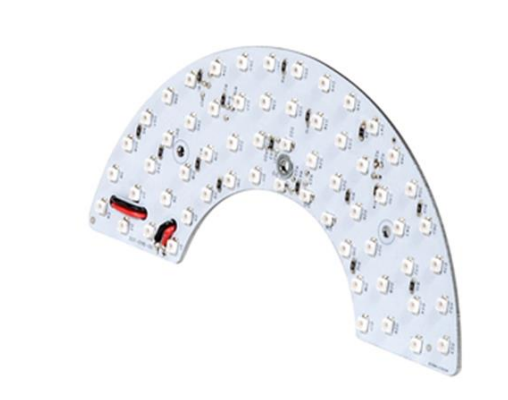

| Articoli | CE001136 | CE001132 | CE001134 |
|--|--|--|--|
| Colore LED | rosso | infrarosso | bianco |
| Lunghezza d’onda | 630 nm | 850 nm | N/D |
| Tensione | 24VDC | 24VDC | 24VDC |
| Corrente | 0.17A | 0.12A | 0.17A |
| Area di illuminazione | 155x75 mm^2 |  |  |
| Materiale struttura | Lega di alluminio |  |  |
| Temperatura di esercizio | -40 / +85 °C |  |  |
| Lunghezza cavo | 0.2 m |  |  |
| Metodo di raffreddamento | Aria naturale |  |  |
| Materiale opalino | Vetro 3+3 con plastico bianco latte |  |  |
```

```{dropdown} Backlight per FB350

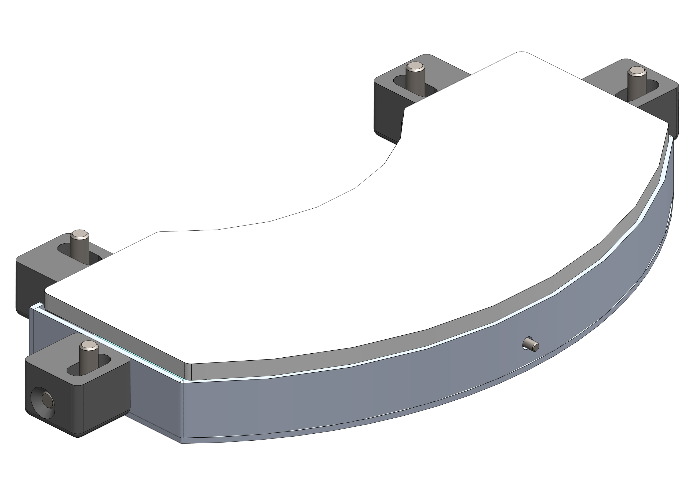

| Articoli | CE001142 | CE001139 | CE001140 |
|--|--|--|--|
| Colore LED | rosso | infrarosso | bianco |
| Lunghezza d’onda | 630 nm | 850 nm | N/D |
| Tensione | 24VDC | 24VDC | 24VDC |
| Corrente | 0.18A | 0.13A | 0.18A |
| Area di illuminazione | 220x100 mm^2 |  |  |
| Materiale struttura | Lega di alluminio |  |  |
| Temperatura di esercizio | -40 / +85 °C |  |  |
| Lunghezza cavo | 0.2 m |  |  |
| Metodo di raffreddamento | Aria naturale |  |  |
| Materiale opalino | Vetro 3+3 con plastico bianco latte |  |  |
```

```{dropdown} Backlight per FB500

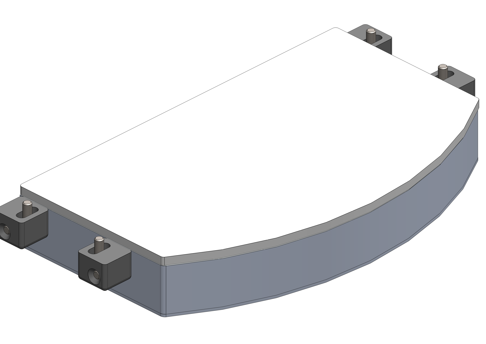

| Articoli | CE001148 | CE001144 | CE001146 |
|--|--|--|--|
| Colore LED | rosso | infrarosso | bianco |
| Lunghezza d’onda | 630 nm | 850 nm | N/D |
| Tensione | 24VDC | 24VDC | 24VDC |
| Corrente | 0.46A | 0.31A | 0.46A |
| Area di illuminazione | 330x170 mm^2 |  |  |
| Materiale struttura | Lega di alluminio |  |  |
| Temperatura di esercizio | -40 / +85 °C |  |  |
| Lunghezza cavo | 0.2 m |  |  |
| Metodo di raffreddamento | Aria naturale |  |  |
| Materiale opalino | Vetro 3+3 con plastico bianco latte |  |  |
```

```{dropdown} Backlight per FB650

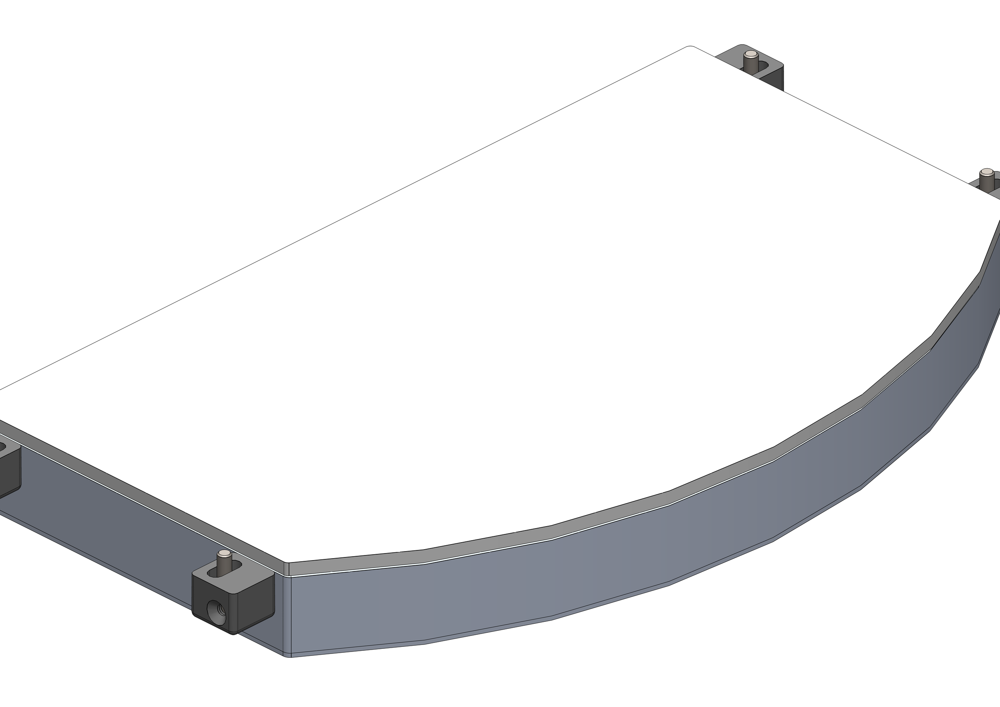

| Articoli | CE000306 | CE000273 | CE000305 |
|--|--|--|--|
| Articoli alternativi | GM000591 | GM000592 | GM000590 |
| Colore LED | rosso | infrarosso | bianco |
| Lunghezza d’onda | 630 nm | 850 nm | N/D |
| Tensione | 24VDC | 24VDC | 24VDC |
| Corrente | 0.86A | 0.56A | 0.94A |
| Area di illuminazione | 400x240 mm^2 |  |  |
| Materiale struttura | Lega di alluminio |  |  |
| Temperatura di esercizio | -40 / +85 °C |  |  |
| Lunghezza cavo | 0.2 m |  |  |
| Metodo di raffreddamento | Aria naturale |  |  |
| Materiale opalino | Vetro 3+3 con plastico bianco latte |  |  |
```

```{dropdown} Backlight per FB800

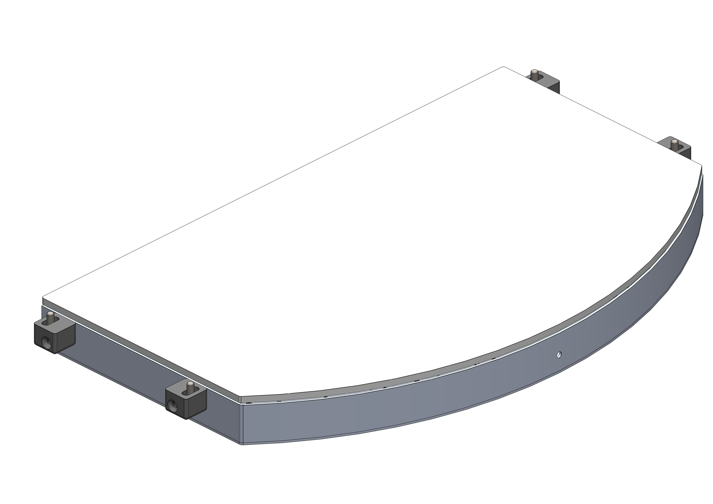

| Articoli | CE001154 | CE001150 | CE001152 |
|--|--|--|--|
| Colore LED | rosso | infrarosso | bianco |
| Lunghezza d’onda | 630 nm | 850 nm | N/D |
| Tensione | 24VDC | 24VDC | 24VDC |
| Corrente | 1.15A | 0.76A | 1.2A |
| Area di illuminazione | 400x315 mm^2 |  |  |
| Materiale struttura | Lega di alluminio |  |  |
| Temperatura di esercizio | -40 / +85 °C |  |  |
| Lunghezza cavo | 0.2 m |  |  |
| Metodo di raffreddamento | Aria naturale |  |  |
| Materiale opalino | Vetro 3+3 con plastico bianco latte |  |  |
```

```{dropdown} Backlight per FB1200

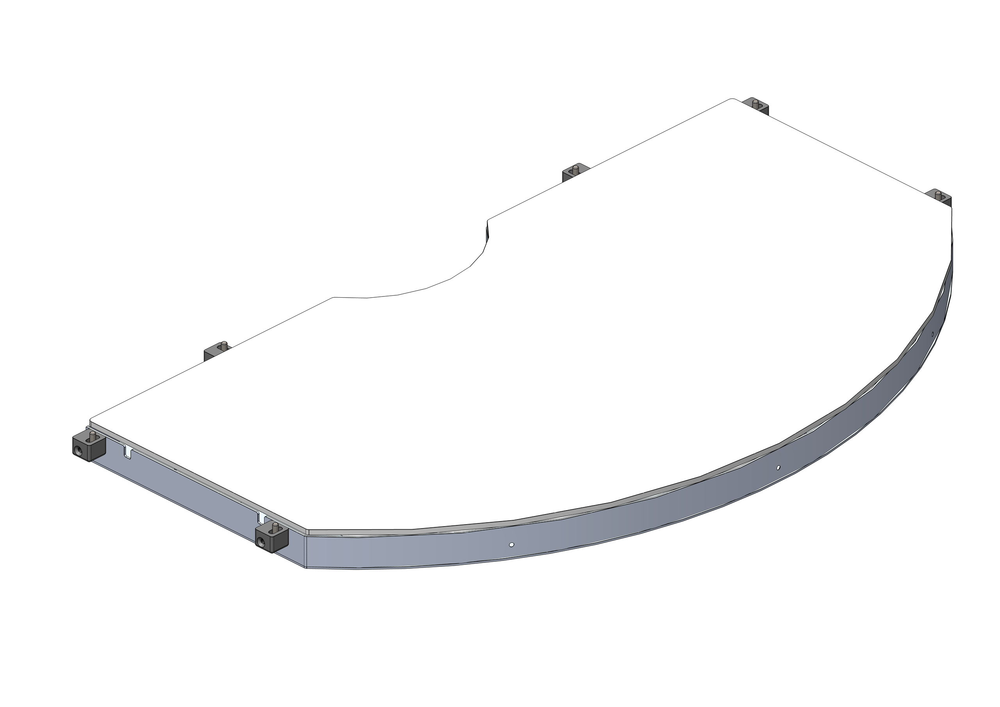

| Articoli | GE000051 | GE000052 | GE000050 |
|--|--|--|--|
| Colore LED | rosso | infrarosso | bianco |
| Lunghezza d’onda | 630 nm | 850 nm | N/D |
| Tensione | 24VDC | 24VDC | 24VDC |
| Corrente | 4A | 2.6A | 4.2A |
| Area di illuminazione | 917x525 mm^2 |  |  |
| Materiale struttura | Lega di alluminio |  |  |
| Temperatura di esercizio | -40 / +85 °C |  |  |
| Lunghezza cavo | 0.2 m |  |  |
| Metodo di raffreddamento | Aria naturale |  |  |
| Materiale opalino | Vetro 3+3 con plastico bianco latte |  |  |
```

## Colori dei Backlight

:::{list-table}
:widths: 15 15 70
:header-rows: 1

* - Colore
  - Lunghezza d'onda
  - Utilizzo consigliato

* - Red
  - 630 nm
  - Utilizzato per componenti metallici speciali. Lunghezza d’onda: 630 nm. È necessario schermare la cella da qualsiasi fonte di luce esterna e dalla luce solare.

* - IR
  - 850 nm
  - Preferito per la maggior parte dei tipi di applicazioni. Non è visibile all’occhio umano. Lunghezza d’onda: 850 nm. Si consiglia di schermare la cella per evitare interferenze con la luce solare.

* - White
  - N/D
  - Utilizzato con componenti trasparenti. È necessario schermare la cella da qualsiasi fonte di luce esterna e dalla luce solare.

:::


(toplight)=
# **Toplight**

Il Toplight è un illuminatore separato che viene montato all'altezza della telecamera e illumina l'area di visione del FlexiBowl® dall'alto, così che le features del componente che sono rivolte verso la telecamera siano messe in evidenza. È indicato principalmente per superfici lisce e non riflettenti, o superfici che presentano qualche tipo di marcatura distinguibile.
Il Toplight è disponibile con luce: 
- Bianca
- Rossa
- Infrarossa

:::{important}
Il Toplight infrarosso emette luce non visibile e perciò può apparire non funzionante. Controllare con una telecamera con un filtro ad infrarossi installato per verificarne il funzionamento. La maggior parte degli smartphone visualizzano gli infrarossi.
:::

## Caratteristiche dei Toplight

```{dropdown} TopLight 500x300 - White
Questa dimensione di Toplight è indicata per i modelli: FlexiBowl® 200, FlexiBowl® 350, FlexiBowl® 500
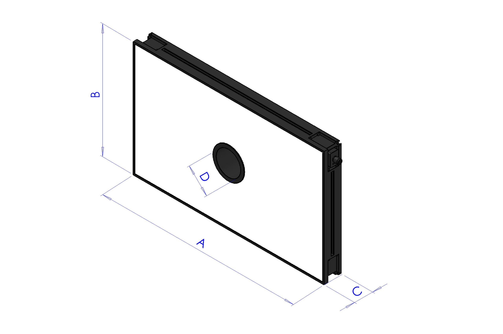
 
| Lunghezza | Larghezza | Altezza | Altezza con piastra di fissaggio | Diametro foro centrale | Superficie utile max [AxB] | Perimetro utile max |
|--|--|--|--|--|--|--|
| **A** | **B** | **C** | **C + 10mm** | **D** | - | - |
| 500 | 300 | 45 | 55 | 65 | 0.15 m^2 | 1.6 m |
 
:::{list-table}
:widths: 35 65
:header-rows: 0
 
* - **Codice**
  - CM002316
 
* - **Elettronica**
  -
 
* - Alimentazione
  - 24 VDC ±10%
 
* - Modalità di controllo
  - Continua
 
* - Tempo massimo di salita
  - 15 µs
 
* - Tempo massimo di discesa
  - 10 µs
 
* - Controllo
  - [Connettore M12](cablaggio_illuminatore)
 
* - Configurazione pin connettore
  - 1: 24VDC / 3: GND / 4: PNP
 
* - Consumo
  - 96.6W
 
* - Tensione minima di funzionamento
  - 20V sull’ingresso luce
 
* - Tensione nominale di funzionamento
  - 24V sull’ingresso luce (±10%)
 
* - Tensione massima di funzionamento
  - 30V sull’ingresso luce
 
* - Lunghezza d'onda
  -
 
* - Classe di Rischio
  - 0 (nesusn rischio)
 
* - **Meccanica**
  -
 
* - Spessore
  - 45mm + 10mm con piastra di fissaggio
 
* - Diametro interno
  - 65mm
 
* - Peso
  - 23.8 Kg/m² ±15%
 
* - Materiali
  - Alluminio e ABS caricato
 
* - Diffusore
  - PMMA bianco
 
* - Fissaggio
  - 4 dadi M4 (forniti) da inserire nella scanalatura
    oppure 4 viti M4x20 (non fornite) applicate agli angoli
 
* - **Ambiente**
  -
 
* - Temperatura di esercizio
  - -10°C a +40°C / 80% di umidità senza condensa
    Nessuno shock termico (variazione massima: 10°C in 24h)
 
* - Temperatura di stoccaggio
  - -20°C a +60°C / 80% di umidità senza condensa
    Nessuno shock termico (variazione massima: 10°C in 24h)
 
* - Grado di protezione IP
  - IP 50
 
* - Marcature
  - RoHS-CE-DEEE, UL
:::
 
```
```{dropdown} TopLight 500x300 - Red  
Questa dimensione di Toplight è indicata per i modelli: FlexiBowl® 200, FlexiBowl® 350, FlexiBowl® 500

 
| Lunghezza | Larghezza | Altezza | Altezza con piastra di fissaggio | Diametro foro centrale | Superficie utile max [AxB] | Perimetro utile max |
|--|--|--|--|--|--|--|
| **A** | **B** | **C** | **C + 10mm** | **D** | - | - |
| 500 | 300 | 45 | 55 | 65 | 0.15 m^2 | 1.6 m |
 
:::{list-table}
:widths: 35 65
:header-rows: 0
 
* - **Codice**
  - CM002401
 
* - **Elettronica**
  -
 
* - Alimentazione
  - 24 VDC ±10%
 
* - Modalità di controllo
  - Continua
 
* - Tempo massimo di salita
  - 15 µs
 
* - Tempo massimo di discesa
  - 10 µs
 
* - Controllo
  - [Connettore M12](cablaggio_illuminatore)
 
* - Configurazione pin connettore
  - 1: 24VDC / 3: GND / 4: PNP
 
* - Consumo
  - 96.6W @24 Vdc
 
* - Tensione minima di funzionamento
  - 20V sull’ingresso luce
 
* - Tensione nominale di funzionamento
  - 24V sull’ingresso luce (±10%)
 
* - Tensione massima di funzionamento
  - 30V sull’ingresso luce
 
* - Lunghezza d'onda
  - 630 nm
 
* - Classe di Rischio
  - 0 (nesusn rischio)
 
 
* - **Meccanica**
  -
 
* - Spessore
  - 45mm + 10mm con piastra di fissaggio
 
* - Diametro interno
  - 65mm
 
* - Peso
  - 23.8 Kg/m² ±15%
 
* - Materiali
  - Alluminio e ABS caricato
 
* - Diffusore
  - PMMA bianco
 
* - Fissaggio
  - 4 dadi M4 (forniti) da inserire nella scanalatura
    oppure 4 viti M4x20 (non fornite) applicate agli angoli
 
* - **Ambiente**
  -
 
* - Temperatura di esercizio
  - -10°C a +40°C / 80% di umidità senza condensa
    Nessuno shock termico (variazione massima: 10°C in 24h)
 
* - Temperatura di stoccaggio
  - -20°C a +60°C / 80% di umidità senza condensa
    Nessuno shock termico (variazione massima: 10°C in 24h)
 
* - Grado di protezione IP
  - IP 50
 
* - Marcature
  - RoHS-CE-DEEE, UL
:::
 
```
 
```{dropdown} TopLight 500x300 - Infrared
Questa dimensione di Toplight è indicata per i modelli: FlexiBowl® 200, FlexiBowl® 350, FlexiBowl® 500

 
| Lunghezza | Larghezza | Altezza | Altezza con piastra di fissaggio | Diametro foro centrale | Superficie utile max [AxB] | Perimetro utile max |
|--|--|--|--|--|--|--|
| **A** | **B** | **C** | **C + 10mm** | **D** | - | - |
| 500 | 300 | 45 | 55 | 65 | 0.15 m^2 | 1.6 m |
 
:::{list-table}
:widths: 35 65
:header-rows: 0
 
* - **Codice**
  - CM002405
 
* - **Elettronica**
  -
 
* - Alimentazione
  - 24 VDC ±10%
 
* - Modalità di controllo
  - Continua
 
* - Tempo massimo di salita
  - 15 µs
 
* - Tempo massimo di discesa
  - 10 µs
 
* - Controllo
  - [Connettore M12](cablaggio_illuminatore)
 
* - Configurazione pin connettore
  - 1: 24VDC / 3: GND / 4: PNP
 
* - Consumo
  - 96.6W @24 Vdc
 
* - Tensione minima di funzionamento
  - 20V sull’ingresso luce
 
* - Tensione nominale di funzionamento
  - 24V sull’ingresso luce (±10%)
 
* - Tensione massima di funzionamento
  - 30V sull’ingresso luce
 
* - Lunghezza d'onda
  - 850 nm
 
* - Classe di Rischio
  - 1 (basso rischio)
 
* - **Meccanica**
  -
 
* - Spessore
  - 45mm + 10mm con piastra di fissaggio
 
* - Diametro interno
  - 65mm
 
* - Peso
  - 23.8 Kg/m² ±15%
 
* - Materiali
  - Alluminio e ABS caricato
 
* - Diffusore
  - PMMA bianco
 
* - Fissaggio
  - 4 dadi M4 (forniti) da inserire nella scanalatura
    oppure 4 viti M4x20 (non fornite) applicate agli angoli
 
* - **Ambiente**
  -
 
* - Temperatura di esercizio
  - -10°C a +40°C / 80% di umidità senza condensa
    Nessuno shock termico (variazione massima: 10°C in 24h)
 
* - Temperatura di stoccaggio
  - -20°C a +60°C / 80% di umidità senza condensa
    Nessuno shock termico (variazione massima: 10°C in 24h)
 
* - Grado di protezione IP
  - IP 50
 
* - Marcature
  - RoHS-CE-DEEE, UL
:::
 
```
 
```{dropdown} TopLight 700x300 - White
Questa dimensione di Toplight è indicata per i modelli: FlexiBowl® 650, FlexiBowl® 800
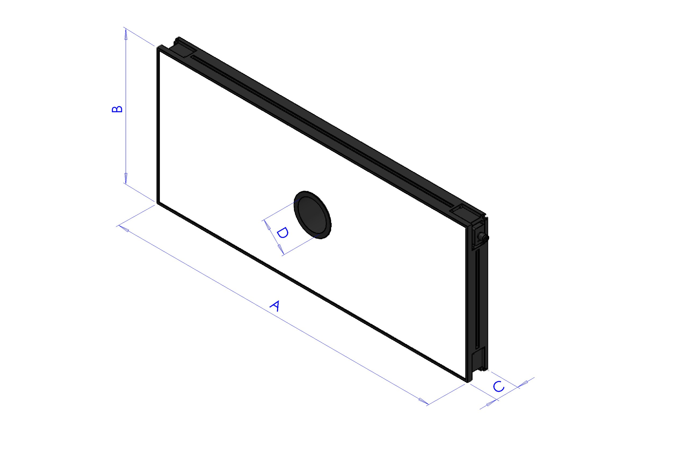
 
| Lunghezza | Larghezza | Altezza | Altezza con piastra di fissaggio | Diametro foro centrale | Superficie utile max [AxB] | Perimetro utile max |
|--|--|--|--|--|--|--|
| **A** | **B** | **C** | **C + 10mm** | **D** | - | - |
| 700 | 300 | 45 | 55 | 65 | 0.21 m^2 | 2 m |
 
:::{list-table}
:widths: 35 65
:header-rows: 0
 
* - **Codice**
  - CM002317
 
* - **Elettronica**
  -
 
* - Alimentazione
  - 24 VDC ±10%
 
* - Modalità di controllo
  - Continua
 
* - Tempo massimo di salita
  - 15 µs
 
* - Tempo massimo di discesa
  - 10 µs
 
* - Controllo
  - [Connettore M12](cablaggio_illuminatore)
 
* - Configurazione pin connettore
  - 1: 24VDC / 3: GND / 4: PNP
 
* - Consumo
  - 135.6W @24 Vdc
 
* - Tensione minima di funzionamento
  - 20V sull’ingresso luce
 
* - Tensione nominale di funzionamento
  - 24V sull’ingresso luce (±10%)
 
* - Tensione massima di funzionamento
  - 30V sull’ingresso luce
 
* - Lunghezza d'onda
  -
 
* - Classe di Rischio
  - 0 (nesusn rischio)
 
* - **Meccanica**
  -
 
* - Spessore
  - 45mm + 10mm con piastra di fissaggio
 
* - Diametro interno
  - 65mm
 
* - Peso
  - 23.8 Kg/m² ±15%
 
* - Materiali
  - Alluminio e ABS caricato
 
* - Diffusore
  - PMMA bianco
 
* - Fissaggio
  - 4 dadi M4 (forniti) da inserire nella scanalatura
    oppure 4 viti M4x20 (non fornite) applicate agli angoli
 
* - **Ambiente**
  -
 
* - Temperatura di esercizio
  - -10°C a +40°C / 80% di umidità senza condensa
    Nessuno shock termico (variazione massima: 10°C in 24h)
 
* - Temperatura di stoccaggio
  - -20°C a +60°C / 80% di umidità senza condensa
    Nessuno shock termico (variazione massima: 10°C in 24h)
 
* - Grado di protezione IP
  - IP 50
 
* - Marcature
  - RoHS-CE-DEEE, UL
:::
```
 
```{dropdown} TopLight 700x300 - Red
Questa dimensione di Toplight è indicata per i modelli: FlexiBowl® 650, FlexiBowl® 800

 
| Lunghezza | Larghezza | Altezza | Altezza con piastra di fissaggio | Diametro foro centrale | Superficie utile max [AxB] | Perimetro utile max |
|--|--|--|--|--|--|--|
| **A** | **B** | **C** | **C + 10mm** | **D** | - | - |
| 700 | 300 | 45 | 55 | 65 | 0.21 m^2 | 2 m |
 
:::{list-table}
:widths: 35 65
:header-rows: 0
 
 * - **Codice**
   - CM002402
 
* - **Elettronica**
  -
 
* - Alimentazione
  - 24 VDC ±10%
 
* - Modalità di controllo
  - Continua
 
* - Tempo massimo di salita
  - 15 µs
 
* - Tempo massimo di discesa
  - 10 µs
 
* - Controllo
  - [Connettore M12](cablaggio_illuminatore)
 
* - Configurazione pin connettore
  - 1: 24VDC / 3: GND / 4: PNP
 
* - Consumo
  - 135.6W @24 Vdc
 
* - Tensione minima di funzionamento
  - 20V sull’ingresso luce
 
* - Tensione nominale di funzionamento
  - 24V sull’ingresso luce (±10%)
 
* - Tensione massima di funzionamento
  - 30V sull’ingresso luce
 
* - Lunghezza d'onda
  - 630 nm
 
* - Classe di Rischio
  - 0 (nesusn rischio)
 
* - **Meccanica**
  -
 
* - Spessore
  - 45mm + 10mm con piastra di fissaggio
 
* - Diametro interno
  - 65mm
 
* - Peso
  - 23.8 Kg/m² ±15%
 
* - Materiali
  - Alluminio e ABS caricato
 
* - Diffusore
  - PMMA bianco
 
* - Fissaggio
  - 4 dadi M4 (forniti) da inserire nella scanalatura
    oppure 4 viti M4x20 (non fornite) applicate agli angoli
 
* - **Ambiente**
  -
 
* - Temperatura di esercizio
  - -10°C a +40°C / 80% di umidità senza condensa
    Nessuno shock termico (variazione massima: 10°C in 24h)
 
* - Temperatura di stoccaggio
  - -20°C a +60°C / 80% di umidità senza condensa
    Nessuno shock termico (variazione massima: 10°C in 24h)
 
* - Grado di protezione IP
  - IP 50
 
* - Marcature
  - RoHS-CE-DEEE, UL
:::
```
 
```{dropdown} TopLight 700x300 - Infrared
Questa dimensione di Toplight è indicata per i modelli: FlexiBowl® 650, FlexiBowl® 800

 
| Lunghezza | Larghezza | Altezza | Altezza con piastra di fissaggio | Diametro foro centrale | Superficie utile max [AxB] | Perimetro utile max |
|--|--|--|--|--|--|--|
| **A** | **B** | **C** | **C + 10mm** | **D** | - | - |
| 700 | 300 | 45 | 55 | 65 | 0.21 m^2 | 2 m |
 
:::{list-table}
:widths: 35 65
:header-rows: 0
 
* - **Codice**
  - CM002406
 
* - **Elettronica**
  -
 
* - Alimentazione
  - 24 VDC ±10%
 
* - Modalità di controllo
  - Continua
 
* - Tempo massimo di salita
  - 15 µs
 
* - Tempo massimo di discesa
  - 10 µs
 
* - Controllo
  - [Connettore M12](cablaggio_illuminatore)
 
* - Configurazione pin connettore
  - 1: 24VDC / 3: GND / 4: PNP
 
* - Consumo
  - 135.6W @24 Vdc
 
* - Tensione minima di funzionamento
  - 20V sull’ingresso luce
 
* - Tensione nominale di funzionamento
  - 24V sull’ingresso luce (±10%)
 
* - Tensione massima di funzionamento
  - 30V sull’ingresso luce
 
* - Lunghezza d'onda
  - 850 nm
 
* - Classe di Rischio
  - 1 (basso rischio)
 
* - **Meccanica**
  -
 
* - Spessore
  - 45mm + 10mm con piastra di fissaggio
 
* - Diametro interno
  - 65mm
 
* - Peso
  - 23.8 Kg/m² ±15%
 
* - Materiali
  - Alluminio e ABS caricato
 
* - Diffusore
  - PMMA bianco
 
* - Fissaggio
  - 4 dadi M4 (forniti) da inserire nella scanalatura
    oppure 4 viti M4x20 (non fornite) applicate agli angoli
 
* - **Ambiente**
  -
 
* - Temperatura di esercizio
  - -10°C a +40°C / 80% di umidità senza condensa
    Nessuno shock termico (variazione massima: 10°C in 24h)
 
* - Temperatura di stoccaggio
  - -20°C a +60°C / 80% di umidità senza condensa
    Nessuno shock termico (variazione massima: 10°C in 24h)
 
* - Grado di protezione IP
  - IP 50
 
* - Marcature
  - RoHS-CE-DEEE, UL
:::
```
 
```{dropdown} TopLight 700x500 - White
Questa dimensione di Toplight è indicata per i modelli: FlexiBowl® 650, FlexiBowl® 800
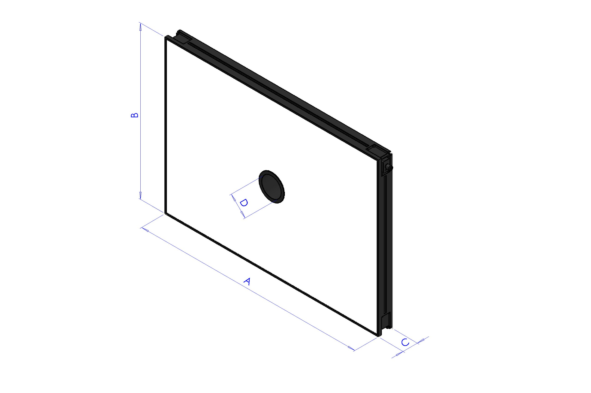
 
| Lunghezza | Larghezza | Altezza | Altezza con piastra di fissaggio | Diametro foro centrale | Superficie utile max [AxB] | Perimetro utile max |
|--|--|--|--|--|--|--|
| **A** | **B** | **C** | **C + 10mm** | **D** | - | - |
| 700 | 500 | 45 | 55 | 65 | 0.35 m^2 | 2.4 m |
 
:::{list-table}
:widths: 35 65
:header-rows: 0
 
* - **Codice**
  - CM002318
 
* - **Elettronica**
  -
 
* - Alimentazione
  - 24 VDC ±10%
 
* - Modalità di controllo
  - Continua
 
* - Tempo massimo di salita
  - 15 µs
 
* - Tempo massimo di discesa
  - 10 µs
 
* - Controllo
  - [Connettore M12](cablaggio_illuminatore)
 
* - Configurazione pin connettore
  - 1: 24VDC / 3: GND / 4: PNP
 
* - Consumo
  - 252.6W @24 Vdc
 
* - Tensione minima di funzionamento
  - 20V sull’ingresso luce
 
* - Tensione nominale di funzionamento
  - 24V sull’ingresso luce (±10%)
 
* - Tensione massima di funzionamento
  - 30V sull’ingresso luce
 
* - Lunghezza d'onda
  -
 
* - Classe di Rischio
  - 0 (nesusn rischio)
 
* - **Meccanica**
  -
 
* - Spessore
  - 45mm + 10mm con piastra di fissaggio
 
* - Diametro interno
  - 65mm
 
* - Peso
  - 23.8 Kg/m² ±15%
 
* - Materiali
  - Alluminio e ABS caricato
 
* - Diffusore
  - PMMA bianco
 
* - Fissaggio
  - 4 dadi M4 (forniti) da inserire nella scanalatura
    oppure 4 viti M4x20 (non fornite) applicate agli angoli
 
* - **Ambiente**
  -
 
* - Temperatura di esercizio
  - -10°C a +40°C / 80% di umidità senza condensa
    Nessuno shock termico (variazione massima: 10°C in 24h)
 
* - Temperatura di stoccaggio
  - -20°C a +60°C / 80% di umidità senza condensa
    Nessuno shock termico (variazione massima: 10°C in 24h)
 
* - Grado di protezione IP
  - IP 50
 
* - Marcature
  - RoHS-CE-DEEE, UL
:::
```
 
```{dropdown} TopLight 700x500 - Red
Questa dimensione di Toplight è indicata per i modelli: FlexiBowl® 650, FlexiBowl® 800

 
| Lunghezza | Larghezza | Altezza | Altezza con piastra di fissaggio | Diametro foro centrale | Superficie utile max [AxB] | Perimetro utile max |
|--|--|--|--|--|--|--|
| **A** | **B** | **C** | **C + 10mm** | **D** | - | - |
| 700 | 500 | 45 | 55 | 65 | 0.35 m^2 | 2.4 m |
 
:::{list-table}
:widths: 35 65
:header-rows: 0
 
* - **Codice**
  - CM002403
 
* - **Elettronica**
  -
 
* - Alimentazione
  - 24 VDC ±10%
 
* - Modalità di controllo
  - Continua
 
* - Tempo massimo di salita
  - 15 µs
 
* - Tempo massimo di discesa
  - 10 µs
 
* - Controllo
  - [Connettore M12](cablaggio_illuminatore)
 
* - Configurazione pin connettore
  - 1: 24VDC / 3: GND / 4: PNP
 
* - Consumo
  - 252.6W @24 Vdc
 
* - Tensione minima di funzionamento
  - 20V sull’ingresso luce
 
* - Tensione nominale di funzionamento
  - 24V sull’ingresso luce (±10%)
 
* - Tensione massima di funzionamento
  - 30V sull’ingresso luce
 
* - Lunghezza d'onda
  - 630 nm
 
* - Classe di Rischio
  - 0 (nesusn rischio)
 
* - **Meccanica**
  -
 
* - Spessore
  - 45mm + 10mm con piastra di fissaggio
 
* - Diametro interno
  - 65mm
 
* - Peso
  - 23.8 Kg/m² ±15%
 
* - Materiali
  - Alluminio e ABS caricato
 
* - Diffusore
  - PMMA bianco
 
* - Fissaggio
  - 4 dadi M4 (forniti) da inserire nella scanalatura
    oppure 4 viti M4x20 (non fornite) applicate agli angoli
 
* - **Ambiente**
  -
 
* - Temperatura di esercizio
  - -10°C a +40°C / 80% di umidità senza condensa
    Nessuno shock termico (variazione massima: 10°C in 24h)
 
* - Temperatura di stoccaggio
  - -20°C a +60°C / 80% di umidità senza condensa
    Nessuno shock termico (variazione massima: 10°C in 24h)
 
* - Grado di protezione IP
  - IP 50
 
* - Marcature
  - RoHS-CE-DEEE, UL
:::
```
 
```{dropdown} TopLight 700x500 - Infrared
Questa dimensione di Toplight è indicata per i modelli: FlexiBowl® 650, FlexiBowl® 800

 
| Lunghezza | Larghezza | Altezza | Altezza con piastra di fissaggio | Diametro foro centrale | Superficie utile max [AxB] | Perimetro utile max |
|--|--|--|--|--|--|--|
| **A** | **B** | **C** | **C + 10mm** | **D** | - | - |
| 700 | 500 | 45 | 55 | 65 | 0.35 m^2 | 2.4 m |
 
:::{list-table}
:widths: 35 65
:header-rows: 0
 
* - **Codice**
  - CM002407
 
* - **Elettronica**
  -
 
* - Alimentazione
  - 24 VDC ±10%
 
* - Modalità di controllo
  - Continua
 
* - Tempo massimo di salita
  - 15 µs
 
* - Tempo massimo di discesa
  - 10 µs
 
* - Controllo
  - [Connettore M12](cablaggio_illuminatore)
 
* - Configurazione pin connettore
  - 1: 24VDC / 3: GND / 4: PNP
 
* - Consumo
  - 252.6W @24 Vdc
 
* - Tensione minima di funzionamento
  - 20V sull’ingresso luce
 
* - Tensione nominale di funzionamento
  - 24V sull’ingresso luce (±10%)
 
* - Tensione massima di funzionamento
  - 30V sull’ingresso luce
 
* - Lunghezza d'onda
  - 850 nm
 
* - Classe di Rischio
  - 1 (basso rischio)
 
* - **Meccanica**
  -
 
* - Spessore
  - 45mm + 10mm con piastra di fissaggio
 
* - Diametro interno
  - 65mm
 
* - Peso
  - 23.8 Kg/m² ±15%
 
* - Materiali
  - Alluminio e ABS caricato
 
* - Diffusore
  - PMMA bianco
 
* - Fissaggio
  - 4 dadi M4 (forniti) da inserire nella scanalatura
    oppure 4 viti M4x20 (non fornite) applicate agli angoli
 
* - **Ambiente**
  -
 
* - Temperatura di esercizio
  - -10°C a +40°C / 80% di umidità senza condensa
    Nessuno shock termico (variazione massima: 10°C in 24h)
 
* - Temperatura di stoccaggio
  - -20°C a +60°C / 80% di umidità senza condensa
    Nessuno shock termico (variazione massima: 10°C in 24h)
 
* - Grado di protezione IP
  - IP 50
 
* - Marcature
  - RoHS-CE-DEEE, UL
:::
```
 
```{dropdown} TopLight 900x600 - White
Questa dimensione di Toplight è indicata per il modelli FlexiBowl® 1200

 
| Lunghezza | Larghezza | Altezza | Altezza con piastra di fissaggio | Diametro foro centrale | Superficie utile max [AxB] | Perimetro utile max |
|--|--|--|--|--|--|--|
| **A** | **B** | **C** | **C + 10mm** | **D** | - | - |
| 900 | 600 | 45 | 55 | 65 | 0.54 m^2 | 3 m |
 
:::{list-table}
:widths: 35 65
:header-rows: 0
 
* - **Codice**
  - CM002319
 
* - **Elettronica**
  -
 
* - Alimentazione
  - 24 VDC ±10%
 
* - Modalità di controllo
  - Continua
 
* - Tempo massimo di salita
  - 15 µs
 
* - Tempo massimo di discesa
  - 10 µs
 
* - Controllo
  - [Connettore M12](cablaggio_illuminatore)
 
* - Configurazione pin connettore
  - 1: 24VDC / 3: GND / 4: PNP
 
* - Consumo
  - 345.6W @24 Vdc
 
* - Tensione minima di funzionamento
  - 20V sull’ingresso luce
 
* - Tensione nominale di funzionamento
  - 24V sull’ingresso luce (±10%)
 
* - Tensione massima di funzionamento
  - 30V sull’ingresso luce
 
* - Lunghezza d'onda
  -
 
* - Classe di Rischio
  - 0 (nesusn rischio)
 
* - **Meccanica**
  -
 
* - Spessore
  - 45mm + 10mm con piastra di fissaggio
 
* - Diametro interno
  - 65mm
 
* - Peso
  - 23.8 Kg/m² ±15%
 
* - Materiali
  - Alluminio e ABS caricato
 
* - Diffusore
  - PMMA bianco
 
* - Fissaggio
  - 4 dadi M4 (forniti) da inserire nella scanalatura
    oppure 4 viti M4x20 (non fornite) applicate agli angoli
 
* - **Ambiente**
  -
 
* - Temperatura di esercizio
  - -10°C a +40°C / 80% di umidità senza condensa
    Nessuno shock termico (variazione massima: 10°C in 24h)
 
* - Temperatura di stoccaggio
  - -20°C a +60°C / 80% di umidità senza condensa
    Nessuno shock termico (variazione massima: 10°C in 24h)
 
* - Grado di protezione IP
  - IP 50
 
* - Marcature
  - RoHS-CE-DEEE, UL
:::
```
```{dropdown} TopLight 900x600 - Red
Questa dimensione di Toplight è indicata per il modelli FlexiBowl® 1200

 
| Lunghezza | Larghezza | Altezza | Altezza con piastra di fissaggio | Diametro foro centrale | Superficie utile max [AxB] | Perimetro utile max |
|--|--|--|--|--|--|--|
| **A** | **B** | **C** | **C + 10mm** | **D** | - | - |
| 900 | 600 | 45 | 55 | 65 | 0.54 m^2 | 3 m |
 
:::{list-table}
:widths: 35 65
:header-rows: 0
 
* - **Codice**
  - CM002404
 
* - **Elettronica**
  -
 
* - Alimentazione
  - 24 VDC ±10%
 
* - Modalità di controllo
  - Continua
 
* - Tempo massimo di salita
  - 15 µs
 
* - Tempo massimo di discesa
  - 10 µs
 
* - Controllo
  - [Connettore M12](cablaggio_illuminatore)
 
* - Configurazione pin connettore
  - 1: 24VDC / 3: GND / 4: PNP
 
* - Consumo
  - 345.6W @24 Vdc
 
* - Tensione minima di funzionamento
  - 20V sull’ingresso luce
 
* - Tensione nominale di funzionamento
  - 24V sull’ingresso luce (±10%)
 
* - Tensione massima di funzionamento
  - 30V sull’ingresso luce
 
* - Lunghezza d'onda
  - 630 nm
 
* - Classe di Rischio
  - 0 (nesusn rischio)
 
* - **Meccanica**
  -
 
* - Spessore
  - 45mm + 10mm con piastra di fissaggio
 
* - Diametro interno
  - 65mm
 
* - Peso
  - 23.8 Kg/m² ±15%
 
* - Materiali
  - Alluminio e ABS caricato
 
* - Diffusore
  - PMMA bianco
 
* - Fissaggio
  - 4 dadi M4 (forniti) da inserire nella scanalatura
    oppure 4 viti M4x20 (non fornite) applicate agli angoli
 
* - **Ambiente**
  -
 
* - Temperatura di esercizio
  - -10°C a +40°C / 80% di umidità senza condensa
    Nessuno shock termico (variazione massima: 10°C in 24h)
 
* - Temperatura di stoccaggio
  - -20°C a +60°C / 80% di umidità senza condensa
    Nessuno shock termico (variazione massima: 10°C in 24h)
 
* - Grado di protezione IP
  - IP 50
 
* - Marcature
  - RoHS-CE-DEEE, UL
:::
```
 
```{dropdown} TopLight 900x600 - Infrared
Questa dimensione di Toplight è indicata per il modelli FlexiBowl® 1200

 
| Lunghezza | Larghezza | Altezza | Altezza con piastra di fissaggio | Diametro foro centrale | Superficie utile max [AxB] | Perimetro utile max |
|--|--|--|--|--|--|--|
| **A** | **B** | **C** | **C + 10mm** | **D** | - | - |
| 900 | 600 | 45 | 55 | 65 | 0.54 m^2 | 3 m |
 
:::{list-table}
:widths: 35 65
:header-rows: 0
 
* - **Codice**
  - CM002408
 
* - **Elettronica**
  -
 
* - Alimentazione
  - 24 VDC ±10%
 
* - Modalità di controllo
  - Continua
 
* - Tempo massimo di salita
  - 15 µs
 
* - Tempo massimo di discesa
  - 10 µs
 
* - Controllo
  - [Connettore M12](cablaggio_illuminatore)
 
* - Configurazione pin connettore
  - 1: 24VDC / 3: GND / 4: PNP
 
* - Consumo
  - 345.6W @24 Vdc
 
* - Tensione minima di funzionamento
  - 20V sull’ingresso luce
 
* - Tensione nominale di funzionamento
  - 24V sull’ingresso luce (±10%)
 
* - Tensione massima di funzionamento
  - 30V sull’ingresso luce
 
* - Lunghezza d'onda
  - 850 nm
 
* - Classe di Rischio
  - 1 (basso rischio)
 
* - **Meccanica**
  -
 
* - Spessore
  - 45mm + 10mm con piastra di fissaggio
 
* - Diametro interno
  - 65mm
 
* - Peso
  - 23.8 Kg/m² ±15%
 
* - Materiali
  - Alluminio e ABS caricato
 
* - Diffusore
  - PMMA bianco
 
* - Fissaggio
  - 4 dadi M4 (forniti) da inserire nella scanalatura
    oppure 4 viti M4x20 (non fornite) applicate agli angoli
 
* - **Ambiente**
  -
 
* - Temperatura di esercizio
  - -10°C a +40°C / 80% di umidità senza condensa
    Nessuno shock termico (variazione massima: 10°C in 24h)
 
* - Temperatura di stoccaggio
  - -20°C a +60°C / 80% di umidità senza condensa
    Nessuno shock termico (variazione massima: 10°C in 24h)
 
* - Grado di protezione IP
  - IP 50
 
* - Marcature
  - RoHS-CE-DEEE, UL
:::
```

## Colori dei Toplight

:::{list-table}
:widths: 15 15 70
:header-rows: 1

* - Colore
  - Lunghezza d'onda
  - Utilizzo consigliato

* - Red
  - 630 nm
  - Utilizzato per componenti metallici speciali. Lunghezza d’onda: 630 nm. È necessario schermare la cella da qualsiasi fonte di luce esterna e dalla luce solare.

* - IR
  - 850 nm
  - Preferito per la maggior parte dei tipi di applicazioni. Non è visibile all’occhio umano. Lunghezza d’onda: 850 nm. Si consiglia di schermare la cella per evitare interferenze con la luce solare.

* - White
  - N/D
  - Utilizzato con componenti trasparenti. È necessario schermare la cella da qualsiasi fonte di luce esterna e dalla luce solare.

:::

### *Cavo Alimentazione Toplight* 

```{image} ../../../../_shared/media/images/cavoalimtoplight1.png
:align: center
:width: 60%
```

| Codice   | Descrizione              | Connettore |
|----------|--------------------------|------------|
| CE001337 | Cavo Alimentazione Toplight 2M  | M12 4 Pin Female |
| CE001338 | Cavo Alimentazione Toplight power 5M | M12 4 Pin Female |
| CE001339 | Cavo Alimentazione Toplight power 10M | M12 4 Pin Female |

(staffa)=
### *Staffa per Montaggio Toplight* 
Per il [montaggio del toplight sul lato](montaggio_staffa) è possibile acquistare **a parte** un'apposita staffa. 

```{image} ../../../../_shared/media/images/staffa_montaggio.png
:align: center
:width: 80%
```
## Montaggio Toplight

Se l'ordine include un Toplight (illuminatore dall'alto), questo deve essere montato sulla stessa struttura di supporto della telecamera per garantire un'illuminazione uniforme della superficie di lavoro.

:::{attention}
Durante il montaggio, l'apparecchio deve essere spento e staccato dalla corrente.
:::
### *Dimensioni Toplight* 
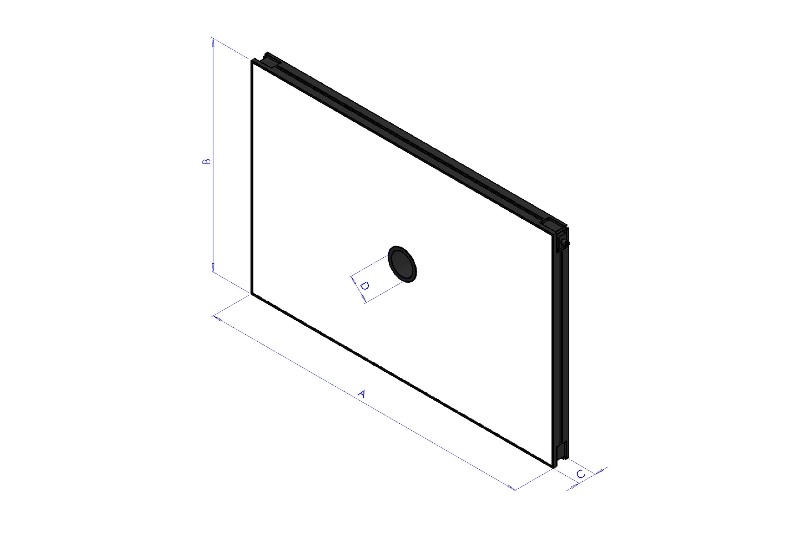

| Lunghezza x Larghezza (mm) | Altezza (mm) | Altezza con piastra di fissaggio (mm) | Diametro foro centrale | Superficie utile massima [A x B] | Perimetro utile massimo |
|:---:|:---:|:---:|:---:|:---:|:---:|
| **A x B** | **C** | **C + 10 mm** | **D** | **–** | **–** |
| 500x300 | 45 | 55 | 65 | 0,15 m² | 1,6 m |
| 700x300 | 45 | 55 | 65 | 0,21 m² | 2 m |
| 700x500 | 45 | 55 | 65 | 0,35 m² | 2,4 m |
| 900x600 | 45 | 55 | 65 | 0,54 m² | 3 m |

### *Posizionamento Toplight* 
Il toplight deve essere posizionato centralmente rispetto alla superficie utile del pannello luminoso,
con l'ottica della telecamera montata all'interno del foro centrale, a filo con la superficie superiore del toplight.   
Le frecce rosse indicano le viti di fissaggio delle ghiere dell'obiettivo, una per la regolazione del fuoco e una per la regolazione del diaframma. Come mostrato nella figura, il toplight deve essere montato in modo che le due viti restino accessibili dall'alto. 

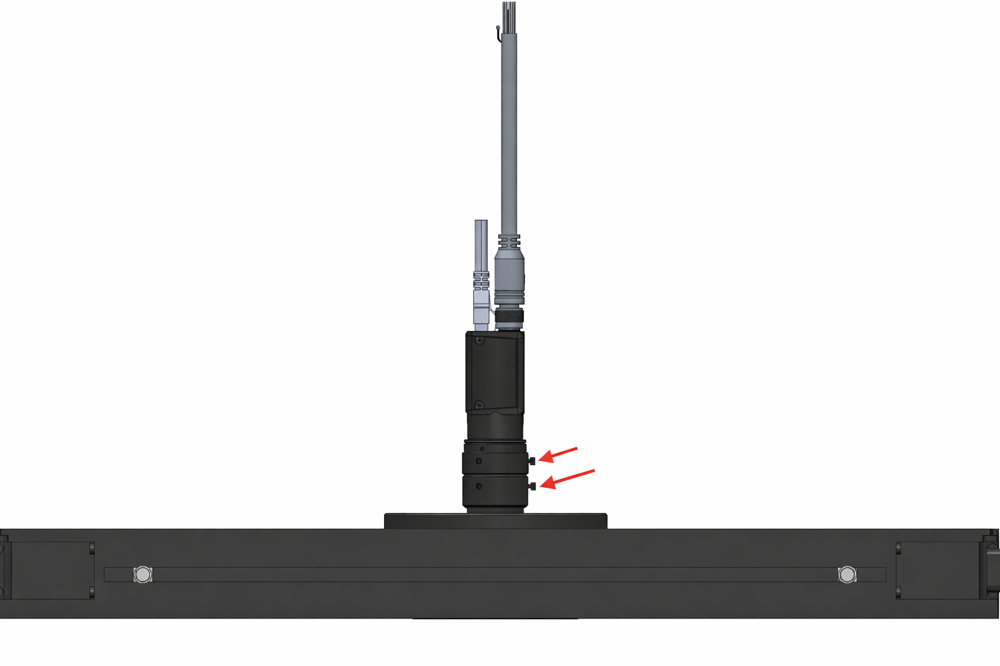

Il campo visivo della telecamera e il fascio luminoso del toplight (in verde) devono essere allineati concentricamente e perpendicolarmente rispetto all'area di visione sul FlexiBowl®.    
Come mostrato nelle tre viste (frontale, dall'alto e assonometrica), il toplight deve illuminare esattamente l'area inquadrata dalla telecamera, con entrambi i componenti centrati sull'asse ottico verticale del sistema.  


Un posizionamento errato si verifica quando il toplight e la telecamera non sono centrati sull'area di visione del FlexiBowl®.   
Come illustrato (in rosso), due errori tipici sono:  
- spostarsi in avanti o indietro rispetto all'area di visione.  
- ruotare il toplight rispetto ad essa.   
  
In entrambi i casi, l'illuminazione risulta disassata e non perpendicolare, compromettendo la qualità dell'acquisizione.


### *Procedura di installazione*
```{list-table}
:header-rows: 1
:widths: 35 65

* - **Fase**
  - **Istruzioni operative**
* - **1. Posizionamento**
  - Fissare il Toplight sulla struttura di supporto in posizione concentrica rispetto alla camera.
* - **2. Distanza dalla superficie**
  - Posizionare l'illuminatore a una distanza dalla superficie del FlexiBowl® simile a quella della camera per:
    
    * Minimizzare le ombre proiettate dai pezzi
    * Massimizzare l'uniformità luminosa
    * Evitare riflessioni dirette verso la camera
* - **3. Orientamento**
  - Assicurarsi che la superficie emittente del Toplight sia parallela alla superficie di lavoro del FlexiBowl®.
* - **4. Angolo di illuminazione**
  - Perpendicolare alla superficie (0° tilt).
* - **5. Fissaggio**
  - Secondo specifiche della modalità scelta (vedi sezione seguente).
```

### *Modalità di fissaggio*

Il Toplight può essere fissato in due modalità: sull'[angolo](angolo) o sul [lato](lato).

:::{note}
I componenti di fissaggio **non sono inclusi** nella fornitura del Toplight. Il montaggio può quindi essere personalizzato in base alle esigenze dell'installazione.

- Fissaggio sul lato (scanalatura): dadi M4 **forniti**
- Fissaggio sull'angolo: viti CHC M4x20 **non fornite**

In entrambi i casi si raccomanda l'uso di un **frenafiletti** (non fornito) per evitare allentamenti nel tempo. La coppia di serraggio consigliata è compresa tra **0,5 e 1,5 Nm**.
:::

(angolo)=
#### *1. Fissaggio sull'angolo*

Il fissaggio sull'angolo utilizza viti CHC M4x20 (non fornite) applicate nei fori posizionati ai quattro angoli del Toplight.
```{figure} ../../../../_shared/media/images/fissaggio_angolo.png
:alt: Fissaggio del Toplight sull'angolo con vite CHC M4x20
:align: center
:width: 60%

Fissaggio sull'angolo tramite vite CHC M4x20 (non fornita).
```

:::{figure} ../../../../_shared/media/images/tlfix-angoli.PNG 
:align: center
:width: 100%
:::

:::{list-table}
:widths: 33 33 33
:header-rows: 1

* - Taglia
  - 500x300
  - 700x300
  - 700x500
  - 900x600

* - Distanza A
  - 498 mm
  - 698 mm
  - 698 mm
  - 898 mm

* - Distanza B
  - 298 mm
  - 298 mm
  - 498 mm
  - 598 mm

:::

(lato)=
#### *2. Fissaggio sul lato (scanalatura)*

Il fissaggio sul lato utilizza 4 dadi M4 (forniti) da inserire nella scanalatura laterale del profilo del Toplight.  
   La profondità massima di inserimento del dado nella scanalatura è di **5 mm**.  
     Le Viti consigliate sono M4x8.

```{figure} ../../../../_shared/media/images/tlfix-sezione.PNG
:alt: Fissaggio del Toplight sul lato 
:align: center
:width: 100%

Fissaggio sul lato
```
(montaggio_staffa)=
##### Fissaggio laterale con staffe 
Nel caso in cui il Toplight venisse fissato con delle staffe: 

::::::{error}
:::::{grid} 2

::::{grid-item}
:::{figure} ../../../../_shared/media/images/tlfix-alto.PNG 
:align: center
:width: 100%

Non appendere l'illuminatore da un solo fianco
:::
::::

::::{grid-item}
:::{figure} ../../../../_shared/media/images/tlfix-staffedef.PNG 
:align: center
:width: 100%

Non deformare la struttura di fissaggio del Toplight
:::
::::
::::::

::::::{tip}

Seguono alcuni esempi di corretto fissaggio del TopLight:

:::::{grid} 2

::::{grid-item}
:::{figure} ../../../../_shared/media/images/tlfix-basso.PNG 
:align: center
:width: 100%
:::
::::

::::{grid-item}
:::{figure} ../../../../_shared/media/images/tlfix-steso.PNG 
:align: center
:width: 100%
:::
::::
::::::

:::{card}
  Per il Montaggio laterale è possibile acquistare **a parte** l'apposita [staffa](staffa).
:::


### *Cablaggio illuminatore*


```{list-table} 
:header-rows: 1
:widths: 30 70

* - Parametro
  - Requisito / Azione
* - **Tensione**
  - 24V DC (±10%). Tensione minima di funzionamento: 20V DC sull'ingresso luce.
* - **Connettore**
  - M12 5 poli (T-coding).
* - **Pinout connettore**
  - Pin 1: +24V (marrone) — Pin 3: GND (blu) — Pin 4: STROBE PNP (nero)
* - **Modalità STROBE (PNP)**
  - Da 5V a 24V per accensione al 100%. Da 0V a 1V per spegnimento al 100%.
* - **Modalità CONTINUA**
  - Pin 1 (+24V) e Pin 3 (GND) collegati; Pin 4 (PNP) collegato a Pin 1.
* - **Caduta di tensione (cavo M12, 10m)**
  - 1.15V @ 5A — 2.3V @ 10A — 3.5V @ 15A — 4.6V @ 20A (max 20A)
* - **Schermatura**
  - Utilizzare cavi schermati per ridurre le interferenze elettromagnetiche (EMI).
```
```{warning}
**Sicurezza elettrica**

- Rispettare le tensioni di alimentazione e i morsetti di connessione indicati.
- Non modificare né smontare il prodotto.
- Non collegare o pulire l'apparecchio quando è sotto tensione.
- Non guardare direttamente la sorgente luminosa.
```

### Schema dei fori di fissaggio


# **Backlight o Toplight?**

```{warning}
**Impatto sul riconoscimento pezzi**

La scelta tra backlight e toplight influenza significativamente il riconoscimento:

- **Backlight**: Ottimo per profili/sagome, pezzi appaiono come silhouette scure su sfondo chiaro
- **Toplight**: Necessario per riconoscere dettagli superficiali, texture, feature interne

La calibrazione, quando si utilizza una griglia di calibrazione ARS, dev'essere eseguita utilizzando l'illuminatore backlight e spegnere il toplight se presente.
```


### *Quando usare l'uno o l'altro*

```{eval-rst}
.. list-table::
   :widths: 20 50 30
   :header-rows: 1

   * - Illuminatore
     - Quando usarlo
     - Esempio
   * - **Toplight**
     - Utilizzato quando il riconoscimento del componente non può essere effettuato dalla sola forma, ma dai dettagli presenti sull'oggetto. È indicato principalmente per superfici lisce e non riflettenti, o superfici che presentano qualche tipo di marcatura distinguibile.
     - .. image:: ../../../../_shared/media/images/TOPLIGHT.png
          :width: 150px
   * - **Backlight**
     - Il caso d'uso principale del backlight è quando l'oggetto può essere riconosciuto dalla sua silhouette/forma oppure con parti trasparenti.
     - .. image:: ../../../../_shared/media/images/BACKLIGHT.png
          :width: 150px
```
#### *Casi d'uso tipici*

- Viti, bulloni, rondelle → **Backlight**
- Pezzi con stampe sulla faccia superiore, parti opache su superfici scure → **Toplight**
- Parti trasparenti o traslucide → **Backlight**
- Pezzi lucidi con riflessi → **Backlight**

---

(colore_illuminazione)=
## Colore dell'Illuminazione

### *Quando usare ciascun colore*

````{list-table}
   :widths: 20 50 30
   :header-rows: 1

* - Colore / Lunghezza d'onda
  - Utilizzo consigliato
  - Esempi
* - **Bianco**
  - Utilizzato con componenti trasparenti. È necessario schermare la cella da qualsiasi fonte di luce esterna e dalla luce solare.
  - ```{image} ../../../../_shared/media/images/WHITELIGHT1.png
      :width: 120px
    ```
    ```{figure} ../../../../_shared/media/images/WHITELIGHT2.png
      :width: 120px
    ```
* - **Rosso (630 nm)**
  - Utilizzato per componenti metallici speciali. Lunghezza d'onda: 630 nm. È necessario schermare la cella da qualsiasi fonte di luce esterna e dalla luce solare.
  - ```{image} ../../../../_shared/media/images/REDLIGHT1.png
      :width: 120px
    ```
    ```{figure} ../../../../_shared/media/images/REDLIGHT2.png
      :width: 120px
    ```
* - **Infrarosso (850 nm)**
  - Preferito per la maggior parte dei tipi di applicazioni. Non è visibile all'occhio umano. Lunghezza d'onda: 850 nm. Si consiglia di schermare la cella per evitare interferenze con la luce solare.
  - ```{image} ../../../../_shared/media/images/INFRARED1.png
      :width: 120px
    ```
    ```{figure} ../../../../_shared/media/images/INFRARED2.png
      :width: 120px
    ```
````
Per maggiori Informazioni sulla Schermatura della Luce Ambientale visitare la sezione [Schermatura Luce Ambientale](luce_ambientale).