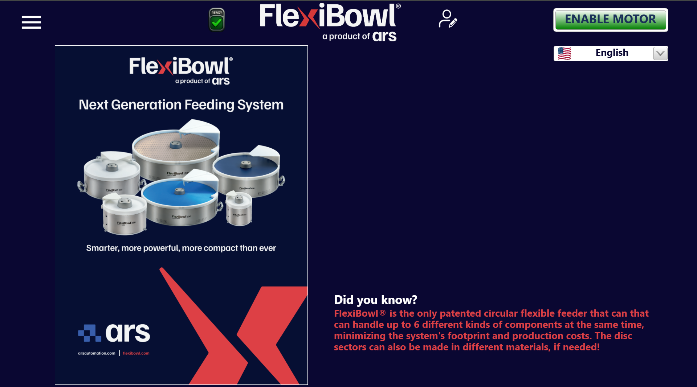

# [SOF] **Home**

## Panoramica

La pagina **Home** è la schermata principale dell'interfaccia software FlexiBowl®. Viene visualizzata all'avvio del sistema e fornisce all'operatore una panoramica immediata dello stato del dispositivo, oltre a consentire l'accesso alle funzioni principali.

| Elemento | Posizione | Descrizione |
|---|---|---|
| **Menu** (☰) | In alto a sinistra | Apre il menu laterale di navigazione principale, che consente di accedere a tutte le sezioni del software (parametri, diagnostica, storico, impostazioni, ecc.) |
| **Icona di stato** (READY ✓) | Centro-sinistra | Indica lo stato operativo corrente del sistema. L'icona verde con la spunta e la scritta **READY** segnala che il sistema è pronto per l'operazione |
| **Icona utente** | Centro-destra | Consente di gestire il profilo utente attivo (login, logout, cambio utente) |
| **Pulsante ENABLE MOTOR** | In alto a destra | Abilita il motore del FlexiBowl®. |
| **Selettore lingua** | Sotto ENABLE MOTOR | Menu a tendina per selezionare la lingua dell'interfaccia. Mostra la bandiera della lingua attiva (es. 🇺🇸 English) |

---

## Note operative

:::{attention}   
Prima di abilitare il motore, verificare che lo stato del sistema sia **READY** (icona verde visibile nella barra superiore). Se l'icona non è verde, controllare i messaggi di errore nelle sezioni di diagnostica.
:::

:::{note}  
La lingua selezionata dalla Home viene applicata a tutta l'interfaccia software. La modifica è immediata e non richiede il riavvio del sistema.
:::
