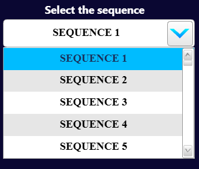
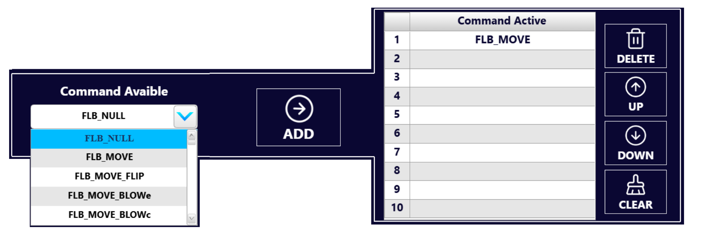

# [SOF] **Sequence**

## Panoramica

La pagina **Sequence** consente di creare, modificare e gestire sequenze operative personalizzate per il FlexiBowl®. Una sequenza è una lista ordinata di comandi che il sistema esegue in successione automatica, combinando movimenti di rotazione (MOVE), oscillazione (SHAKE), flip e soffio.

---

## Struttura dell'interfaccia

La pagina è organizzata in quattro aree principali:

| N° | Area | Posizione | Descrizione |
|---|---|---|---|
| 1 | [**Selezione sequenza**](seq) | In alto a sinistra | Menu a tendina per selezionare la sequenza attiva |
| 2 | [**Emptying Sequence**](empty) | In alto al centro | Toggle per attivare la modalità di svuotamento |
| 3 | [**Pannello Parametri**](param) | Sinistra | Parametri di MOVE, SHAKE e OPTION; aggiunta comandi alla sequenza |
| 4 | [**Pannello comandi**](comm) | Destra | Elenco ordinato dei comandi nella sequenza attiva e strumenti di gestione |

---
(seq)=
## 1. Selezione della sequenza

:::{important}
**Prima di qualsiasi operazione**, selezionare la sequenza da modificare tramite il menu a tendina **"Select the sequence"** in alto a sinistra.
:::

Il sistema supporta fino a **20 sequenze indipendenti** (SEQUENCE 1 – SEQUENCE 20), ognuna con la propria lista di comandi e parametri indipendenti. La sequenza selezionata diventa quella attiva su cui operano tutte le modifiche successive.

---
(empty)=
## 2. Emptying Sequence

Il toggle **Emptying Sequence** (in alto al centro, con bordo rosso) attiva una modalità speciale in cui la sequenza viene eseguita con l'obiettivo di svuotare il FlexiBowl® dai componenti presenti.

:::{warning}
Attivare **Emptying Sequence** solo quando si desidera rimuovere tutti i componenti dal FlexiBowl®. Questa modalità altera il comportamento della sequenza rispetto all'utilizzo normale.
:::

---
(param)=
## 3. Pannello dei Parametri

### Parametri MOVE

| Parametro | Valore esempio | Descrizione |
|---|---|---|
| **Acceleration Move** | 50 % | Rampa di accelerazione per il movimento di rotazione |
| **Deceleration Move** | 50 % | Rampa di decelerazione per il movimento di rotazione |
| **Speed Move** | 35 % | Velocità di rotazione del FlexiBowl® |
| **Angle Move** | 360 Degree | Angolo di rotazione percorso durante il comando MOVE |

### Parametri SHAKE

| Parametro | Valore esempio | Descrizione |
|---|---|---|
| **Acceleration Shake** | 50 % | Rampa di accelerazione durante lo shake |
| **Deceleration Shake** | 50 % | Rampa di decelerazione durante lo shake |
| **Speed Shake** | 50 % | Velocità di rotazione durante lo shake |
| **Ccw Angle Shake** | -45 Degree | Angolo di rotazione in senso antiorario durante ogni oscillazione |
| **Cw Angle Shake** | -30 Degree | Angolo di rotazione in senso orario durante ogni oscillazione |
| **Count Shake** | 2 N° | Numero di oscillazioni complete per ciclo di shake |

### Parametri OPTION (flip e blow)

| Parametro | Valore esempio | Descrizione |
|---|---|---|
| **Flip Pressure** | 5.00 Bar | Pressione dell'aria per l'attuazione del flip |
| **Flip Count** | 4 N° | Numero di flip eseguiti per ciclo |
| **Flip Delay** | 100 ms | Intervallo tra un flip e il successivo |
| **Blow Pressure** | 5.00 Bar | Pressione dell'aria per il soffiaggio |
| **Blow Time** | 200 ms | Durata dell'impulso di soffiaggio |

:::{note}
I parametri mostrati nel pannello sinistro si applicano ai comandi della sequenza. Prima di aggiungere un comando con **ADD**, verificare che i valori siano corretti: i parametri vengono associati al comando nel momento dell'inserimento.
:::

---
(comm)=
## 4. Pannello dei comandi
### Selezione e aggiunta di un comando

Il pannello centrale superiore contiene:

- Il menu a tendina **"Command Available"**: consente di selezionare il tipo di comando da aggiungere alla sequenza.
- Il pulsante **ADD** (freccia →): aggiunge il comando selezionato in coda alla lista dei comandi attivi.

I comandi disponibili sono:

| Comando | Descrizione |
|---|---|
| `FLB_NULL` | Comando nullo, nessuna azione eseguita |
| `FLB_MOVE` | Rotazione del FlexiBowl® secondo i parametri MOVE |
| `FLB_MOVE_FLIP` | Rotazione combinata con flip |
| `FLB_MOVE_BLOWe` | Rotazione combinata con soffiaggio esterno |
| `FLB_MOVE_BLOWc` | Rotazione combinata con soffiaggio centrale |
| *(altri comandi)* | *(da completare)* |

:::{tip}
Selezionare il comando desiderato dal menu a tendina prima di premere **ADD**. Il comando verrà inserito nella prima riga libera della lista **Command Active**.
:::

La tabella **Command Active** mostra la sequenza di comandi nell'ordine di esecuzione, numerati da 1 a 10.

Nell'esempio visualizzato, la sequenza contiene un solo comando:

| N° | Comando |
|---|---|
| 1 | FLB_MOVE |
| 2–10 | *(vuoto)* |

### Strumenti di gestione della lista

| Pulsante | Funzione |
|---|---|
| **DELETE** | Elimina il comando selezionato dalla lista |
| **UP** | Sposta il comando selezionato di una posizione verso l'alto |
| **DOWN** | Sposta il comando selezionato di una posizione verso il basso |
| **CLEAR** | Cancella tutti i comandi presenti nella lista |

:::{warning}
Il pulsante **CLEAR** rimuove **tutti** i comandi dalla sequenza senza possibilità di recupero. Utilizzarlo con cautela.
:::

---

## 5. Esecuzione della sequenza

In basso a destra sono presenti due pulsanti di esecuzione:

| Pulsante | Campo affiancato | Funzione |
|---|---|---|
| **TEST SEQUENCE** | Tempo esecuzione (ms) | Esegue la sequenza una volta sola. Il campo a destra mostra la durata totale dell'ultima esecuzione in millisecondi |
| **RUN** | — | Avvia la sequenza in modalità operativa continua (loop), in attesa dei trigger del sistema di visione |

:::{note}
Il campo **ms** affiancato a **TEST SEQUENCE** indica il tempo totale di esecuzione della sequenza completa. Nell'esempio mostrato il valore è **1140 ms**. Questo dato è utile per la sincronizzazione con il sistema di visione artificiale.
:::

:::{important}
Prima di premere **RUN**, verificare che:
- Il motore sia abilitato (**ENABLE MOTOR** attivo)
- Lo stato del sistema sia **READY**
- La sequenza contenga almeno un comando valido nella lista **Command Active**
:::
