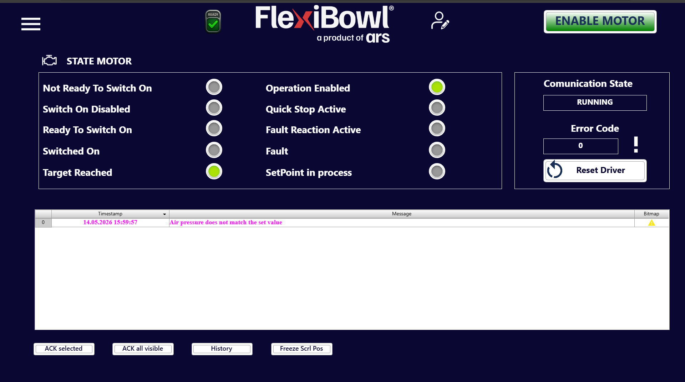

# [SOF] **Monitor**

## Panoramica

La pagina **Monitor** fornisce una visione in tempo reale dello stato del motore e del sistema di comunicazione, e registra tutti gli eventi e gli allarmi generati durante il funzionamento del FlexiBowl®. È la pagina di riferimento per la diagnostica e il troubleshooting.

---

## Sezione STATE MOTOR

Il pannello **STATE MOTOR** mostra lo stato operativo corrente del driver motore tramite una serie di indicatori luminosi (LED virtuali).     
Ogni LED può essere:      
🟢 **Verde** : stato attivo     
⚫ **Grigio** : stato inattivo  

### Indicatori di stato

| Indicatore | Descrizione |
|---|---|
| **Not Ready To Switch On** | Il driver non è pronto per l'abilitazione  |
| **Switch On Disabled** | L'abilitazione del motore è bloccata  |
| **Ready To Switch On** | Il driver è pronto per ricevere il comando di abilitazione |
| **Switched On** | Il motore è alimentato ma non ancora in controllo attivo |
| **Target Reached** | Il FlexiBowl® ha raggiunto la posizione o il setpoint di destinazione |
| **Operation Enabled** | Il motore è abilitato e operativo |
| **Quick Stop Active** | Arresto rapido del motore richiesto |
| **Fault Reaction Active** | Il driver sta eseguendo la procedura di reazione a un fault |
| **Fault** | È presente un fault attivo sul driver motore |
| **SetPoint in process** | Il sistema sta elaborando o raggiungendo un nuovo setpoint di posizione |

:::{note}
Durante il normale funzionamento operativo, i LED **Operation Enabled** e **Target Reached** devono risultare verdi. Qualsiasi altro LED verde indica una condizione anomala che richiede attenzione.
:::

---

## Sezione Communication State

Il pannello laterale destro mostra lo stato della comunicazione tra il software e il driver motore.

| Campo | Valore esempio | Descrizione |
|---|---|---|
| **Communication State** | `RUNNING` | Indica che la comunicazione con il driver è attiva e funzionante |
| **Error Code** | `0` | Codice di errore restituito dal driver. Il valore `0` indica assenza di errori |

### Pulsante Reset Driver

Il pulsante **Reset Driver** esegue un reset del driver motore, utile per uscire da uno stato di fault o per reinizializzare la comunicazione.

:::{warning}
Premere **Reset Driver** solo dopo aver identificato e risolto la causa del fault. Eseguire il reset senza aver eliminato la causa del problema potrebbe comportare la ripetizione dell'errore o danni al sistema.
:::

---

## Log degli eventi (tabella messaggi)

La tabella centrale registra in tempo reale tutti gli eventi, gli allarmi e i messaggi di sistema generati durante il funzionamento.

### Colonne della tabella

| Colonna | Descrizione |
|---|---|
| **Timestamp** | Data e ora dell'evento nel formato `GG.MM.AAAA HH:MM:SS` |
| **Message** | Descrizione testuale dell'evento o dell'allarme |
| **Bitmap** | Icona che indica la tipologia dell'evento (⚠️ warning, ❌ errore, ecc.) |

### Esempio di messaggio

| # | Timestamp | Message | Bitmap |
|---|---|---|---|
| 0 | 14.05.2026 15:59:57 | Air pressure does not match the set value | ⚠️ |

:::{warning}
Il messaggio **"Air pressure does not match the set value"** indica che la pressione dell'aria rilevata dal sistema non corrisponde al valore impostato nei parametri. Verificare l'alimentazione pneumatica e controllare i valori di **Flip Pressure** e **Blow Pressure** nella pagina **Main Command > OPTION**.
:::

:::{tip}
I messaggi di warning sono visualizzati in **rosso** nella colonna Timestamp e in **arancione** nella colonna Message, per facilitarne il riconoscimento immediato anche in presenza di molte righe nel log.
:::

---

## Pulsanti di gestione del log

| Pulsante | Funzione |
|---|---|
| **ACK selected** | Conferma il messaggio selezionato nella tabella, marcandolo come preso in carico |
| **ACK all visible** | Conferma tutti i messaggi attualmente visibili nella tabella |
| **History** | Apre la cronologia completa degli eventi registrati dal sistema |
| **Freeze Scrl Pos** | Blocca lo scorrimento automatico della tabella, consentendo di esaminare i messaggi precedenti senza che la vista si sposti verso i nuovi eventi |

:::{note}
È buona pratica effettuare l'**ACK** degli allarmi solo dopo aver verificato e risolto la condizione che li ha generati, non per sopprimere la notifica senza intervenire.
:::
