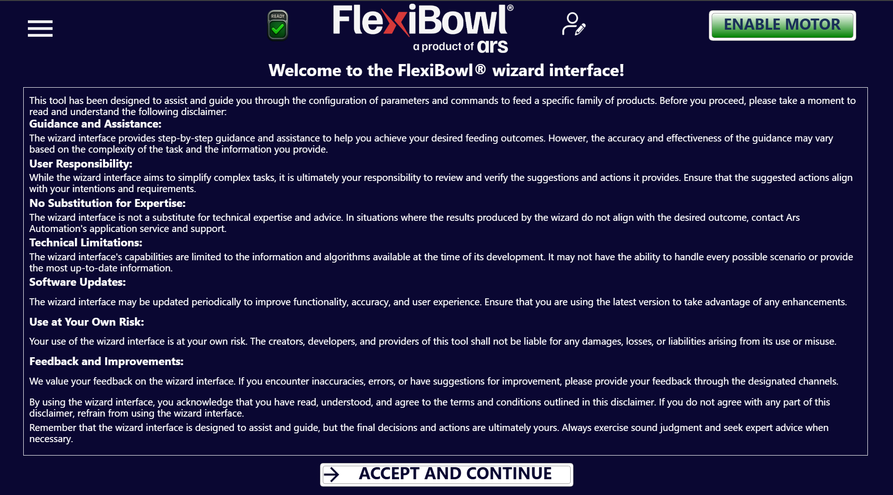

# [SOF] **Wizard**
L'interfaccia **FlexiBowl® Wizard** è uno strumento interattivo progettato per guidare l'utente nella configurazione dei parametri di alimentazione in base alla specifica famiglia di prodotti da gestire.



## Step 0: Accesso al Wizard

:::{list-table}
* - **1**
  - Per accedere alla configurazione guidata dei parametri FlexiBowl®, è sufficiente cliccare sulla pagina **Wizard** nel menu laterale. 
:::

:::{note}
Il modello e il senso di trotazione del FlexiBowl® vengono automaticamente rilevati dal software. 
:::

## Step 1: Caratterizzazione del Componente

Il sistema richiede informazioni sulla morfologia dei pezzi per ottimizzare la separazione.
````{list-table}
* - **2**
  - Selezionare la dimensione del componente:**

    **Per Modelli FlexiBowl 200, 350, 500, 650:**

    :::{card}
    <= 150mm
    :::

    :::{card}
    &gt; 150mm
    :::

    **Per Modelli FlexiBowl 800 e 1200:**

    :::{card}
    <= 250mm
    :::

    :::{card}
    &gt; 250mm
    :::

* - **3**
  - Selezionare la geometria che meglio descrive il componente:
      * **FLAT**: Componenti piatti.
      * **CYLINDRICAL**: Componenti cilindrici.
      * **COMPLEX**: Geometrie articolate o irregolari

      

      *Esempi di geometrie: Flat, Cylindrical e Complex.*

* - **4**
  - Definire come i componenti interagiscono tra loro sulla superficie:
      * **Overlapping**: I pezzi tendono a sovrapporsi.
      * **Not Overlapping**: I pezzi non si sovrappongono.
      * **Tangling / Stacking**: I pezzi tendono ad agganciarsi o impilarsi.
      * **Not Tangling / Not Stacking**: I pezzi rimangono separati e non si incastrano.

      

      *Not Overlapping: i pezzi non si sovrappongono sulla superficie.*

      ::::{grid} 2
      :::{grid-item}
      

      *Stacking: i pezzi si impilano.*
      :::
      :::{grid-item}
      

      *Tangling: i pezzi si agganciano tra loro.*
      :::
      ::::
````
## Step 2: Test degli Accessori
```{list-table}
* - **5**
  - Selezionare dal menu a tendina se il FlexiBowl® è equipaggiato con il modulo **Air-blow**.
* - **6**
  - Cliccare su **TEST Air-blow** per verificare il funzionamento.
* - **7**
  - Selezionare **USE** per abilitarlo nell'applicazione corrente, altrimenti cliccare su **DON'T USE**.
* - **8**
  - Cliccare su **TEST FLIP** per verificare l'effettiva attivazione del percussore.
      Il "Flip" è l'unità che genera l'impulso meccanico per ribaltare i pezzi, è fondamentale per separare, districare o capovolgere i componenti durante il ciclo di alimentazione.
 
      :::{important}
      Se l'impulso non è avvertibile, verificare che l'aria compressa sia collegata e agire sul regolatore di pressione meccanico posto sul pannello di controllo.
      :::
* - **9**
  - Al termine del Wizard, cliccando su **FINISH**, il sistema calcolerà automaticamente i parametri: 
    - Parametri di movimento (velocità, accelerazione, angolo)
    - Parametri di scuotimento (shake)
    - Temporizzazioni accessori (flip, blow)
* - **10**
  - Sarà quindi possibile affinarli nella dashboard riassuntiva.
```
```{list-table} Panoramica Parametri
   :widths: 20 30 50
   :header-rows: 1

   * - Gruppo
     - Parametro
     - Descrizione
   * - **Move**
     - Accel, Decel, Speed, Angle
     - Parametri del movimento principale del disco.
   * - **Option**
     - Flip Count, Flip Delay, Blow Time
     - Gestione dei tempi di attivazione degli accessori.
   * - **Shake**
     - Accel, Speed, Angle CW/CCW
     - Parametri della vibrazione di scuotimento (separazione).
```

## Step 3: Validazione della Sequenza

Utilizzare la funzione **...** per verificare che il ciclo rispetti i seguenti criteri di efficienza:
```{list-table}
:widths: 5 95
:header-rows: 0

* - **Sincronizzazione**
  - L'impulso di Flip deve terminare esattamente nello stesso istante in cui termina il movimento (*Move*). Regolare i valori di *Flip Count* e *Delay* per allinearli.

* - **Stabilità Immagine**
  - I componenti devono essere immobili al momento dello scatto della camera.
    - Se i pezzi si muovono, diminuire velocità/accelerazione o inserire una pausa (es. `pause 200ms`).

* - **Posizionamento dei pezzi durante la sequenza**
  - Durante il movimento, i pezzi devono essere convogliati verso il centro del raggio del FlexiBowl® per massimizzare l'efficacia del Flip. Al termine della sequenza, i pezzi devono disporsi approssimativamente al centro dell'area di visione.
```

:::{warning}
Cliccare sempre su **Synchronize Parameters** dopo ogni modifica manuale per rendere attive le variazioni nel controller.
:::
