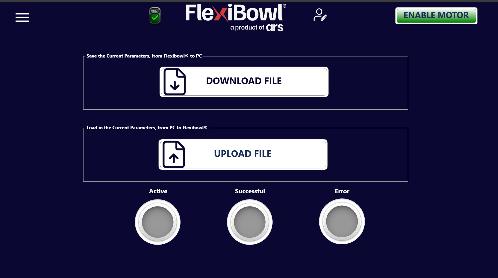

# [SOF] **File Transfer**

## Panoramica

La pagina **File Transfer** consente di esportare e importare la configurazione completa dei parametri del FlexiBowl®, trasferendo i dati tra il sistema e un PC. È la funzione dedicata al backup e al ripristino della configurazione operativa.

---

## Funzioni disponibili

### DOWNLOAD FILE — Salvataggio parametri (FlexiBowl® → PC)

Il pannello superiore, etichettato **"Save the Current Parameters, from FlexiBowl® to PC"**, consente di esportare in un file tutti i parametri attualmente configurati nel sistema.

Premendo il pulsante **DOWNLOAD FILE** il software genera un file di configurazione e lo rende disponibile per il salvataggio sul PC collegato.

:::{tip}
Eseguire un **DOWNLOAD FILE** prima di ogni modifica significativa ai parametri operativi. Il file scaricato costituisce un backup completo della configurazione e permette di ripristinare rapidamente lo stato precedente in caso di errore.
:::

---

### UPLOAD FILE — Caricamento parametri (PC → FlexiBowl®)

Il pannello inferiore, etichettato **"Load in the Current Parameters, from PC to FlexiBowl®"**, consente di importare nel sistema un file di configurazione precedentemente salvato.

Premendo il pulsante **UPLOAD FILE** si apre il selettore file del sistema operativo. Una volta selezionato il file, i parametri vengono caricati nel FlexiBowl® e applicati immediatamente.

:::{warning}
Il caricamento di un file di configurazione **sovrascrive tutti i parametri correnti** del sistema. Assicurarsi che il file selezionato sia compatibile con il modello di FlexiBowl® in uso e con la versione software installata prima di procedere.
:::

:::{warning}
Non spegnere il sistema e non interrompere la connessione durante il trasferimento del file. Un'interruzione durante l'upload potrebbe causare una configurazione incompleta o corrotta.
:::

---

## Indicatori di stato del trasferimento

In fondo alla pagina sono presenti tre indicatori luminosi (LED virtuali) che segnalano l'esito dell'operazione di trasferimento.

| Indicatore | Colore attivo | Descrizione |
|---|---|---|
| **Active** | 🟡 Giallo ?? | Il trasferimento è in corso |
| **Successful** | 🟢 Verde | Il trasferimento si è completato correttamente |
| **Error** | 🔴 Rosso | Si è verificato un errore durante il trasferimento |

:::{note}
Durante un'operazione di download o upload, attendere che il LED **Successful** si illumini prima di procedere con altre operazioni. Se si illumina il LED **Error**, verificare la connessione al PC e ripetere l'operazione.
:::
