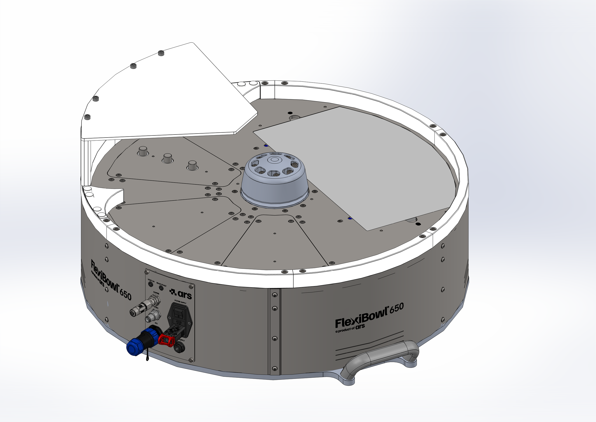
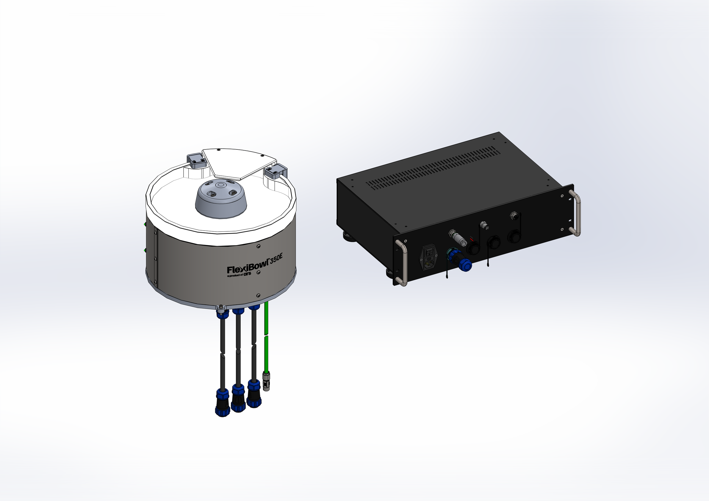
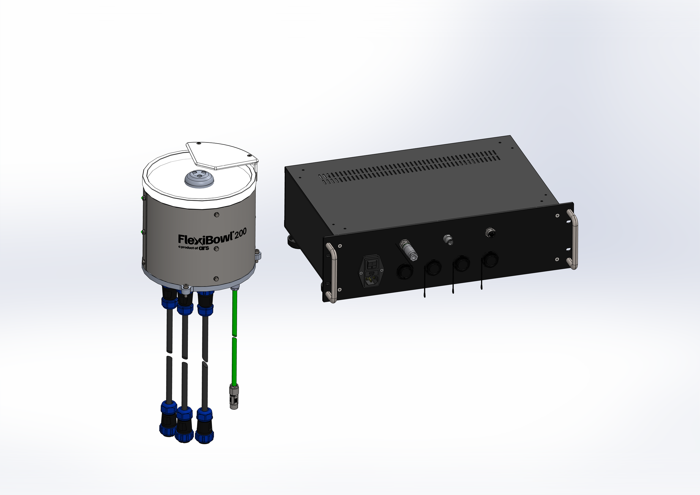

(panoramica)=
# **Overview and Unboxing**

## Main components of the FlexiBowl®

The FlexiBowl® is composed of the following fundamental parts:

:::{raw} html

<!-- Tab bar -->

  <button class="fb-tab on"    onclick="fbSwitchTab('fb200',this)">FB200</button>
  <button class="fb-tab"    onclick="fbSwitchTab('fb350',this)">FB350</button>
  <button class="fb-tab" onclick="fbSwitchTab('fb650',this)">FB500-650-800-1200</button>

<!-- ══════════ FB650 ══════════ -->

  

    

      
      
      

      
Select a component from the list

    

    

      
No.ComponentDescription

      

    

  

<!-- ══════════ FB350 ══════════ -->

  

    

      
      
      

      
Select a component from the list

    

    

      
No.ComponentDescription

      

    

  

<!-- ══════════ FB200 ══════════ -->

  

    

      
      
      

      
Select a component from the list

    

    

      
No.ComponentDescription

      

    

  

:::

## What is in the box?
