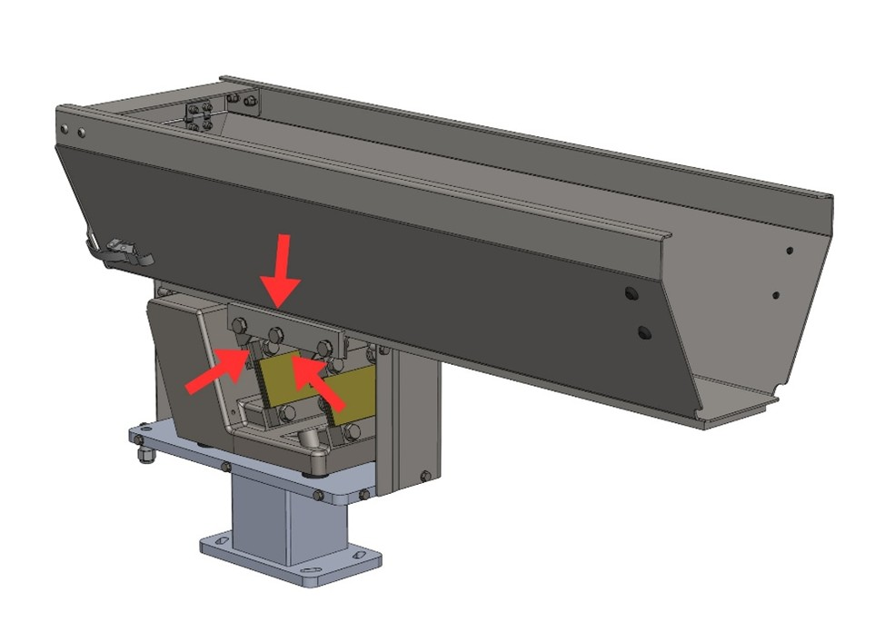

# **Maintenance and Troubleshooting**

:::{warning}
Eseguire le operazioni di manutenzione quando la macchina è spenta.
:::

:::{warning}
Le operazioni di manutenzione devono essere eseguite da personale qualificato ed autorizzato.
::: 

La manutenzione della macchina comprende gli interventi (ispezione, verifica, controllo, regolazione e sostituzione) che si rendono necessari in seguito al normale uso.

**Linee guida per una corretta manutenzione:**

  
  

    

    

      Componenti
      
Servirsi soltanto di ricambi originali, di attrezzi adatti allo scopo ed in buono stato.

    

  

  

    

    

      Frequenze d'intervento
      
Rispettare le scadenze indicate nel manuale per la manutenzione programmata (preventiva e periodica). La distanza temporale o i cicli di lavoro tra un intervento e l'altro sono da intendersi come valore massimo accettabile e non devono essere superati.

    

  

  

    

    

      Monitoraggio preventivo
      
Verificare prontamente la causa di eventuali anomalie quali rumorosità eccessiva, surriscaldamenti, trafilamenti di fluidi, ecc.

    

  

  

    

      Tempestività
      

        Una rimozione immediata delle cause di anomalia o malfunzionamento evita ulteriori danni alle apparecchiature e garantisce la sicurezza degli operatori.
      

    

  

Il personale addetto deve essere ben addestrato e avere un'approfondita conoscenza delle norme antinfortunistiche. Il personale non autorizzato deve rimanere all'esterno dell'area di lavoro durante le operazioni. 

Le attività di pulizia e regolazione vengono effettuate solo ed esclusivamente in fase di manutenzione, a macchina ferma, de-energizzata e con quadro elettrico sezionato.

:::{important}
In caso di dubbi è vietato operare. Interpellare il Costruttore per i necessari chiarimenti.
:::

:::{attention}
Gli interventi di riparazione o di manutenzione non contenuti nel presente manuale possono essere eseguiti soltanto previa autorizzazione di ARS S.r.l.
Nessuna responsabilità relativa a danni a persone o cose può essere attribuita a ARS S.r.l. per interventi diversi da quelli descritti od eseguiti con modalità diverse da quelle indicate.
:::

### Classificazione operativa delle manutenzioni

| Tipo manutenzione | Descrizione |
| :--- | :--- |
| **Manutenzione ordinaria** | Operazioni preventive per garantire il buon funzionamento della macchina nel tempo (ispezione, controllo, regolazione, pulizia e lubrificazione). |
| **Manutenzione straordinaria** | Interventi correttivi al bisogno (revisione, riparazione, ripristino delle condizioni nominali o sostituzione di un gruppo guasto, difettoso o usurato). |

---

## Avvertenze di Sicurezza 

:::{attention} 
Prima di iniziare qualsiasi intervento di manutenzione sulla macchina, sezionare e lucchettare tutte le fonti energetiche, e mettere in condizione di blocco in sicurezza i gruppi mobili che la compongono. Apporre il cartello “Macchina in manutenzione - non inserire l’alimentazione” presso l’interruttore generale.
:::

:::{attention}
Quando la macchina è in manutenzione, per evitare che questa possa essere messa in funzione accidentalmente, apporre cartelli con la dicitura: “ATTENZIONE! Macchina In Manutenzione”.
:::

  

    

      

      

        DPI
        
I manutentori devono obbligatoriamente indossare tutti i dispositivi di protezione individuale necessari (guanti, occhiali, tute) all'attività da effettuare.

      

    

    

      

      

        Segnalazione
        
Se l'operazione prevede la rimozione di protezioni, transennare la zona di intervento e segnalare il divieto di accesso alle persone estranee.

      

    

    

      

      

        Verifica disconnessione
        
Prima di procedere a qualunque attività, verificare l'effettiva disconnessione delle fonti energetiche (corrente elettrica, aria compressa, energia idraulica, ecc.).

      

    

    

      

        Competenza
        
Il manutentore deve eseguire solo le operazioni di propria competenza (Meccanica, Elettrica, Fluidica) per le quali è esplicitamente autorizzato, utilizzando la strumentazione idonea alla ricerca guasti.

      

    

  

---

## Manutenzione Ordinaria 

La manutenzione ordinaria tiene sotto controllo le condizioni meccaniche e la pulizia della macchina. Le periodicità indicate si riferiscono a condizioni di funzionamento normali. 

:::{important}
Per quanto riguarda la manutenzione ordinaria delle macchine provenienti da fornitori esterni, si rimanda ai manuali dei sub-fornitori allegati.
::: 

:::{important}
Nel fissaggio delle viti utilizzare sempre LOCTITE 243 per garantire un perfetto serraggio anti-vibrante.
:::

### Controlli e verifiche

#### Tabella di manutenzione ordinaria – Controlli

| Operazione | Giornaliera | Settimanale | Mensile | Semestrale | Annuale |
| :--- | :---: | :---: | :---: | :---: | :---: |
| Controllo stato della vasca prima di ogni avviamento | ◈ | | | | |
| Controllo stato di usura dei relè | | | |  | ◈ |
| Controllo corretto funzionamento dei fusibili | | | |  | ◈ |
| Controllo stato di usura delle balestre | | | | ◈ |  |
| Controllo corretto funzionamento dell'elettromagnete | | | | ◈ |  |
| Controllo usura rivestimento in poliuretano *(ove presente)* | | | ◈ | |  |

#### Verifica dispositivi di sicurezza

Per la verifica dell'integrità dei sistemi di protezione, eseguire i seguenti passi:

  

    
1

    

      Verificare che siano presenti e correttamente fissate tutte le cover e i carter della macchina.
    

  

  

    
2

    

      Verificare che il cavo di alimentazione elettrica non presenti danneggiamenti, tagli o segni di usura superficiale.
    

  

#### Pulizia

:::{attention} 
Le operazioni di pulizia devono essere eseguite solo da personale qualificato e autorizzato.
:::

:::{attention} 
Per pulire la macchina, non utilizzare frammenti di spugna, panni umidi e/o abrasivi, stracci filamentosi, benzina o solventi infiammabili come detergente.
:::

:::{attention} 
Non usare acidi o solventi chimici aggressivi per pulire la base della tramoggia.
:::

:::{important}
Usare prodotti delicati e non abrasivi, come sgrassatori neutri o comune sapone domestico. Per rimuovere frammenti e polveri, usare un pennello avendo cura di indossare gli occhiali protettivi.
:::

#### Tabella di manutenzione ordinaria – Pulizia

| Operazione | Giornaliera | Settimanale | Mensile | Semestrale | Annuale |
| :--- | :---: | :---: | :---: | :---: | :---: |
| Rimozione residui e scarti di processo dalla superficie vasca | ◈ | | | | |
| Rimozione grasso e olio con prodotti o solventi neutri | ◈ |  | | | |
| Pulizia generale della macchina | | ◈ |  | | |

#### Procedura di pulizia generale

  

    
1

    

      Disconnettere completamente l'alimentazione elettrica dalla macchina.
    

  

  

    
2

    

      Rimuovere manualmente eventuali residui di prodotto accumulati.
    

  

  

    
3

    

      Rimuovere lo sporco localizzato utilizzando solventi commerciali non infiammabili e non tossici.
    

  

  

    
4

    

      Utilizzare, se necessario, un aspiratore per rimuovere i residui minuti presenti sulla superficie rotante.
    

  

  

    
5

    

      Ristabilire, una volta terminata la pulizia, i collegamenti della macchina.
    

  

:::{important}
La pulizia generale della macchina deve essere effettuata ogni qual volta viene sostituito il tipo di componente da lavorare, in modo da eliminare residui contaminanti della lavorazione precedente.
:::

---

## Manutenzione Straordinaria

:::{attention} 
La manutenzione straordinaria e la riparazione della macchina sono riservate ai tecnici qualificati, istruiti ed autorizzati, dipendenti dal Costruttore o dal centro assistenza autorizzato.
:::

Se accadono eventi eccezionali che richiedono interventi straordinari, i manutentori interni dell’utilizzatore devono:
1. Verificare con precisione lo stato dei gruppi danneggiati o sfasati.
2. Eseguire esclusivamente le operazioni descritte in questo paragrafo se autorizzati.
3. Se le operazioni non sono contemplate in questo manuale, trasmettere al Costruttore una relazione dettagliata dei fatti, l'esito dell'ispezione e le osservazioni rilevate.

:::{attention} 
Le parti di ricambio da sostituire devono essere ordinate direttamente a ARS S.r.l. Nel caso in cui non vengano utilizzati ricambi originali o autorizzati per iscritto, il Costruttore declina ogni responsabilità sul funzionamento della macchina e sulla sicurezza degli operatori.
:::

:::{attention} 
Disconnettere l’alimentazione elettrica e pneumatica prima di procedere con qualsiasi operazione di manutenzione straordinaria o prima di rimuovere le cover di protezione.
:::

:::{important}
Nel serraggio delle viti utilizzare sempre frenafiletti LOCTITE 243 per garantire la tenuta meccanica.
:::

### Regolazione traferro

Il traferro è la distanza fisica che intercorre tra il nucleo ed il contro-nucleo; una regolazione millimetrica è fondamentale:
* **Traferro troppo stretto:** Le superfici del nucleo e del contro-nucleo entrano in contatto meccanico durante il funzionamento, provocando il "battito".
* **Traferro troppo largo:** La corrente elettrica del vibratore può salire a livelli critici, provocando la bruciatura dell’avvolgimento e il danneggiamento dei componenti interni del controller.

:::{attention}
Non far funzionare in nessun caso il vibratore qualora si verifichi una delle due condizioni sopra descritte.
:::

:::{important}
Il traferro viene opportunamente tarato in fabbrica; interventi di regolazione si rendono necessari solo in caso di manipolazioni improprie o applicazioni di sovratensioni.
:::

| Dati operativi | Specifiche di intervento |
| :--- | :--- |
| **Qualifica operatore** | Manutentore meccanico |
| **Utensili da utilizzare** | Chiave a forchetta |

#### Procedura di regolazione del traferro

  

    
1

    

      Allentare il controdado di bloccaggio <strong>(Dado 2)</strong>.
    

  

  

    
2

    

      Avvitare la <strong>Vite 1</strong> operando in senso orario fino a portarla a fine corsa, ossia in battuta meccanica contro il contro-nucleo.
    

  

  

    
3

    

      Svitare la <strong>Vite 1</strong> operando in senso antiorario: fare riferimento alla tabella sottostante per identificare il valore corretto e far compiere alla vite il numero di giri e frazioni necessari per impostare la distanza corretta.
    

  

  

    
4

    

      Serrare a fondo il <strong>Dado 2</strong> per assicurare la stabilità della vite di regolazione 1.
    

  

:::{note} 
 La regolazione del traferro è un'operazione di precisione che può richiedere verifiche ripetute per ottenere il settaggio ideale.
:::

#### Tabella tecnica di riferimento traferro

| Modello | Dimensione magnete | Traferro richiesto | Rotazione vite di regolazione |
| :---: | :---: | :---: | :---: |
| **1,5lt** | Ø21 | 1,5 mm | 360° (1 giro completo) |
| **3lt** | Ø24 | 2 mm | 480° (1 giro + 1/3) |
| **5lt** | Ø28 | 3 mm | 720° (2 giri completi) |
| **10lt** | Ø28 | 3 mm | 720° (2 giri completi) |
| **20lt** | Ø28 | 3 mm | 720° (2 giri completi) |
| **40lt** | 32x30 | 3 mm | 720° (2 giri completi) |

### Sostituzione balestre

| Dati operativi | Specifiche di intervento |
| :--- | :--- |
| **Qualifica operatore** | Manutentore meccanico |
| **Utensili da utilizzare** | Chiave a forchetta |

La modifica del dimensionamento del pacco balestre (numero e spessore dei fogli) serve a variare ed adeguare la portata utile del vibratore.

#### Procedura di sostituzione delle balestre

  

    
1

    

      Operare su un singolo pacco balestre alla volta, iniziando tassativamente da quello posizionato sul lato posteriore.
    

  

  

    
2

    

      Annotare o fotografare l'esatta posizione e l'ordine di sequenza di ogni balestra, distanziale e morsetto di ritenuta.
    

  

  

    
3

    

      Rimuovere i bulloni di ancoraggio meccanico alla base e, successivamente, i bulloni di fissaggio al ponte del canale vibrante.
    

  

  

    
4

    

      Sostituire gli elementi usurati o fessurati con ricambi originali.
    

  

  

    
5

    

      Ricomporre il pacco balestre seguendo esattamente l'ordine inverso rispetto allo smontaggio.
    

  

  

    
6

    

      Serrare tutte le viti applicando la coppia di serraggio stabilita nella tabella seguente.
    

  

#### Tabella tecnica balestre e coppie di serraggio

| Modello | Dimensione balestre | Spessore fogli | Coppia di serraggio e filettatura |
| :---: | :---: | :---: | :--- |
| **1,5lt** | 40x48 mm | 1 - 1,5 - 2 mm | 7,5 N·m – M5 |
| **3lt** | 40x48 mm | 1 - 1,5 - 2 mm | 7,5 N·m – M5 |
| **5lt** | 70x82 mm | 1,5 - 2 mm | 30 N·m – M8 |
| **10lt** | 70x82 mm | 1,5 - 2 mm | 30 N·m – M8 |
| **20lt** | 70x82 mm | 1,5 - 2 mm | 30 N·m – M8 |
| **40lt** | 80x91 mm | 1,5 - 2 - 2,5 mm | 70 N·m – M10 |

### Sostituzione vasca

| Dati operativi | Specifiche di intervento |
| :--- | :--- |
| **Qualifica operatore** | Manutentore meccanico |
| **Utensili da utilizzare** | Chiave a forchetta |

#### Procedura di smontaggio e montaggio vasca

  

    
1

    

      Sostenere saldamente la vasca per evitarne la caduta libera.
    

  

  

    
2

    

      Svitare completamente tutte le viti di fissaggio dei due carter di protezione laterali e rimuoverli.
    

  

  

    
3

    

      Allentare i bulloni di tenuta inferiori della struttura della vasca.
    

  

  

    
4

    

      Estrarre con cautela la vasca originale dalla propria sede.
    

  

  

    
5

    

      Posizionare la nuova vasca di ricambio verificando gli allineamenti.
    

  

  

    
6

    

      Serrare saldamente le viti di bloccaggio strutturale.
    

  

  

    
7

    

      Riassemblare i due carter protettivi, avendo l'avvertenza di rimontare per ultimo quello dotato di lembi piegati.
    

  

:::{attention}
Nel caso di modelli personalizzati i componenti potrebbero differire, parzialmente o totalmente, da quelli indicati. Per modelli di questo genere è necessario fare riferimento al fascicolo tecnico di progetto.
:::

---

## Troubleshooting

:::{attention}
Durante il normale funzionamento il vibratore deve operare silenziosamente. Se dovesse verificarsi un rumore cupo causato da un battito interno, spegnere immediatamente il sistema.
:::

In caso di battito, controllare e ripristinare il traferro ottimale: se le superfici sono troppo vicine impatteranno meccanicamente; se troppo distanti, l'innalzamento anomalo di corrente brucerà gli avvolgimenti dello statore.

| Sintomo riscontrato | Possibile causa radice | Azione correttiva richiesta |
| :--- | :--- | :--- |
| **Il vibratore funziona troppo lentamente** | La tensione di alimentazione è al di sotto della soglia nominale. | Incrementare la tensione elettrica fino al valore corretto di targa. |
| | L'unità entra in contatto con oggetti rigidi esterni o strutture adiacenti. | Ripristinare i giochi fisici isolando l'unità vibrante (3-5 cm). |
| | L'oscillazione dei pacchi balestre è ostacolata o frenata da accumuli. | Smontare, pulire a fondo ed eliminare i residui dai pacchi balestre. |
| | Le balestre presentano cricche, difetti o snervamento strutturale. | Provvedere alla sostituzione immediata del set balestre. |
| | Il canale vibrante è incrinato o usurato meccanicamente. | Sostituire il canale. |
| **Il vibratore funziona troppo velocemente** | La tensione di alimentazione supera i limiti nominali *(Causa prima di battito)*. | Stabilizzare e ridurre la tensione di alimentazione al valore di targa. |
| **L'unità emette rumore (ronzio) ma non vibra** | La scheda elettronica di regolazione all'interno della cassetta è difettosa. | Sostituire la scheda elettronica del controller. |
| **L'unità non si attiva e non risponde** | Mancanza totale di alimentazione elettrica in ingresso al Controller. | Ispezionare la linea e rimuovere eventuali interruzioni elettriche. |
| | L'interruttore magnetotermico o il fusibile di protezione sono interrotti. | Provvedere alla sostituzione dei fusibili o al riarmo. |
| | La scheda elettronica interna alla cassetta di controllo è danneggiata. | Sostituire la scheda elettronica. |
| | L'avvolgimento interno del vibratore è bruciato o scarica a massa. | Sostituire il gruppo elettromagnete. |
| | L'avvolgimento è in corto circuito interno. | Sostituire l'avvolgimento. |
| | L'avvolgimento del reostato di regolazione risulta aperto. | Sostituire il componente guasto. |

