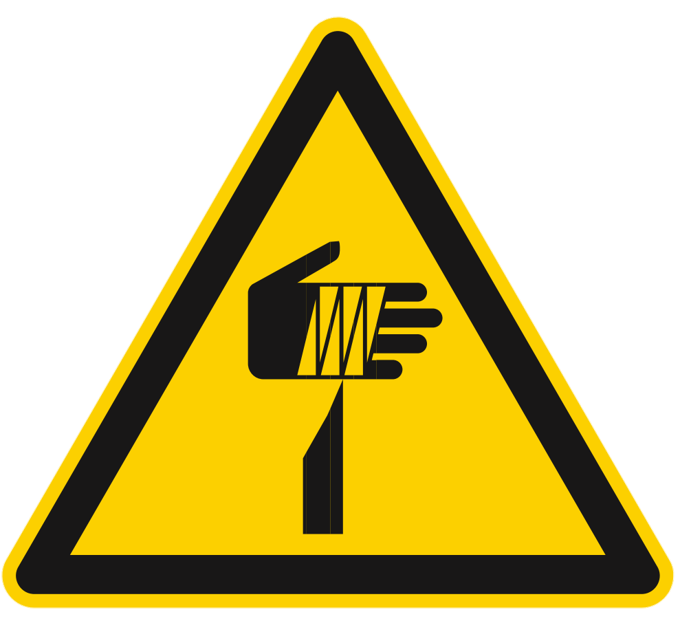

# **Información de seguridad**

Le seguenti istruzioni di sicurezza, precauzioni generali e norme relative alla movimentazione e all'ambiente operativo devono essere scrupolosamente rispettate per garantire la sicurezza del personale, l'integrità del prodotto e il corretto funzionamento dell'impianto.

```{warning}
**Responsabilità dell'utente**

Il rispetto di tutte le norme di sicurezza riportate in questa sezione è obbligatorio e di responsabilità dell'utilizzatore finale. Il mancato rispetto può causare danni a persone, apparecchiature o compromettere il funzionamento del sistema.
```

---

## Area di sicurezza dell'operatore

Le zone intorno alla macchina vengono suddivise nel seguente modo: 

:::{list-table}
:widths: 20 60
:header-rows: 1

* - Termine
  - Descrizione

* - Zone di comando 
  - Sono le zone in cui l’utilizzatore e gli altri operatori possono eseguire le operazioni di comando e controllo delle funzioni cicliche della macchina (“postazione di guida”), sia in automatico che in semiautomatico, agendo sugli appositi pannelli di comando o per l’esecuzione delle operazioni manuali. 

* - Zone di manutenzione/regolazione 
  - Sono le zone in cui i manutentori meccanici possono eseguire le operazioni di manutenzione o regolazione. Queste zone sono considerate a rischio e non accessibili durante il normale funzionamento della macchina. Gli operatori devono essere perfettamente a conoscenza delle avvertenze riguardante la sicurezza e dei dispositivi individuali da indossare. 

* - Zone pericolose
  - Sono considerate tali tutte le zone all’interno (o circostanti) alla macchina con la presenza di rischi residui che possono provocare danni alle persone. In queste zone è vietato l’accesso a chiunque, durante il funzionamento della macchina. 

:::

I pericoli ed i rischi esistenti in queste zone sono protetti, per quanto possibile, con ripari (carter, portelli) e con dispositivi di sicurezza (sensori, microinterruttori, barriere fotoelettriche) che, in caso di attivazione, provvedono ad un totale arresto della macchina stessa. Tuttavia, quando la macchina è in funzione, è assolutamente vietato operare nelle zone pericolose in quanto alcuni rischi potrebbero non essere stati totalmente annullati.

(dpi)=
## Dispositivi di protezione individuale (D.P.I.)

Quando si opera vicino al FlexiBowl®, sia per le operazioni di montaggio, che per quelle di manutenzione e/o regolazione, bisogna 
strettamente attenersi alle norme generali antinfortunistiche, per questo sarà importante utilizzare i dispositivi di protezione 
individuale (D.P.I.) richiesti per ogni singola operazione. 
Riportiamo l’elenco completo dei dispositivi di protezione individuale (D.P.I.) che potranno essere richiesti per le diverse 
procedure: 

:::: {list-table}
:header-rows: 1
:widths: 20 60

* - Simbolo
  - Descrizione

* - ::: {figure} ../../../../_shared/media/images/guanti.png
    :align: center
    :width: 50%
    :::

  - **Obbligo ad utilizzare guanti protettivi o isolanti.**

    Indica una prescrizione per il personale di utilizzare guanti protettivi o isolanti. 

* - ::: {figure} ../../../../_shared/media/images/occhiali.png
    :align: center
    :width: 50%
    :::

  - **Obbligo ad utilizzare occhiali di protezione.**

    Indica una prescrizione per il personale di utilizzare occhiali protettivi per gli occhi. 

* - ::: {figure} ../../../../_shared/media/images/scarpe.png
    :align: center
    :width: 50%
    :::

  - **Obbligo ad utilizzare scarpe antinfortunistiche.**

    Indica una prescrizione per il personale di utilizzare scarpe antinfortunistiche a protezione dei piedi. 

* - ::: {figure} ../../../../_shared/media/images/rumore.png
    :align: center
    :width: 50%
    :::

  - **Obbligo ad utilizzare dispositivi di protezione dal rumore.**

    Indica una prescrizione per il personale di utilizzare cuffie o tappi isolanti a protezione dell'udito. 

* - ::: {figure} ../../../../_shared/media/images/tuta.png
    :align: center
    :width: 50%
    :::

  - **Obbligo ad utilizzare indumenti protettivi.**

    Indica una prescrizione per il personale di utilizzare specifici indumenti protettivi. 

* - ::: {figure} ../../../../_shared/media/images/casco.png
    :align: center
    :width: 50%
    :::

  - **Obbligo ad utilizzare un elmetto protettivo.**

    Indica una prescrizione per il personale di utilizzare un elmetto a protezione della testa. 

* - ::: {figure} ../../../../_shared/media/images/manuale.png
    :align: center
    :width: 50%
    :::

  - **Obbligo consultare il manuale/libretto delle istruzioni.**

    Indica una prescrizione per il personale di consultare (e comprendere) le istruzioni d’uso e di avvertenza della macchina prima di operare con essa. 

::::

L’abbigliamento di chi opera o effettua manutenzione sulla linea deve essere conforme ai requisiti essenziali di sicurezza definiti dal **Reg. UE 2016/425** e alle leggi vigenti nel paese in cui la stessa viene installata. 

## Dispositivi di sicurezza

Allo scopo di garantire una totale sicurezza dell’operatore e impedire l’accesso all’interno della macchina quando questa è in movimento, la macchina è stata dotata di una serie di dispositivi di sicurezza che, in caso di attivazione, provvedono al suo totale arresto. La macchina è stata progettata e dotata di sistemi di sicurezza per ridurre al minimo i rischi dell’operatore.  La macchina è provvista dei dispositivi di sicurezza descritti nella seguente tabella. Per la posizione di tali dispositivi, fare riferimento allo schema seguente.

:::{list-table}
:widths: 10 20 60
:header-rows: 1

* - N.
  - Elemento
  - Descrizione

* - 1
  - Carter
  - È costituito da protezioni perimetrali fisse (carterature), le quali hanno funzione di impedire l’accesso ai movimenti delle varie parti della macchina durante il ciclo di funzionamento e richiedono utensili specifici per la loro rimozione.

* - 2
  - Interruttore elettrico
  - È posizionato sul pannello comandi e permette di interrompere l’alimentazione elettrica in caso di:

    * pericolo per l’incolumità dell’operatore;
    * pericolo elettrico sulla macchina;
    * interventi di natura meccanica o elettrica sulla macchina.

:::

:::{figure} ../../../../_shared/media/images/AS000006_DispSicurezza.PNG
:align: center
:width: 80%
:::

:::{warning}
A causa della presenza di sporgenze appuntite sulle superfici o dischi rigidi con Spike, l’operatore potrebbe essere esposto 
al pericolo di abrasione e/o taglio in caso di contatto con esse. Indossare gli opportuni D.P.I. in caso di operazioni 
nelle vicinanze di tali superfici o dischi rigidi.
:::

:::{warning}
In caso di emergenza, togliere l’alimentazione connessa al pannello comandi per disabilitare in sicurezza i 
comandi del FlexiBowl®.
:::

## Pericoli e rischi

### Rumore
Le misurazioni di rumore sono state effettuate in accordo con quanto stabilito dalle norme UNI EN ISO 11200:2020 – “Rumore emesso dalle macchine e dalle apparecchiature - Linee guida per l'uso delle norme di base per la determinazione dei livelli di pressione sonora al posto di lavoro e in altre specifiche posizioni” e la UNI EN ISO 3746:2011 “Determinazione dei livelli di potenza sonora e dei livelli di energia sonora delle sorgenti di rumore mediante misurazione della pressione sonora - Metodo di controllo con una superficie avvolgente su un piano riflettente”. Abbiamo effettuato anche la valutazione seguendo le procedure riportate nella DIRETTIVA 2006/42/CE punto 1.5.8 – punto 1.7.4.2 lettera u.

La relazione completa è contenuta nella documentazione perntinente la quasi macchina custodita da ARS. Il report di misura è disponibile su richiesta per utilizzatori e integratori.

Le misure sono state effettuate in 3 differenti condizioni operative:

- FlexiBowl in funzione (MOVE, SHAKE, FLIP) senza la presenza di componenti (“funzionamento a vuoto”);
- FlexiBowl in funzione (MOVE, SHAKE, FLIP) con la presenza di componenti sul disco rotante, componenti in plastica rigida; 
- FlexiBowl in funzione (MOVE, SHAKE, FLIP) con la presenza di componenti sul disco rotante, componenti in metallo;

Durante i cicli di funzionamento a vuoto, il livello di pressione acustica continuo equivalente ponderato A nel posto di lavoro è pari a 73.3 dB(A). Per i cicli di funzionamento con componenti, dato che il livello di pressione acustica dell'emissione ponderato A nei posti di lavoro supera 80 dB(A), si riporta nella tabella seguente anche il livello di potenza acustica ponderato A emesso dalla macchina.

:::{list-table} Valori emissioni sonore valutate ai sensi della norma UNI EN ISO 3746:2011 - UNI EN ISO 11202:2021
:widths: 30 30 30 30 30
:header-rows: 1

* - FlexiBowl® 800
  - Livello di potenza sonora ponderata A Lw(A)
  - Incertezza di misura K
  - Livello di potenza sonora lineare Lw(z)
  - Incertezza di misura K

* - Funzionamento a vuoto
  - 82.6 dB(A)
  - 8.9
  - 87.7 dB
  - 8.9

* - Funzionamento con pezzi in plastica rigida
  - 89.7 dB(A)
  - 6.0
  - 90.7 dB
  - 6.0

* - Funzionamento con pezzi staffe metalliche
  - 85.0
  - 6.0
  - 88.5
  - 6.0

:::

Il livello di rumore effettivo della macchina installata durante il funzionamento presso il sito in un processo produttivo potrebbe 
essere diverso da quello sopra riportato poiché il rumore è influenzato da vari fattori quali:

- componenti movimentati dal FlexiBowl e parametri operativi;  
- tipo e caratteristiche del sito; 
- caratteristiche della macchina su cu il FlexiBowl® è integrato; 
- altre macchine adiacenti in funzione.

::::{warning}
<table style="width: 100%; border: none; background: transparent;">
  <tr style="background: transparent !important; border: none !important;">
    <td style="width: 20%; border: none; vertical-align: middle; text-align: center; background: transparent !important;">
      
    </td>
    <td style="width: 80%; border: none; vertical-align: middle; background: transparent !important; padding-left: 15px;">
      Per livelli di esposizione quotidiana superiori a 80 dB(A), è obbligatorio utilizzare gli appositi dispositivi di protezione individuale.
    </td>
  </tr>
</table>
::::

### Backlight e Toplight

Fare riferimento alla seguente tabella per la classificazione del livello di rischio dovuto all'utilizzo degli illuminatori Toplight e Backlight, in base alla norma EN-62471:

:::{list-table} Toplight
:widths: 30 15 15
:header-rows: 1

* - Colore
  - Classe
  - Rischio

* - Bianco
  - 0
  - Nessuno

* - Rosso
  - 0
  - Nessuno

* - IR
  - 1
  - Basso

:::

:::{list-table} Backlight
:widths: 30 15 15
:header-rows: 1

* - Colore
  - Classe
  - Rischio

* - Bianco
  - 0
  - Nessuno

* - Rosso
  - 0
  - Nessuno

* - IR
  - 1
  - Basso

:::

:::{note}
Gli illuminatori infrarossi emettono luce non visibile e perciò possono apparire non funzionanti. Controllare con una telecamera con un filtro ad infrarossi installato per verificarne il funzionamento. La maggior parte degli smartphone visualizzano gli infrarossi.
:::

(temp)=
### Temperatura

::::{warning}
In condizioni di utilizzo intenso o ambienti caldi, alcuni componenti del sistema possono raggiungere temperature elevate:

- Calotta stringi-disco: fino a 65°C
- Motore: fino a 80°C

Il pianale superiore del telaio può presentare una zona calda ampia circa quanto il foro centrale ampliato del 25%:

:::{figure} ../../../../_shared/media/images/FB800_zone-calde.PNG
    :width: 80%
    :align: center
:::

{strong}`NOTA:` Questi valori sono stati ottenuti facendo funzionare il FlexiBowl® in maniera continuativa per due settimane in un ambiente ristretto e privo di ventilazione utilizzando i seguenti parametri:

:::{raw} html
<p class="centered-params">
  Move 90° <br>
  Pause 1000 ms <br>
  Shake +45° -45° <br>
  Pause 1000 ms
</p>
:::

::::

### Vibrazioni

Le vibrazioni prodotte dalla macchina, in funzione delle modalità di conduzione della stessa, non sono pericolose alla salute degli 
operatori.

:::{warning}
Un’ eccessiva vibrazione può solo essere causata da un guasto meccanico che deve essere immediatamente segnalato ed eliminato, per non pregiudicare la sicurezza della linea e degli operatori.
:::

### Compatibilità elettromagnetica

La macchina fornita contiene componenti elettronici soggetti alle normative sulla Compatibilità Elettromagnetica, condizionati da emissioni condotte e irradiate.

I valori delle emissioni rientrano nelle esigenze normative grazie all’impiego di componenti conformi alla direttiva Compatibilità Elettromagnetica, collegamenti idonei e installazione di filtri dove necessario. La macchina risulta quindi conforme alla direttiva sulla Compatibilità Elettromagnetica (EMC).

:::{warning}
Eventuali attività manutentive sull’apparecchiatura elettrica realizzate in modo non conforme o sostituzioni errate di componenti possono compromettere l’efficienza delle soluzioni adottate.
:::

### Rischi residui

La progettazione della macchina è stata eseguita in modo da garantire i requisiti essenziali di sicurezza per l’operatore. La sicurezza, per quanto possibile, è stata integrata nel progetto e nella costruzione della macchina; tuttavia permangono rischi dai quali gli operatori devono essere protetti soprattutto in fase di:

- trasporto e installazione; 
- funzionamento normale; 
- regolazione e messa a punto, 
- manutenzione e pulizia; 
- smontaggio e smantellamento.

Di seguito per ogni rischio residuo viene fornita una descrizione, la zona o parte di macchina oggetto del rischio (a meno che non 
ne sia oggetto tutta la macchina) e le informazioni procedurali su come poterlo evitare:

:::{raw} html
<style>
  .custom-safety-table {
    width: 100%;
    border-collapse: collapse;
    font-family: sans-serif;
    font-size: 0.95em;
    color: #333;
    border: 1px solid #e0e6ed;
  }

  /* Riga intestazione */
  .custom-safety-table thead tr {
    background-color: #f8f9fa;
    border-bottom: 3px solid #176de8; /* Il tuo blu specifico */
  }

  .custom-safety-table th {
    padding: 15px;
    text-align: left;
    font-weight: bold;
    color: #1a202c;
    border-right: 1px solid #e0e6ed; /* Linea verticale nell'header */
  }

  .custom-safety-table th:last-child {
    border-right: none;
  }

  /* Righe alternate (Zebra) */
  .custom-safety-table tbody tr:nth-child(even) {
    background-color: #f1f5f9;
  }

  .custom-safety-table tbody tr:nth-child(odd) {
    background-color: #ffffff;
  }

  /* Effetto Hover */
  .custom-safety-table tbody tr:hover {
    background-color: #dbeafe !important;
    transition: background-color 0.2s ease !important;
  }

  .custom-safety-table td {
    padding: 15px;
    vertical-align: top;
    border-bottom: 1px solid #e0e6ed;
    border-right: 1px solid #e0e6ed; /* Linea verticale tra le colonne */
  }

  .custom-safety-table td:last-child {
    border-right: none; /* Rimuove l'ultima linea a destra */
  }

  .pittogrammi-container {
    display: flex;
    justify-content: center;
    gap: 8px;
    margin-top: 10px;
  }
</style>

<table class="custom-safety-table">
  <thead>
    <tr>
      <th style="width: 25%;">Rischio</th>
      <th>Descrizione ed informazioni procedurali</th>
    </tr>
  </thead>
  <tbody>
    <tr>
      <td style="text-align: center;">
        <strong>PERICOLI DOVUTI ALLA MOVIMENTAZIONE</strong><br><br>
        <small style="color: #666;">PITTOGRAMMI:</small>
        <div class="pittogrammi-container">
          
          
          
        </div>
      </td>
      <td>
        Le procedure di movimentazione sono descritte al capitolo <strong>"Trasporto e installazione"</strong> del presente manuale d'istruzioni.<br>
        <strong>Rischio residuo:</strong><br>
        Le operazioni di:
        <ul>
            <li>scarico degli imballi,</li>
            <li>apertura degli imballi,</li>
            <li>movimentazione della macchina</li>
        </ul>
        espongono gli operatori al rischio di carichi sospesi e schiacciamento. Tali operazioni devono essere svolte esclusivamente da personale specializzato nella conduzione di mezzi di sollevamento e che sia stato opportunamente addestrato allo scopo.
      </td>
    </tr>
    <tr>
      <td style="text-align: center;">
        <strong>PERICOLO DI ABRASIONE, TAGLIO, URTO</strong><br><br>
        <small style="color: #666;">PITTOGRAMMI:</small>
        <div class="pittogrammi-container">
          
          
        </div>
      </td>
      <td>
        A causa della presenza di sporgenze appuntite sui <strong>"Rotary Disc"</strong> con Spike, l'operatore potrebbe essere esposto al pericolo di abrasione e/o taglio in caso di contatto con esse.<br>
        Indossare gli opportuni D.P.I. in caso di operazioni nelle vicinanze di tali <strong>"Rotary Disc"</strong>.
      </td>
    </tr>
    <tr>
      <td style="text-align: center;">
        <strong>PERICOLO ELETTRICO</strong><br><br>
        <small style="color: #666;">PITTOGRAMMI:</small>
        <div class="pittogrammi-container">
          
          
        </div>
      </td>
      <td>
        Le operazioni di accesso e manutenzione della macchina espongono gli operatori al rischio elettrico. Gli interventi sulle apparecchiature sotto tensione devono essere effettuati esclusivamente da personale esperto e qualificato.<br>
        Si raccomandano le seguenti misure di sicurezza:
        <ul>
            <li>prestare la massima attenzione ai pittogrammi di sicurezza relativi al rischio elettrico;</li>
            <li>non effettuare interventi di manutenzione senza aver preventivamente sezionato l'energia elettrica;</li>
            <li>consultare i manuali delle attrezzature commerciali per eventuali raccomandazioni specifiche;</li>
            <li>ispezionare periodicamente il circuito di protezione equipotenziale.</li>
        </ul>
      </td>
    </tr>
    <tr>
      <td style="text-align: center;">
        <strong>PERICOLO DERIVANTE DA DISTURBI DI ILLUMINAZIONE</strong><br><br>
        <small style="color: #666;">PITTOGRAMMI:</small>
        <div class="pittogrammi-container">
          
        </div>
      </td>
      <td>
        Il <strong>"Backlight"</strong> è posto nella parte interna del corpo macchina, fuori dalla vista dell'operatore ed è schermata quasi totalmente dai ripari del corpo macchina.<br>
        <strong>Rischio residuo:</strong><br>
        L'operatore può subire danni alla vista se osserva per un lasso di tempo prolungato l'intensa luce del <strong>"Backlight"</strong>.
      </td>
    </tr>
    <tr>
      <td style="text-align: center;">
        <strong>PERICOLO DERIVANTE DA POLVERI, SCHEGGE, ECC.</strong><br><br>
        <small style="color: #666;">PITTOGRAMMI:</small>
        <div class="pittogrammi-container">
          
        </div>
      </td>
      <td>
        Al termine del ciclo di lavoro potrebbero restare sul <strong>"Rotary Disc"</strong> della macchina una serie di residui delle parti alimentate o accumuli di polveri.<br>
        Procedere ad un'accurata pulizia del <strong>"Rotary Disc"</strong> dopo ogni utilizzo, come descritto all'interno del cap.7 del presente manuale.
      </td>
    </tr>
  </tbody>
</table>
:::

:::{warning}
Non effettuare attività di manutenzione e pulizia se prima non si è provveduto a de-energizzare le energie 
presenti.
:::

:::{warning}
È assolutamente vietato rimuovere le protezioni di sicurezza installate sulla macchina o aprire i ripari fissi senza 
prima aver sezionato l’alimentazione elettrica e pneumatica della macchina.
:::

Sarà cura dell’utilizzatore provvedere a: 
- analizzare i rischi che potrebbero verificarsi durante una fase di movimentazione e di installazione all’interno della 
propria sede (le analisi fatte sulla movimentazione della macchina sono state fatte solo in considerazioni delle 
caratteristiche della stessa); 
- sensibilizzare ed istruire il personale addetto alle operazioni sulle postazioni di lavoro e il personale addetto alla 
conduzione della macchina; 
- applicare le segnaletiche visive di sicurezza nell’ambiente di lavoro dopo aver valutato i rischi all’interno delle aree di 
transito o di comando.

## Pittogrammi di sicurezza apllicati alla macchina

Nella tabella di seguito sono elencati i pittogrammi presenti sulla macchina, solitamente presenti accanto al pannello comandi.

::::{list-table}
:widths: 30 60
:header-rows: 1

* - Pittogramma
  - Descrizione

* - :::{figure} ../../../../_shared/media/images/manutenzione.png
    :width: 80%
    :align: center
    :::
  - **PERICOLO! SOLO IL PERSONALE AUTORIZZATO PUÒ ESEGUIRE LAVORI DI MANUTENZIONE O RIPARAZIONE.**

    Indica un divieto ad eseguire lavori di manutenzione o riparazione a personale non autorizzato. 

* - :::{figure} ../../../../_shared/media/images/disconnettere.png
    :width: 80%
    :align: center
    :::
  - **ATTENZIONE! DISCONNETTERE L’ALIMENTAZIONE ELETTRICA PRIMA DI ESEGUIRE OPERAZIONI DI PULIZIA O MANUTENZIONE.**

    Indica un divieto ad eseguire lavori di manutenzione o pulizia non prima di aver staccato l’alimentazione elettrica.

::::

## Integrazione con sistemi robotizzati

### **Requisiti di sicurezza della cella**

:::{warning}
Il FlexiBowl® opera in stretta connessione con sistemi robotizzati di terze parti. L'utente deve garantire che l'area di lavoro sia dotata di tutte le misure di sicurezza necessarie imposte dalle normative pertinenti
:::

### **Attenzione durante l'operatività**

:::{warning}

Durante il funzionamento del sistema, tenere sempre conto di:

- Ingombri fisici del robot e del FlexiBowl
- Traiettorie e velocità dei movimenti robotici
- Possibili situazioni impreviste (caduta pezzi, errori di prelievo)
- Zone di pericolo durante le fasi di vibrazione del FlexiBowl
:::

## Precauzioni generali prima degli interventi

### **Disconnessione alimentazioni**

```{warning}
Prima di eseguire qualsiasi intervento di manutenzione, modifica o ispezione sul sistema, assicurarsi sempre che:

- Tutte le fonti di alimentazione elettrica siano disconnesse (VisionController, FlexiBowl, Camera, Illuminatore)
- L'alimentazione pneumatica sia scaricata e disconnessa (se presente)
- I cavi di collegamento siano fisicamente scollegati
- Il robot sia in modalità di sicurezza o completamente spento
```
### **Procedure di sicurezza**

```{warning}

Non affidarsi esclusivamente agli interruttori: utilizzare procedure di lockout/tagout (LOTO) quando disponibili.
```

## Modifiche e manomissioni

### **Divieto di modifiche non autorizzate**

```{warning}
Non modificare mai il prodotto o i suoi componenti senza espressa autorizzazione scritta di ARS S.r.l.
```
### **Conseguenze delle modifiche**

```{warning}
Modifiche non autorizzate possono:

- Causare malfunzionamenti del sistema
- Invalidare la garanzia
- Creare rischi di lesioni, scosse elettriche o incendi
- Compromettere le certificazioni di sicurezza del prodotto
```