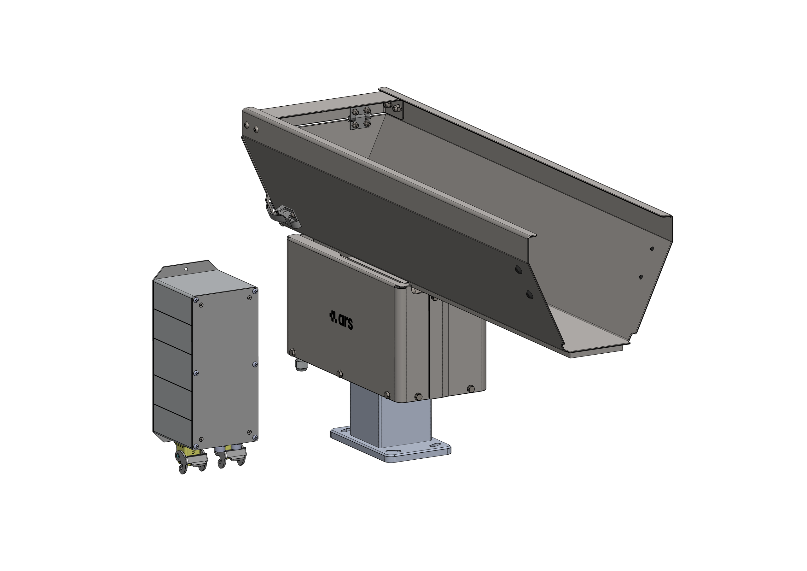
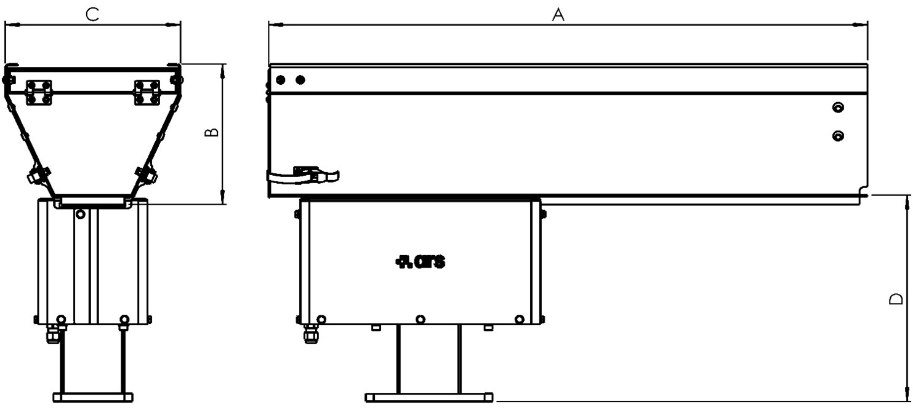

# **Description de la machine** 

<p style="line-height: 1.6; border-left: 4px solid #34495e; padding-left: 15px; margin-bottom: 25px;">
  Le tramogge sono particolarmente adatte per alimentare e pre-dosare particolari di piccole, medie e grandi dimensioni. Sono azionate da una base lineare vibrante, il cui modello varia a seconda della dimensione della tramoggia stessa.
</p>

La macchina standard è composta dalle seguenti parti fondamentali:

:::{raw} html
<style>
*{box-sizing:border-box;margin:0;padding:0}
:root{
  --acc:#1a6fc4;--acc-dk:#0d4a8a;--acc-bg:#e8f1fb;
  --bd:#e0e0e0;--bg-p:#ffffff;--bg-s:#f7f8f9;--bg-h:#f0f4fa;
  --tx1:#1a1a1a;--tx2:#555;--tx3:#888;
  --r:10px;--tr:0.35s cubic-bezier(.4,0,.2,1);
}

/* ── Tab bar ── */
.tr-tabs{display:flex;gap:6px;margin-bottom:12px}
.tr-tab{padding:5px 14px;border-radius:6px;border:1.5px solid var(--bd);background:#fff;font-size:13px;font-weight:600;color:var(--tx2);cursor:pointer;transition:background var(--tr),color var(--tr),border-color var(--tr)}
.tr-tab:hover{background:var(--bg-h)}
.tr-tab.on{background:var(--acc-bg);color:var(--acc-dk);border-color:var(--acc)}

/* ── Panel ── */
.tr-panel{display:none}
.tr-panel.on{display:block}
.tr-wrap{border:1px solid var(--bd);border-radius:var(--r);overflow:hidden;background:var(--bg-p);box-shadow:0 2px 12px rgba(0,0,0,0.07)}
.tr-img-outer{position:relative;width:100%;padding-top:70.71%}
.tr-img-outer img{position:absolute;inset:0;width:100%;height:100%;object-fit:contain;padding:0;transition:opacity var(--tr)}
.tr-img-base{opacity:1;z-index:1}
.tr-img-hl{opacity:0;z-index:2}
.tr-badge{position:absolute;top:12px;left:14px;z-index:3;background:var(--acc);color:#fff;font-size:12px;font-weight:600;padding:4px 10px;border-radius:20px;opacity:0;transform:translateY(-4px);transition:opacity var(--tr),transform var(--tr);pointer-events:none;white-space:nowrap}
.tr-badge.on{opacity:1;transform:translateY(0)}
.tr-hint{position:absolute;bottom:14px;left:50%;z-index:3;transform:translateX(-50%);font-size:13px;color:#fff;background:rgba(0,0,0,0.38);padding:6px 16px;border-radius:20px;pointer-events:none;transition:opacity var(--tr);white-space:nowrap}
.tr-list-panel{border-top:1px solid var(--bd);background:var(--bg-p)}
.tr-list-head{display:grid;grid-template-columns:40px 160px 1fr;gap:8px;padding:8px 14px;background:var(--bg-s);border-bottom:1px solid var(--bd);font-size:11px;font-weight:600;text-transform:uppercase;letter-spacing:.05em;color:var(--tx3)}
.tr-row{display:grid;grid-template-columns:40px 160px 1fr;gap:8px;align-items:center;padding:9px 14px;border-bottom:1px solid var(--bd);cursor:pointer;transition:background var(--tr);user-select:none}
.tr-row:last-child{border-bottom:none}
.tr-row:hover{background:var(--bg-h)}
.tr-row.on{background:var(--acc-bg)}
.tr-bubble{width:26px;height:26px;border-radius:50%;border:1.5px solid var(--bd);background:#fff;display:flex;align-items:center;justify-content:center;font-size:12px;font-weight:600;color:var(--tx2);flex-shrink:0;transition:background var(--tr),color var(--tr),border-color var(--tr)}
.tr-row.on .tr-bubble{background:var(--acc);color:#fff;border-color:var(--acc)}
.tr-name{font-size:13px;font-weight:500;color:var(--tx1);transition:color var(--tr)}
.tr-row.on .tr-name{color:var(--acc-dk)}
.tr-desc{font-size:12px;color:var(--tx2);line-height:1.55}
.tr-desc a{color:var(--acc);text-decoration:underline}
</style>

<!-- Tab bar -->
<div class="tr-tabs">
  <button class="tr-tab on"    onclick="trSwitchTab('tramoggia',this)">Tramoggia vibrante</button>
</div>

<!-- ══════════ TRAMOGGIA ══════════ -->
<div class="tr-panel on" id="tr-panel-tramoggia">
  <div class="tr-wrap">
    <div class="tr-img-outer">
      
      
      <div class="tr-badge" id="tramoggia-badge"></div>
      <div class="tr-hint"  id="tramoggia-hint">Seleziona un componente dalla lista</div>
    </div>
    <div class="tr-list-panel">
      <div class="tr-list-head"><span>N.</span><span>Componente</span><span>Descrizione</span></div>
      <div id="tramoggia-list"></div>
    </div>
  </div>
</div>

<script>
(function(){

  /* ── dati componenti ── */
  var models = {
    tramoggia: {
      imgPath: '../../../../../_shared/media/images/tramoggia',
      imgExt: '.PNG',
      comps: [
        {n:1,  name:'Supporto',        desc:'È il componente che viene staffato sulla macchina e su cui viene posizionata la tramoggia.'},
        {n:2,  name:'Base vibrante',    desc:'È il componente principale della tramoggia; tramite un elettromagnete effettua la vibrazione che permette l’avanzamento dei pezzi sulla vasca.'},
        {n:3,  name:'Vasca',            desc:'Può essere da 1,5lt, 5lt, 10lt, 20lt, 40lt a seconda del componente da lavorare. Su richiesta, sono realizzabili anche di dimensioni personalizzate. La vasca da 1,5lt è costruita in materiale plastico mentre le altre sono in acciaio INOX.'},
        {n:4,  name:'Controller',       desc:'Viene utilizzato per regolare la vibrazione della tramoggia.'},
        {n:5,  name:'Carter',           desc:'Componenti di protezione della base vibrante da urti, sporco e polvere.'},
      ]
    },
  };

  /* ── stato per modello ── */
  var state = {};
  Object.keys(models).forEach(function(id){ state[id]={activeN:null,activeRow:null}; });

  /* ── costruisce le liste ── */
  Object.keys(models).forEach(function(id){
    var m   = models[id];
    var el  = document.getElementById(id+'-list');
    m.comps.forEach(function(c){
      var row = document.createElement('div');
      row.className = 'tr-row';
      row.innerHTML = '<div class="tr-bubble">'+c.n+'</div>'
                    + '<div class="tr-name">'+c.name+'</div>'
                    + '<div class="tr-desc">'+c.desc+'</div>';
      row.addEventListener('click', function(){ toggle(id, c, row); });
      el.appendChild(row);
    });
  });

  /* ── toggle componente ── */
  function toggle(id, c, row){
    var s       = state[id];
    var m       = models[id];
    var imgBase = document.getElementById(id+'-img-base');
    var imgHl   = document.getElementById(id+'-img-hl');
    var badge   = document.getElementById(id+'-badge');
    var hint    = document.getElementById(id+'-hint');

    if(s.activeN === c.n){ reset(id); return; }
    if(s.activeRow) s.activeRow.classList.remove('on');
    row.classList.add('on');
    s.activeRow = row; s.activeN = c.n;

    badge.textContent = c.n + ' \u2014 ' + c.name;
    badge.classList.add('on');
    hint.style.opacity = '0';

    var newImg = new Image();
    newImg.onload = function(){
      imgHl.src = newImg.src;
      imgHl.style.opacity = '1';
      imgBase.style.opacity = '0';
    };
    newImg.onerror = function(){
      imgBase.style.opacity = '1';
      imgHl.style.opacity = '0';
    };
    newImg.src = m.imgPath + c.n + m.imgExt;
  }

  /* ── reset ── */
  function reset(id){
    var s       = state[id];
    var imgBase = document.getElementById(id+'-img-base');
    var imgHl   = document.getElementById(id+'-img-hl');
    var badge   = document.getElementById(id+'-badge');
    var hint    = document.getElementById(id+'-hint');

    if(s.activeRow) s.activeRow.classList.remove('on');
    s.activeRow = null; s.activeN = null;
    imgBase.style.opacity = '1';
    imgHl.style.opacity = '0';
    setTimeout(function(){ imgHl.src = ''; }, 350);
    badge.classList.remove('on');
    hint.style.opacity = '1';
  }

  /* ── switch tab ── */
  window.trSwitchTab = function(id, btn){
    document.querySelectorAll('.tr-panel.on').forEach(function(p){
      var oldId = p.id.replace('tr-panel-','');
      reset(oldId);
    });
    document.querySelectorAll('.tr-tab').forEach(function(b){ b.classList.remove('on'); });
    document.querySelectorAll('.tr-panel').forEach(function(p){ p.classList.remove('on'); });
    btn.classList.add('on');
    document.getElementById('tr-panel-'+id).classList.add('on');
  };

})();
</script>
:::

:::{attention}
Nel caso di modelli personalizzati i componenti potrebbero differire, parzialmente o totalmente, da quelli indicati. Per modelli di questo genere è necessario fare riferimento al fascicolo tecnico di progetto. 
:::

## Componenti e Funzionamento

* **Struttura della base:** La base lineare vibrante è composta da due corpi uniti tra loro da molle a balestra.
* **Meccanismo di vibrazione:** Il funzionamento è affidato ad un elettromagnete solidale al corpo fisso che attrae e rilascia il corpo mobile. Questa azione genera la vibrazione che permette l’avanzamento dei particolari contenuti all’interno della vasca (posizionata sul corpo mobile e bloccata tramite l’utilizzo di ganasce).
* **Controllo elettrico:** Per assolvere a questo scopo i vibratori necessitano di un controller che converte la corrente alternata in corrente di impulso, oltre a regolare la velocità del sistema stesso.

---

## Uso Previsto 

La tramoggia è disponibile in sei modelli base. Modelli personalizzati, derivanti da quelli di base ma differenti dal punto di vista dimensionale e prestazionale, sono realizzabili previo confronto con le richieste dell’utilizzatore. 

:::{note} 
**Nota di validità:** Le informazioni contenute nel presente manuale sono da ritenersi valide anche per modelli di natura personalizzata.
:::

**Capacità dei modelli standard disponibili:**

| Modello Base | Capacità della Vasca |
|:--- |:--- |
| **Modello 1** | 1,5 litri |
| **Modello 2** | 3 litri |
| **Modello 3** | 5 litri |
| **Modello 4** | 10 litri |
| **Modello 5** | 20 litri |
| **Modello 6** | 40 litri |


La macchina in oggetto è destinata ad uso industriale per: 

::::{list-table}
:widths: 25 25 25 25
:header-rows: 1
:class: custom-safety-table

* - <span style="font-weight: bold; color: #2c3e50;">Operazione</span>
  - <span style="font-weight: bold; color: #27ae60;">Consentita</span>
  - <span style="font-weight: bold; color: #c0392b;">Non Consentita</span>
  - <span style="font-weight: bold; color: #2c3e50;">Ambiente di lavorazione</span>

* - <div style="padding: 8px 0;"><span style="font-weight: 600; text-transform: uppercase; font-size: 0.9em; ">Movimentazione volta all'alimentazione di:</span></div>
  - <div style="background-color: #e8f8f5; border-left: 4px solid #2ecc71; padding: 10px; margin: 5px 0; border-radius: 4px; font-size: 0.95em; color: #117a65;">
      Componentistica di peso e dimensioni massime variabili in base al modello di macchina.
    </div>
  - <div style="background-color: #fdf2f2; border-left: 4px solid #e74c3c; padding: 10px; margin: 5px 0; border-radius: 4px; font-size: 0.95em; color: #78281f;">
      Qualsiasi altro componente non compreso all'interno del range di peso e dimensioni massime consentite.
    </div>
  - <div style="background-color: #f4f6f7; padding: 10px; margin: 5px 0; border-radius: 4px; font-size: 0.95em; text-align: center; font-weight: 500; color: #566573;">
      Industriale
    </div>
::::

:::{IMPORTANT}
Per maggiori informazioni sulla tipologia di componentistica consentita, consultare il paragrafo “Dati tecnici” del presente manuale.
:::

<div style="display: flex; flex-direction: column; gap: 20px; margin: 20px 0;">

  <!-- Card 1: Destinazione d'Uso -->
  <div style="border-left: 5px solid #2980b9; background-color: #ebf5fb; padding: 20px; border-radius: 4px 8px 8px 4px; box-shadow: 0 2px 8px rgba(0,0,0,0.05);">
    <h3 style="color: #2980b9; margin-top: 0; font-size: 1.2em; border-bottom: none;"> Destinazione d'Uso</h3>
    <p style="margin-bottom: 10px; color: #2c3e50;">La macchina è stata creata per:</p>
    <ul style="color: #34495e; margin-bottom: 0; padding-left: 20px;">
      <li style="margin-bottom: 5px;">soddisfare le <strong>esigenze specifiche</strong> menzionate sul contratto di vendita;</li>
      <li>essere utilizzata secondo le <strong>istruzioni ed i limiti d’impiego</strong> riportati nel presente manuale.</li>
    </ul>
  </div>

  <!-- Card 2: Condizioni per la Sicurezza -->
  <div style="border-left: 5px solid #27ae60; background-color: #eafaf1; padding: 20px; border-radius: 4px 8px 8px 4px; box-shadow: 0 2px 8px rgba(0,0,0,0.05);">
    <h3 style="color: #27ae60; margin-top: 0; font-size: 1.2em; border-bottom: none;"> Condizioni per la Sicurezza</h3>
    <p style="margin-bottom: 10px; color: #2c3e50;">La macchina è progettata e costruita per lavorare in sicurezza <strong>esclusivamente se</strong>:</p>
    <ul style="color: #34495e; margin-bottom: 0; padding-left: 20px;">
      <li style="margin-bottom: 5px;">viene impiegata entro i limiti dichiarati sul contratto e sul presente manuale;</li>
      <li style="margin-bottom: 5px;">vengono seguite scrupolosamente le procedure del manuale d’uso;</li>
      <li style="margin-bottom: 5px;">viene effettuata la manutenzione ordinaria nei tempi e nei modi indicati;</li>
      <li style="margin-bottom: 5px;">viene fatta eseguire tempestivamente la manutenzione straordinaria in caso di necessità;</li>
      <li><strong style="color: #c0392b;">NON vengono mai rimossi e/o bypassati i dispositivi di sicurezza.</strong></li>
    </ul>
  </div>

</div>

## Uso Scorretto (Ragionevolmente Prevedibile)

<div style="border-left: 5px solid #c0392b; background-color: #fdf2f2; padding: 20px; border-radius: 4px; margin: 15px 0; box-shadow: 0 2px 5px rgba(0,0,0,0.03);">
  <ul style="color: #2c3e50; margin: 0; padding-left: 20px; line-height: 1.6;">
    <li style="margin-bottom: 8px;">Lavorare componenti liquidi e graniglie fini;</li>
    <li style="margin-bottom: 8px;">Modificare i parametri di lavoro inficianti la sicurezza;</li>
    <li style="margin-bottom: 8px;">Trasporto di persone;</li>
    <li style="margin-bottom: 8px;">Sfruttare la macchina come punto d’appoggio;</li>
    <li style="margin-bottom: 8px;">Utilizzare la macchina in modo da ottenere valori di produzione superiori ai limiti prescritti;</li>
    <li style="margin-bottom: 8px;">Modificare / manomettere i collegamenti elettrici e pneumatici della macchina o ogni altro suo componente;</li>
    <li style="margin-bottom: 8px;">Utilizzare la macchina con prodotto diverso da quello elencato nell’“Uso previsto (corretto)”;</li>
    <li style="margin-bottom: 0;">Utilizzare la macchina diversamente da quanto previsto al paragrafo “Uso previsto (corretto)”.</li>
  </ul>
</div>

:::{warning}
Qualsiasi altro impiego della macchina rispetto a quello previsto deve essere preventivamente autorizzato per iscritto dal Costruttore. In mancanza di tale autorizzazione scritta, l’impiego è da considerare “uso improprio”; pertanto il Costruttore declina ogni responsabilità in relazione ai danni eventualmente provocati a cose o persone e ritiene decaduta ogni tipo di garanzia sulla macchina.  
:::

:::{important}
Un uso improprio della macchina esclude qualsiasi responsabilità del Costruttore.
:::

## Obblighi e Divieti 

### Obblighi degli utilizzatori 

L’utilizzatore (imprenditore o datore di lavoro) deve:

<div style="border-left: 5px solid #2980b9; background-color: #ebf5fb; padding: 20px; border-radius: 4px; margin: 15px 0; box-shadow: 0 2px 5px rgba(0,0,0,0.03);">
  <ul style="color: #2c3e50; margin: 0; padding-left: 20px; line-height: 1.6;">
    <li style="margin-bottom: 8px;">Tenere conto delle capacità e delle condizioni degli operatori in rapporto alla loro salute e alla loro sicurezza;</li>
    <li style="margin-bottom: 8px;">Fornire i mezzi di protezione individuale (DPI) adeguati alle singole procedure;</li>
    <li style="margin-bottom: 8px;">Fornire mezzi e procedure di sollevamento a norma;</li>
    <li style="margin-bottom: 8px;">Richiedere l’osservanza da parte dei singoli lavoratori delle norme e delle disposizioni aziendali in materia di sicurezza e di uso dei mezzi di protezione collettivi e individuali messi a loro disposizione;</li>
    <li style="margin-bottom: 8px;">Istruire il personale sulle procedure da seguire in caso di infortunio;</li>
    <li style="margin-bottom: 8px;">Istruire il personale sui rischi residui presenti;</li>
    <li style="margin-bottom: 8px;">Istruire il personale sui dispositivi predisposti per la sicurezza degli operatori;</li>
    <li style="margin-bottom: 8px;">Istruire il personale sui rischi di emissione da rumore nell’ambiente di lavoro;</li>
    <li style="margin-bottom: 0;">Istruire il personale sulle regole antinfortunistiche generali previste da direttive europee e dalla legislazione del Paese di destinazione della macchina.</li>
  </ul>
</div>

:::{note} 
Fare operare sulla macchina solo personale che abbia preso visione del presente manuale e che sia stato opportunamente addestrato.
:::

### Obblighi del personale addetto (operatori/manutentori/tecnici)

Il personale deve:

<div style="border-left: 5px solid #27ae60; background-color: #eafaf1; padding: 20px; border-radius: 4px; margin: 15px 0; box-shadow: 0 2px 5px rgba(0,0,0,0.03);">
  <ul style="color: #2c3e50; margin: 0; padding-left: 20px; line-height: 1.6;">
    <li style="margin-bottom: 8px;"><strong>Effettuare gli interventi di manutenzione sempre a macchina spenta.</strong> Non lubrificare mai organi in moto;</li>
    <li style="margin-bottom: 8px;">Quando la macchina è in funzione, evitare di operare nei pressi con catene, braccialetti, cravatte o altri indumenti che possano impigliarsi nei meccanismi;</li>
    <li style="margin-bottom: 8px;">Raccogliere obbligatoriamente i capelli lunghi per evitare il rischio di trascinamento;</li>
    <li style="margin-bottom: 8px;">Effettuare interventi sul quadro elettrico, cassette di derivazione, cavi e componenti elettrici <strong>esclusivamente con l’interruttore generale spento</strong>;</li>
    <li style="margin-bottom: 8px;">Sincerarsi che non vi sia nessuna persona all'interno delle zone pericolose prima di avviare la macchina;</li>
    <li style="margin-bottom: 8px;">Prestare la massima attenzione durante il funzionamento affinché nessuno possa accedere direttamente alle parti in movimento;</li>
    <li style="margin-bottom: 8px;">Utilizzare in modo appropriato i dispositivi di protezione messi a disposizione dal datore di lavoro;</li>
    <li style="margin-bottom: 0;">Segnalare immediatamente al datore di lavoro, al dirigente o al preposto qualsiasi deficienza o anomalia nei dispositivi di sicurezza.</li>
  </ul>
</div>

### Divieti del personale addetto 

In particolare, il personale non deve:

<div style="border-left: 5px solid #c0392b; background-color: #fdf2f2; padding: 20px; border-radius: 4px; margin: 15px 0; box-shadow: 0 2px 5px rgba(0,0,0,0.03);">
  <ul style="color: #2c3e50; margin: 0; padding-left: 20px; line-height: 1.6;">
    <li style="margin-bottom: 8px;">Utilizzare la macchina in modo improprio (ovvero per usi diversi da quelli indicati nel paragrafo “Uso Previsto”);</li>
    <li style="margin-bottom: 8px;">Rimuovere o modificare senza preventiva autorizzazione i dispositivi di sicurezza o di segnalazione;</li>
    <li style="margin-bottom: 8px;">Compiere di propria iniziativa operazioni o manovre fuori dalla propria competenza o che possano compromettere la sicurezza propria o di altri lavoratori;</li>
    <li style="margin-bottom: 8px;">Indossare bracciali, anelli o catenine che possano ciondolare ed essere trascinati da organi in movimento;</li>
    <li style="margin-bottom: 8px;">Sostituire o modificare le velocità dei componenti della macchina senza l'esplicito consenso di un responsabile;</li>
    <li style="margin-bottom: 8px;">Modificare in alcun modo il ciclo programmato della macchina;</li>
    <li style="margin-bottom: 8px;">Modificare gli allacciamenti elettrici con lo scopo di escludere o bypassare le sicurezze interne;</li>
    <li style="margin-bottom: 8px;">Utilizzare la macchina se non è stata installata in totale conformità con le normative vigenti;</li>
    <li style="margin-bottom: 8px;">Sfruttare la macchina come punto di appoggio, anche se non funzionante (pena il rischio di caduta dell'operatore e/o il danneggiamento della struttura);</li>
    <li style="margin-bottom: 0;">Utilizzare la macchina al di fuori delle condizioni ambientali permesse (consultare il “Capitolo 5”).</li>
  </ul>
</div>

:::{attention}
ARS S.r.l. non risponde per danni causati a cose o persone nel caso:  
•	si accerti che la macchina sia stata utilizzata in uno degli ambienti non ammessi;  
•	non siano stati rispettati gli obblighi ed i divieti qui descritti.  
:::

## Dati Tecnici 

```{list-table}
:header-rows: 1

* - Dati alimentazione elettrica
  - 1,5lt
  - 3lt
  - 5lt
  - 10lt
  - 20lt
  - 40lt
* - Alimentazione elettrica
  - :span: 6
  - 230Vac +/- 5% (115Vac su richiesta)
* - Frequenza / Fase
  - :span: 6
  - 50-60 Hz / monofase
* - Assorbimento (A)
  - 0,1
  - 0,1
  - 0,25
  - 0,25
  - 0,25
  - 0,45
```

| Dati alimentazione elettrica | 1,5lt | 3lt | 5lt | 10lt | 20lt | 40lt |
|------------------------------|--------|------|------|-------|-------|-------|
| Peso netto                   | 11 Kg | 18 Kg | 22 Kg | 24 Kg | 27 Kg | 38 Kg |

:::{attention}
Nel caso di modelli personalizzati i valori indicati potrebbero differire da quelli in tabella. Per modelli di questo genere è necessario fare riferimento al fascicolo tecnico di progetto. 
:::

## Layout 



| Dimensioni | 1,5lt | 3lt | 5lt | 10lt | 20lt | 40lt |
|------------|--------|------|------|-------|-------|-------|
| A | 350 mm | 525 mm | 435 mm | 630 mm | 760 mm | 780 mm |
| B | 65 mm | 98 mm | 135 mm | 135 mm | 180 mm | 260 mm |
| C | 90 mm | 97 mm | 140 mm | 140 mm | 220 mm | 280 mm |
| D | 211 mm | 218 mm | 247 mm | 247 mm | 262 mm | 290 mm |

:::{attention}
Nel caso di modelli personalizzati i valori indicati potrebbero differire da quelli in tabella. Per modelli di questo genere è necessario fare riferimento al fascicolo tecnico di progetto. 
:::


## Componenti Standard e Opzionali 

```{list-table} Accessori e Dotazioni delle Tramogge
:widths: 20 40 25 15
:header-rows: 1

* - **Elemento**
  - **Descrizione**
  - **Foto**
  - **Standard / Opzionale**

* - Sportello svuotamento
  - Sportello di scarico posteriore per svuotamento rapido
  - 
    :::{image} ../../../../../_shared/media/images/sportello_svuotamento.jpg
    :alt: Sportello svuotamento
    :width: 120px
    :align: center
    :::
  - STANDARD (esclusa tramoggia 1,5lt)

* - Barriera dosatrice
  - Dosatore a barriera per regolazione del flusso (registrabile)
  - 
    :::{image} ../../../../../_shared/media/images/barriera_dosatrice.jpg
    :alt: Barriera dosatrice
    :width: 120px
    :align: center
    :::
  - OPZIONALE (esclusa tramoggia 1,5lt)

* - Protezione di sicurezza
  - Protezione di sicurezza per mani
  - 
    :::{image} ../../../../../_shared/media/images/protezione_sicurezza.jpg
    :alt: Protezione di sicurezza
    :width: 120px
    :align: center
    :::
  - OPZIONALE (esclusa tramoggia 1,5lt)

* - Rivestimento
  - Rivestimento della vasca in poliuretano
  - 
    :::{image} ../../../../../_shared/media/images/rivestimento.png
        :alt: Rivestimento
        :width: 120px
        :align: center
    :::
  - OPZIONALE (esclusa tramoggia 1,5lt)

* - Fotocellula frontale
  - Ha la funzione di verificare la presenza di componenti nella zona frontale della vasca vibrante durante il processo di alimentazione. Per maggiori informazioni fare riferimento all’Appendice A: “Frontal and Rear Photocells”.
  - 
    :::{image} ../../../../../_shared/media/images/fotocellula_frontale.png
        :alt: Fotocellula frontale
        :width: 120px
        :align: center
    :::
  - OPZIONALE (esclusa tramoggia 1,5lt)

* - Fotocellula posteriore
  - Ha la funzione di monitorare il livello dei pezzi presenti dentro alla vasca. Per maggiori informazioni fare riferimento all’Appendice A: “Frontal and Rear Photocells”.
  - 
    :::{image} ../../../../../_shared/media/images/fotocellula_posteriore.png
        :alt: Fotocellula posteriore
        :width: 120px
        :align: center
    :::
  - OPZIONALE (esclusa tramoggia 1,5lt)

```

### Ciclo di lavorazione 

Di seguito viene descritto in maniera semplificata il ciclo di lavorazione, suddiviso nelle seguenti fasi operative:

<div style="display: flex; flex-direction: column; gap: 15px; margin: 20px 0; position: relative;">

  <!-- Fase 1 -->
  <div style="display: flex; background-color: #f8f9fa; border-radius: 8px; border: 1px solid #e9ecef; overflow: hidden; box-shadow: 0 2px 4px rgba(0,0,0,0.02);">
    <div style="background-color: #2c3e50; color: #ffffff; display: flex; align-items: center; justify-content: center; width: 60px; font-size: 1.4em; font-weight: bold; flex-shrink: 0;">
      1
    </div>
    <div style="padding: 15px 20px; display: flex; align-items: center; color: #2c3e50; line-height: 1.5;">
      <span>L'operatore posiziona manualmente o con un sistema di carico automatico il prodotto da lavorare all’interno della vasca.</span>
    </div>
  </div>

  <!-- Fase 2 -->
  <div style="display: flex; background-color: #f8f9fa; border-radius: 8px; border: 1px solid #e9ecef; overflow: hidden; box-shadow: 0 2px 4px rgba(0,0,0,0.02);">
    <div style="background-color: #34495e; color: #ffffff; display: flex; align-items: center; justify-content: center; width: 60px; font-size: 1.4em; font-weight: bold; flex-shrink: 0;">
      2
    </div>
    <div style="padding: 15px 20px; display: flex; align-items: center; color: #2c3e50; line-height: 1.5;">
      <span>La tramoggia effettua ciclicamente delle vibrazioni (impostate dall'operatore) per consentire l’avanzamento dei pezzi, in modo da garantire costantemente la presenza degli stessi sull’alimentatore.</span>
    </div>
  </div>

</div>