# **Superfici e Dischi Rigidi**

:::{list-table}
:header-rows: 1 

* - **Superficie/Disco Rigido**
  - **FB200**
  - **FB350**
  - **FB500**
  - **FB650**
  - **FB800**
  - **FB1200**

* - [**Flexi Disc Anti-Cut Grey FDA**](Anti-cut-grey)
  - 
  - 
  - ✓
  - ✓
  - ✓
  - ✓

* - [**Flexi Disc Anti-Roll "interasse" Beige Spike FDA**](Anti-roll-beige)
  - 
  - 
  - ✓
  - ✓
  - ✓
  - ✓

* - [**Flexi Disc Anti-Roll "interasse" Grey Spike FDA**](Anti-roll-grey)
  - 
  - 
  - ✓
  - ✓
  - ✓
  - ✓

* - [**Flexi Disc Anti-Roll "interasse" White FDA**](Anti-roll-white)
  - 
  - 
  - ✓
  - ✓
  - ✓
  - ✓

* - [**Flexi Disc Anti-Roll "interasse" White FDA**](Anti-roll-white)
  - 
  - 
  - ✓
  - 
  - 
  - 

* - [**Flexi Disc Anti-Roll White Silicon  FDA**](Anti-roll-white-silicon)
  - 
  - 
  - ✓
  - ✓
  - ✓
  - ✓

* - [**Flexi Disc Anti-Stick Blue FDA**](Anti-stick-blue)
  - 
  - 
  - ✓
  - ✓
  - ✓
  - ✓
  
* - [**Flexi Disc Smooth Beige FDA**](smooth-beige)
  - 
  - 
  - ✓
  - ✓
  - ✓
  - ✓
  
* - [**Flexi Disc Smooth Blue FDA**](smooth-blue)
  - 
  - 
  - ✓
  - ✓
  - ✓
  - ✓
  

* - [**Flexi Disc Smooth White FDA**](smooth-white)
  - 
  - 
  - ✓
  - ✓
  - ✓
  - ✓

* - [**Rigid Disc Anti-roll White**](RD-anti-roll-white)
  - ✓
  - ✓
  - ✓
  - 
  - 
  - 
 
* - [**Rigid Disc Anti-stick White**](RD-anti-stick-white)
  - ✓
  - ✓
  - ✓
  - 
  - 
  - 

* - [**Rigid Disc Smooth Black**](RD-smooth-black)
  - ✓
  - ✓
  - ✓
  - 
  - 
  - 

* - [**Rigid Disc Smooth White**](RD-smooth-white)
  - ✓
  - ✓
  - ✓
  - 
  - 
  - 

* - Rigid Disc Application Specific Design - Custom
  - ✓
  - ✓
  - ✓
  - 
  - 
  - 

:::

## **Superfici**
Le superfici sono tappeti circolari in materiale telato e flessibile, e sono le soluzioni standard per le seguenti taglie di FlexiBowl®:

-  **FB500**
-  **FB650**
-  **FB800**
-  **FB1200**

Seguono le caratteristiche principali delle superfici disponibili a listino:

(Anti-cut-grey)=
### Flexi Disc Anti-Cut Grey FDA - Fabric Transparent

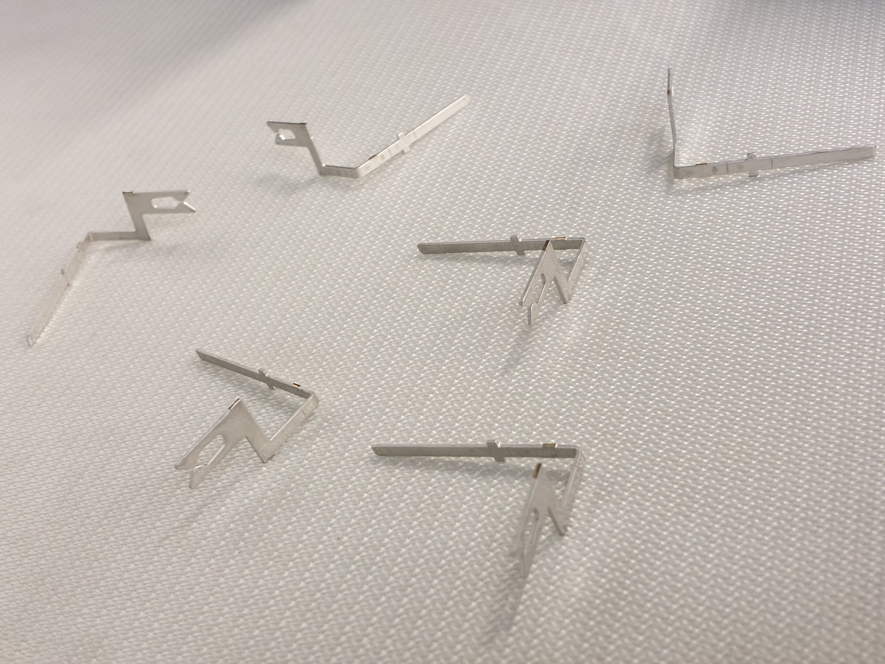

    <strong>Caratteristiche Principali:</strong> Raccomandata per componenti taglienti o con spigoli vivi (sharp components).

    <table class="sphinx-styled-table">
        <thead>
            <tr>
                <th style="width: 30%;">Proprietà</th>
                <th style="width: 70%;">Specifiche / Livello</th>
            </tr>
        </thead>
        <tbody>
            <tr>
                <td><strong>Materiale</strong></td>
                <td>Silicone - FDA</td>
            </tr>
            <tr>
                <td><strong>Filamenti Antistatici</strong></td>
                <td>Sì</td>
            </tr>
            <tr>
                <td><strong>Backlight</strong></td>
                <td>
                    

                        

                        

                        

                    

                </td>
            </tr>
            <tr>
                <td><strong>Toplight</strong></td>
                <td>
                    

                        

                        

                        

                    

                </td>
            </tr>
            <tr>
                <td><strong>Cleaning</strong></td>
                <td>
                    

                        

                        

                        

                    

                </td>
            </tr>
            <tr>
                <td><strong>Grip</strong></td>
                <td>
                    

                        

                        

                        

                    

                </td>
            </tr>
        </tbody>
    </table>

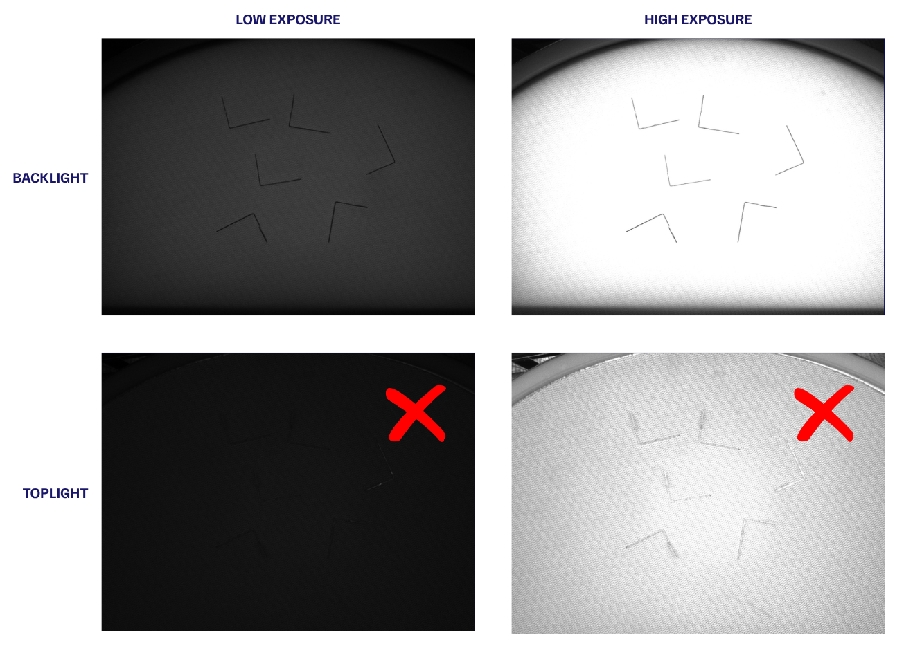

#### Compatibilità Componenti (Flexi Disc Anti-Cut Grey FDA)

    <table class="sphinx-styled-table">
        <thead>
            <tr>
                <th style="width: 30%;">Tipo di Componente</th>
                <th style="width: 70%;">Compatibilità</th>
            </tr>
        </thead>
        <tbody>
            <tr>
                <td><strong>Dirty/Oily</strong></td>
                <td>
                    

                        

                        

                        

                    

                </td>
            </tr>
            <tr>
                <td><strong>Cylindrical</strong></td>
                <td>
                    

                        

                        

                        

                    

                </td>
            </tr>
            <tr>
                <td><strong>Sticky</strong></td>
                <td>
                    

                        

                        

                        

                    

                </td>
            </tr>
            <tr>
                <td><strong>Transparent</strong></td>
                <td>
                    

                        

                        

                        

                    

                </td>
            </tr>
            <tr>
                <td><strong>Sharp</strong></td>
                <td>
                    

                        

                        

                        

                    

                </td>
            </tr>
        </tbody>
    </table>

(Anti-roll-beige)=
### Flexi Disc Anti-Roll "interasse" Beige Spike FDA - Spike Beige

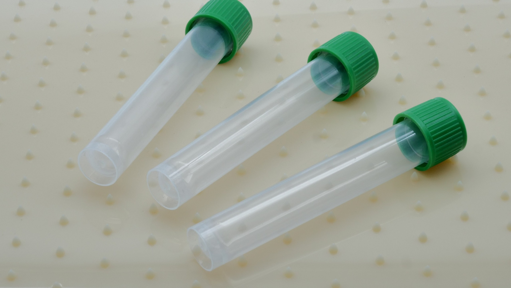 

  <strong>Caratteristiche Principali:</strong> Raccomandata per componenti cilindrici con diametro superiore a 15 mm.

    <table class="sphinx-styled-table">
        <thead>
            <tr>
                <th style="width: 30%;">Proprietà</th>
                <th style="width: 70%;">Specifiche / Livello</th>
            </tr>
        </thead>
        <tbody>
            <tr>
                <td><strong>Materiale</strong></td>
                <td>Silicone - FDA</td>
            </tr>
            <tr>
                <td><strong>Filamenti Antistatici</strong></td>
                <td>Sì</td>
            </tr>
            <tr>
                <td><strong>Backlight</strong></td>
                <td>
                    

                        

                        

                        

                    

                </td>
            </tr>
            <tr>
                <td><strong>Toplight</strong></td>
                <td>
                    

                        

                        

                        

                    

                </td>
            </tr>
            <tr>
                <td><strong>Cleaning</strong></td>
                <td>
                    

                        

                        

                        

                    

                </td>
            </tr>
            <tr>
                <td><strong>Grip</strong></td>
                <td>
                    

                        

                        

                        

                    

                </td>
            </tr>
        </tbody>
    </table>

#### Compatibilità Componenti (Flexi Disc Anti-Roll "interasse" Beige Spike FDA)

    <table class="sphinx-styled-table">
        <thead>
            <tr>
                <th style="width: 30%;">Tipo di Componente</th>
                <th style="width: 70%;">Compatibilità</th>
            </tr>
        </thead>
        <tbody>
            <tr>
                <td><strong>Dirty/Oily</strong></td>
                <td>
                    

                        

                        

                        

                    

                </td>
            </tr>
            <tr>
                <td><strong>Cylindrical</strong></td>
                <td>
                    

                        

                        

                        

                    

                </td>
            </tr>
            <tr>
                <td><strong>Sticky</strong></td>
                <td>
                    

                        

                        

                        

                    

                </td>
            </tr>
            <tr>
                <td><strong>Transparent</strong></td>
                <td>
                    

                        

                        

                        

                    

                </td>
            </tr>
            <tr>
                <td><strong>Sharp</strong></td>
                <td>
                    

                        

                        

                        

                    

                </td>
            </tr>
        </tbody>
    </table>

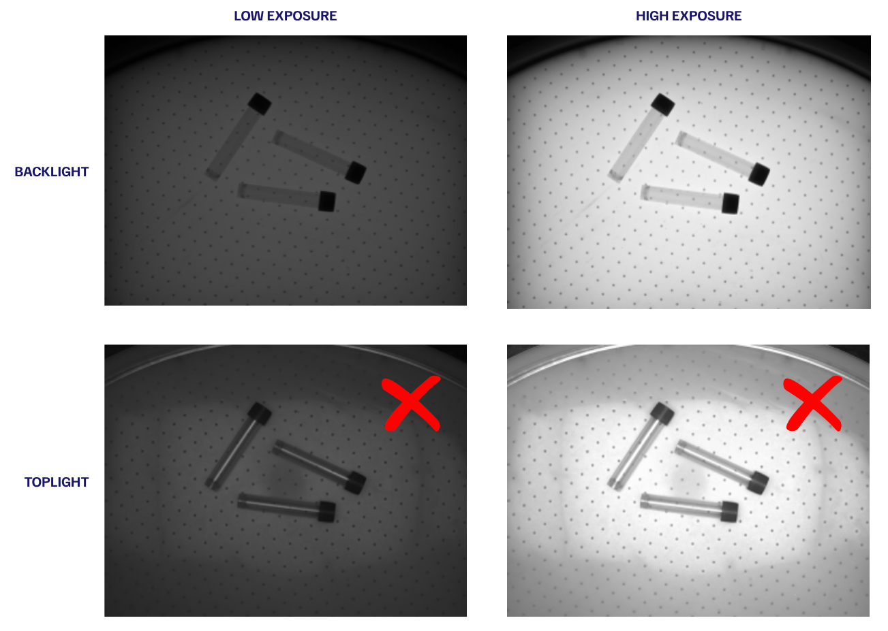 

(Anti-roll-grey)=
### Flexi Disc Anti-Roll "interasse" Grey Spike FDA - Spike Transparent

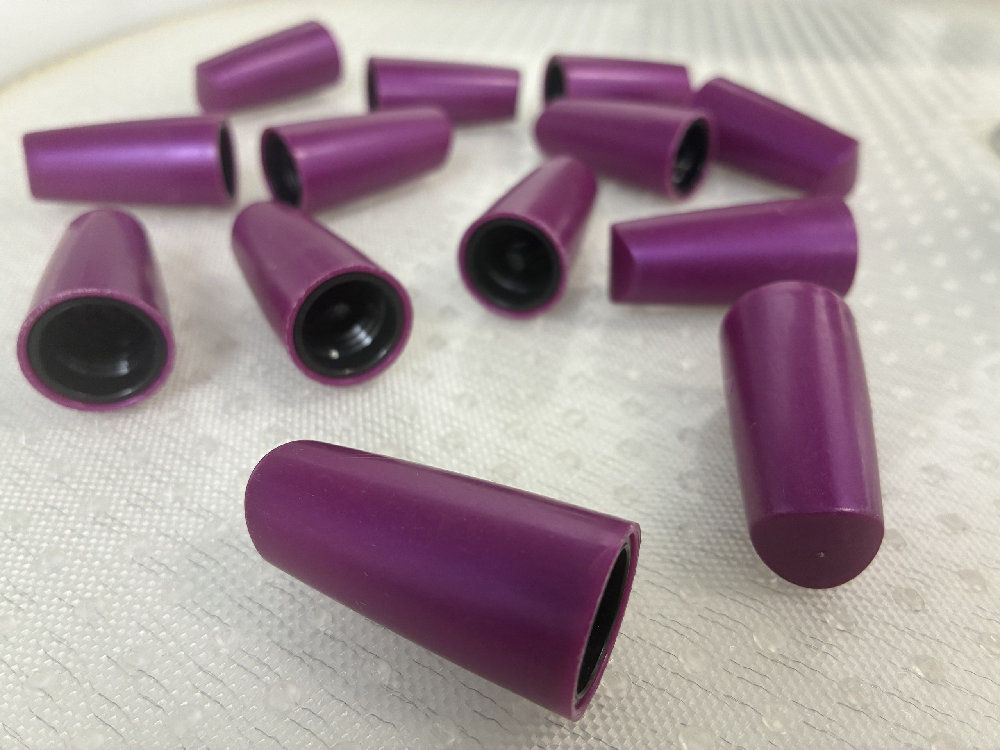

        <strong>Caratteristiche Principali:</strong> Raccomandata per componenti cilindrici con diametro inferiore a 15 mm.

    <table class="sphinx-styled-table">
        <thead>
            <tr>
                <th style="width: 30%;">Proprietà</th>
                <th style="width: 70%;">Specifiche / Livello</th>
            </tr>
        </thead>
        <tbody>
            <tr>
                <td><strong>Materiale</strong></td>
                <td>Silicone - FDA</td>
            </tr>
            <tr>
                <td><strong>Filamenti Antistatici</strong></td>
                <td>Sì</td>
            </tr>
            <tr>
                <td><strong>Backlight</strong></td>
                <td>
                    

                        

                        

                        

                    

                </td>
            </tr>
            <tr>
                <td><strong>Toplight</strong></td>
                <td>
                    

                        

                        

                        

                    

                </td>
            </tr>
            <tr>
                <td><strong>Cleaning</strong></td>
                <td>
                    

                        

                        

                        

                    

                </td>
            </tr>
            <tr>
                <td><strong>Grip</strong></td>
                <td>
                    

                        

                        

                        

                    

                </td>
            </tr>
        </tbody>
    </table>

#### Compatibilità Componenti (Flexi Disc Anti-Roll "interasse" Grey Spike FDA)

    <table class="sphinx-styled-table">
        <thead>
            <tr>
                <th style="width: 30%;">Tipo di Componente</th>
                <th style="width: 70%;">Compatibilità</th>
            </tr>
        </thead>
        <tbody>
            <tr>
                <td><strong>Dirty/Oily</strong></td>
                <td>
                    

                        

                        

                        

                    

                </td>
            </tr>
            <tr>
                <td><strong>Cylindrical</strong></td>
                <td>
                    

                        

                        

                        

                    

                </td>
            </tr>
            <tr>
                <td><strong>Sticky</strong></td>
                <td>
                    

                        

                        

                        

                    

                </td>
            </tr>
            <tr>
                <td><strong>Transparent</strong></td>
                <td>
                    

                        

                        

                        

                    

                </td>
            </tr>
            <tr>
                <td><strong>Sharp</strong></td>
                <td>
                    

                        

                        

                        

                    

                </td>
            </tr>
        </tbody>
    </table>

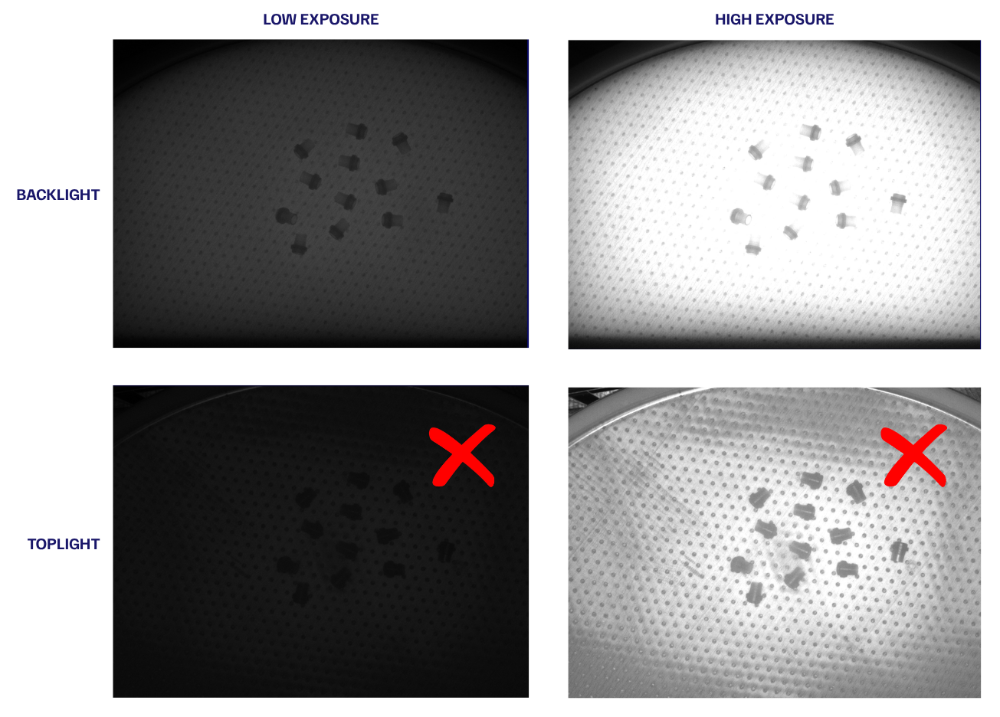

(Anti-roll-white)=
### Flexi Disc Anti-Roll "interasse" White FDA - GSTR white

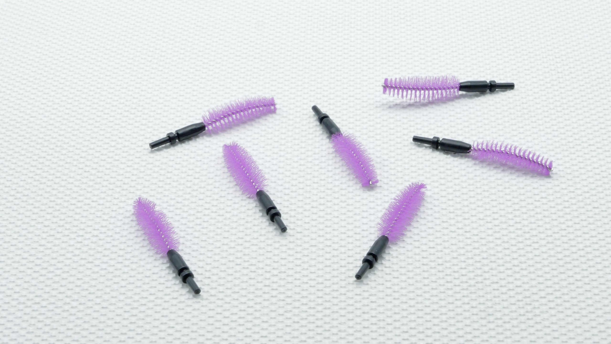

    <strong>Caratteristiche Principali:</strong> Raccomandata per parti pulite e stabili (anche se appiccicose/sticky), e per componenti cilindrici di dimensioni molto ridotte.

    <table class="sphinx-styled-table">
        <thead>
            <tr>
                <th style="width: 30%;">Proprietà</th>
                <th style="width: 70%;">Specifiche / Livello</th>
            </tr>
        </thead>
        <tbody>
            <tr>
                <td><strong>Materiale</strong></td>
                <td>Silicone - FDA</td>
            </tr>
            <tr>
                <td><strong>Filamenti Antistatici</strong></td>
                <td>Sì</td>
            </tr>
            <tr>
                <td><strong>Backlight</strong></td>
                <td>
                    

                        

                        

                        

                    

                </td>
            </tr>
            <tr>
                <td><strong>Toplight</strong></td>
                <td>
                    

                        

                        

                        

                    

                </td>
            </tr>
            <tr>
                <td><strong>Cleaning</strong></td>
                <td>
                    

                        

                        

                        

                    

                </td>
            </tr>
            <tr>
                <td><strong>Grip</strong></td>
                <td>
                    

                        

                        

                        

                    

                </td>
            </tr>
        </tbody>
    </table>

#### Compatibilità Componenti (Flexi Disc Anti-Roll "interasse" White FDA)

    <table class="sphinx-styled-table">
        <thead>
            <tr>
                <th style="width: 30%;">Tipo di Componente</th>
                <th style="width: 70%;">Compatibilità</th>
            </tr>
        </thead>
        <tbody>
            <tr>
                <td><strong>Dirty/Oily</strong></td>
                <td>
                    

                        

                        

                        

                    

                </td>
            </tr>
            <tr>
                <td><strong>Cylindrical</strong></td>
                <td>
                    

                        

                        

                        

                    

                </td>
            </tr>
            <tr>
                <td><strong>Sticky</strong></td>
                <td>
                    

                        

                        

                        

                    

                </td>
            </tr>
            <tr>
                <td><strong>Transparent</strong></td>
                <td>
                    

                        

                        

                        

                    

                </td>
            </tr>
            <tr>
                <td><strong>Sharp</strong></td>
                <td>
                    

                        

                        

                        

                    

                </td>
            </tr>
        </tbody>
    </table>

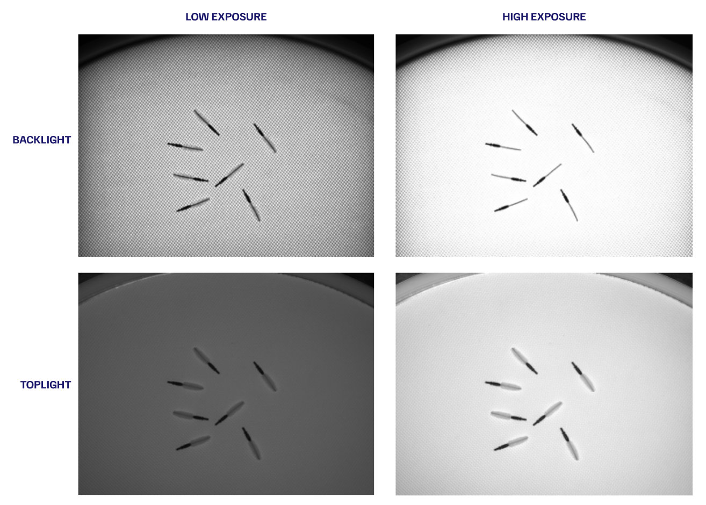

(Anti-roll-white)=
### Flexi Disc Anti-Roll "interasse" White FDA - Polibech White

        <strong>Caratteristiche Principali:</strong> Consigliata per componenti dotati di collare circolare o per piccoli cilindri.

    <table class="sphinx-styled-table">
        <thead>
            <tr>
                <th style="width: 30%;">Proprietà</th>
                <th style="width: 70%;">Specifiche / Livello</th>
            </tr>
        </thead>
        <tbody>
            <tr>
                <td><strong>Materiale</strong></td>
                <td>Silicone - FDA</td>
            </tr>
            <tr>
                <td><strong>Filamenti Antistatici</strong></td>
                <td>Sì</td>
            </tr>
            <tr>
                <td><strong>Backlight</strong></td>
                <td>
                    

                        

                        

                        

                    

                </td>
            </tr>
            <tr>
                <td><strong>Toplight</strong></td>
                <td>
                    

                        

                        

                        

                    

                </td>
            </tr>
            <tr>
                <td><strong>Cleaning</strong></td>
                <td>
                    

                        

                        

                        

                    

                </td>
            </tr>
            <tr>
                <td><strong>Grip</strong></td>
                <td>
                    

                        

                        

                        

                    

                </td>
            </tr>
        </tbody>
    </table>

#### Compatibilità Componenti (Flexi Disc Anti-Roll "interasse" White FDA )

    <table class="sphinx-styled-table">
        <thead>
            <tr>
                <th style="width: 30%;">Tipo di Componente</th>
                <th style="width: 70%;">Compatibilità</th>
            </tr>
        </thead>
        <tbody>
            <tr>
                <td><strong>Dirty/Oily</strong></td>
                <td>
                    

                        

                        

                        

                    

                </td>
            </tr>
            <tr>
                <td><strong>Cylindrical</strong></td>
                <td>
                    

                        

                        

                        

                    

                </td>
            </tr>
            <tr>
                <td><strong>Sticky</strong></td>
                <td>
                    

                        

                        

                        

                    

                </td>
            </tr>
            <tr>
                <td><strong>Transparent</strong></td>
                <td>
                    

                        

                        

                        

                    

                </td>
            </tr>
            <tr>
                <td><strong>Sharp</strong></td>
                <td>
                    

                        

                        

                        

                    

                </td>
            </tr>
        </tbody>
    </table>

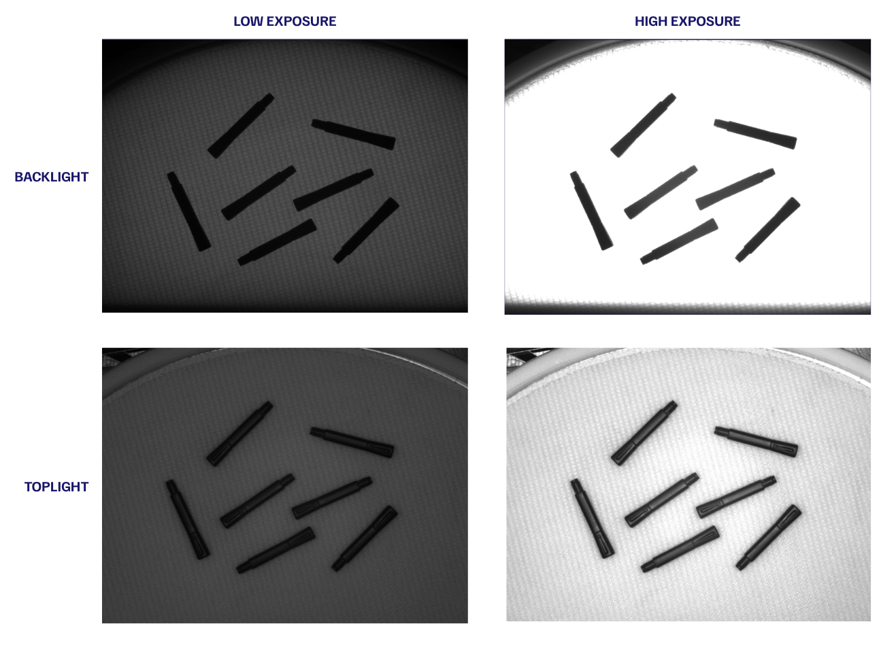

(Anti-roll-white-silicon)=
### Flexi Disc Anti-Roll White Silicon  FDA - Silicon Transparent

    <strong>Caratteristiche Principali:</strong> Raccomandata per parti con un'ampia base d'appoggio (anche se non perfettamente stabili) e per componenti che tendono a scivolare l'uno sull'altro.

    <table class="sphinx-styled-table">
        <thead>
            <tr>
                <th style="width: 30%;">Proprietà</th>
                <th style="width: 70%;">Specifiche / Livello</th>
            </tr>
        </thead>
        <tbody>
            <tr>
                <td><strong>Materiale</strong></td>
                <td>Silicone - FDA</td>
            </tr>
            <tr>
                <td><strong>Filamenti Antistatici</strong></td>
                <td>Sì</td>
            </tr>
            <tr>
                <td><strong>Backlight</strong></td>
                <td>
                    

                        

                        

                        

                    

                </td>
            </tr>
            <tr>
                <td><strong>Toplight</strong></td>
                <td>
                    

                        

                        

                        

                    

                </td>
            </tr>
            <tr>
                <td><strong>Cleaning</strong></td>
                <td>
                    

                        

                        

                        

                    

                </td>
            </tr>
            <tr>
                <td><strong>Grip</strong></td>
                <td>
                    

                        

                        

                        

                    

                </td>
            </tr>
        </tbody>
    </table>

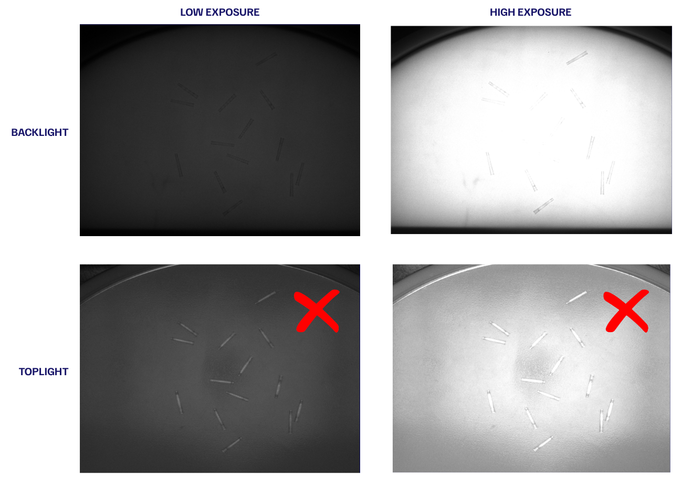

#### Compatibilità Componenti (Flexi Disc Anti-Roll White Silicon  FDA)

    <table class="sphinx-styled-table">
        <thead>
            <tr>
                <th style="width: 30%;">Tipo di Componente</th>
                <th style="width: 70%;">Compatibilità</th>
            </tr>
        </thead>
        <tbody>
            <tr>
                <td><strong>Dirty/Oily</strong></td>
                <td>
                    

                        

                        

                        

                    

                </td>
            </tr>
            <tr>
                <td><strong>Cylindrical</strong></td>
                <td>
                    

                        

                        

                        

                    

                </td>
            </tr>
            <tr>
                <td><strong>Sticky</strong></td>
                <td>
                    

                        

                        

                        

                    

                </td>
            </tr>
            <tr>
                <td><strong>Transparent</strong></td>
                <td>
                    

                        

                        

                        

                    

                </td>
            </tr>
            <tr>
                <td><strong>Sharp</strong></td>
                <td>
                    

                        

                        

                        

                    

                </td>
            </tr>
        </tbody>
    </table>

(Anti-stick-blue)=
### Flexi Disc Anti-Stick Blue FDA - Diamond Blue

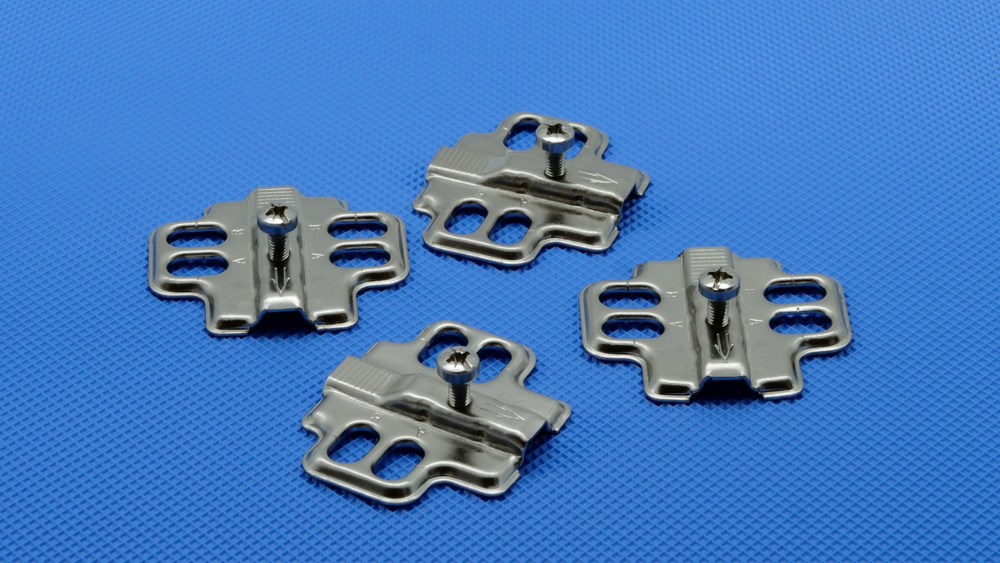

    <strong>Caratteristiche Principali:</strong> Superficie ampiamente utilizzata, raccomandata per numerose e diverse applicazioni. Ottima anche per parti sporche o oleose.

    <table class="sphinx-styled-table">
        <thead>
            <tr>
                <th style="width: 30%;">Proprietà</th>
                <th style="width: 70%;">Specifiche / Livello</th>
            </tr>
        </thead>
        <tbody>
            <tr>
                <td><strong>Materiale</strong></td>
                <td>Silicone - FDA</td>
            </tr>
            <tr>
                <td><strong>Filamenti Antistatici</strong></td>
                <td>Sì</td>
            </tr>
            <tr>
                <td><strong>Backlight</strong></td>
                <td>
                    

                        

                        

                        

                    

                </td>
            </tr>
            <tr>
                <td><strong>Toplight</strong></td>
                <td>
                    

                        

                        

                        

                    

                </td>
            </tr>
            <tr>
                <td><strong>Cleaning</strong></td>
                <td>
                    

                        

                        

                        

                    

                </td>
            </tr>
            <tr>
                <td><strong>Grip</strong></td>
                <td>
                    

                        

                        

                        

                    

                </td>
            </tr>
        </tbody>
    </table>

#### Compatibilità Componenti (Flexi Disc Anti-Stick Blue FDA)

    <table class="sphinx-styled-table">
        <thead>
            <tr>
                <th style="width: 30%;">Tipo di Componente</th>
                <th style="width: 70%;">Compatibilità</th>
            </tr>
        </thead>
        <tbody>
            <tr>
                <td><strong>Dirty/Oily</strong></td>
                <td>
                    

                        

                        

                        

                    

                </td>
            </tr>
            <tr>
                <td><strong>Cylindrical</strong></td>
                <td>
                    

                        

                        

                        

                    

                </td>
            </tr>
            <tr>
                <td><strong>Sticky</strong></td>
                <td>
                    

                        

                        

                        

                    

                </td>
            </tr>
            <tr>
                <td><strong>Transparent</strong></td>
                <td>
                    

                        

                        

                        

                    

                </td>
            </tr>
            <tr>
                <td><strong>Sharp</strong></td>
                <td>
                    

                        

                        

                        

                    

                </td>
            </tr>
        </tbody>
    </table>

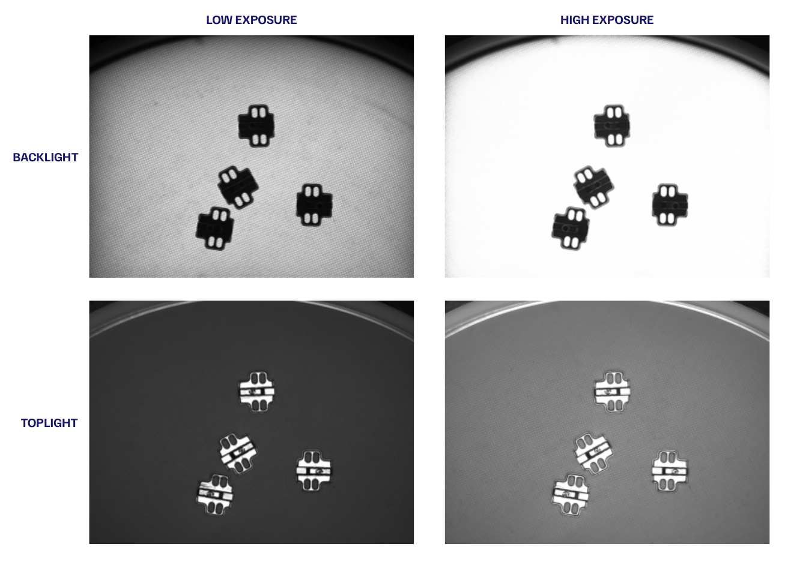

(smooth-beige)=
### Flexi Disc Smooth Beige FDA - Flat Beige

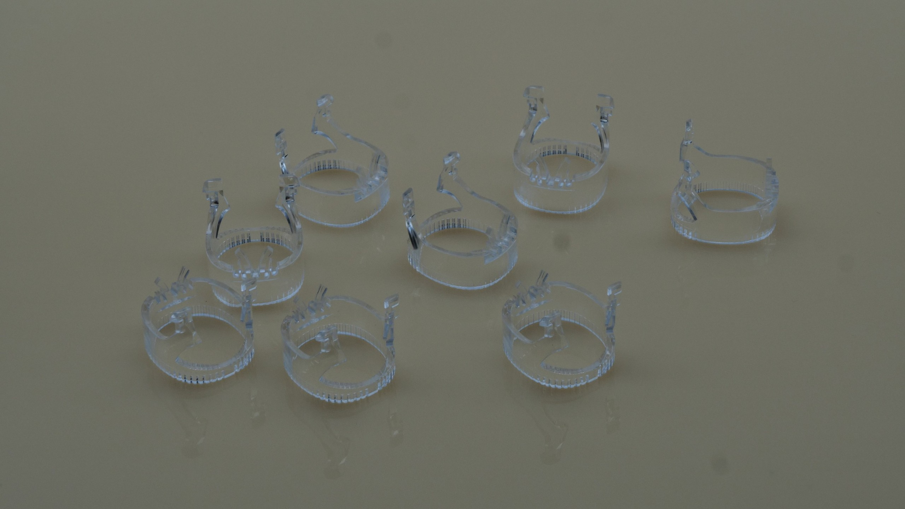

        <strong>Caratteristiche Principali:</strong> Raccomandata per componenti trasparenti, ottimale con illuminazione dal basso (backlight).

    <table class="sphinx-styled-table">
        <thead>
            <tr>
                <th style="width: 30%;">Proprietà</th>
                <th style="width: 70%;">Specifiche / Livello</th>
            </tr>
        </thead>
        <tbody>
            <tr>
                <td><strong>Materiale</strong></td>
                <td>Silicone - FDA</td>
            </tr>
            <tr>
                <td><strong>Filamenti Antistatici</strong></td>
                <td>Sì</td>
            </tr>
            <tr>
                <td><strong>Backlight</strong></td>
                <td>
                    

                        

                        

                        

                    

                </td>
            </tr>
            <tr>
                <td><strong>Toplight</strong></td>
                <td>
                    

                        

                        

                        

                    

                </td>
            </tr>
            <tr>
                <td><strong>Cleaning</strong></td>
                <td>
                    

                        

                        

                        

                    

                </td>
            </tr>
            <tr>
                <td><strong>Grip</strong></td>
                <td>
                    

                        

                        

                        

                    

                </td>
            </tr>
        </tbody>
    </table>

#### Compatibilità Componenti (Flexi Disc Smooth Beige FDA)

    <table class="sphinx-styled-table">
        <thead>
            <tr>
                <th style="width: 30%;">Tipo di Componente</th>
                <th style="width: 70%;">Compatibilità</th>
            </tr>
        </thead>
        <tbody>
            <tr>
                <td><strong>Dirty/Oily</strong></td>
                <td>
                    

                        

                        

                        

                    

                </td>
            </tr>
            <tr>
                <td><strong>Cylindrical</strong></td>
                <td>
                    

                        

                        

                        

                    

                </td>
            </tr>
            <tr>
                <td><strong>Sticky</strong></td>
                <td>
                    

                        

                        

                        

                    

                </td>
            </tr>
            <tr>
                <td><strong>Transparent</strong></td>
                <td>
                    

                        

                        

                        

                    

                </td>
            </tr>
            <tr>
                <td><strong>Sharp</strong></td>
                <td>
                    

                        

                        

                        

                    

                </td>
            </tr>
        </tbody>
    </table>

(smooth-blue)=
### Flexi Disc Smooth Blue FDA - Smooth blue

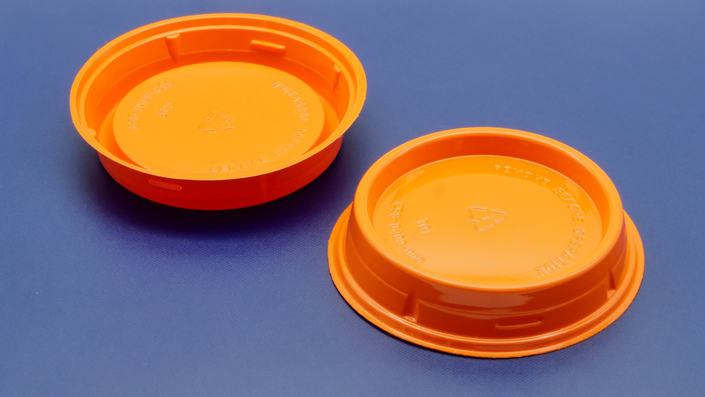

        <strong>Caratteristiche Principali:</strong> Consigliata per componenti di colore chiaro e per illuminazione dall'alto (toplight). Molto poco soggetta all'accumulo di sporco.
    

    <table class="sphinx-styled-table">
        <thead>
            <tr>
                <th style="width: 30%;">Proprietà</th>
                <th style="width: 70%;">Specifiche / Livello</th>
            </tr>
        </thead>
        <tbody>
            <tr>
                <td><strong>Materiale</strong></td>
                <td>Silicone - FDA</td>
            </tr>
            <tr>
                <td><strong>Filamenti Antistatici</strong></td>
                <td>Sì</td>
            </tr>
            <tr>
                <td><strong>Backlight</strong></td>
                <td>
                    

                        

                        

                        

                    

                </td>
            </tr>
            <tr>
                <td><strong>Toplight</strong></td>
                <td>
                    

                        

                        

                        

                    

                </td>
            </tr>
            <tr>
                <td><strong>Cleaning</strong></td>
                <td>
                    

                        

                        

                        

                    

                </td>
            </tr>
            <tr>
                <td><strong>Grip</strong></td>
                <td>
                    

                        

                        

                        

                    

                </td>
            </tr>
        </tbody>
    </table>

#### Compatibilità Componenti (Flexi Disc Smooth Blue FDA)

    <table class="sphinx-styled-table">
        <thead>
            <tr>
                <th style="width: 30%;">Tipo di Componente</th>
                <th style="width: 70%;">Compatibilità</th>
            </tr>
        </thead>
        <tbody>
            <tr>
                <td><strong>Dirty/Oily</strong></td>
                <td>
                    

                        

                        

                        

                    

                </td>
            </tr>
            <tr>
                <td><strong>Cylindrical</strong></td>
                <td>
                    

                        

                        

                        

                    

                </td>
            </tr>
            <tr>
                <td><strong>Sticky</strong></td>
                <td>
                    

                        

                        

                        

                    

                </td>
            </tr>
            <tr>
                <td><strong>Transparent</strong></td>
                <td>
                    

                        

                        

                        

                    

                </td>
            </tr>
            <tr>
                <td><strong>Sharp</strong></td>
                <td>
                    

                        

                        

                        

                    

                </td>
            </tr>
        </tbody>
    </table>

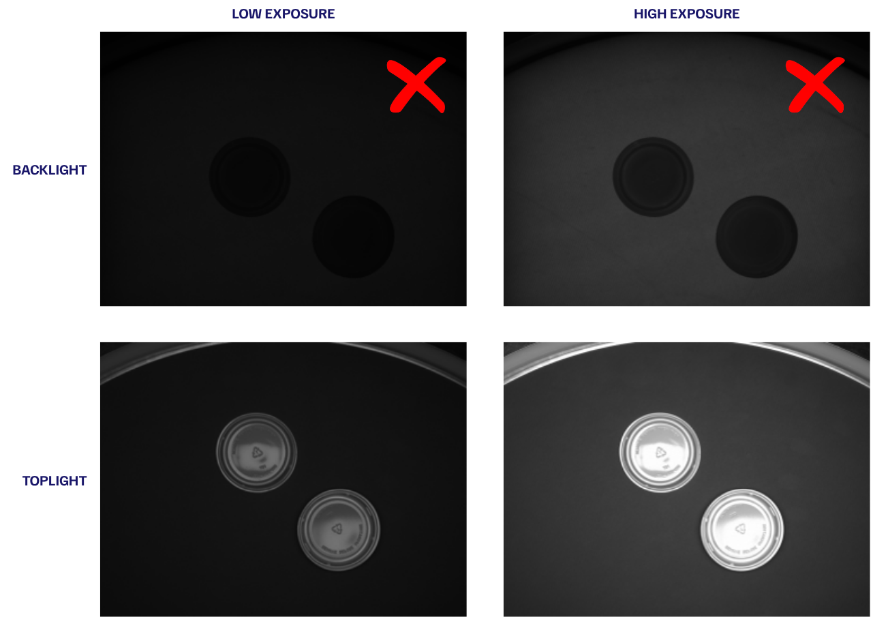

(smooth-white)=
### Flexi Disc Smooth White FDA - Standard White

    <strong>Caratteristiche Principali:</strong> Consigliata per parti piatte e pulite. Efficiente sia con illuminazione dal basso (backlight) che dall'alto (toplight).

    <table class="sphinx-styled-table">
        <thead>
            <tr>
                <th style="width: 30%;">Proprietà</th>
                <th style="width: 70%;">Specifiche / Livello</th>
            </tr>
        </thead>
        <tbody>
            <tr>
                <td><strong>Materiale</strong></td>
                <td>Polyurethane - FDA</td>
            </tr>
            <tr>
                <td><strong>Filamenti Antistatici</strong></td>
                <td>Sì</td>
            </tr>
            <tr>
                <td><strong>Backlight</strong></td>
                <td>
                    

                        

                        

                        

                    

                </td>
            </tr>
            <tr>
                <td><strong>Toplight</strong></td>
                <td>
                    

                        

                        

                        

                    

                </td>
            </tr>
            <tr>
                <td><strong>Cleaning</strong></td>
                <td>
                    

                        

                        

                        

                    

                </td>
            </tr>
            <tr>
                <td><strong>Grip</strong></td>
                <td>
                    

                        

                        

                        

                    

                </td>
            </tr>
        </tbody>
    </table>

#### Compatibilità Componenti (Flexi Disc Smooth White FDA)

    <table class="sphinx-styled-table">
        <thead>
            <tr>
                <th style="width: 30%;">Tipo di Componente</th>
                <th style="width: 70%;">Compatibilità</th>
            </tr>
        </thead>
        <tbody>
            <tr>
                <td><strong>Dirty/Oily</strong></td>
                <td>
                    

                        

                        

                        

                    

                </td>
            </tr>
            <tr>
                <td><strong>Cylindrical</strong></td>
                <td>
                    

                        

                        

                        

                    

                </td>
            </tr>
            <tr>
                <td><strong>Sticky</strong></td>
                <td>
                    

                        

                        

                        

                    

                </td>
            </tr>
            <tr>
                <td><strong>Transparent</strong></td>
                <td>
                    

                        

                        

                        

                    

                </td>
            </tr>
            <tr>
                <td><strong>Sharp</strong></td>
                <td>
                    

                        

                        

                        

                    

                </td>
            </tr>
        </tbody>
    </table>

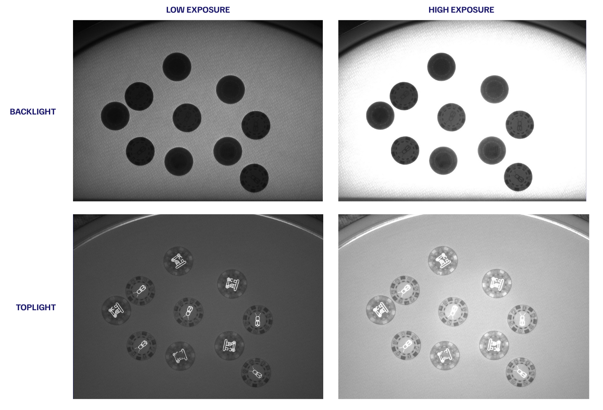

### Tabelle Riassuntive per le Superfici dai modelli FB500 ai modelli FB1200

<table style="border-collapse: collapse; width: 100%; font-size: 0.85em;">
  <thead>
    <tr>
      <th rowspan="2" style="background-color: #d1d5db; color: #1f2937; text-align: center; vertical-align: middle; font-weight: bold; border: 1px solid #9ca3af; padding: 6px;">Rotary Disk</th>
      <th colspan="6" style="background-color: #fca5a5; color: #7f1d1d; text-align: center; font-weight: bold; border: 1px solid #9ca3af; padding: 6px;">Disc features</th>
    </tr>
    <tr>
      <th style="background-color: #fca5a5; color: #7f1d1d; text-align: center; border: 1px solid #9ca3af; padding: 6px;">FDA</th>
      <th style="background-color: #fca5a5; color: #7f1d1d; text-align: center; border: 1px solid #9ca3af; padding: 6px;">Antistatic</th>
      <th style="background-color: #fca5a5; color: #7f1d1d; text-align: center; border: 1px solid #9ca3af; padding: 6px;">Backlight</th>
      <th style="background-color: #fca5a5; color: #7f1d1d; text-align: center; border: 1px solid #9ca3af; padding: 6px;">Toplight</th>
      <th style="background-color: #fca5a5; color: #7f1d1d; text-align: center; border: 1px solid #9ca3af; padding: 6px;">Cleaning</th>
      <th style="background-color: #fca5a5; color: #7f1d1d; text-align: center; border: 1px solid #9ca3af; padding: 6px;">Grip</th>
    </tr>
  </thead>
  <tbody>
    <tr>
      <td style="font-weight: bold; border: 1px solid #9ca3af; padding: 6px;">Flexi Disc Anti-Cut Grey FDA</td>
      <td style="text-align:center; border: 1px solid #9ca3af; padding: 6px;">

</td>
      <td style="text-align:center; border: 1px solid #9ca3af; padding: 6px;">

</td>
      <td style="text-align:center; border: 1px solid #9ca3af; padding: 6px;">

</td>
      <td style="text-align:center; border: 1px solid #9ca3af; padding: 6px;">

</td>
      <td style="text-align:center; border: 1px solid #9ca3af; padding: 6px;">

</td>
      <td style="text-align:center; border: 1px solid #9ca3af; padding: 6px;">

</td>
    </tr>
    <tr>
      <td style="font-weight: bold; border: 1px solid #9ca3af; padding: 6px;">Flexi Disc Anti-Roll "interasse" Beige Spike FDA</td>
      <td style="text-align:center; border: 1px solid #9ca3af; padding: 6px;">

</td>
      <td style="text-align:center; border: 1px solid #9ca3af; padding: 6px;">

</td>
      <td style="text-align:center; border: 1px solid #9ca3af; padding: 6px;">

</td>
      <td style="text-align:center; border: 1px solid #9ca3af; padding: 6px;">

</td>
      <td style="text-align:center; border: 1px solid #9ca3af; padding: 6px;">

</td>
      <td style="text-align:center; border: 1px solid #9ca3af; padding: 6px;">

</td>
    </tr>
    <tr>
      <td style="font-weight: bold; border: 1px solid #9ca3af; padding: 6px;">Flexi Disc Anti-Roll "interasse" Grey Spike FDA</td>
      <td style="text-align:center; border: 1px solid #9ca3af; padding: 6px;">

</td>
      <td style="text-align:center; border: 1px solid #9ca3af; padding: 6px;">

</td>
      <td style="text-align:center; border: 1px solid #9ca3af; padding: 6px;">

</td>
      <td style="text-align:center; border: 1px solid #9ca3af; padding: 6px;">

</td>
      <td style="text-align:center; border: 1px solid #9ca3af; padding: 6px;">

</td>
      <td style="text-align:center; border: 1px solid #9ca3af; padding: 6px;">

</td>
    </tr>
    <tr>
      <td style="font-weight: bold; border: 1px solid #9ca3af; padding: 6px;">Flexi Disc Anti-Roll "interasse" White FDA - GSTR white</td>
      <td style="text-align:center; border: 1px solid #9ca3af; padding: 6px;">

</td>
      <td style="text-align:center; border: 1px solid #9ca3af; padding: 6px;">

</td>
      <td style="text-align:center; border: 1px solid #9ca3af; padding: 6px;">

</td>
      <td style="text-align:center; border: 1px solid #9ca3af; padding: 6px;">

</td>
      <td style="text-align:center; border: 1px solid #9ca3af; padding: 6px;">

</td>
      <td style="text-align:center; border: 1px solid #9ca3af; padding: 6px;">

</td>
    </tr>
    <tr>
      <td style="font-weight: bold; border: 1px solid #9ca3af; padding: 6px;">Flexi Disc Anti-Roll "interasse" White FDA - Polibech White</td>
      <td style="text-align:center; border: 1px solid #9ca3af; padding: 6px;">

</td>
      <td style="text-align:center; border: 1px solid #9ca3af; padding: 6px;">

</td>
      <td style="text-align:center; border: 1px solid #9ca3af; padding: 6px;">

</td>
      <td style="text-align:center; border: 1px solid #9ca3af; padding: 6px;">

</td>
      <td style="text-align:center; border: 1px solid #9ca3af; padding: 6px;">

</td>
      <td style="text-align:center; border: 1px solid #9ca3af; padding: 6px;">

</td>
    </tr>
    <tr>
      <td style="font-weight: bold; border: 1px solid #9ca3af; padding: 6px;">Flexi Disc Anti-Roll White Silicon FDA</td>
      <td style="text-align:center; border: 1px solid #9ca3af; padding: 6px;">

</td>
      <td style="text-align:center; border: 1px solid #9ca3af; padding: 6px;">

</td>
      <td style="text-align:center; border: 1px solid #9ca3af; padding: 6px;">

</td>
      <td style="text-align:center; border: 1px solid #9ca3af; padding: 6px;">

</td>
      <td style="text-align:center; border: 1px solid #9ca3af; padding: 6px;">

</td>
      <td style="text-align:center; border: 1px solid #9ca3af; padding: 6px;">

</td>
    </tr>
    <tr>
      <td style="font-weight: bold; border: 1px solid #9ca3af; padding: 6px;">Flexi Disc Anti-Stick Blue FDA</td>
      <td style="text-align:center; border: 1px solid #9ca3af; padding: 6px;">

</td>
      <td style="text-align:center; border: 1px solid #9ca3af; padding: 6px;">

</td>
      <td style="text-align:center; border: 1px solid #9ca3af; padding: 6px;">

</td>
      <td style="text-align:center; border: 1px solid #9ca3af; padding: 6px;">

</td>
      <td style="text-align:center; border: 1px solid #9ca3af; padding: 6px;">

</td>
      <td style="text-align:center; border: 1px solid #9ca3af; padding: 6px;">

</td>
    </tr>
    <tr>
      <td style="font-weight: bold; border: 1px solid #9ca3af; padding: 6px;">Flexi Disc Smooth Beige FDA</td>
      <td style="text-align:center; border: 1px solid #9ca3af; padding: 6px;">

</td>
      <td style="text-align:center; border: 1px solid #9ca3af; padding: 6px;">

</td>
      <td style="text-align:center; border: 1px solid #9ca3af; padding: 6px;">

</td>
      <td style="text-align:center; border: 1px solid #9ca3af; padding: 6px;">

</td>
      <td style="text-align:center; border: 1px solid #9ca3af; padding: 6px;">

</td>
      <td style="text-align:center; border: 1px solid #9ca3af; padding: 6px;">

</td>
    </tr>
    <tr>
      <td style="font-weight: bold; border: 1px solid #9ca3af; padding: 6px;">Flexi Disc Smooth Blue FDA</td>
      <td style="text-align:center; border: 1px solid #9ca3af; padding: 6px;">

</td>
      <td style="text-align:center; border: 1px solid #9ca3af; padding: 6px;">

</td>
      <td style="text-align:center; border: 1px solid #9ca3af; padding: 6px;">

</td>
      <td style="text-align:center; border: 1px solid #9ca3af; padding: 6px;">

</td>
      <td style="text-align:center; border: 1px solid #9ca3af; padding: 6px;">

</td>
      <td style="text-align:center; border: 1px solid #9ca3af; padding: 6px;">

</td>
    </tr>
    <tr>
      <td style="font-weight: bold; border: 1px solid #9ca3af; padding: 6px;">Flexi Disc Smooth White FDA</td>
      <td style="text-align:center; border: 1px solid #9ca3af; padding: 6px;">

</td>
      <td style="text-align:center; border: 1px solid #9ca3af; padding: 6px;">

</td>
      <td style="text-align:center; border: 1px solid #9ca3af; padding: 6px;">

</td>
      <td style="text-align:center; border: 1px solid #9ca3af; padding: 6px;">

</td>
      <td style="text-align:center; border: 1px solid #9ca3af; padding: 6px;">

</td>
      <td style="text-align:center; border: 1px solid #9ca3af; padding: 6px;">

</td>
    </tr>
  </tbody>
</table>

 

<table style="border-collapse: collapse; width: 100%; font-size: 0.85em;">
  <thead>
    <tr>
      <th rowspan="2" style="background-color: #d1d5db; color: #1f2937; text-align: center; vertical-align: middle; font-weight: bold; border: 1px solid #9ca3af; padding: 6px;">Rotary Disk</th>
      <th colspan="9" style="background-color: #60a5fa; color: #1e3a8a; text-align: center; font-weight: bold; border: 1px solid #9ca3af; padding: 6px;">Component Features</th>
    </tr>
    <tr>
      <th style="background-color: #60a5fa; color: #1e3a8a; text-align: center; border: 1px solid #9ca3af; padding: 6px;">Dirty</th>
      <th style="background-color: #60a5fa; color: #1e3a8a; text-align: center; border: 1px solid #9ca3af; padding: 6px;">Cyl. 1-5mm</th>
      <th style="background-color: #60a5fa; color: #1e3a8a; text-align: center; border: 1px solid #9ca3af; padding: 6px;">Cyl. 5-10mm</th>
      <th style="background-color: #60a5fa; color: #1e3a8a; text-align: center; border: 1px solid #9ca3af; padding: 6px;">Cyl. 10-20mm</th>
      <th style="background-color: #60a5fa; color: #1e3a8a; text-align: center; border: 1px solid #9ca3af; padding: 6px;">Cyl. >20mm</th>
      <th style="background-color: #60a5fa; color: #1e3a8a; text-align: center; border: 1px solid #9ca3af; padding: 6px;">Sticky</th>
      <th style="background-color: #60a5fa; color: #1e3a8a; text-align: center; border: 1px solid #9ca3af; padding: 6px;">Transparent</th>
      <th style="background-color: #60a5fa; color: #1e3a8a; text-align: center; border: 1px solid #9ca3af; padding: 6px;">Sharp</th>
    </tr>
  </thead>
  <tbody>
    <tr>
      <td style="font-weight: bold; border: 1px solid #9ca3af; padding: 6px;">Flexi Disc Anti-Cut Grey FDA</td>
      <td style="text-align:center; border: 1px solid #9ca3af; padding: 6px;">

</td>
      <td style="text-align:center; border: 1px solid #9ca3af; padding: 6px;">

</td>
      <td style="text-align:center; border: 1px solid #9ca3af; padding: 6px;">

</td>
      <td style="text-align:center; border: 1px solid #9ca3af; padding: 6px;">

</td>
      <td style="text-align:center; border: 1px solid #9ca3af; padding: 6px;">

</td>
      <td style="text-align:center; border: 1px solid #9ca3af; padding: 6px;">

</td>
      <td style="text-align:center; border: 1px solid #9ca3af; padding: 6px;">

</td>
      <td style="text-align:center; border: 1px solid #9ca3af; padding: 6px;">

</td>
    </tr>
    <tr>
      <td style="font-weight: bold; border: 1px solid #9ca3af; padding: 6px;">Flexi Disc Anti-Roll "interasse" Beige Spike FDA</td>
      <td style="text-align:center; border: 1px solid #9ca3af; padding: 6px;">

</td>
      <td style="text-align:center; border: 1px solid #9ca3af; padding: 6px;">

</td>
      <td style="text-align:center; border: 1px solid #9ca3af; padding: 6px;">

</td>
      <td style="text-align:center; border: 1px solid #9ca3af; padding: 6px;">

</td>
      <td style="text-align:center; border: 1px solid #9ca3af; padding: 6px;">

</td>
      <td style="text-align:center; border: 1px solid #9ca3af; padding: 6px;">

</td>
      <td style="text-align:center; border: 1px solid #9ca3af; padding: 6px;">

</td>
      <td style="text-align:center; border: 1px solid #9ca3af; padding: 6px;">

</td>
    </tr>
    <tr>
      <td style="font-weight: bold; border: 1px solid #9ca3af; padding: 6px;">Flexi Disc Anti-Roll "interasse" Grey Spike FDA</td>
      <td style="text-align:center; border: 1px solid #9ca3af; padding: 6px;">

</td>
      <td style="text-align:center; border: 1px solid #9ca3af; padding: 6px;">

</td>
      <td style="text-align:center; border: 1px solid #9ca3af; padding: 6px;">

</td>
      <td style="text-align:center; border: 1px solid #9ca3af; padding: 6px;">

</td>
      <td style="text-align:center; border: 1px solid #9ca3af; padding: 6px;">

</td>
      <td style="text-align:center; border: 1px solid #9ca3af; padding: 6px;">

</td>
      <td style="text-align:center; border: 1px solid #9ca3af; padding: 6px;">

</td>
      <td style="text-align:center; border: 1px solid #9ca3af; padding: 6px;">

</td>
    </tr>
    <tr>
      <td style="font-weight: bold; border: 1px solid #9ca3af; padding: 6px;">Flexi Disc Anti-Roll "interasse" White FDA - GSTR white</td>
      <td style="text-align:center; border: 1px solid #9ca3af; padding: 6px;">

</td>
      <td style="text-align:center; border: 1px solid #9ca3af; padding: 6px;">

</td>
      <td style="text-align:center; border: 1px solid #9ca3af; padding: 6px;">

</td>
      <td style="text-align:center; border: 1px solid #9ca3af; padding: 6px;">

</td>
      <td style="text-align:center; border: 1px solid #9ca3af; padding: 6px;">

</td>
      <td style="text-align:center; border: 1px solid #9ca3af; padding: 6px;">

</td>
      <td style="text-align:center; border: 1px solid #9ca3af; padding: 6px;">

</td>
      <td style="text-align:center; border: 1px solid #9ca3af; padding: 6px;">

</td>
    </tr>
    <tr>
      <td style="font-weight: bold; border: 1px solid #9ca3af; padding: 6px;">Flexi Disc Anti-Roll "interasse" White FDA - Polibech White</td>
      <td style="text-align:center; border: 1px solid #9ca3af; padding: 6px;">

</td>
      <td style="text-align:center; border: 1px solid #9ca3af; padding: 6px;">

</td>
      <td style="text-align:center; border: 1px solid #9ca3af; padding: 6px;">

</td>
      <td style="text-align:center; border: 1px solid #9ca3af; padding: 6px;">

</td>
      <td style="text-align:center; border: 1px solid #9ca3af; padding: 6px;">

</td>
      <td style="text-align:center; border: 1px solid #9ca3af; padding: 6px;">

</td>
      <td style="text-align:center; border: 1px solid #9ca3af; padding: 6px;">

</td>
      <td style="text-align:center; border: 1px solid #9ca3af; padding: 6px;">

</td>
    </tr>
    <tr>
      <td style="font-weight: bold; border: 1px solid #9ca3af; padding: 6px;">Flexi Disc Anti-Roll White Silicon FDA</td>
      <td style="text-align:center; border: 1px solid #9ca3af; padding: 6px;">

</td>
      <td style="text-align:center; border: 1px solid #9ca3af; padding: 6px;">

</td>
      <td style="text-align:center; border: 1px solid #9ca3af; padding: 6px;">

</td>
      <td style="text-align:center; border: 1px solid #9ca3af; padding: 6px;">

</td>
      <td style="text-align:center; border: 1px solid #9ca3af; padding: 6px;">

</td>
      <td style="text-align:center; border: 1px solid #9ca3af; padding: 6px;">

</td>
      <td style="text-align:center; border: 1px solid #9ca3af; padding: 6px;">

</td>
      <td style="text-align:center; border: 1px solid #9ca3af; padding: 6px;">

</td>
    </tr>
    <tr>
      <td style="font-weight: bold; border: 1px solid #9ca3af; padding: 6px;">Flexi Disc Anti-Stick Blue FDA</td>
      <td style="text-align:center; border: 1px solid #9ca3af; padding: 6px;">

</td>
      <td style="text-align:center; border: 1px solid #9ca3af; padding: 6px;">

</td>
      <td style="text-align:center; border: 1px solid #9ca3af; padding: 6px;">

</td>
      <td style="text-align:center; border: 1px solid #9ca3af; padding: 6px;">

</td>
      <td style="text-align:center; border: 1px solid #9ca3af; padding: 6px;">

</td>
      <td style="text-align:center; border: 1px solid #9ca3af; padding: 6px;">

</td>
      <td style="text-align:center; border: 1px solid #9ca3af; padding: 6px;">

</td>
      <td style="text-align:center; border: 1px solid #9ca3af; padding: 6px;">

</td>
    </tr>
    <tr>
      <td style="font-weight: bold; border: 1px solid #9ca3af; padding: 6px;">Flexi Disc Smooth Beige FDA</td>
      <td style="text-align:center; border: 1px solid #9ca3af; padding: 6px;">

</td>
      <td style="text-align:center; border: 1px solid #9ca3af; padding: 6px;">

</td>
      <td style="text-align:center; border: 1px solid #9ca3af; padding: 6px;">

</td>
      <td style="text-align:center; border: 1px solid #9ca3af; padding: 6px;">

</td>
      <td style="text-align:center; border: 1px solid #9ca3af; padding: 6px;">

</td>
      <td style="text-align:center; border: 1px solid #9ca3af; padding: 6px;">

</td>
      <td style="text-align:center; border: 1px solid #9ca3af; padding: 6px;">

</td>
      <td style="text-align:center; border: 1px solid #9ca3af; padding: 6px;">

</td>
    </tr>
    <tr>
      <td style="font-weight: bold; border: 1px solid #9ca3af; padding: 6px;">Flexi Disc Smooth Blue FDA</td>
      <td style="text-align:center; border: 1px solid #9ca3af; padding: 6px;">

</td>
      <td style="text-align:center; border: 1px solid #9ca3af; padding: 6px;">

</td>
      <td style="text-align:center; border: 1px solid #9ca3af; padding: 6px;">

</td>
      <td style="text-align:center; border: 1px solid #9ca3af; padding: 6px;">

</td>
      <td style="text-align:center; border: 1px solid #9ca3af; padding: 6px;">

</td>
      <td style="text-align:center; border: 1px solid #9ca3af; padding: 6px;">

</td>
      <td style="text-align:center; border: 1px solid #9ca3af; padding: 6px;">

</td>
      <td style="text-align:center; border: 1px solid #9ca3af; padding: 6px;">

</td>
    </tr>
    <tr>
      <td style="font-weight: bold; border: 1px solid #9ca3af; padding: 6px;">Flexi Disc Smooth White FDA</td>
      <td style="text-align:center; border: 1px solid #9ca3af; padding: 6px;">

</td>
      <td style="text-align:center; border: 1px solid #9ca3af; padding: 6px;">

</td>
      <td style="text-align:center; border: 1px solid #9ca3af; padding: 6px;">

</td>
      <td style="text-align:center; border: 1px solid #9ca3af; padding: 6px;">

</td>
      <td style="text-align:center; border: 1px solid #9ca3af; padding: 6px;">

</td>
      <td style="text-align:center; border: 1px solid #9ca3af; padding: 6px;">

</td>
      <td style="text-align:center; border: 1px solid #9ca3af; padding: 6px;">

</td>
      <td style="text-align:center; border: 1px solid #9ca3af; padding: 6px;">

</td>
    </tr>
  </tbody>
</table>

    

:::{list-table}
:widths: 15 10 30 15 30 15 15 4 4
:header-rows: 1

* - Superficie
  - Materiale
  - Particolari consigliati
  - Illuminazione
  - Taglia compatibile
  - Detergente consigliato
  - Accessori consigliati
  - FDA
  - ESD

* - Superficie 1
  - 
  - 
  - 
  - 
  - 
  - 
  - 
  - 

* - Superficie 2
  - 
  - 
  - 
  - 
  - 
  - 
  - 
  - 
:::

## **Dischi Rigidi**

I dischi rigidi sono l'alternativa alle superfici adatta ai FlexiBowl® in verrsione edge:
- **FlexiBowl® 200**
- **FlexiBowl® 350**
- **FlexiBowl® 500E**

La loro rigidezza cambia il funzionamento del flip che, invce di agire in maniera praticamente direta sui componenti tramite lo spostamento della superficie, provoca una vibrazione sul disco ideale per lo smistamento di componenti di dimensioni più ridotte. Presentano inoltre un bordo integrato, che li rende ancora più adatti all'elaborazione di componenti piccoli in quanto elimina il gap che si può formare tra una superficie e il normale anello di contenimento. 

Seguono le caratteristiche principali dei dischi disponibili a listino:

(RD-anti-roll-white)=
### Rigid Disc Anti-roll White

(RD-anti-stick-white)=
### Rigid Disc Anti-stick White

(RD-smooth-black)=
### Rigid Disc Smooth Black

(RD-smooth-white)=
### Rigid Disc Smooth White

### Rigid Disc Application Specific Design - Custom
