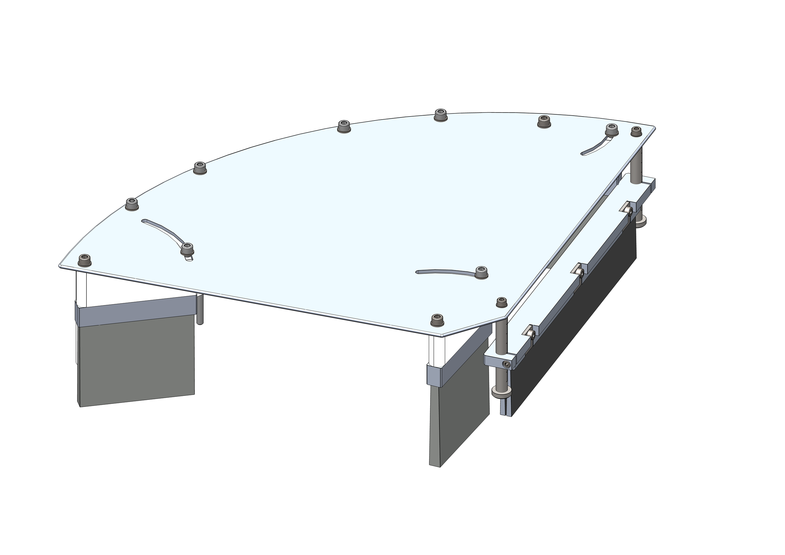

(brush)=
# [MEC] **Brush Diverter**

## Componenti del gruppo
Il gruppo **brush diverter** può comprendere fino a **4 spazzole**:

:::{raw} html

<!-- Tab bar -->

  <button class="fb-tab on"    onclick="fbSwitchTab('Spazzole',this)">Spazzole</button>

<!-- ══════════ Spazzole ══════════ -->

  

    

      
      
      

      
Seleziona un componente dalla lista

    

    

      
N.ComponenteDescrizione

      

    

  

:::

---

## Applicazioni consigliate

Preferire il gruppo **brush diverter**:

- Rispetto ai soffi quando i componenti sono **troppo pesanti** per essere spostati dal getto d'aria;
- Rispetto ai deviatori standard quando si utilizzano **superfici spike**.

---

## Procedura di montaggio

:::{warning} Attenzione
Assicurarsi che il FlexiBowl® sia **spento e fermo** prima di procedere con il montaggio.
:::

| Step | Operazione |
|:----:|-----------|
| 1 | Rimuovere tutto il gruppo **schermo-barriera flip** svitando le **quattro viti** di fissaggio |
| 2 | Sostituire lo schermo con il gruppo **brush diverter** |
| 3 | Fissare il nuovo gruppo **brush diverter-barriera flip** |

---

## Procedura di regolazione

:::{warning} Attenzione
Assicurarsi che il FlexiBowl® sia **spento e fermo** prima di procedere con la regolazione.
:::

### Spazzole centrale e deviatori

| Step | Operazione |
|:----:|-----------|
| 1 | Allentare le **due viti** di fissaggio |
| 2 | Sfruttare l'**asola** per portare la spazzola nella posizione desiderata |
| 3 | Stringere di nuovo le **viti di fissaggio** |

### Spazzola regolabile

| Step | Operazione |
|:----:|-----------|
| 1 | Allentare le **viti** ai lati del supporto |
| 2 | Far scorrere la spazzola sulle **colonne graduate** fino alla posizione desiderata |
| 3 | Stringere le **viti** ai lati del supporto |

---

## Valutazione del corretto funzionamento

Effetuare una prova di movimentazione del FlexiBowl® per valutare l'efficacia dei deviatori.

---

:::{seealso}
Per ulteriori informazioni su accessori e configurazioni alternative, consultare:
- Manuale del deviatore standard
- Guida alle superfici spike compatibili
- Scheda tecnica FlexiBowl®
:::