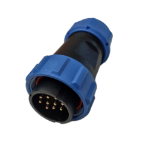

<style>
.compare-grid {
  display: grid;
  grid-template-columns: 1fr 1fr;
  gap: 1rem;
  margin: 1rem 0 1.5rem;
}
@media (max-width: 680px) {
  .compare-grid { grid-template-columns: 1fr; }
}
.compare-card {
  border: 1px solid #5a9fd4;
  border-radius: 7px;
  overflow: hidden;
  font-size: 0.92rem;
}
.compare-card-header {
  padding: 0.5rem 1rem;
  font-weight: 700;
  font-size: 0.82rem;
  letter-spacing: 0.05em;
  color: #ffffff;
}
.v20 .compare-card-header { background: #1a4a7a; }
.v30 .compare-card-header { background: #1e6fbf; }
.compare-card-body {
  padding: 0.85rem 1rem;
}
.compare-card-body p, .compare-card-body li { margin: 0.25rem 0; }
.compare-card-body ul, .compare-card-body ol { padding-left: 1.2rem; margin: 0.4rem 0; }
.compare-card-body table {
  width: 100%;
  border-collapse: collapse;
  margin: 0.5rem 0;
  font-size: 0.88rem;
}
.compare-card-body table th {
  padding: 0.35rem 0.6rem;
  text-align: left;
  font-size: 0.78rem;
  font-weight: 700;
  border-bottom: 2px solid #5a9fd4;
  opacity: 0.75;
}
.compare-card-body table td {
  padding: 0.35rem 0.6rem;
  border-bottom: 1px solid rgba(90, 159, 212, 0.3);
}
.compare-card-body table tr:last-child td { border-bottom: none; }
</style>

# [ELE] **Comparativa Elettrica**

Questa pagina confronta le principali differenze elettriche tra **FlexiBowl® 2.0** e **FlexiBowl® 3.0**, in termini di alimentazione, connettività e sicurezza.

:::{important}
Prima di leggere i contenuti della pagina corrente, è buona pratica avere chiare le informazioni riportate nella pagina [Specifiche Elettriche e Pneumatiche](dati_elettrici)
:::

---

## 1. Alimentazione

```{list-table}
:header-rows: 1
:widths: 25 37 38

* -
  - FlexiBowl® 2.0
  - FlexiBowl® 3.0
* - **Alimentazione AC**
  - 110-220 Vac ±5%
  - 110-230 Vac ±5%
* - **Frequenza**
  - 50/60 Hz
  - 50/60 Hz
* - **Potenza nominale**
  - 150 W
  - 345-920 W *(in base alla taglia FlexiBowl®)*
* - **Alimentazione DC**
  - Generata internamente
  - Generata internamente
```

:::{note}
FlexiBowl® 3.0 assorbe una potenza nominale superiore rispetto alla generazione precedente, poiché l'elettronica di azionamento (drive) è integrata direttamente nell'unità.
:::

---

## 2. Connettività Ethernet

<div class="compare-grid">
<div class="compare-card v20">
<div class="compare-card-header">FlexiBowl® 2.0</div>
<div class="compare-card-body">

Connettore **RJ45** standard.

</div>
</div>
<div class="compare-card v30">
<div class="compare-card-header">FlexiBowl® 3.0</div>
<div class="compare-card-body">

Connettore **M12 D-code**.

</div>
</div>
</div>

---

## 3. Sicurezza

<div class="compare-grid">
<div class="compare-card v20">
<div class="compare-card-header">FlexiBowl® 2.0</div>
<div class="compare-card-body">

Per arrestare in sicurezza l'unità è necessario **scollegare completamente l'alimentazione a 230 Vac**.

</div>
</div>
<div class="compare-card v30">
<div class="compare-card-header">FlexiBowl® 3.0</div>
<div class="compare-card-body">



Funzione **Safe Torque Off (STO)** integrata, che consente l'arresto sicuro senza dover scollegare l'alimentazione.

</div>
</div>
</div>

:::{note}
Per i dettagli sui canali STO e sul relativo cablaggio, fare riferimento alla pagina [Interfaccia Elettrica](dati_elettrici).
:::

---

## 4. Sintesi

FlexiBowl® 3.0 assorbe più potenza rispetto alla generazione precedente per via dell'elettronica di azionamento integrata, ma introduce un connettore Ethernet più robusto (M12 D-code) e una funzione di sicurezza STO integrata, che evita la necessità di scollegare l'alimentazione per arrestare l'unità in sicurezza.
