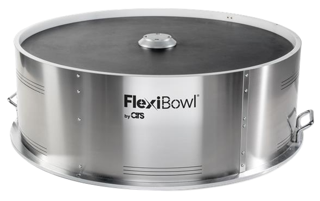
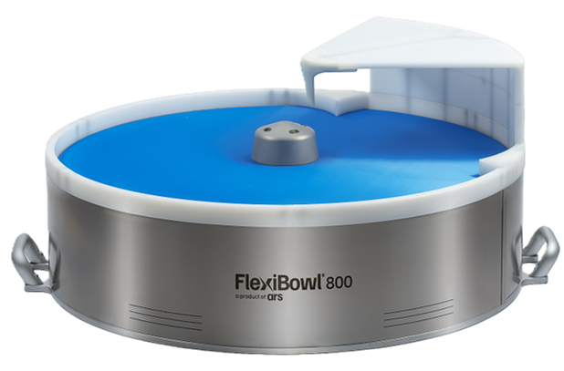

<style>
.compare-grid {
  display: grid;
  grid-template-columns: 1fr 1fr;
  gap: 1rem;
  margin: 1rem 0 1.5rem;
}
@media (max-width: 680px) {
  .compare-grid { grid-template-columns: 1fr; }
}
.compare-card {
  border: 1px solid #5a9fd4;
  border-radius: 7px;
  overflow: hidden;
  font-size: 0.92rem;
}
.compare-card-header {
  padding: 0.5rem 1rem;
  font-weight: 700;
  font-size: 0.82rem;
  letter-spacing: 0.05em;
  color: #ffffff;
}
.v20 .compare-card-header { background: #1a4a7a; }
.v30 .compare-card-header { background: #1e6fbf; }
.compare-card-body {
  padding: 0.85rem 1rem;
  text-align: center;
}
.compare-card-body p, .compare-card-body li { margin: 0.25rem 0; }
.compare-card-body ul, .compare-card-body ol { padding-left: 1.2rem; margin: 0.4rem 0; text-align: left; }
.compare-card-body table {
  width: 100%;
  border-collapse: collapse;
  margin: 0.5rem 0;
  font-size: 0.88rem;
}
.compare-card-body table th {
  padding: 0.35rem 0.6rem;
  text-align: left;
  font-size: 0.78rem;
  font-weight: 700;
  border-bottom: 2px solid #5a9fd4;
  opacity: 0.75;
}
.compare-card-body table td {
  padding: 0.35rem 0.6rem;
  border-bottom: 1px solid rgba(90, 159, 212, 0.3);
}
.compare-card-body table tr:last-child td { border-bottom: none; }
</style>

# [MEC] **Comparativa Meccanica**

Questa pagina confronta le principali differenze meccaniche tra **FlexiBowl® 2.0** e **FlexiBowl® 3.0**, in termini di dimensioni e peso.

:::{important}
Prima di leggere i contenuti della pagina corrente, è buona pratica avere chiare le informazioni riportate nella pagina [Specifiche Meccaniche](mech_specs)
:::

---

## 1. Dimensioni e peso

<div class="compare-grid">
<div class="compare-card v20">
<div class="compare-card-header">FlexiBowl® 2.0</div>
<div class="compare-card-body">



</div>
</div>
<div class="compare-card v30">
<div class="compare-card-header">FlexiBowl® 3.0</div>
<div class="compare-card-body">



</div>
</div>
</div>

FlexiBowl® 3.0 adotta un design **più compatto e snello** rispetto alla generazione precedente: a parità di modello risulta generalmente **più leggero** e **più basso**, con una riduzione di larghezza di circa il **5%**.

```{list-table} Peso e altezza per modello
:header-rows: 2
:widths: 24 19 19 19 19

* -
  - Peso
  -
  - Altezza (h)
  -
* -
  - FB 2.0
  - FB 3.0
  - FB 2.0
  - FB 3.0
* - **FlexiBowl® 200**
  - 6 kg
  - 7 kg
  - 186 mm
  - 186 mm
* - **FlexiBowl® 350**
  - 25 kg
  - 14 kg
  - 299,5 mm
  - 203 mm
* - **FlexiBowl® 500**
  - 42 kg
  - 35 kg
  - 296 mm
  - 217 mm
* - **FlexiBowl® 500E**
  - 42 kg
  - 35 kg
  - 296 mm
  - 217 mm
* - **FlexiBowl® 650**
  - 54 kg
  - 51 kg
  - 296 mm
  - 217 mm
* - **FlexiBowl® 800**
  - 71 kg
  - 67 kg
  - 296 mm
  - 217 mm
* - **FlexiBowl® 1200**
  - 170 kg
  - 144 kg
  - 328 mm
  - 248 mm
```

:::{note}
FlexiBowl® 200 è l'unico modello in cui il peso di FlexiBowl® 3.0 risulta **superiore** a quello della generazione 2.0.
:::

---

## 2. Sintesi

FlexiBowl® 3.0 offre un design meccanico più compatto rispetto alla generazione precedente, risultando in generale più leggero, più basso e circa il 5% più stretto a parità di modello.

Per i valori dimensionali puntuali di ciascun modello, fare riferimento alle rispettive pagine di [Specifiche Meccaniche](mech_specs) di FlexiBowl® 2.0 e 3.0.
