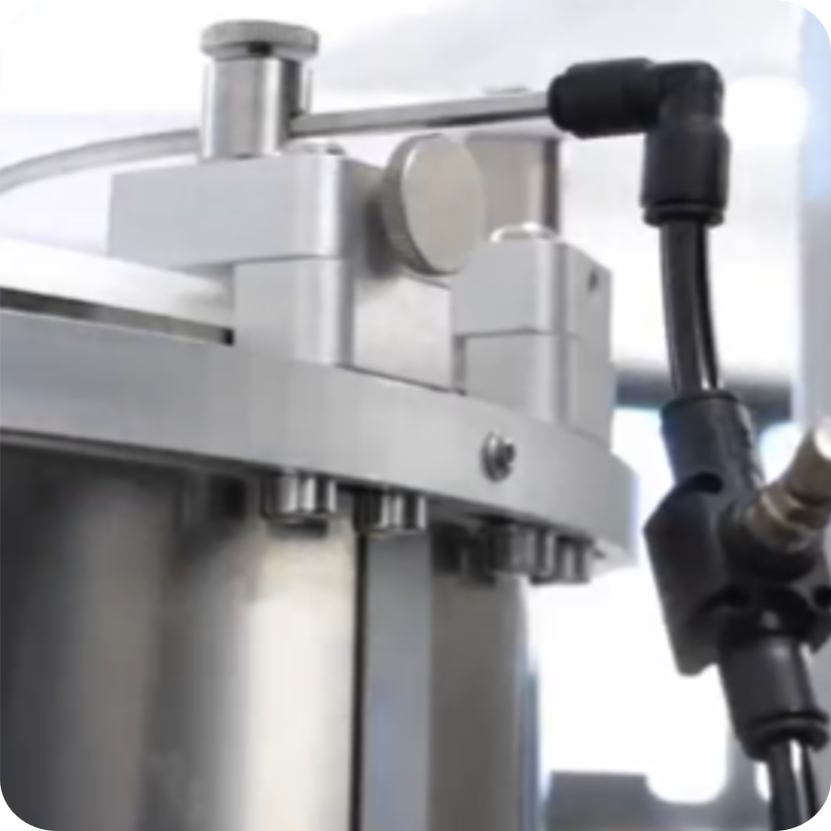

<style>
.compare-grid {
  display: grid;
  grid-template-columns: 1fr 1fr;
  gap: 1rem;
  margin: 1rem 0 1.5rem;
}
@media (max-width: 680px) {
  .compare-grid { grid-template-columns: 1fr; }
}
.compare-card {
  border: 1px solid #5a9fd4;
  border-radius: 7px;
  overflow: hidden;
  font-size: 0.92rem;
}
.compare-card-header {
  padding: 0.5rem 1rem;
  font-weight: 700;
  font-size: 0.82rem;
  letter-spacing: 0.05em;
  color: #ffffff;
}
.v20 .compare-card-header { background: #1a4a7a; }
.v30 .compare-card-header { background: #1e6fbf; }
.compare-card-body {
  padding: 0.85rem 1rem;
  text-align: center;
}
.compare-card-body p, .compare-card-body li { margin: 0.25rem 0; text-align: left; }
.compare-card-body ul, .compare-card-body ol { padding-left: 1.2rem; margin: 0.4rem 0; }
.compare-card-body table {
  width: 100%;
  border-collapse: collapse;
  margin: 0.5rem 0;
  font-size: 0.88rem;
}
.compare-card-body table th {
  padding: 0.35rem 0.6rem;
  text-align: left;
  font-size: 0.78rem;
  font-weight: 700;
  border-bottom: 2px solid #5a9fd4;
  opacity: 0.75;
}
.compare-card-body table td {
  padding: 0.35rem 0.6rem;
  border-bottom: 1px solid rgba(90, 159, 212, 0.3);
}
.compare-card-body table tr:last-child td { border-bottom: none; }
.compare-card-body video { border-radius: 4px; }
</style>

# [PNU] **Comparativa Pneumatica**

Questa pagina confronta le principali differenze pneumatiche tra **FlexiBowl® 2.0** e **FlexiBowl® 3.0**.

:::{important}
Prima di leggere i contenuti della pagina corrente, è buona pratica avere chiare le informazioni riportate nella pagina [Specifiche Elettriche e Pneumatiche](elec_pneu_specs)
:::

---

## 1. Caratteristiche dell'aria compressa

```{list-table}
:header-rows: 1
:widths: 30 35 35

* -
  - FlexiBowl® 2.0
  - FlexiBowl® 3.0
* - **Pressione aria richiesta**
  - 6 Bar
  - 7 Bar
* - **Caratteristiche dell'aria**
  - Filtrata ed essiccata
  - Aria compressa pulita secondo ISO 8573-1:2010, classe 1.3.2
```

---

## 2. Regolazione e lettura della pressione

<div class="compare-grid">
<div class="compare-card v20">
<div class="compare-card-header">FlexiBowl® 2.0</div>
<div class="compare-card-body">


La forza dell'impulso viene regolata tramite il **regolatore dell'aria compressa**, posizionato sul pannello di controllo. Il relativo indicatore di pressione è **integrato nel pannello**.

</div>
</div>
<div class="compare-card v30">
<div class="compare-card-header">FlexiBowl® 3.0</div>
<div class="compare-card-body">

<video width="100%" controls poster="video/flip_pressure_v30_poster.jpg">
  <source src="../../../../_shared/media/videos/flip_pressure_v30_demo.mp4" type="video/mp4">
</video>

Regolazione e lettura della pressione impostabili **direttamente dall'interfaccia software**.

</div>
</div>
</div>

---

## 3. Controllo del soffio (Blow)

<div class="compare-grid">
<div class="compare-card v20">
<div class="compare-card-header">FlexiBowl® 2.0</div>
<div class="compare-card-body">



Regolazione tramite componentistica pneumatica fisica (raccordi e regolatori sull'unità).

</div>
</div>
<div class="compare-card v30">
<div class="compare-card-header">FlexiBowl® 3.0</div>
<div class="compare-card-body">

<video width="100%" controls poster="video/blow_control_v30_poster.jpg">
  <source src="../../../../_shared/media/videos/blow_control_v30_demo.mp4" type="video/mp4">
</video>

Controllo nativo del soffio (**Native Blow Control**) direttamente da interfaccia software: Flip Pressure, Flip Count, Flip Delay, Blow Pressure, Blow Time.

</div>
</div>
</div>

:::{note}
Per i dettagli sul collegamento dell'alimentazione dell'aria, fare riferimento alla pagina [Interfaccia Elettrica e Pneumatica](elec_pneu_interface).
:::

---

## 4. Sintesi

FlexiBowl® 3.0 richiede una pressione dell'aria leggermente superiore (7 Bar contro 6 Bar) e specifica una classe di pulizia ISO 8573-1:2010 1.3.2, non definita sulla generazione precedente. La differenza più rilevante dal punto di vista dell'usabilità è lo spostamento della regolazione e della lettura di pressione, flip e soffio dai componenti fisici del pannello all'interfaccia software.
