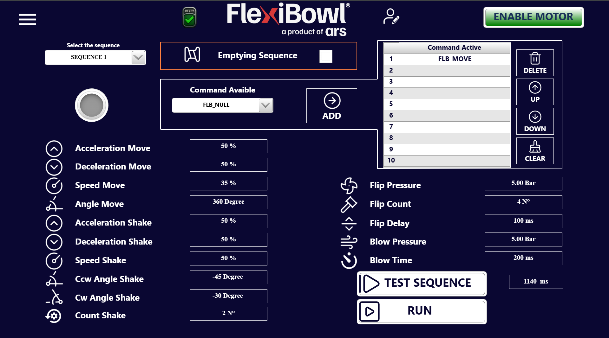

# **Comparativa Software**

Questa pagina confronta le principali differenze software tra **FlexiBowl® 2.0** e **FlexiBowl® 3.0**, con l'obiettivo di guidare l'utente nella comprensione delle nuove funzionalità e dei cambiamenti operativi introdotti dalla nuova generazione.

---

## 1. Protocolli di comunicazione disponibili

| Protocollo | FlexiBowl® 2.0 | FlexiBowl® 3.0 |
|---|---|---|
| TCP/IP – UDP | ✅ | ✅ (TCP Server) |
| EtherNet/IP | ✅ | ✅ |
| Profinet | ❌ | ✅ |
| Modbus | ❌ | ✅ |
| Digital I/O | ✅ | ✅ (opzionale) |

**FlexiBowl® 2.0** supporta TCP/IP (UDP, porta 7776 TCP / 7775 UDP), EtherNet/IP e Digital I/O. I comandi vengono inviati come stringhe ASCII con header `Chr(0)Chr(7)` e footer `Chr(13)`.

**FlexiBowl® 3.0** introduce due nuovi protocolli — **Profinet** e **Modbus** — e adotta un modello di comunicazione basato su **ControlWord numeriche** e variabili di Input/Output (EXE / WRITE / READ). Il TCP Server utilizza stringhe in formato `NomeVariabile[Valore]%`. La modalità Digital I/O rimane disponibile come opzione acquistabile separatamente.

---

## 2. Interfaccia utente: com'è fatta e come si accede

### FlexiBowl® 2.0 — Software *FlexiBowl® Parameters*

L'interfaccia del FlexiBowl® 2.0 è un'applicazione **desktop** chiamata **FlexiBowl® Parameters**, da installare sul PC di controllo.

**Installazione e accesso:**

1. Installare il programma **FlexiBowl® Parameters** sul PC (fornito da ARS o scaricabile dal portale).
2. Collegare il PC al FlexiBowl® tramite **cavo Ethernet** (LAN diretta o via switch).
3. Avviare il programma e inserire l'**indirizzo IP** del FlexiBowl® per connettersi.

**Struttura dell'interfaccia:**

Il menu laterale presenta cinque voci principali:

| Voce | Descrizione |
|---|---|
| **1 – Main Commands** | Finestra principale per la configurazione e il test di Move e Shake |
| **2 – Try Commands** | Crea e testa sequenze combinate di comandi |
| **3 – Monitor** | Monitora lo stato I/O, il driver e gli allarmi |
| **4 – Console** | Invia comandi stringa direttamente al driver |
| **5 – Reset Option** | Ripristina i parametri ai valori di fabbrica e gestisce lo svuotamento manuale |

Dalla schermata **Main Commands** sono direttamente accessibili i pannelli **Move**, **Shake** e **Option** tramite tab nella parte superiore.

---

### FlexiBowl® 3.0 — Interfaccia web *browser-based*

L'interfaccia del FlexiBowl® 3.0 è **completamente web-based**: non richiede alcuna installazione. È sufficiente un browser moderno.

**Accesso:**

1. Collegare il PC al FlexiBowl® tramite Ethernet.
2. Aprire il browser e digitare nella barra degli indirizzi l'**indirizzo IP** del FlexiBowl®.
3. Si apre la **Home page** dell'interfaccia.

:::{note}
Se il sistema in uso è **FlexiVision One**, la configurazione viene gestita dalla sua interfaccia dedicata. Non è necessario utilizzare l'interfaccia software FlexiBowl® descritta in questa sezione.
:::

**Struttura dell'interfaccia:**

Il menu laterale del FlexiBowl® 3.0 include pagine dedicate a ogni funzione operativa (Main Command, Jog Motor, Setup, Monitor, ecc.), accessibili direttamente dal browser.

---

## 3. Come cambiare l'indirizzo IP

### FlexiBowl® 2.0

1. Aprire il programma **FlexiBowl® Parameters**.
2. Nella schermata di connessione, selezionare **Change IP Address**.
3. Inserire il nuovo indirizzo IP desiderato e confermare.
4. In caso di IP sconosciuto o irraggiungibile, è possibile recuperarlo tramite la procedura di **IP Address Recovery** descritta nel manuale (sezione 6.2.3), che prevede l'uso del pulsante fisico sul pannello di controllo.

### FlexiBowl® 3.0

1. Aprire il browser e accedere all'interfaccia tramite l'IP corrente.
2. Dal menu laterale, aprire la pagina **Setup**.
3. Cliccare su **Get IP** per leggere i parametri di rete correnti.
4. Inserire il nuovo indirizzo IP nei campi dedicati e cliccare **Set IP**.
5. Cliccare **Apply** per confermare, poi **Reboot** per rendere effettive le modifiche.

:::{important}
Dopo il reboot, riconnettersi al FlexiBowl® utilizzando il nuovo indirizzo IP impostato.
:::

---

## 4. Come gestire i movimenti

### FlexiBowl® 2.0

I movimenti vengono configurati e testati direttamente dall'interfaccia **Main Commands**, che espone tre pannelli:

- **Move**: imposta Acceleration, Deceleration, Speed e Angle tramite slider o campo numerico. Il pulsante **Test Move** esegue il movimento con i valori impostati.
- **Shake**: espone i parametri CCW Angle, CW Angle, Count, Acceleration, Deceleration e Speed. Il pulsante **Test Shake** esegue lo shake.
- **Try Commands** (sezione 6.2.5): permette di combinare più comandi in una sequenza con un numero configurabile di loop, selezionando i comandi dalla lista **All Commands** e aggiungendoli alla lista **Selected Commands**.

Per eseguire movimenti in produzione tramite protocollo, si inviano comandi ASCII (es. `QX2` per Move, `QX6` per Shake) attraverso il canale TCP/UDP configurato.

### FlexiBowl® 3.0

I movimenti sono organizzati in **sequenze** (fino a 20), configurabili dalla pagina **Main Command** dell'interfaccia web. Ogni sequenza contiene una lista di comandi (fino a 10 slot), con i relativi parametri di Move, Shake, Flip e Blow.

Dalla pagina **Main Command** è possibile:

- Selezionare la sequenza da configurare tramite il menu a tendina **Select the sequence**.
- Impostare tutti i parametri (Acceleration/Deceleration/Speed Move, Angle Move, parametri Shake, Flip e Blow) direttamente nei campi numerici.
- Aggiungere comandi alla lista tramite il selettore **Command Available** + pulsante **ADD**.
- Riordinare i comandi con i pulsanti **UP** / **DOWN**, eliminarli con **DELETE** o svuotare la lista con **CLEAR**.
- Testare la sequenza con **TEST SEQUENCE** o avviarla in produzione con **RUN**.

Per la modalità manuale continua, la pagina **Jog Motor** consente di avviare una rotazione continua con parametri di Speed (positivo = orario, negativo = antiorario), Acceleration e Deceleration, con possibilità di attivare contestualmente Flip e Blow.

Per eseguire movimenti in produzione tramite protocollo, si invia la ControlWord corrispondente (es. `10[0]%` per eseguire la Sequenza 1 via TCP, oppure ControlWord `10` via EtherNet/IP o Profinet).

---

## 5. Come cambiare i parametri

### FlexiBowl® 2.0

I parametri operativi (velocità, angoli, accelerazioni) vengono modificati in due modalità:

- **Interfaccia grafica**: tramite gli slider o i campi numerici nelle schermate Move e Shake di **Main Commands**.
- **Via protocollo (runtime)**: usando comandi di lettura/scrittura come `RW` (Write) e `RL` (Read) inviati tramite TCP/UDP. I valori da inviare al driver devono essere moltiplicati per il **fattore di riduzione** della macchina (ottenuto con il comando `RR114`), poiché i parametri sono espressi in unità interne del driver.

### FlexiBowl® 3.0

I parametri vengono modificati in tre modalità:

- **Interfaccia web**: direttamente nei campi numerici della pagina **Main Command** per ogni sequenza.
- **Via protocollo WRITE**: usando le ControlWord del blocco WRITE (formula: `N × 100 + offset_parametro`) per scrivere singoli parametri di una sequenza dall'esterno.
- **Via protocollo READ**: usando le ControlWord del blocco READ (formula: `10000 + N × 100 + offset_parametro`) per leggere i valori correnti.

I valori sono espressi in **unità fisiche dirette** (%, gradi, ms, bar) senza fattori di conversione.

---

### 5.1 Esempio pratico: Move + Shake su FlexiBowl® 800

Lo scenario è il seguente: eseguire un **Move** a 360°, poi uno **Shake**, poi un wait di 200 ms; accendere il backlight; impostare i parametri di movimento con acceleration/deceleration al 50%, speed al 35%, shake con angoli CW -30° e CCW -45°, count 2.

#### Con FlexiBowl® 2.0

I parametri devono essere scalati tramite il **fattore di riduzione** della macchina. La sequenza di comandi da inviare via TCP/UDP è:

```
QX7                          → Accendi backlight
RR114                        → Leggi fattore di riduzione → variabile_riduzione

RL1 (50 × variabile_riduzione)  → RW11  → Scrivi Acceleration Move = 50%
RL1 (50 × variabile_riduzione)  → RW12  → Scrivi Deceleration Move = 50%
RL1 (35 × variabile_riduzione)  → RW13  → Scrivi Speed Move = 35%
RL1 (360 × variabile_riduzione) → RW14  → Scrivi Angle Move = 360°
QX2                          → Esegui Move

RL1 (50 × variabile_riduzione)  → RW15  → Scrivi Acceleration Shake = 50%
RL1 (50 × variabile_riduzione)  → RW16  → Scrivi Deceleration Shake = 50%
RL1 (50 × variabile_riduzione)  → RW110 → Scrivi Speed Shake = 50%
RL1 (30 × variabile_riduzione)  → RW18  → Scrivi Angle CW Shake = -30°
RL1 (30 × variabile_riduzione)  → RW19  → Scrivi Angle CCW Shake = -45°
RL1 2                        → RW17  → Scrivi Count Shake = 2
QX6                          → Esegui Shake
```

Il wait di 200 ms è gestito dal sistema chiamante (robot o PLC), in attesa che il FlexiBowl® abbia completato il comando corrente prima di inviare il successivo.

#### Con FlexiBowl® 3.0

I parametri si impostano direttamente dall'interfaccia web, senza conversioni. Dalla pagina **Main Command**:

1. Selezionare **SEQUENCE 1** dal menu a tendina.
2. Impostare i campi:
   - Acceleration Move: `50 %`
   - Deceleration Move: `50 %`
   - Speed Move: `35 %`
   - Angle Move: `360 Degree`
   - Acceleration Shake: `50 %`
   - Deceleration Shake: `50 %`
   - Speed Shake: `50 %`
   - Ccw Angle Shake: `-45 Degree`
   - Cw Angle Shake: `-30 Degree`
   - Count Shake: `2 N°`

3. Aggiungere alla lista dei comandi: `FLB_MOVE`, poi `FLB_SHAKE`.
4. Verificare che il Backlight sia abilitato dalla pagina **Option** (toggle Backlight 1).
5. Il wait di 200 ms si gestisce aggiungendo il comando `FLB_WAIT` alla lista con il valore opportuno, oppure lato sistema chiamante.

Per eseguire la sequenza via protocollo TCP, inviare:

```
10[0]%    → Esegui Sequenza 1
```

Il sistema risponde con `10[0]%` a conferma dell'avvenuta esecuzione. Non è necessario calcolare fattori di riduzione: tutti i valori sono in unità fisiche.

---

## 6. Come leggere gli allarmi

### FlexiBowl® 2.0

Gli allarmi si consultano dalla sezione **Monitor → Alarm Status** del programma **FlexiBowl® Parameters**. La schermata mostra una lista di stati del driver con indicatori LED (verde = OK, rosso = errore). La schermata **Driver Status** mostra in tempo reale tutte le variabili operative (Motor Enabled, In Motion, Drive Fault, ecc.).

Per il reset di un allarme via protocollo, inviare:

```
Chr(0)Chr(7)QX12Chr(13)    → Reset allarme e riabilitazione motore
```

### FlexiBowl® 3.0

Gli allarmi si consultano dalla pagina **Monitor** dell'interfaccia web, con tre tab: **I/O Status**, **Driver Status** e **Alarm Status**.

Via protocollo, il segnale di allarme è esposto dalla variabile di output **In_Error** (BOOL) e il codice dell'errore attivo è disponibile in **ErrorCode** (UDINT). Per leggere lo stato via TCP:

```
InError%         → risposta: InError[1]% se c'è errore, InError[0]% se OK
ErrorCode%       → risposta: ErrorCode[N]% con il codice dell'errore attivo
```

Per il reset dell'allarme:

- Via protocollo TCP: `Reset%`
- Via variabile digitale: fronte di salita sul segnale di input **Reset** (BOOL)

:::{warning}
Prima di eseguire il reset, identificare e risolvere la causa dell'errore. Il sistema non eseguirà nuovi comandi di movimento finché è presente un errore attivo.
:::

---

## 7. Modalità tracking (FlexiTrack)

### FlexiBowl® 2.0 — FlexiTrack (opzione)

La modalità **FlexiTrack** è un'opzione acquistabile separatamente che consente di mantenere il FlexiBowl® in **rotazione continua** (jog) sincronizzando il segnale encoder con il robot di pick, per aumentare la produttività in applicazioni ad alta cadenza.

**Hardware richiesto:**

- Connessione all'**encoder interno** tramite il connettore del pannello di controllo (segnale quadratura TTL, 4000 conteggi/giro sul motore; per FlexiBowl® 500/650/800 con riduzione 1:3 → 12000 conteggi/giro sul disco).
- In alternativa, installazione di un **encoder esterno** (incremental, TTL RS422, ≥ 12000 ppr) sul perno solidale alla puleggia condotta.

:::{important}
Con FlexiTrack, il controllo del movimento è possibile **solo via protocollo Ethernet** (TCP/UDP). Il protocollo Digital I/O non è supportato.
:::

**Comandi principali FlexiTrack (inviati via TCP/UDP):**

| Comando | Descrizione |
|---|---|
| `JA<valore>` | Imposta accelerazione/decelerazione in giri/s² |
| `JL<valore>` | Imposta decelerazione (se diversa da JA, inviare dopo JA) |
| `JS<valore>` | Imposta velocità di rotazione in giri/s |
| `CC<valore>` | Imposta corrente diretta al motore |
| `DI1` | Direzione oraria |
| `DI-1` | Direzione antioraria |
| `CJ` | Avvia jog (rotazione continua) |
| `SJ` | Ferma jog (con rampa JL) |
| `IL2` / `IH2` | Attiva / disattiva Flip |
| `IL3` / `IH3` | Attiva / disattiva Blow |

**Parametri consigliati:**

```
JA0.2    → accelerazione 0.2 giri/s²
JL0.2    → decelerazione 0.2 giri/s²
JS0.2    → velocità 0.2 giri/s
CC1.3    → corrente motore
DI1      → rotazione oraria
```

Flip e Blow, non gestibili con i comandi `QX` standard durante il jog, vanno implementati tramite un **programma in background** con ciclo iterativo che commuta lo stato delle valvole con i tempi e le iterazioni desiderati.

---

### FlexiBowl® 3.0 — Jog Motor

Nel FlexiBowl® 3.0, la modalità di rotazione continua è integrata nativamente nella pagina **Jog Motor** dell'interfaccia web, senza necessità di opzioni hardware aggiuntive.

**Parametri di movimento Jog:**

| Parametro | Unità | Descrizione |
|---|---|---|
| Acceleration | % | Rampa di accelerazione all'avvio |
| Deceleration | % | Rampa di decelerazione all'arresto |
| Speed | % | Velocità di rotazione. Valore **positivo** = orario; valore **negativo** = antiorario |

**Funzioni accessorie durante il Jog:**

Il jog gestisce direttamente Flip e Blow tramite toggle dedicati, senza necessità di programmi in background:

- **Flip Enable**: abilita il flip automatico ciclico durante il jog, con parametri di Flip Duration, Flip Pression e Flip Pause configurabili direttamente nell'interfaccia.
- **Blow Enable**: abilita il soffio automatico ciclico, con Blow Duration, Blow Pression, Blow Pause e Blow Type (BLOWc, BLOWe, BLOWc+BLOWe).
- **Backlight 1 / Backlight 2**: toggle per la gestione retroilluminazione, indipendente dallo stato del jog.

**Avvio e arresto:**

- **START JOG**: avvia la rotazione continua con i parametri impostati.
- **STOP JOG**: interrompe il jog con rampa di decelerazione.

Per controllare il jog via protocollo, usare le ControlWord EXE:

```
40[0]%    → Start Jog Seq (via TCP)
41[0]%    → Stop Jog Seq (via TCP)
```

:::{important}
Prima di avviare il jog, verificare che il motore sia abilitato (**ENABLE MOTOR** attivo) e che lo stato del sistema sia **READY**.
:::

---