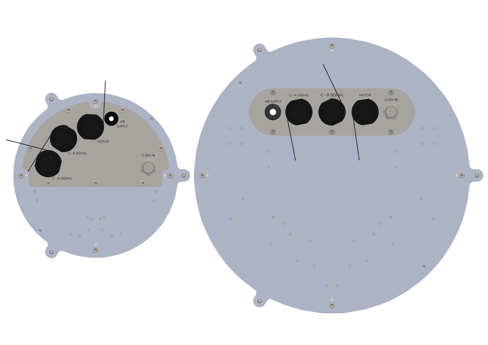

(intele)=
# [ELE] **Interfaccia Elettrica**

Il pannello connettori del FlexiBowl® varia in base alla versione della macchina:

:::{raw} html
<style>
.ie-tabs, .ie-wrap, .ie-tabs *, .ie-wrap * {
  box-sizing: border-box;
}
/* Applica margin e padding zero solo ai componenti del tuo pannello se necessario, 
   senza toccare il resto del sito di Sphinx */
.ie-tabs, .ie-panel, .ie-wrap, .ie-row, .ie-bubble, .ie-name, .ie-desc {
  margin: 0;
  padding: 0;
}
:root{
  --acc:#1a6fc4;--acc-dk:#0d4a8a;--acc-bg:#e8f1fb;
  --bd:#e0e0e0;--bg-p:#ffffff;--bg-s:#f7f8f9;--bg-h:#f0f4fa;
  --tx1:#1a1a1a;--tx2:#555;--tx3:#888;
  --r:10px;--tr:0.35s cubic-bezier(.4,0,.2,1);
}
.ie-tabs{display:flex;gap:6px;margin-bottom:12px;flex-wrap:wrap}
.ie-tab{padding:5px 14px;border-radius:6px;border:1.5px solid var(--bd);background:#fff;font-size:13px;font-weight:600;color:var(--tx2);cursor:pointer;transition:background var(--tr),color var(--tr),border-color var(--tr)}
.ie-tab:hover{background:var(--bg-h)}
.ie-tab.on{background:var(--acc-bg);color:var(--acc-dk);border-color:var(--acc)}
.ie-panel{display:none}
.ie-panel.on{display:block}
.ie-wrap{border:1px solid var(--bd);border-radius:var(--r);overflow:hidden;background:var(--bg-p);box-shadow:0 2px 12px rgba(0,0,0,0.07)}
.ie-img-outer{position:relative;width:100%;padding-top:70.71%}
.ie-img-outer img{position:absolute;inset:0;width:100%;height:100%;object-fit:contain;padding:0;transition:opacity var(--tr)}
.ie-img-base{opacity:1;z-index:1}
.ie-img-hl{opacity:0;z-index:2}
.ie-badge{position:absolute;top:12px;left:14px;z-index:3;background:var(--acc);color:#fff;font-size:12px;font-weight:600;padding:4px 10px;border-radius:20px;opacity:0;transform:translateY(-4px);transition:opacity var(--tr),transform var(--tr);pointer-events:none;white-space:nowrap}
.ie-badge.on{opacity:1;transform:translateY(0)}
.ie-hint{position:absolute;bottom:14px;left:50%;z-index:3;transform:translateX(-50%);font-size:13px;color:#fff;background:rgba(0,0,0,0.38);padding:6px 16px;border-radius:20px;pointer-events:none;transition:opacity var(--tr);white-space:nowrap}
.ie-list-panel{border-top:1px solid var(--bd);background:var(--bg-p)}
.ie-list-head{display:grid;grid-template-columns:40px 140px 1fr;gap:8px;padding:8px 14px;background:var(--bg-s);border-bottom:1px solid var(--bd);font-size:11px;font-weight:600;text-transform:uppercase;letter-spacing:.05em;color:var(--tx3)}
.ie-row{display:grid;grid-template-columns:40px 140px 1fr;gap:8px;align-items:center;padding:9px 14px;border-bottom:1px solid var(--bd);cursor:pointer;transition:background var(--tr);user-select:none}
.ie-row:last-child{border-bottom:none}
.ie-row:hover{background:var(--bg-h)}
.ie-row.on{background:var(--acc-bg)}
.ie-bubble{width:26px;height:26px;border-radius:50%;border:1.5px solid var(--bd);background:#fff;display:flex;align-items:center;justify-content:center;font-size:12px;font-weight:600;color:var(--tx2);flex-shrink:0;transition:background var(--tr),color var(--tr),border-color var(--tr)}
.ie-row.on .ie-bubble{background:var(--acc);color:#fff;border-color:var(--acc)}
.ie-name{font-size:13px;font-weight:600;color:var(--tx1);font-family:monospace;transition:color var(--tr)}
.ie-row.on .ie-name{color:var(--acc-dk)}
.ie-desc{font-size:12px;color:var(--tx2);line-height:1.55}
</style>
 
<!-- Tab bar -->
<div class="ie-tabs">
  <button class="ie-tab on" onclick="ieSwitchTab('smallpanel',this)">Pannello FlexiBowl® 200-350</button>
  <button class="ie-tab"    onclick="ieSwitchTab('rack',this)">Rack</button>
  <button class="ie-tab"    onclick="ieSwitchTab('stpanel',this)">Pannello Standard</button>
  <button class="ie-tab"    onclick="ieSwitchTab('encpanel',this)">Pannello Flexitracking</button>
</div>
<!-- ══════════ PANNELLO FB200-350 ══════════ -->
<div class="ie-panel on" id="ie-panel-smallpanel">
  <div class="ie-wrap">
    <div class="ie-img-outer">
      
      
      <div class="ie-badge" id="smallpanel-badge"></div>
      <div class="ie-hint"  id="smallpanel-hint">Seleziona un connettore dalla lista</div>
    </div>
    <div class="ie-list-panel">
      <div class="ie-list-head"><span>N.</span><span>Connettore</span><span>Descrizione</span></div>
      <div id="smallpanel-list"></div>
    </div>
  </div>
</div>
<!-- ══════════ RACK ══════════ -->
<div class="ie-panel" id="ie-panel-rack">
  <div class="ie-wrap">
    <div class="ie-img-outer">
      
      
      <div class="ie-badge" id="rack-badge"></div>
      <div class="ie-hint"  id="rack-hint">Seleziona un connettore dalla lista</div>
    </div>
    <div class="ie-list-panel">
      <div class="ie-list-head"><span>N.</span><span>Connettore</span><span>Descrizione</span></div>
      <div id="rack-list"></div>
    </div>
  </div>
</div>
<!-- ══════════ PANNELLO STANDARD ══════════ -->
<div class="ie-panel" id="ie-panel-stpanel">
  <div class="ie-wrap">
    <div class="ie-img-outer">
      
      
      <div class="ie-badge" id="stpanel-badge"></div>
      <div class="ie-hint"  id="stpanel-hint">Seleziona un connettore dalla lista</div>
    </div>
    <div class="ie-list-panel">
      <div class="ie-list-head"><span>N.</span><span>Connettore</span><span>Descrizione</span></div>
      <div id="stpanel-list"></div>
    </div>
  </div>
</div>
<!-- ══════════ PANNELLO FLEXITRACKING ══════════ -->
<div class="ie-panel" id="ie-panel-encpanel">
  <div class="ie-wrap">
    <div class="ie-img-outer">
      
      
      <div class="ie-badge" id="encpanel-badge"></div>
      <div class="ie-hint"  id="encpanel-hint">Seleziona un connettore dalla lista</div>
    </div>
    <div class="ie-list-panel">
      <div class="ie-list-head"><span>N.</span><span>Connettore</span><span>Descrizione</span></div>
      <div id="encpanel-list"></div>
    </div>
  </div>
</div>
<script>
(function(){
  var models = {
    smallpanel: {
      imgPath: '../../../../_shared/media/images/smallpanel',
      imgExt: '.PNG',
      comps: [
        {n:1, name:'C-A SIGNAL', desc:'Connettore C-A signal'},
        {n:2, name:'C-B SIGNAL', desc:'Connettore C-B Signal'},
        {n:3, name:'MOTOR',      desc:'Connettore cavo motore'},
        {n:4, name:'C-ETH FB',   desc:'Collegamento ethernet al rack'},
        {n:5, name:'AIR SUPPLY', desc:'Ingresso aria'}
      ]
    },
    rack: {
      imgPath: '../../../../_shared/media/images/rack',
      imgExt: '.PNG',
      comps: [
        {n:1, name:'POWER SUPPLY', desc:'Presa di corrente e interruttore; comprende anche un filtro IEC'},
        {n:2, name:'STO',          desc:'Connettore STO'},
        {n:3, name:'MOTOR',        desc:'Connettore cavo motore'},
        {n:4, name:'C-A SIGNAL',   desc:'Connettore C-A signal'},
        {n:5, name:'C-B SIGNAL',   desc:'Connettore C-B Signal'},
        {n:6, name:'C-ETH IN',     desc:'Connettore Ethernet'},
        {n:7, name:'HOPPER',       desc:'Connettore tramoggia'},
        {n:8, name:'C-ETH FB',     desc:'Collegamento Ethernet al FlexiBowl\u00ae'}
      ]
    },
    stpanel: {
      imgPath: '../../../../_shared/media/images/stpanel',
      imgExt: '.PNG',
      comps: [
        {n:1, name:'POWER SUPPLY', desc:'Presa di corrente e interruttore; comprende anche un filtro IEC'},
        {n:2, name:'AIR SUPPLY',   desc:'Ingresso aria'},
        {n:3, name:'LIGHT ON',     desc:'LED di stato backlight'},
        {n:4, name:'READY/FAULT',  desc:'LED di stato Ready/Fault'},
        {n:5, name:'HOPPER',       desc:'Connettore tramoggia'},
        {n:6, name:'C-ETH',        desc:'Connettore Ethernet'},
        {n:7, name:'STO',          desc:'Connettore STO'}
      ]
    },
    encpanel: {
      imgPath: '../../../../_shared/media/images/encpanel',
      imgExt: '.PNG',
      comps: [
        {n:1, name:'POWER SUPPLY', desc:'Presa di corrente e interruttore; comprende anche un filtro IEC'},
        {n:2, name:'LIGHT ON',     desc:'LED di stato backlight'},
        {n:3, name:'READY/FAULT',  desc:'LED di stato Ready/Fault'},
        {n:4, name:'HOPPER',       desc:'Connettore tramoggia'},
        {n:5, name:'C-ETH',        desc:'Connettore Ethernet'},
        {n:6, name:'ENCODER',      desc:'Passaggio cavo encoder'},
        {n:7, name:'AIR SUPPLY',   desc:'Ingresso aria'},
        {n:8, name:'I/O',          desc:'Connettore I/O'},
        {n:9, name:'STO',          desc:'Connettore STO'}
      ]
    }
  };
  var state = {};
  Object.keys(models).forEach(function(id){ state[id]={activeN:null,activeRow:null}; });
  Object.keys(models).forEach(function(id){
    var m  = models[id];
    var el = document.getElementById(id+'-list');
    m.comps.forEach(function(c){
      var row = document.createElement('div');
      row.className = 'ie-row';
      row.innerHTML = '<div class="ie-bubble">'+c.n+'</div>'
                    + '<div class="ie-name">'+c.name+'</div>'
                    + '<div class="ie-desc">'+c.desc+'</div>';
      row.addEventListener('click', function(){ toggle(id, c, row); });
      el.appendChild(row);
    });
  });
  function toggle(id, c, row){
    var s       = state[id];
    var m       = models[id];
    var imgBase = document.getElementById(id+'-img-base');
    var imgHl   = document.getElementById(id+'-img-hl');
    var badge   = document.getElementById(id+'-badge');
    var hint    = document.getElementById(id+'-hint');
    if(s.activeN === c.n){ reset(id); return; }
    if(s.activeRow) s.activeRow.classList.remove('on');
    row.classList.add('on');
    s.activeRow = row; s.activeN = c.n;
    badge.textContent = c.name + ' \u2014 ' + c.desc;
    badge.classList.add('on');
    hint.style.opacity = '0';
    var newImg = new Image();
    newImg.onload = function(){
      imgHl.src = newImg.src;
      imgHl.style.opacity = '1';
      imgBase.style.opacity = '0';
    };
    newImg.onerror = function(){
      imgBase.style.opacity = '1';
      imgHl.style.opacity = '0';
    };
    newImg.src = m.imgPath + c.n + m.imgExt;
  }
  function reset(id){
    var s       = state[id];
    var imgBase = document.getElementById(id+'-img-base');
    var imgHl   = document.getElementById(id+'-img-hl');
    var badge   = document.getElementById(id+'-badge');
    var hint    = document.getElementById(id+'-hint');
    if(s.activeRow) s.activeRow.classList.remove('on');
    s.activeRow = null; s.activeN = null;
    imgBase.style.opacity = '1';
    imgHl.style.opacity = '0';
    setTimeout(function(){ imgHl.src = ''; }, 350);
    badge.classList.remove('on');
    hint.style.opacity = '1';
  }
  window.ieSwitchTab = function(id, btn){
    document.querySelectorAll('.ie-panel.on').forEach(function(p){
      var oldId = p.id.replace('ie-panel-','');
      reset(oldId);
    });
    document.querySelectorAll('.ie-tab').forEach(function(b){ b.classList.remove('on'); });
    document.querySelectorAll('.ie-panel').forEach(function(p){ p.classList.remove('on'); });
    btn.classList.add('on');
    document.getElementById('ie-panel-'+id).classList.add('on');
  };
})();
</script>
:::


:::{warning}
Prima di effettuare qualsiasi connessione elettrica, assicurarsi che l'alimentazione sia disinserita e che il sistema sia in stato di sicurezza. 
:::

:::{important}
Lasciare circa {ref}`100mm di spazio libero <dim800>` attorno ai connettori di alimentazione per agevolare le operazioni di cablaggio e manutenzione.
:::

## Interfaccia Utente

### Collegamento Elettrico Pannello standard FlexiBowl 500-1200


```{list-table}
:widths: 8 52 40
:header-rows: 1

* - #
  - Azione
  - Immagine
* - 1
  - **Collegare lo STO.**

    <div class="ars-step-note">
    Connettore a 10 pin. Gli ingressi <strong>+STO1</strong> e <strong>+STO2</strong> devono ricevere <strong>+24 Vdc</strong> dal circuito di sicurezza; <strong>−STO1</strong> e <strong>−STO2</strong> vanno collegati al riferimento −24 Vdc. Senza questo collegamento il motore non può essere attivato.
    </div>

    <details class="ars-dropdown"><summary>Pinout connettore 10 pin</summary><div class="ars-dropdown-body">

    | Pin | Descrizione |
    |---|---|
    | 1 | +24 Vdc |
    | 2 | −24 Vdc |
    | 3 | +STO1 |
    | 4 | −STO1 |
    | 5 | +STO2 |
    | 6 | −STO2 |
    | 7–10 | NC |

    </div></details>
  -
    ```{image} ../../../../_shared/media/images/stpanel7.PNG
    :alt: Collegare lo STO
    ```

* - 2
  - **Collegare l'Ethernet (C-ETH).**

    <div class="ars-step-note">
    Connettore M12, codifica D-Code. Consente la comunicazione con il FlexiBowl®, accessibile anche tramite web browser.
    </div>

    <div class="ars-step-attn">
    Quando il FlexiBowl® è alimentato, il collegamento Ethernet è <strong>obbligatorio</strong>: se assente, la macchina entra in stato di <strong>ERROR</strong> (LED Ready/Fault rosso).
    </div>

    <details class="ars-dropdown"><summary>Pinout M12 → RJ45</summary><div class="ars-dropdown-body">

    Adattatore M12 8 poli → RJ45:

    | Pin | Colore |
    |---|---|
    | 1 | Giallo |
    | 2 | Arancione |
    | 3 | Bianco |
    | 4 | Non assegnato |
    | 5 | Non assegnato |
    | 6 | Blu |
    | 7 | Non assegnato |
    | 8 | Non assegnato |

    Connettore M12 D-code 4 poli:

    | Pin | Colore |
    |---|---|
    | 1 | Giallo |
    | 2 | Bianco |
    | 3 | Arancione |
    | 4 | Blu |

    </div></details>
  -
    ```{image} ../../../../_shared/media/images/stpanel6.PNG
    :alt: Collegare l'Ethernet
    ```

* - 3
  - **Collegare l'Hopper.**

    <div class="ars-step-note">
    Connettore M12 A-code, utilizzato per comunicare con i controller hopper ARS tramite protocollo <strong>Modbus RTU</strong>.
    </div>

    <details class="ars-dropdown"><summary>Pinout M12 A-code</summary><div class="ars-dropdown-body">

    | Pin | Colore |
    |---|---|
    | 1 | Marrone |
    | 2 | Bianco |
    | 3 | Blu |
    | 4 | Nero |
    | 5 | Grigio |

    </div></details>
  -
    ```{image} ../../../../_shared/media/images/stpanel5.PNG
    :alt: Collegare l'Hopper
    ```

* - 4
  - **Collegare l'alimentazione (Power Supply).**

    <div class="ars-step-attn">
    Assicurarsi che il FlexiBowl® sia <strong>spento</strong> prima di collegare l'alimentazione, e che il dispositivo sia collegato a terra.
    </div>

    <div class="ars-step-warn">
    Tensione ammessa: <strong>120–230 Vac, 50/60 Hz</strong>. Utilizzare esclusivamente il connettore fornito in dotazione, identificato con la sigla <strong>POWER SUPPLY</strong>.
    </div>

    <div class="ars-step-note">
    Il connettore di alimentazione è provvisto di un supporto per l'alloggiamento di <strong>n. 2 fusibili</strong>, con funzione di protezione da eventuali anomalie elettriche. Al primo avvio, verificarne sempre lo stato prima di accendere il dispositivo. L'accensione/spegnimento avviene tramite l'apposito pulsante di alimentazione.
    </div>

    <details class="ars-dropdown"><summary>Schema pinout cavo alimentazione</summary><div class="ars-dropdown-body">

    | Colore | Tipo | Etichetta |
    |---|---|---|
    | Marrone | Fase | L1 |
    | Blu | Neutro | N1 |
    | Giallo/Verde | Terra | PE1 |

    </div></details>
  -
    ```{image} ../../../../_shared/media/images/stpanel1.PNG
    :alt: Collegare l'alimentazione
    ```

* - 5
  - **Verificare i LED di stato.**

    Dopo l'accensione, attendere che il LED di stato **Ready/Fault** si accenda: se Hopper e C-ETH sono collegati correttamente, il LED sarà **verde**.

    <div class="ars-step-note">
    Il pannello frontale dispone di due LED:
    </div>

    <details class="ars-dropdown"><summary>Significato dei LED</summary><div class="ars-dropdown-body">

    | LED | Colore | Significato |
    |---|---|---|
    | Light ON | Verde (unico stato) | Indica se il backlight del sistema di visione è ON o OFF. Attivabile via software di visione o da comandi Ethernet esterni. |
    | Ready / Fault | Verde | Sistema operativo, privo di anomalie, collegamento Ethernet corretto. |
    | Ready / Fault | Rosso | Anomalia interna o anomalia nel collegamento Ethernet: fare riferimento alla tabella delle anomalie. |

    </div></details>
  -

* - 6
  - **Collegare l'aria compressa** con tubo **Ø 8 mm**.

    :::{note}
    Per le caratteristiche dell'aria richieste (pressione, classe di pulizia ISO) fare riferimento ai [Dati Tecnici Pneumatici](datipneum).
    :::
  -
    ```{image} ../../../../_shared/media/images/connectAir.png
    :alt: Collegare l'aria compressa Ø8mm
    ```
```

---

### Collegamento Elettrico Pannello FlexiBowl 200 e 350


I modelli FlexiBowl® FB 200 e FB 350 sono dotati di un **Rack** esterno, contenente tutti i dispositivi elettronici necessari al funzionamento. I collegamenti verso gli impianti del cliente si trovano sul rack (non sulla macchina); il rack va poi collegato alla macchina tramite 4 cavi dedicati.

#### Collegamento tra Rack e FlexiBowl®

Il rack comunica con il FlexiBowl® tramite 4 cavi dedicati, ciascuno da collegare **esclusivamente** alla porta con l'etichetta corrispondente sul pannello.

:::{attention}
Collegare ogni cavo alla porta con l'**etichetta corrispondente** (es. MOTOR ↔ MOTOR, C-A SIGNAL ↔ C-A SIGNAL). Un collegamento incrociato può danneggiare il sistema.
:::

```{list-table}
:widths: 8 52 40
:header-rows: 1

* - #
  - Azione
  - Immagine
* - 5
  - **Collegare il cavo Ethernet (C-ETH FB)** tra Rack e FlexiBowl® — connettore M12 D-code.
  -
    ```{image} ../../../../_shared/media/images/rack8.PNG
    :width: 110%
    :alt: Collegare il cavo C-ETH FB
    ```
* - 6
  - **Collegare il cavo MOTOR.**

    <div class="ars-step-note">
    Connettore a 9 pin: veicola sia l'alimentazione del motore sia i segnali <strong>STO</strong> verso il FlexiBowl® (sul rack, STO e Motore sono connettori separati; sul cavo verso la macchina sono combinati in un unico connettore a 9 pin).
    </div>

    <details class="ars-dropdown"><summary>Pinout connettore Motor (9 pin)</summary><div class="ars-dropdown-body">

    | Pin | Descrizione |
    |---|---|
    | 1 | +STO1 – Safety Torque Off |
    | 2 | +24 Vdc – Alimentazione ausiliaria |
    | 3 | +STO2 – Safety Torque Off |
    | 4 | −24 Vdc – Alimentazione ausiliaria |
    | 5 | NC |
    | 6 | +48 Vdc – Motor Power |
    | 7 | −STO1 – Safety Torque Off |
    | 8 | −48 Vdc – Motor Power |
    | 9 | −STO2 – Safety Torque Off |

    </div></details>
  -
    ```{image} ../../../../_shared/media/images/rack3.PNG
    :width: 110%
    :alt: Collegare il cavo Motor
    ```
* - 7
  - **Collegare il cavo C-A SIGNAL** — connettore a 12 pin per i segnali analogici.

    <details class="ars-dropdown"><summary>Pinout C-A Signal (12 pin)</summary><div class="ars-dropdown-body">

    | Pin | Descrizione |
    |---|---|
    | 1 | Analog Output 1 |
    | 2 | −24 Vdc |
    | 3 | Analog Input 1 |
    | 4 | +24 Vdc |
    | 5–12 | NC |

    </div></details>
  -
    ```{image} ../../../../_shared/media/images/rack4.PNG
    :width: 110%
    :alt: Collegare il cavo C-A Signal
    ```
* - 8
  - **Collegare il cavo C-B SIGNAL** — connettore a 19 pin per i segnali digitali.

    <details class="ars-dropdown"><summary>Pinout C-B Signal (19 pin)</summary><div class="ars-dropdown-body">

    | Pin | Descrizione |
    |---|---|
    | 1 | +24 Vdc – Attivazione Led Verde Stato |
    | 2 | −24 Vdc – Comune Led Stato |
    | 3 | +24 Vdc – Attivazione Led Rosso Stato |
    | 4 | +24 Vdc – Attivazione Led Stato Back light |
    | 5 | −24 Vdc – Attivazione Led Stato Back light |
    | 6 | +24 Vdc – Attivazione Back light |
    | 7 | −24 Vdc – Attivazione Back light |
    | 8 | +24 Vdc – Attivazione Flip |
    | 9 | −24 Vdc – Attivazione Flip |
    | 10 | +24 Vdc – Attivazione Blow |
    | 11 | −24 Vdc – Attivazione Blow |
    | 12–19 | NC |

    </div></details>
  -
    ```{image} ../../../../_shared/media/images/rack5.PNG
    :width: 110%
    :alt: Collegare il cavo C-B Signal
    ```
* - 9
  - **Collegare l'aria compressa** con tubo **Ø 6 mm**, direttamente sul pannello della macchina.

    :::{note}
    Per le caratteristiche dell'aria richieste (pressione, classe di pulizia ISO) fare riferimento ai [Dati Tecnici Pneumatici](datipneum).
    :::
  -
    ```{image} ../../../../_shared/media/images/connectAir200.png
    :width: 110%
    :alt: Collegare l'aria compressa Ø6mm
    ```
```


### Collegamenti sul Rack

I connettori del rack sono gli stessi del pannello standard (stessa piedinatura), semplicemente posizionati su un box esterno anziché sulla macchina.

```{list-table}
:header-rows: 1

* - #
  - Azione

* - 1
  - **Collegare lo STO** sul rack — stesso connettore a 10 pin del pannello standard (vedi tabella pinout sopra).

* - 2
  - **Collegare il C-ETH IN** sul rack — stesso connettore M12 D-code del pannello standard. Vale la stessa regola: collegamento obbligatorio, altrimenti la macchina va in ERROR.

* - 3
  - **Collegare l'Hopper** sul rack — stesso connettore M12 A-code (Modbus RTU) del pannello standard.

* - 4
  - **Collegare l'alimentazione** sul rack — 120–230 Vac.

    <div class="ars-step-attn">
    Assicurarsi che il FlexiBowl® sia <strong>spento</strong> prima di collegare l'alimentazione.
    </div>

    <div class="ars-step-note">
    Anche sul rack, il connettore di alimentazione dispone dell'alloggiamento per i <strong>2 fusibili</strong> di protezione: verificarne lo stato al primo avvio.
    </div>
```

### Fusibili – Alloggiamento

Il connettore elettrico è provvisto di un supporto per l'alloggiamento di n. 2 fusibili, aventi la funzione di proteggere il dispositivo da eventuali anomalie elettriche.


## LED di Stato

Sul pannello frontale del FlexiBowl sono presenti due LED di stato:

### LED – Light ON

- **Colore**: Verde (unico stato)

Indica se il backlight a bordo del FlexiBowl è nello stato ON (acceso) o OFF (spento). Il backlight viene utilizzato dal sistema di visione per illuminare i componenti e renderli riconoscibili. L'attivazione del backlight è accessibile tramite il software di visione oppure mediante comandi provenienti da un sistema esterno in comunicazione Ethernet.

### LED – Ready / Fault

Questo LED può avere due stati:

:::{list-table}
:widths: 30 70
:header-rows: 1
* - Colore LED
  - Significato
* - Verde
  - Sistema operativo e privo di anomalie. Collegamento Ethernet corretto.
* - Rosso
  - Anomalia interna o anomalia nel collegamento Ethernet. Fare riferimento alla tabella delle anomalie.
:::

### Verificare i LED di stato

Come per il pannello standard, dopo l'accensione attendere che il LED **Ready/Fault** diventi verde (Hopper e C-ETH correttamente collegati); in caso di anomalia — interna o sul collegamento Ethernet — il LED sarà rosso.

## Pannello FlexiTrack

Il pannellino in dotazione con l'opzione FlexiTrack prevede i seguenti connettori:

:::::{grid} 1
:gutter: 2

::::{grid-item} Sofffi radiali

:::{figure} ../../../../_shared/media/images/encpanel6.PNG
:width: 100%
:::

::::

::::{grid-item} Soffio centrale

:::{figure} ../../../../_shared/media/images/encpanel8.PNG
:width: 100%
:::

::::

- **Connettore I/O**: scambio segnali digitali, inclusa la funzione Latch.

- **Passacavo encoder**: dedicato all'encoder interno al FlexiBowl.

### Connettore I/O – 19 pin

Di seguito è riportata la mappa segnali del connettore a 19 pin:

:::{list-table}
:widths: 25 75
:header-rows: 1
* - Pin
  - Segnale
* - 1
  - IN – Bit 1 – Seq. Cmd
* - 2
  - IN – Bit 2 – Seq. Cmd
* - 3
  - IN – Bit 3 – Seq. Cmd
* - 4
  - IN – Bit 4 – Seq. Cmd
* - 5
  - IN – Bit 5 – Seq. Cmd
* - 6
  - IN – Latch
* - 7
  - NC
* - 8
  - NC
* - 9
  - OUT – Ready
* - 10
  - OUT – Fault
* - 11
  - OUT – Busy
* - 12
  - OUT – Hopper_1_IsVibrating
* - 13
  - OUT – Hopper_2_IsVibrating
* - 14
  - OUT – Hopper_3_IsVibrating
* - 15
  - OUT – Hopper_4_IsVibrating
* - 16
  - NC
* - 17
  - NC
* - 18
  - NC
* - 19
  - NC
:::


## Note e Avvertenze Generali

:::{attention}
Tutte le operazioni di connessione devono essere eseguite a dispositivo spento e scollegato dall'alimentazione.
:::

:::{attention}
Il collegamento di terra è obbligatorio e deve essere verificato prima di ogni accensione.
:::

:::{attention}
In caso di anomalia indicata dal LED rosso (Ready/Fault), fare riferimento alla tabella delle anomalie specifica del modello.
:::

:::{attention}
Per ulteriori informazioni tecniche o assistenza, contattare ARS s.r.l. – FlexiBowl® Division.
:::


