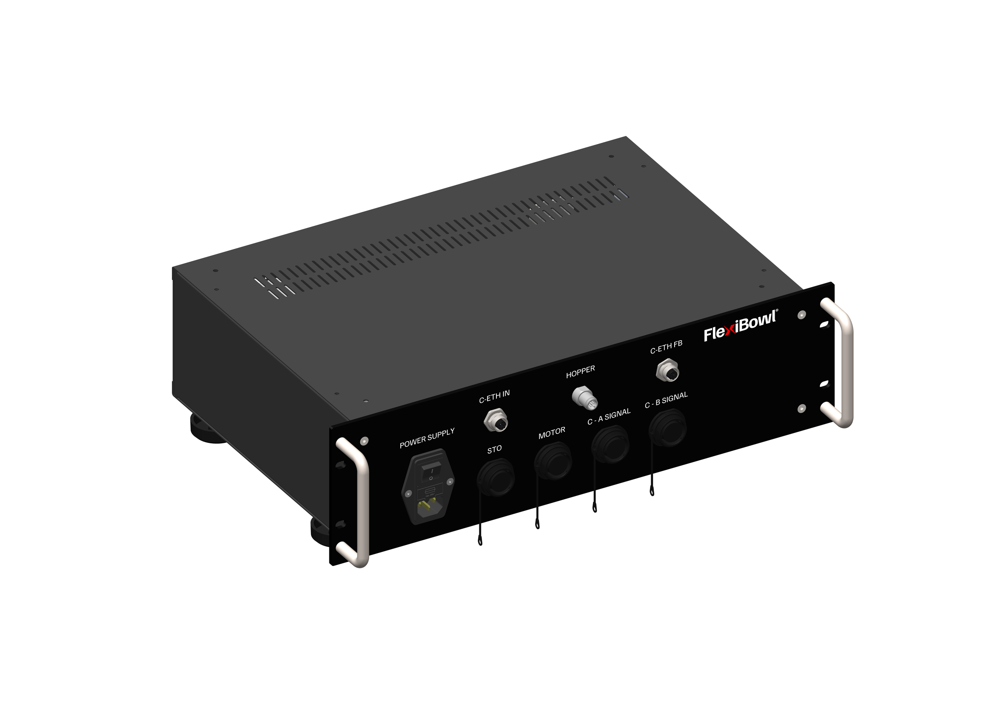
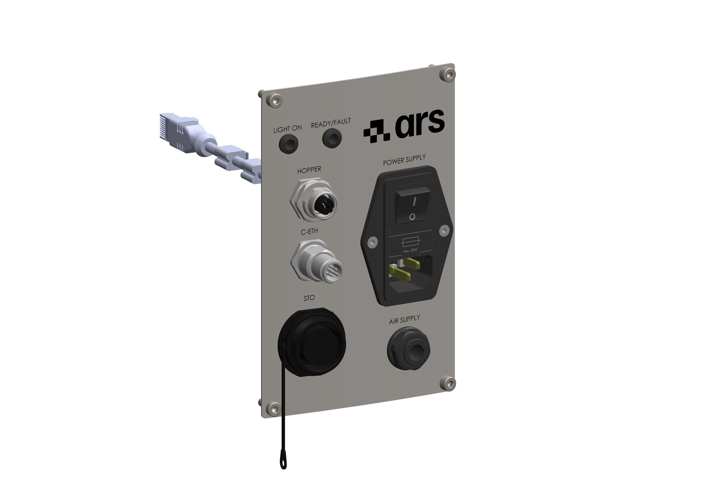
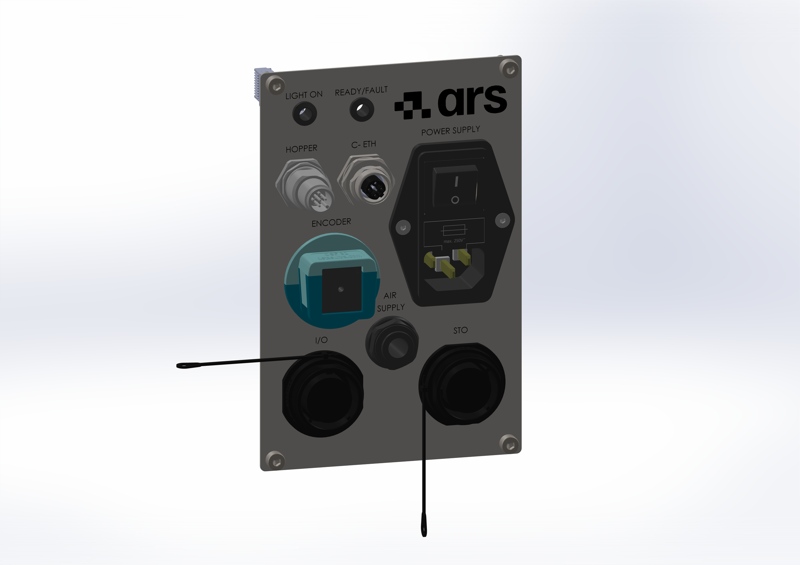

(intele)=
# **[ELE]** Interfaccia Elettrica

Il pannello connettori del FlexiBowl® varia in base alla versione della macchina:

:::{raw} html

<!-- Tab bar -->

  <button class="ie-tab on" onclick="ieSwitchTab('rack',this)">Rack</button>
  <button class="ie-tab"    onclick="ieSwitchTab('stpanel',this)">Pannello Standard</button>
  <button class="ie-tab"    onclick="ieSwitchTab('encpanel',this)">Pannello Flexitracking</button>

<!-- ══════════ RACK ══════════ -->

  

    

      
      
      

      
Seleziona un connettore dalla lista

    

    

      
N.Connettore

      

    

  

<!-- ══════════ PANNELLO STANDARD ══════════ -->

  

    

      
      
      

      
Seleziona un connettore dalla lista

    

    

      
N.Connettore

      

    

  

<!-- ══════════ PANNELLO FLEXITRACKING ══════════ -->

  

    

      
      
      

      
Seleziona un connettore dalla lista

    

    

      
N.Connettore

      

    

  

:::