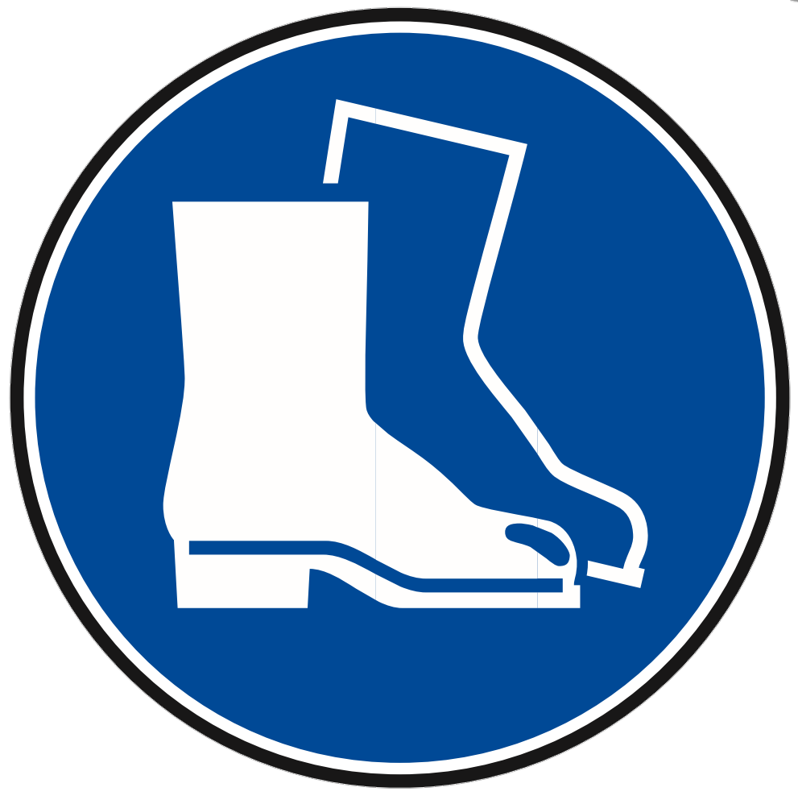

(intpneum)=
# **Interfaccia Pneumatica**

La macchina è dotata di azionamento pneumatico. 
Prima di effettuare l’**allacciamento pneumatico** verificare che: 
- l’impianto di fornitura di aria compressa presente, garantisca alla macchina la quantità di aria alla giusta pressione; 
- il serbatoio dell’aria compressa predisposto sia correttamente dimensionato. 
L’allacciamento pneumatico deve essere effettuato collegando la linea principale al circuito macchina. 
Il cliente deve inoltre garantire un’alimentazione di aria con le caratteristiche elencate nel paragrafo {ref}`“Dati Tecnici Pneumatici” <datipneum>` di questo manuale.

:::{warning}
Non superare mai i 6 bar di pressione nell’impianto pneumatico della macchina.
:::

:::{warning}
È precisa responsabilità dell’utilizzatore/cliente assicurare la corretta connessione al gruppo trattamento aria principale con tubazioni rigide, solidamente fissate al fine di evitare effetto frusta o protette con altri ripari che ne evitino o trattengano il trafilamento “a getto”.
:::

:::::{important}

:::{raw} html
   
:::

::::{list-table}
:widths: 30 60
:header-rows: 1
* - {ref}`Qualifica operatore <operatori>`
  - {ref}`D.P.I. Necessari <dpi>`

* - **Manutentore meccanico**
  - :::{raw} html
       

         
         
         
       

    :::
::::
:::::

Per l'allacciamento alla rete pneumatica, collegare un tubo dell’aria {ref}`della giusta misura <datipneum>` all'ingresso “Air Supply” presente nel {ref}`pannello comandi <intele>`.

:::{note}
Per interventi di manutenzione è necessario prevedere un sistema di sezionamento dell'aria.
:::