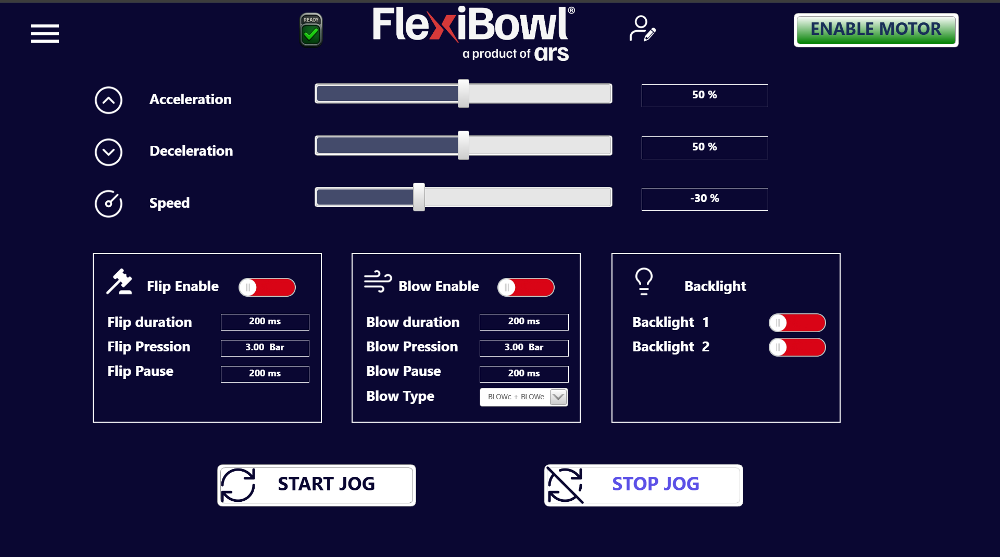

# **Jog Motor**

## Panoramica

La pagina **Jog Motor** consente di azionare il FlexiBowl® in modalità manuale continua (jog), senza l'utilizzo di sequenze programmate. È utilizzata principalmente durante le fasi di setup, messa in servizio e test del sistema, permettendo all'operatore di controllare direttamente la rotazione del bowl e le funzioni accessorie.

---

## Parametri di movimento

I tre slider in alto definiscono il comportamento del motore durante il jog.

| Parametro | Unità | Valore esempio | Descrizione |
|---|---|---|---|
| **Acceleration** | % | 50 | Rampa di accelerazione all'avvio del jog |
| **Deceleration** | % | 50 | Rampa di decelerazione all'arresto del jog |
| **Speed** | % | -30 | Velocità di rotazione del FlexiBowl®. Un valore **negativo** indica rotazione in senso **antiorario**; un valore **positivo** indica rotazione in senso **orario** |

:::{tip}
Per invertire il senso di rotazione del bowl durante il jog, è sufficiente portare lo slider **Speed** su un valore negativo. Non è necessario fermare il jog per modificare il parametro.
:::

---

## Pannello FLIP

Il pannello **Flip Enable** gestisce l'attivazione e i parametri del sistema di ribaltamento durante il jog.

| Controllo | Valore esempio | Descrizione |
|---|---|---|
| **Flip Enable** (toggle) | Attivo (rosso) | Abilita il flip automatico durante il jog |
| **Flip Duration** | 200 ms | Durata dell'impulso di attuazione del flip |
| **Flip Pression** | 3.00 Bar | Pressione dell'aria utilizzata per il flip |
| **Flip Pause** | 200 ms | Pausa tra un flip e il successivo durante il jog |

:::{note}
Il flip viene eseguito ciclicamente durante il jog, con la cadenza definita da **Flip Pause**, solo se il toggle **Flip Enable** è attivo.
:::

---

## Pannello BLOW

Il pannello **Blow Enable** gestisce l'attivazione e i parametri del sistema di soffio durante il jog.

| Controllo | Valore esempio | Descrizione |
|---|---|---|
| **Blow Enable** (toggle) | Attivo (rosso) | Abilita il soffio automatico durante il jog |
| **Blow Duration** | 200 ms | Durata dell'impulso di soffio |
| **Blow Pression** | 3.00 Bar | Pressione dell'aria utilizzata per il soffio |
| **Blow Pause** | 200 ms | Pausa tra un impulso di blow e il successivo durante il jog |
| **Blow Type** | BLOWc + BLOWe | Tipologia di soffio attivata. Le opzioni combinano soffio centrale (BLOWc) e/o soffio esterno (BLOWe) |

### Opzioni Blow Type

| Valore | Descrizione |
|---|---|
| **BLOWc** | Solo soffio centrale |
| **BLOWe** | Solo soffio esterno |
| **BLOWc + BLOWe** | Entrambi i soffiaggi attivati simultaneamente |

---

## Pannello BACKLIGHT

Il pannello **Backlight** gestisce lo stato delle retroilluminazioni indipendentemente dal jog.

| Controllo | Descrizione |
|---|---|
| **Backlight 1** (toggle) | Abilita/disabilita la retroilluminazione 1 |
| **Backlight 2** (toggle) | Abilita/disabilita la retroilluminazione 2 |

I toggle mostrano rosso quando la retroilluminazione è **attiva**.

---

## Avvio e arresto del jog

| Pulsante | Funzione |
|---|---|
| **START JOG** | Avvia la rotazione continua del bowl con i parametri impostati, attivando contestualmente flip e blow se i rispettivi toggle sono abilitati |
| **STOP JOG** | Interrompe il jog e arresta il bowl |

:::{important}
Prima di premere **START JOG**, verificare che:
- Il motore sia abilitato (**ENABLE MOTOR** attivo)
- Lo stato del sistema sia **READY**
- I parametri di Speed, Flip e Blow siano impostati correttamente per evitare movimenti indesiderati
:::

:::{warning}
Durante il jog il bowl ruota in modo continuo. Assicurarsi che l'area attorno al FlexiBowl® sia libera da ostacoli e che il personale non sia a contatto con le parti in movimento prima di avviare il jog.
:::
