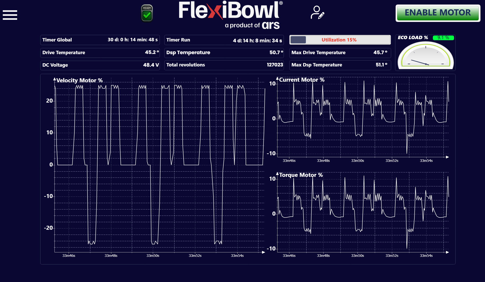

# [SOF] **Graphs**

## Panoramica

La pagina **Graphs** fornisce una dashboard di monitoraggio in tempo reale delle grandezze elettriche e termiche del driver motore del FlexiBowl®. In questa pagina, l'operatore può verificare le prestazioni del sistema e rilevare eventuali anomalie durante il funzionamento.

---

## Barra dei contatori e indicatori

La parte superiore della pagina raccoglie i principali parametri di stato del sistema, suddivisi in tre colonne.

### Colonna sinistra

| Campo | Valore esempio | Descrizione |
|---|---|---|
| **Timer Global** | 30 d: 0 h: 14 min: 48 s | Tempo totale di accensione del sistema dall'ultimo reset del contatore globale |
| **Drive Temperature** | 45.2 °C | Temperatura attuale del driver motore |
| **DC Voltage** | 48.4 V | Tensione del bus DC che alimenta il driver motore |

### Colonna centrale

| Campo | Valore esempio | Descrizione |
|---|---|---|
| **Timer Run** | 4 d: 14 h: 8 min: 34 s | Tempo totale di funzionamento del motore (tempo effettivo di movimento) dall'ultimo reset |
| **Dsp Temperature** | 50.7 °C | Temperatura del processore DSP interno al driver |
| **Total Revolutions** | 127023 | Numero totale di giri effettuati dal FlexiBowl® dall'ultimo reset del contatore |

### Colonna destra

| Campo | Valore esempio | Descrizione |
|---|---|---|
| **Utilization** | 15 % | Percentuale di utilizzo corrente del motore rispetto alla capacità massima. Visualizzata tramite una barra di avanzamento affiancata dal valore percentuale in testo colorato |
| **Max Drive Temperature** | 45.7 °C | Temperatura massima raggiunta dal driver motore dall'ultimo reset |
| **Max Dsp Temperature** | 51.1 °C | Temperatura massima raggiunta dal DSP dall'ultimo reset |

### ECO LOAD %

Il tachimetro **ECO LOAD %** in alto a destra indica il carico medio del motore in percentuale. Il valore visualizzato nell'esempio è **9.1 %**, indicando un carico ridotto — condizione tipica di sistema con cicli di lavoro brevi o velocità non elevate.

:::{tip}
Il valore **ECO LOAD %** è un indicatore utile per valutare l'efficienza operativa del sistema nel tempo. Valori costantemente elevati possono indicare un sovraccarico meccanico o parametri di velocità troppo aggressivi.
:::

---

## Grafici in tempo reale

La parte inferiore della pagina mostra tre grafici a oscilloscopio che tracciano l'andamento nel tempo delle grandezze motore. L'asse orizzontale riporta il tempo trascorso dall'avvio, nel formato `Xh Ym Zs` (i campi pari a zero, come le ore, possono non essere mostrati — es. `33m46s`).

### Velocity Motor %

Grafico della **velocità del motore** espressa in percentuale rispetto alla velocità massima.

| Asse | Descrizione |
|---|---|
| **Y** | Velocità in **percentuale** rispetto alla velocità massima, con segno: valori **negativi** indicano rotazione **antioraria**, valori **positivi** rotazione **oraria**. Il valore **0** corrisponde al motore fermo |
| **X** | Tempo di esecuzione |

:::{note}
Un valore di velocità negativo indica rotazione in senso **antiorario**; un valore positivo indica rotazione in senso **orario**. Questo è coerente con il parametro **Speed** nella pagina Jog Motor.
:::

### Current Motor %

Grafico della **corrente assorbita dal motore** espressa in percentuale rispetto alla corrente massima nominale.

| Asse | Descrizione |
|---|---|
| **Y** | Corrente normalizzata in percentuale. Può assumere sia valori **positivi** che **negativi** a seconda della fase di funzionamento (es. accelerazione/decelerazione); i picchi corrispondono alle variazioni più brusche di velocità |
| **X** | Tempo di esecuzione |

:::{tip}
Picchi di corrente elevati e ricorrenti possono indicare rampe di accelerazione troppo aggressive. In tal caso, aumentare i valori di **Acceleration** e **Deceleration** per distribuire lo sforzo su un intervallo di tempo più lungo.
:::

### Torque Motor %

Grafico della **coppia erogata dal motore** espressa in percentuale rispetto alla coppia massima nominale.

| Asse | Descrizione |
|---|---|
| **Y** | Coppia normalizzata in percentuale. Come per la corrente, può assumere sia valori **positivi** che **negativi** a seconda della fase di movimento |
| **X** | Tempo di esecuzione |

:::{note}
I grafici **Current Motor %** e **Torque Motor %** mostrano tipicamente un andamento molto simile, poiché in un motore a corrente continua la coppia è direttamente proporzionale alla corrente. Differenze significative tra i due possono indicare anomalie nel driver.
:::

---

## Note di utilizzo

:::{warning}
Valori di **Drive Temperature** o **Dsp Temperature** costantemente superiori a 70 °C possono ridurre la vita utile del driver e causare arresti di protezione termica. Verificare le condizioni di ventilazione del cabinet e il ciclo di lavoro del sistema.
:::

:::{warning}
Un valore di **DC Voltage** fuori dal range nominale (tipicamente 48 V ± 10%) può indicare problemi all'alimentatore. Interrompere il funzionamento e contattare il servizio tecnico.
:::
