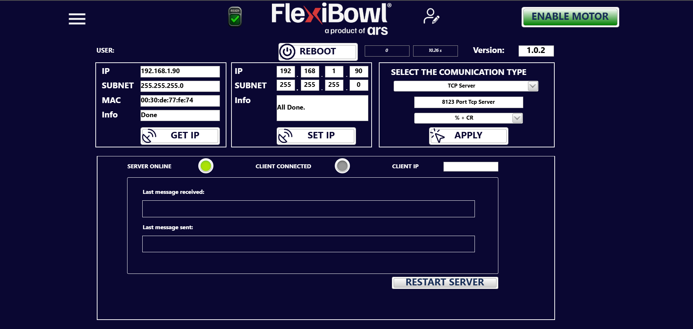
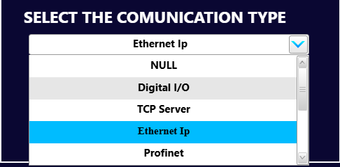
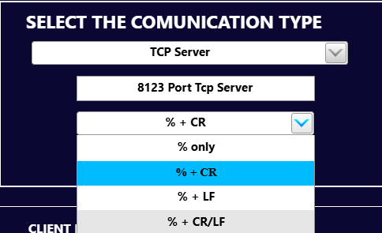

# [SOF] **Setup**
## Panoramica

La pagina **Setup** raggruppa le impostazioni di rete e di comunicazione del FlexiBowl®. Consente di configurare l'indirizzo IP del dispositivo, il tipo di protocollo di comunicazione con il sistema esterno (es. PLC o PC supervisore) e di monitorare lo stato della connessione in tempo reale.

In alto a destra è indicata la **versione del firmware** installato (nell'esempio: `1.0.2`).

---

## Barra superiore

| Elemento | Descrizione |
|---|---|
| **Menu** (icona ☰) | Apre il menu di navigazione tra le pagine del software |
| **READY** | Indicatore di stato del dispositivo: segnala che il FlexiBowl® è pronto all'uso |
| **USER** | Indica l'utente attualmente connesso all'interfaccia software |
| **REBOOT** | Riavvia il software del FlexiBowl® senza spegnere il sistema |
| **Version** | Versione del firmware attualmente installato sul dispositivo |
| **ENABLE MOTOR** | Abilita l'alimentazione del motore del FlexiBowl®. Con motore disabilitato il dispositivo non esegue alcun movimento |

:::{warning}
Il pulsante **REBOOT** interrompe temporaneamente tutte le operazioni in corso. Non eseguire il reboot durante una sequenza attiva o durante un trasferimento file.
:::

:::{warning}
Prima di premere **ENABLE MOTOR** assicurarsi che l'area attorno al FlexiBowl® sia libera: l'abilitazione del motore rende il dispositivo pronto a muoversi.
:::

---

## Pannello GET IP

Il pannello sinistro visualizza i parametri di rete attualmente assegnati al FlexiBowl®.

| Campo | Valore esempio | Descrizione |
|---|---|---|
| **IP** | 192.168.1.90 | Indirizzo IP corrente del dispositivo |
| **SUBNET** | 255.255.255.0 | Maschera di sottorete corrente |
| **MAC** | 00:30:de:77:fe:74 | Indirizzo MAC della scheda di rete del dispositivo |
| **Info** | Done | Esito dell'ultima operazione di lettura |

Il pulsante **GET IP** aggiorna i campi leggendo i parametri di rete attualmente configurati sul dispositivo.

---

## Pannello SET IP

Il pannello centrale consente di modificare l'indirizzo IP e la maschera di sottorete del FlexiBowl®.

| Campo | Valore esempio | Descrizione |
|---|---|---|
| **IP** | 192.168.1.90 | Nuovo indirizzo IP da assegnare al dispositivo (inseribile ottetto per ottetto) |
| **SUBNET** | 255.255.255.0 | Nuova maschera di sottorete da assegnare |
| **Info** | All Done. | Esito dell'ultima operazione di impostazione |

Il pulsante **SET IP** applica i valori inseriti e li salva nella configurazione di rete del dispositivo.

:::{important}
Dopo aver modificato l'indirizzo IP con **SET IP**, è necessario eseguire un **REBOOT** del sistema affinché le modifiche abbiano effetto. Il software dovrà essere riconnesso al nuovo indirizzo IP.
:::

:::{warning}
Assicurarsi che il nuovo indirizzo IP non sia già utilizzato da un altro dispositivo nella stessa rete, per evitare conflitti di indirizzo che potrebbero rendere il FlexiBowl® irraggiungibile.
:::

---

## Pannello SELECT THE COMMUNICATION TYPE

Il pannello destro consente di configurare il protocollo di comunicazione tra il FlexiBowl® e il sistema esterno (PLC, PC supervisore, sistema di visione).

  

| Campo |  Descrizione |
|---|---|
| **Tipo di comunicazione** |  Protocollo di comunicazione selezionato. Selezionabile tramite menu a tendina |
| **Porta** |  Porta TCP su cui il FlexiBowl® è in ascolto come server |
| **Stringa di terminazione** | Carattere o sequenza di caratteri che delimita i messaggi scambiati. Selezionabile tramite menu a tendina |

Il pulsante **APPLY** conferma e applica le impostazioni di comunicazione selezionate.

:::{note}
La modalità **TCP Server** indica che il FlexiBowl® agisce da server: è il sistema esterno (client) a dover iniziare la connessione verso l'indirizzo IP e la porta configurati.
:::

:::{tip}
Verificare che la porta configurata (es. 8123) non sia bloccata da firewall sul PC o nella rete aziendale. In caso di problemi di connessione, consultare il responsabile IT.
:::

---

## Selezione della stringa di terminazione

Il terzo menu a tendina del pannello **SELECT THE COMMUNICATION TYPE** consente di scegliere il **terminatore** dei messaggi scambiati con il sistema esterno, ovvero la sequenza di caratteri che segnala la fine di ogni comando inviato e di ogni risposta ricevuta.

| Opzione | Terminatore | Descrizione |
|---|---|---|
| **% only** | `%` | Solo il carattere `%`, senza caratteri di fine riga |
| **% + CR** | `%` + `\r` | Carattere `%` seguito da Carriage Return (0x0D) |
| **% + LF** | `%` + `\n` | Carattere `%` seguito da Line Feed (0x0A) |
| **% + CR/LF** | `%` + `\r\n` | Carattere `%` seguito da Carriage Return e Line Feed (0x0D 0x0A) |

Dopo aver selezionato l'opzione desiderata, premere **APPLY** per rendere effettiva l'impostazione.

:::{important}
La stringa di terminazione selezionata deve corrispondere a quella attesa dal sistema esterno (PLC, PC supervisore o sistema di visione). Se le due impostazioni non coincidono, i comandi inviati non vengono riconosciuti e la comunicazione non va a buon fine, anche con server online e client connesso.
:::

:::{tip}
In caso di comandi apparentemente inviati ma senza risposta, verificare nel pannello di stato il campo **Last message received**: se il messaggio arriva ma non produce effetto, la causa è spesso una stringa di terminazione errata.
:::

---

## Pannello di stato della comunicazione

Il pannello inferiore mostra in tempo reale lo stato della connessione tra il FlexiBowl® e il client esterno.

### Indicatori di stato

| Indicatore | Colore attivo |  Descrizione |
|---|---|---|
| **SERVER ONLINE** | 🟢 Verde |  Il server TCP del FlexiBowl® è attivo e in ascolto |
| **CLIENT CONNECTED** | 🟢 Verde |  Un client esterno è attualmente connesso al server |
| **CLIENT IP** | — | Indirizzo IP del client attualmente connesso |

:::{note}
Quando un indicatore è grigio la condizione corrispondente non è verificata: nell'esempio il server è online ma nessun client è ancora connesso.
:::

### Monitor messaggi

| Campo |  Descrizione |
|---|---|
| **Last message received** | Ultimo messaggio ricevuto dal client esterno |
| **Last message sent** | Ultimo messaggio inviato dal FlexiBowl® al client |

:::{note}
Il monitor dei messaggi è utile in fase di integrazione e debug della comunicazione con il sistema esterno. I messaggi mostrati seguono il protocollo di comunicazione FlexiBowl®; fare riferimento alla documentazione del protocollo per l'elenco completo dei comandi disponibili.
:::

### Pulsante RESTART SERVER

Il pulsante **RESTART SERVER** riavvia il servizio TCP del FlexiBowl® senza eseguire un reboot completo del sistema. È utile per ripristinare la connessione in caso di disconnessione inattesa del client o di blocco del server.

:::{warning}
**RESTART SERVER** interrompe la connessione TCP corrente. Se il FlexiBowl® è in esecuzione di una sequenza controllata da remoto, questa verrà interrotta. Utilizzare questa funzione solo quando il sistema è in stato di stand-by.
:::
