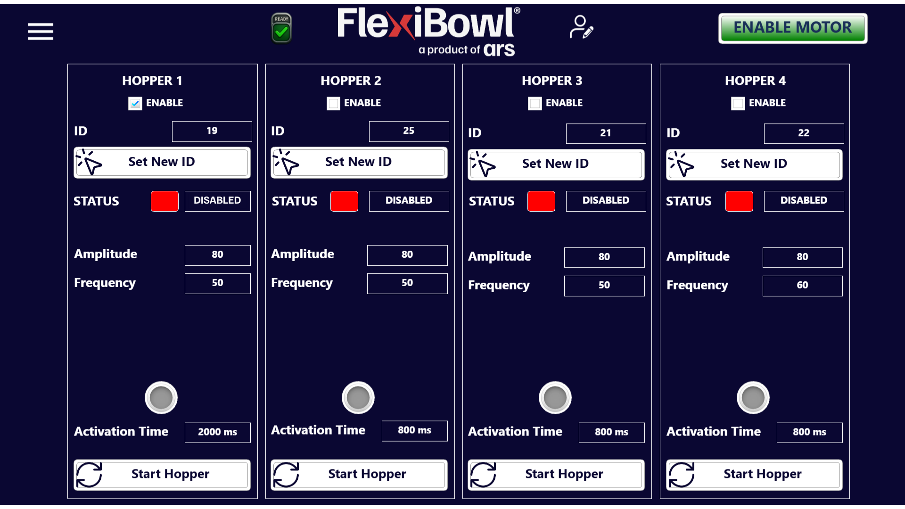

# **Hopper**
## Panoramica

La pagina **Hopper** consente di configurare e gestire fino a **4 hopper** (tramogge vibrazionali) collegati al FlexiBowl®. Ogni hopper è un'unità di alimentazione autonoma che rifornisce il FlexiBowl® di componenti, controllabile indipendentemente con parametri propri di vibrazione e temporizzazione.

Ciascun hopper è rappresentato da una colonna verticale con gli stessi controlli, identificata come **HOPPER 1**, **HOPPER 2**, **HOPPER 3** e **HOPPER 4**.

---

## Struttura di ogni pannello Hopper

### ENABLE

La checkbox **ENABLE** in cima al pannello attiva o disattiva il relativo hopper. Solo gli hopper abilitati possono essere avviati e risponderanno ai comandi del sistema.

Nell'esempio mostrato, solo **HOPPER 1** ha la checkbox ENABLE selezionata (spunta blu); gli hopper 2, 3 e 4 risultano disabilitati.

:::{note}
Un hopper disabilitato non risponde al pulsante **Start Hopper** e non viene attivato durante le sequenze automatiche, anche se è fisicamente collegato al sistema.
:::

---

### ID e Set New ID

| Campo |  Descrizione |
|---|---|
| **ID** |  Identificativo univoco assegnato all'hopper sulla rete di comunicazione |
| **Set New ID** | Pulsante per assegnare un nuovo ID all'hopper. Utilizzato durante la configurazione iniziale o in caso di sostituzione dell'unità |

:::{warning}
Modificare l'ID di un hopper solo se strettamente necessario. Un ID errato o duplicato impedisce la comunicazione con l'hopper e può causare malfunzionamenti nell'intera catena di alimentazione. Dopo aver impostato un nuovo ID, verificarne la corretta acquisizione tramite l'indicatore **STATUS**.
:::

---

### STATUS

L'indicatore **STATUS** mostra lo stato operativo corrente dell'hopper.

| Colore LED | Etichetta | Descrizione |
|---|---|---|
| 🔴 Rosso | **DISABLED** | L'hopper è disabilitata |
| 🟢 Verde | **ENABLED** | L'hopper è abilitata |

---

### Parametri di vibrazione

| Parametro |  Descrizione |
|---|---|
| **Amplitude** |  Ampiezza della vibrazione dell'hopper, espressa in unità adimensionali. Valori più alti producono una vibrazione più intensa e un flusso di componenti maggiore |
| **Frequency** | Frequenza di vibrazione dell'hopper. Influenza la cadenza con cui i componenti vengono convogliati verso il FlexiBowl® |

---

### Activation Time e LED di stato

| Campo  | Descrizione |
|---|---|
| **Activation Time** | Durata dell'attivazione dell'hopper quando viene avviato manualmente con **Start Hopper** o richiamato da una sequenza |
| **LED** (grigio/verde) |  Indicatore luminoso che si illumina durante l'attivazione dell'hopper |

:::{note}
**HOPPER 1** ha un **Activation Time** di 2000 ms, mentre gli altri hopper sono impostati a 800 ms. Tempi di attivazione più lunghi determinano un maggiore apporto di componenti al FlexiBowl® per ogni ciclo di attivazione.
:::

---

### Start Hopper

Il pulsante **Start Hopper** avvia manualmente l'hopper per la durata impostata in **Activation Time**. Al termine del tempo, l'hopper si arresta automaticamente.

:::{important}
Il pulsante **Start Hopper** è attivo solo se la checkbox **ENABLE** del relativo hopper è selezionata. Verificare che l'hopper sia abilitato prima di tentarne l'avvio manuale.
:::

---

## Riepilogo configurazione esempio

| | HOPPER 1 | HOPPER 2 | HOPPER 3 | HOPPER 4 |
|---|---|---|---|---|
| **Enable** | ✅ Sì | ❌ No | ❌ No | ❌ No |
| **ID** | 19 | 25 | 21 | 22 |
| **Amplitude** | 80 | 80 | 80 | 80 |
| **Frequency** | 50 | 50 | 50 | 60 |
| **Activation Time** | 2000 ms | 800 ms | 800 ms | 800 ms |
| **Status** | DISABLED | DISABLED | DISABLED | DISABLED |

:::{note}
Nell'esempio mostrato tutti gli hopper risultano in stato **DISABLED** nonostante HOPPER 1 sia abilitato via checkbox. Questo indica che gli hopper non sono ancora stati raggiunti dal sistema di comunicazione (es. driver non alimentato o ID non ancora acquisito). Verificare il collegamento fisico e il cablaggio prima dell'avvio.
:::
