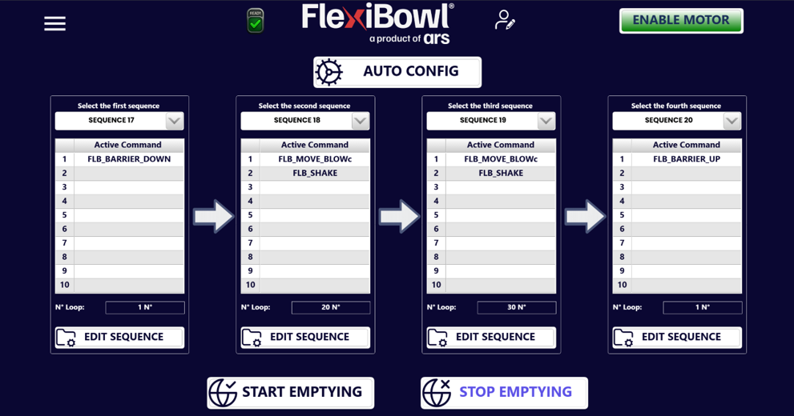
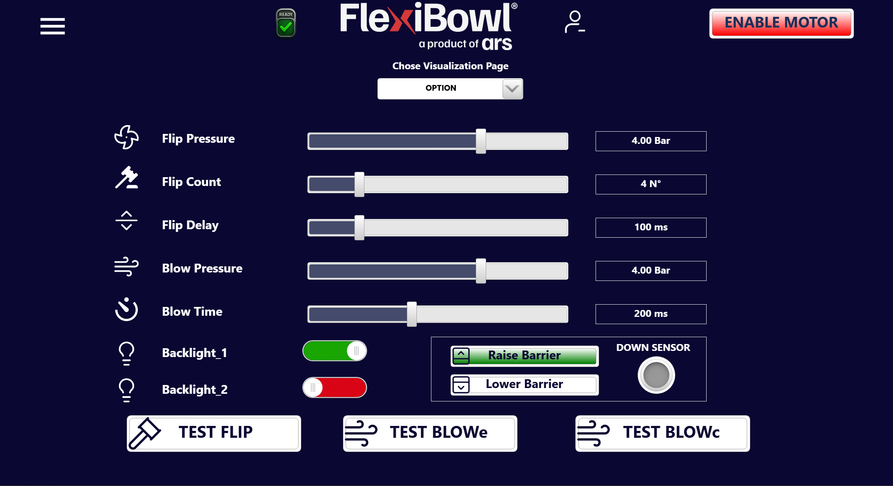

(emptying)=
# [SOF] **Emptying**

La Pagina Emptying viene resa automaticamente disponibile quando l'opzione Svuotamento viene acquistata. 

## Panoramica

La funzione **Emptying** consente di svuotare automaticamente il FlexiBowl® concatenando fino a **4 sequenze** dedicate, ciascuna ripetuta per un numero di volte (loop) configurabile. È pensata per liberare rapidamente il disco dai pezzi residui, ad esempio a fine turno o in fase di cambio produzione, senza dover richiamare manualmente le sequenze una per una.

---

## Configurazione tramite interfaccia web

La pagina è organizzata in **4 colonne**, una per ciascuna delle sequenze che compongono il ciclo di svuotamento ("Select the first/second/third/fourth sequence"), più i comandi di avvio/arresto in fondo alla pagina.

### AUTO CONFIG

Il pulsante **AUTO CONFIG**, in alto, inserisce automaticamente una configurazione predefinita che occupa le **Sequenze 17, 18, 19 e 20**. In alternativa, è possibile personalizzare liberamente queste sequenze oppure selezionarne altre tra le 20 disponibili.

:::{note}
Nella configurazione di default, la prima sequenza chiude la barriera (**FLB_BARRIER_DOWN**), le due sequenze centrali ripetono più volte un movimento combinato di rotazione e soffio seguito da uno shake (**FLB_MOVE_BLOWc** + **FLB_SHAKE**), mentre l'ultima riapre la barriera (**FLB_BARRIER_UP**) al termine del ciclo.
:::

### Elementi di ogni colonna

| Elemento | Funzione |
|---|---|
| **Select the first/second/third/fourth sequence** | Menu a tendina per selezionare quale delle 20 sequenze programmate viene eseguita in quel passaggio del ciclo di svuotamento |
| **Active Command** | Elenco dei comandi attivi nella sequenza selezionata (fino a 10 slot, stessa struttura della pagina Main Command) |
| **N° Loop** | Numero di volte in cui la sequenza selezionata viene ripetuta durante quel passaggio |
| **EDIT SEQUENCE** | Apre la sequenza selezionata per la modifica dei comandi che la compongono |

### Avvio e arresto

| Comando | Funzione |
|---|---|
| **START EMPTYING** | Avvia il ciclo di svuotamento: esegue in ordine le 4 sequenze configurate, ciascuna per il numero di loop impostato |
| **STOP EMPTYING** | Interrompe il ciclo di svuotamento in corso |

---
## Pagina Option

Nel caso in cui la funzione Emptying fosse presente, nella sezione OPTION della pagina 'Main Command', sarà possibile visualizzare il seguente riquadro: 

Questo riquadro, contenente i due pulsanti 'Raise Barrier' e 'Lower Barrier', permette infatti di alzare ed abbassare la barrierra di svuotamento e quindi di verificarne il corretto funzionamento. 
Nel momento in cui la barriera viene abbassata, il sensore presente in questo riquadro viene attivato. 

## Pagina Sequence 

:::{image} ../../../../_shared/media/images/box_emptying.png
:width: 50% 
:align: center
:::

Nella pagina Sequence, il check nella box 'Emptying Sequence' permette di rendere possibile la movimentazione del FlexiBowl anche con la barriera dello svuotamento abbassata. 
Infatti, se la barriera viene abbassata e il check nella pagina Sequence non spuntato, non sarà possibile effettuare la movimentazione associata alla sequenza corrente. 

## Comandi da protocollo

Come per il resto dell'interfaccia software, il ciclo di Emptying può essere avviato, configurato e verificato anche da protocollo (TCP Server, EtherNet/IP, Profinet, Modbus), con le stesse ControlWord indipendentemente dal protocollo utilizzato — cambia solo il trasporto, come descritto nella pagina [Interfaccia Software](int_software).

### Comandi EXE

| Comando | ControlWord | Busy durante esecuzione | ReturnData_1 | Spiegazione |
|---|---|---|---|---|
| Start Emptying | 45 | SI (Emptying attivo) | 45 | Avvia lo svuotamento |
| Stop Emptying | 46 | SI (Emptying attivo) | 46 | Ferma lo svuotamento |
| Emptying Active | 47 | NO | 47 | Verifica se lo svuotamento è attivo |

### Comandi WRITE

Ogni coppia Sequenza/Loop corrisponde a una delle 4 colonne della pagina web:

| Comando | ControlWord | Range Data_1 | Busy durante esecuzione | ReturnData_1 |
|---|---|---|---|---|
| FirstSequence | 20200 | 1–20 | NO | 20200 |
| FirstLoop | 20201 | 0–500 | NO | 20201 |
| SecondSequence | 20202 | 1–20 | NO | 20202 |
| SecondLoop | 20203 | 0–500 | NO | 20203 |
| ThirdSequence | 20204 | 1–20 | NO | 20204 |
| ThirdLoop | 20205 | 0–500 | NO | 20205 |
| FourthSequence | 20206 | 1–20 | NO | 20206 |
| FourthLoop | 20207 | 0–500 | NO | 20207 |

### Comandi READ

| Comando | ControlWord | Busy durante esecuzione | ReturnData_1 | Range ReturnData_2 |
|---|---|---|---|---|
| FirstSequence | 20300 | NO | 20300 | 1–20 |
| FirstLoop | 20301 | NO | 20301 | 0–500 |
| SecondSequence | 20302 | NO | 20302 | 1–20 |
| SecondLoop | 20303 | NO | 20303 | 0–500 |
| ThirdSequence | 20304 | NO | 20304 | 1–20 |
| ThirdLoop | 20305 | NO | 20305 | 0–500 |
| FourthSequence | 20306 | NO | 20306 | 1–20 |
| FourthLoop | 20307 | NO | 20307 | 0–500 |

:::{tip}
Per la spiegazione completa della logica ControlWord, del funzionamento a 4 passaggi e degli esempi pratici via fieldbus/TCP, fare riferimento alla sezione [Comandi di Svuotamento](int_software.html#sec-empty) della pagina Interfaccia Software.
:::

---

## Note di utilizzo

:::{note}
Le 4 sequenze richiamate dall'Emptying (di default 17–20, oppure personalizzate) restano normali sequenze programmabili: possono essere modificate dalla pagina **Main Command** esattamente come qualunque altra sequenza, oltre che dal pulsante **EDIT SEQUENCE** di questa pagina.
:::

:::{warning}
Non inviare un nuovo comando **Start Emptying** mentre un ciclo di svuotamento è già in corso (**Emptying Active** = 1). Verificare che il ciclo precedente sia terminato, oppure inviare **Stop Emptying**, prima di avviarne uno nuovo.
:::
