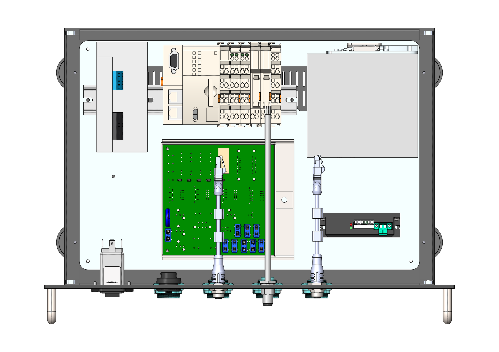
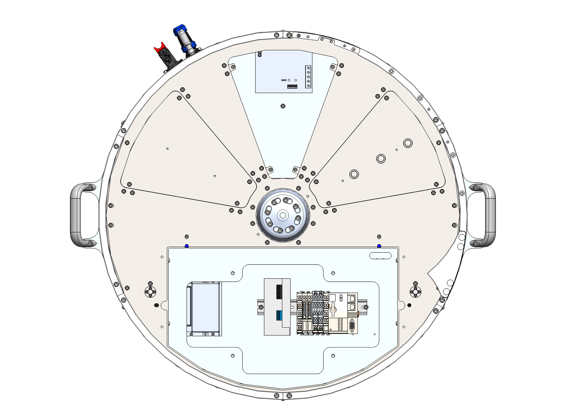

# [ELE] **Sostituzione componentistica elettronica**

:::::{important}

:::{raw} html
   
:::

::::{list-table}
:widths: 30 60
:header-rows: 1
* - {ref}`Qualifica operatore <operatori>`
  - {ref}`D.P.I. Necessari <dpi>`

* - **Manutentore elettrico**
  - :::{raw} html
       

         
         
         
       

    :::
::::
:::::

::::{warning}
<table style="width: 100%; border: none; background: transparent;">
  <tr style="background: transparent !important; border: none !important;">
    <td style="width: 10%; border: none; vertical-align: middle; text-align: center; background: transparent !important;">
      
    </td>
    <td style="width: 90%; border: none; vertical-align: middle; background: transparent !important; padding-left: 15px;">
      Disconnettere l’alimentazione elettrica prima di effettuare qualsiasi operazione all'interno del FlexiBowl®.
    </td>
  </tr>
</table>
::::

## Sostituzione delle parti elettroniche principali

Nelle taglie più piccole l'elettronica è tutta compresa nel rack, per cui è sufficiente smontare il pannello superiore per accedere a tutta la componentistica. Nei FlexiBowl® di taglia 500 o superiore invece tutte le parti sono contenute nella macchina.

:::{raw} html

<!-- Tab bar -->

  <button class="fb-tab on"    onclick="fbSwitchTab('rack',this)">Elettronica nel rack</button>
  <button class="fb-tab"    onclick="fbSwitchTab('fb',this)">Elettronica nel FlexiBowl®</button>

<!-- ══════════ rack ══════════ -->

  

    

      
      
      

      
Seleziona un componente dalla lista

    

    

      
N.ComponenteDescrizione

      

    

  

<!-- ══════════ fb ══════════ -->

  

    

      
      
      

      
Seleziona un componente dalla lista

    

    

      
N.ComponenteDescrizione

      

    

  

:::

La scheda nei FlexiBowl® di taglia 500 o superiore è ancorata a un supporto fissato sulla colonna accanto al backlihgt dal lato flip.

::: {figure} ../../../../_shared/media/images/schedapos.png
:align: center
:width: 90%
:::

:::{note}
Nei FlexiBowl® di taglia 650 o superiore tutta l'elettronica è accessibile dall'alto rimuovendo l'illuminatore del backlight e il coperchio centrale del pianale superiore. Nel FlexiBowl® 500 può essere più conveniente smontare i carter per accedere lateralmente al gruppo PLC/alimentatore 24V e alla resistenza di frenatura.
:::
