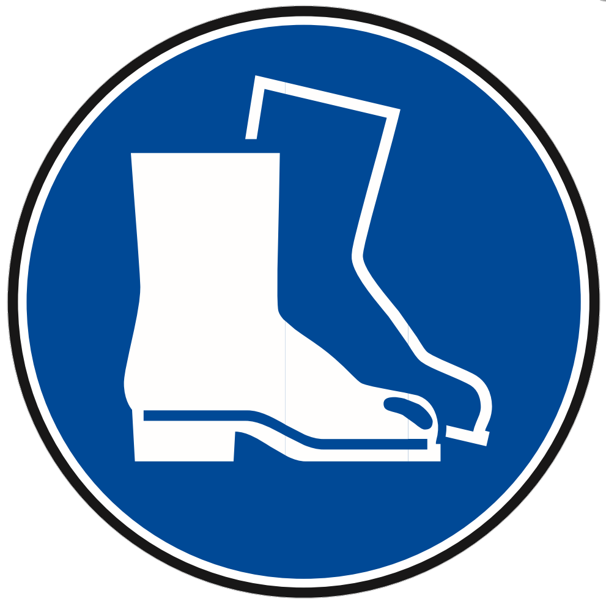
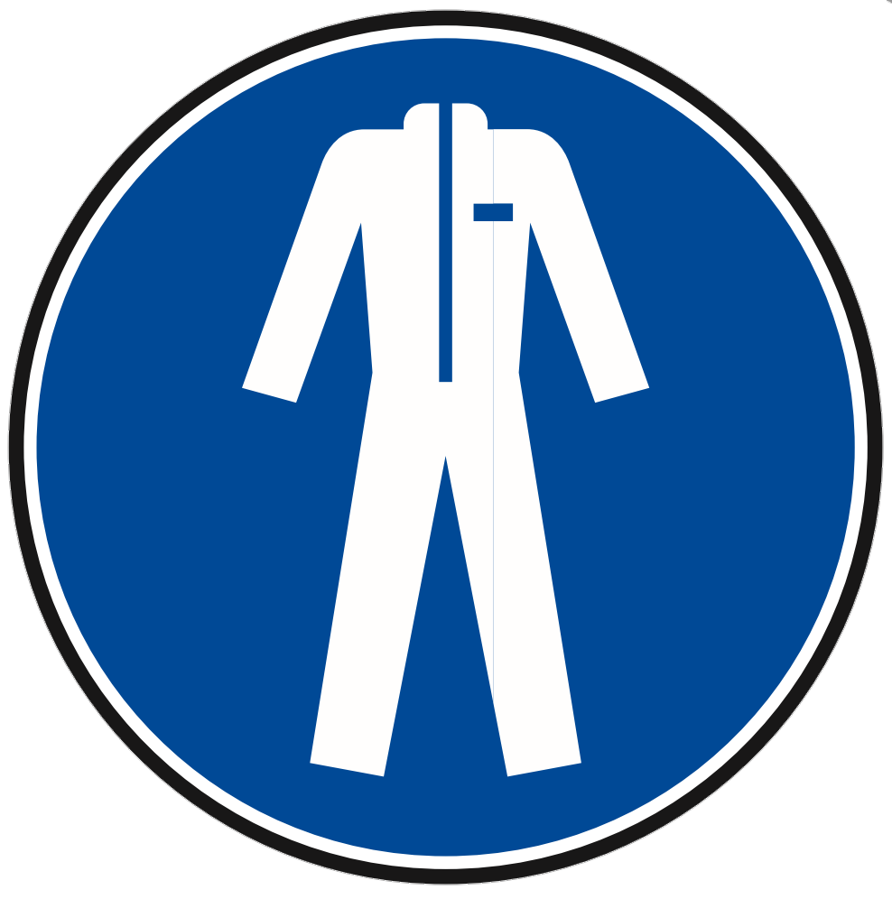
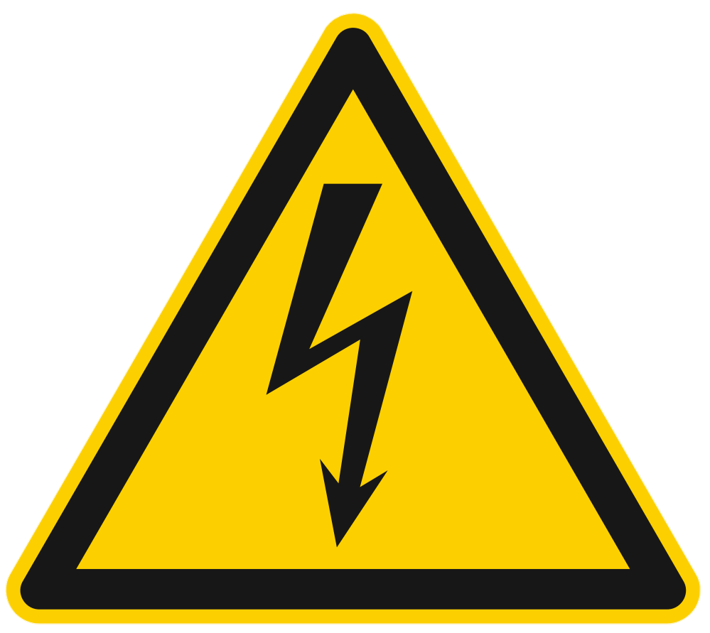
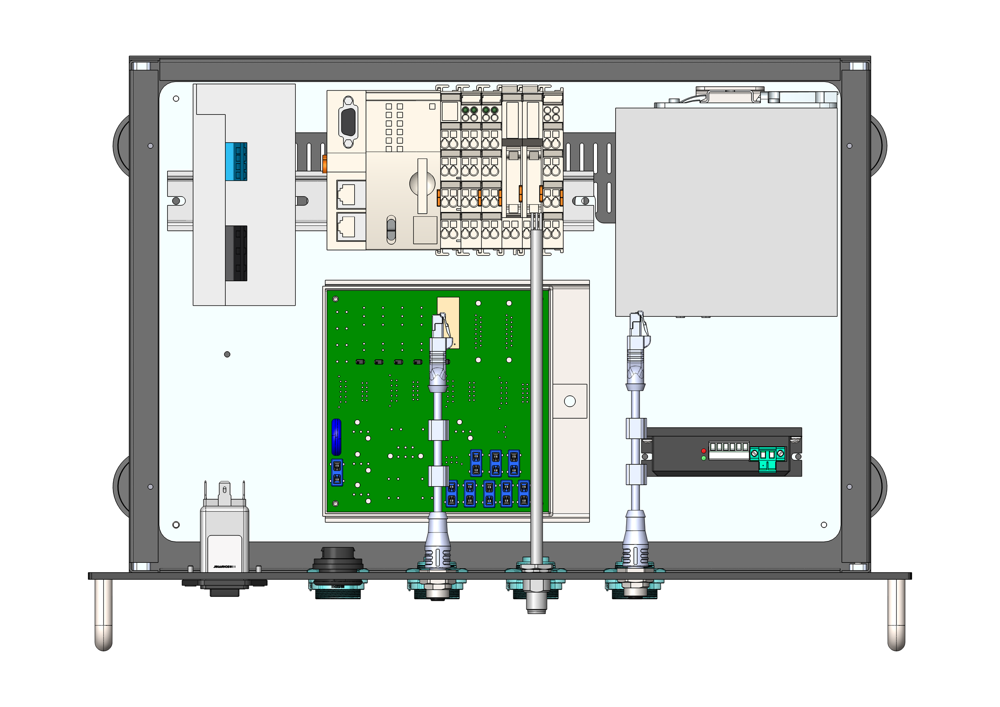
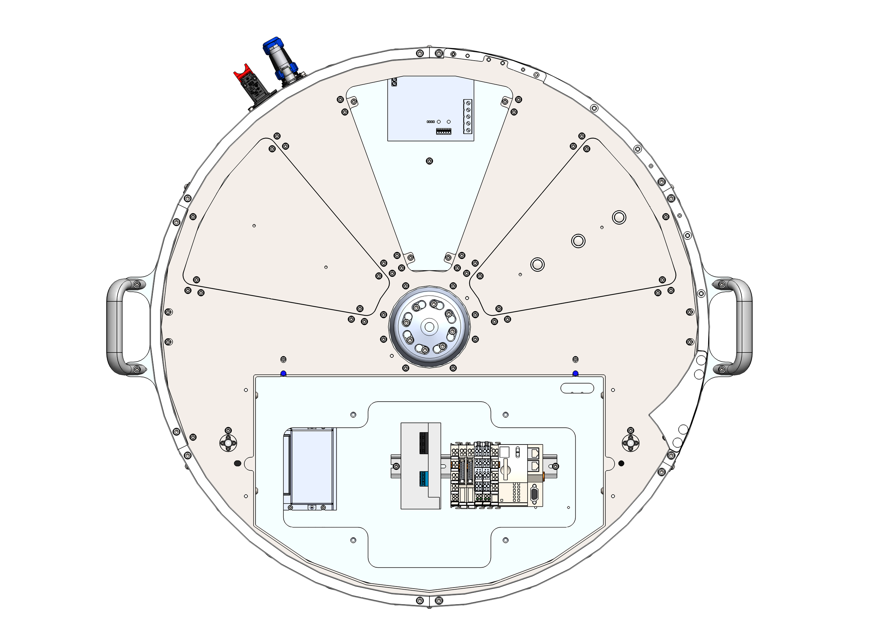

# [ELE] **Sostituzione componentistica elettronica**

:::::{important}

:::{raw} html
   
:::

::::{list-table}
:widths: 30 60
:header-rows: 1
* - {ref}`Qualifica operatore <operatori>`
  - {ref}`D.P.I. Necessari <dpi>`

* - **Manutentore elettrico**
  - :::{raw} html
       

         
         
         
       

    :::
::::
:::::

::::{warning}
<table style="width: 100%; border: none; background: transparent;">
  <tr style="background: transparent !important; border: none !important;">
    <td style="width: 10%; border: none; vertical-align: middle; text-align: center; background: transparent !important;">
      
    </td>
    <td style="width: 90%; border: none; vertical-align: middle; background: transparent !important; padding-left: 15px;">
      Disconnettere l’alimentazione elettrica prima di effettuare qualsiasi operazione all'interno del FlexiBowl®.
    </td>
  </tr>
</table>
::::

## Sostituzione delle parti elettroniche principali

Nelle taglie più piccole l'elettronica è tutta compresa nel rack, per cui è sufficiente smontare il pannello superiore per accedere a tutta la componentistica. Nei FlexiBowl® di taglia 500 o superiore invece tutte le parti sono contenute nella macchina.

:::{raw} html

<!-- Tab bar -->

  <button class="fb-tab on"    onclick="fbSwitchTab('rack',this)">Elettronica nel rack</button>
  <button class="fb-tab"    onclick="fbSwitchTab('fb',this)">Elettronica nel FlexiBowl®</button>

<!-- ══════════ rack ══════════ -->

  

    

      
      
      

      
Seleziona un componente dalla lista

    

    

      
N.ComponenteDescrizione

      

    

  

<!-- ══════════ fb ══════════ -->

  

    

      
      
      

      
Seleziona un componente dalla lista

    

    

      
N.ComponenteDescrizione

      

    

  

:::

La scheda nei FlexiBowl® di taglia 500 o superiore è ancorata a un supporto fissato sulla colonna accanto al backlihgt dal lato flip.

::: {figure} ../../../../_shared/media/images/schedapos.png
:align: center
:width: 90%
:::

:::{note}
Nei FlexiBowl® di taglia 650 o superiore tutta l'elettronica è accessibile dall'alto rimuovendo l'illuminatore del backlight e il coperchio centrale del pianale superiore. Nel FlexiBowl® 500 può essere più conveniente smontare i carter per accedere lateralmente al gruppo PLC/alimentatore 24V e alla resistenza di frenatura.
:::

(scheda-interfaccia)=
## Manutenzione della scheda di interfaccia

Questa sezione descrive il funzionamento e la procedura di sostituzione dei **relè di interfaccia** e dei **fusibili di protezione** presenti a bordo della scheda di interfaccia.

La figura seguente mostra la scheda con l'indicazione della posizione dei relè e dei fusibili.

::: {figure} ../../../../_shared/media/images/schedafronte.png
:align: center
:width: 80%

Vista frontale della scheda di interfaccia
:::

Sulla parte posteriore della scheda sono riportati l'amperaggio di ciascun fusibile e il riferimento di ciascun relè di interfaccia.

(scheda-interfaccia-retro)=
::: {figure} ../../../../_shared/media/images/schedaretro.png
:align: center
:width: 80%

Vista posteriore: riferimenti dei relè e taglio dei fusibili
:::

### Avvertenze di sicurezza

:::{danger}
**Rischio elettrico.** Prima di intervenire sulla scheda di interfaccia, togliere tensione alla macchina agendo sull'interruttore generale e attendere lo scaricamento dei condensatori. Verificare l'assenza di tensione con un idoneo strumento di misura prima di toccare qualsiasi componente.
:::

Durante le operazioni di manutenzione attenersi scrupolosamente alle seguenti indicazioni:

- l'intervento deve essere eseguito esclusivamente da personale tecnico qualificato e formato;
- utilizzare dispositivi di protezione individuale (D.P.I.) idonei, inclusi guanti antistatici;
- evitare di lasciare cadere utensili o corpi estranei sulla scheda durante l'intervento;
- non sostituire un fusibile con uno di amperaggio diverso da quello originale;
- non forzare i relè durante l'estrazione: se un componente risulta bloccato, verificarne il corretto aggancio prima di proseguire;
- al termine dell'intervento, richiudere correttamente lo sportello/fessura di accesso prima di ripristinare l'alimentazione.

### Descrizione della scheda

(scheda-relè)=
#### Relè di interfaccia

La scheda è dotata di cinque relè di interfaccia, identificati dalle sigle K1–K5. Il relè K1 è un relè elettromeccanico a doppio scambio; tutti gli altri relè (K2–K5) sono relè a stato solido.

:::{list-table}
:widths: 10 55 35
:header-rows: 1

* - Rif.
  - Funzione
  - Tipologia
* - K1
  - Relè di interfaccia per back light
  - Elettromeccanico a doppio scambio
* - K2
  - Relè di interfaccia per elettrovalvola del flip
  - Stato solido
* - K3
  - Relè di interfaccia per elettrovalvola soffio centrale
  - Stato solido
* - K4
  - Relè di interfaccia per elettrovalvola soffio radiale
  - Stato solido
* - K5
  - Relè di interfaccia per elettrovalvola svuotamento (opzionale)
  - Stato solido
:::

(scheda-fusibili)=
#### Fusibili di protezione

La scheda è dotata di nove fusibili di protezione di tipo *automotive mini*. Il kit di ricambio dei fusibili è fornito a corredo del FlexiBowl®.

:::{list-table}
:widths: 10 70 20
:header-rows: 1

* - Rif.
  - Funzione
  - Taglio
* - F1
  - Alimentazione principale
  - 10 A
* - F2
  - Alimentazione 24 V — elettrovalvola flip, soffio centrale/radiale, svuotamento
  - 7.5 A
* - F3
  - Alimentazione connettore STO
  - 2 A
* - F4
  - Alimentazione verso cliente
  - 5 A
* - F5
  - Sensore di svuotamento
  - 2 A
* - F6
  - Alimentazione back light
  - 7.5 A
* - F7
  - Alimentazione back light
  - 7.5 A
* - F8
  - Alimentazione motore e driver
  - 5 A
* - F9
  - Alimentazione PLC
  - 7.5 A
:::

### Attrezzatura necessaria

- Estrattore per fusibili *automotive mini* (o pinzetta a becchi piatti)
- Kit di ricambio fusibili in dotazione al FlexiBowl®
- Relè di ricambio conformi al riferimento originale (K1–K5)

### Sostituzione dei relè di interfaccia

La procedura si applica alla sostituzione di uno o più relè di interfaccia (K1–K5).

1. Togliere tensione alla macchina e verificarne l'assenza con il multimetro, come indicato nelle avvertenze di sicurezza.
2. Accedere alla scheda di interfaccia attraverso l'apposita apertura.
3. Individuare la posizione del relè da sostituire facendo riferimento alla {ref}`vista posteriore <scheda-interfaccia-retro>` e alla {ref}`tabella dei relè <scheda-relè>`.
4. Se il relè da sostituire è **K1** (elettromeccanico), estrarlo delicatamente dal proprio zoccolo tirandolo verso l'alto senza forzare i terminali.
5. Se il relè da sostituire è **K2, K3, K4 o K5** (stato solido), estrarlo con la stessa attenzione, evitando di piegare i pin di contatto.
6. Inserire il relè di ricambio nello zoccolo, verificando che il riferimento e l'orientamento corrispondano esattamente a quelli del componente rimosso.
7. Verificare che il relè sia correttamente inserito e stabile nello zoccolo.
8. Richiudere l'apertura di accesso alla scheda.
9. Ripristinare l'alimentazione e verificare il corretto funzionamento della funzione associata al relè sostituito.

### Sostituzione dei fusibili di protezione

La procedura si applica alla sostituzione di uno o più fusibili di protezione (F1–F9).

1. Togliere tensione alla macchina e verificarne l'assenza con il multimetro, come indicato nelle avvertenze di sicurezza.
2. Aprire l'apposita fessura di accesso ai fusibili di protezione.
3. Individuare il fusibile da sostituire facendo riferimento alla {ref}`vista posteriore <scheda-interfaccia-retro>` e alla {ref}`tabella dei fusibili <scheda-fusibili>`.
4. Estrarre il fusibile utilizzando l'estrattore dedicato (o una pinzetta), afferrandolo senza toccare le parti metalliche.
5. Verificare, se possibile, la causa dell'intervento del fusibile prima di procedere alla sostituzione.
6. Prelevare dal kit di ricambio un fusibile *automotive mini* dello stesso taglio (amperaggio) indicato in tabella.
7. Inserire il nuovo fusibile nella propria sede, verificando che risulti correttamente alloggiato.
8. Richiudere la fessura di accesso.
9. Ripristinare l'alimentazione e verificare il corretto funzionamento del circuito protetto dal fusibile sostituito.

:::{caution}
Non utilizzare mai un fusibile di taglio diverso da quello originale.
:::

### Controlli periodici e manutenzione preventiva

- Verificare periodicamente l'assenza di segni di surriscaldamento o annerimento su relè, fusibili e zoccoli.
- Controllare che i connettori presenti sulla scheda siano correttamente innestati.
- Tenere sempre disponibile una scorta del kit di ricambio fusibili.
- Annotare ogni sostituzione effettuata (data, riferimento componente, causa) in un registro di manutenzione.
