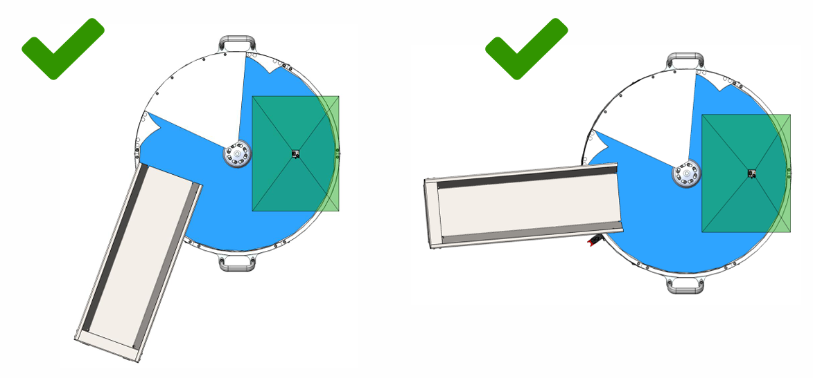
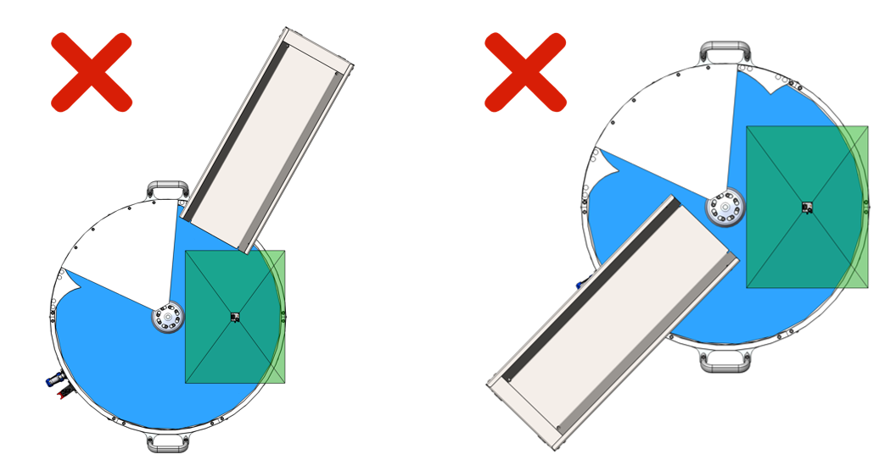
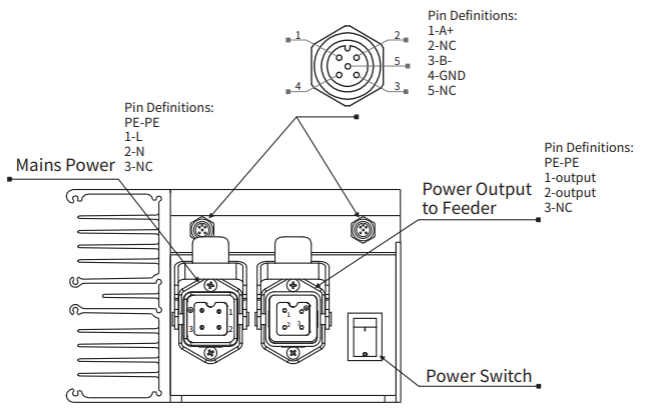
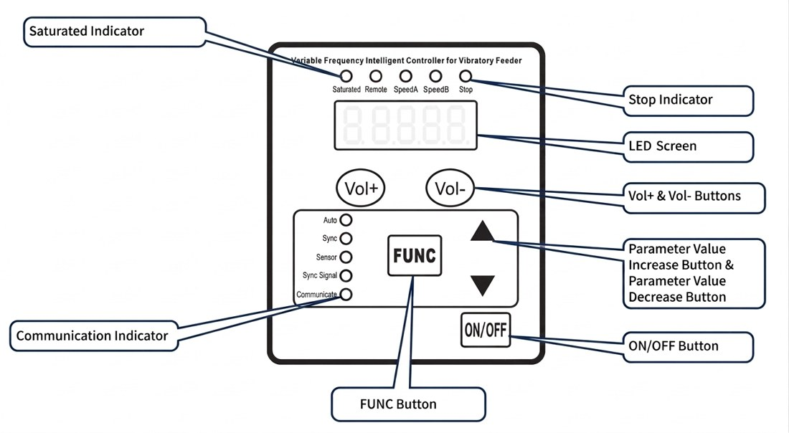
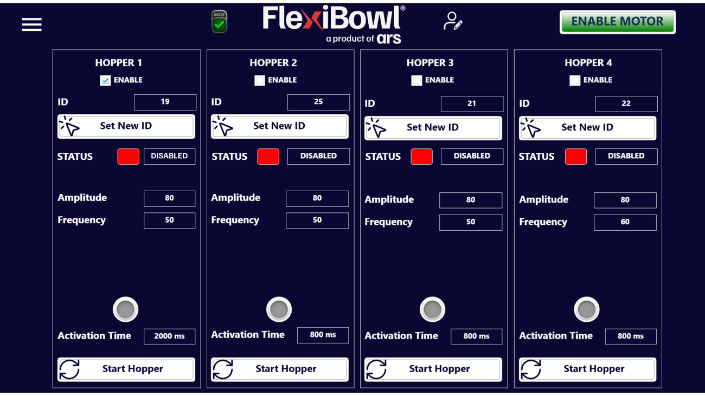
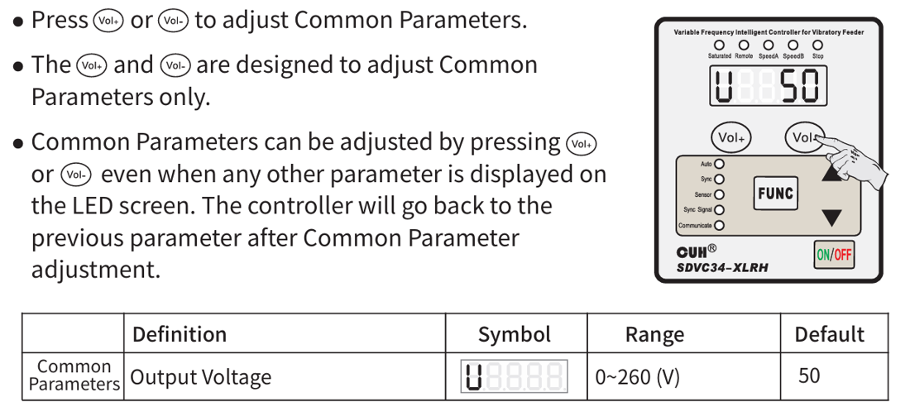
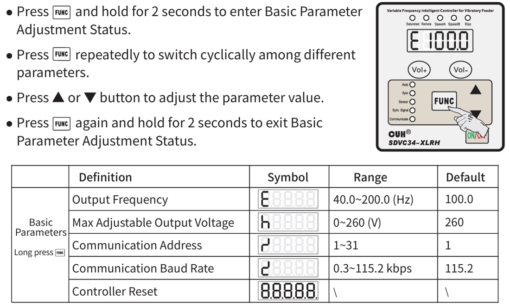
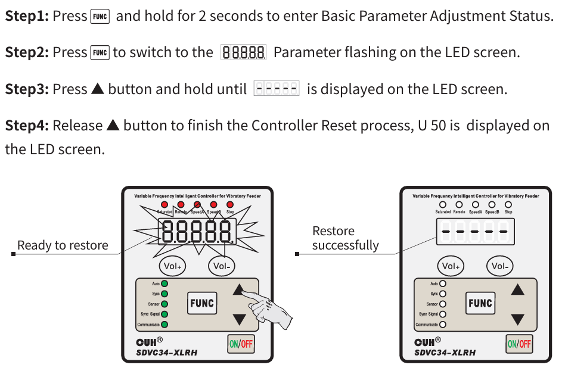

# **Configurazione Tramoggia**

Questa pagina guida alla messa in funzione della tramoggia vibrante, l'accessorio opzionale che alimenta il FlexiBowl® in modo continuo e uniforme. Segui le quattro fasi in sequenza: posizionamento e montaggio meccanico, collegamenti elettrici, impostazione dell'indirizzo di comunicazione e configurazione dei parametri da interfaccia software.

  

  <!-- Step 1 -->
  

    

      
1

      

    

    

      

        <i class="ph ph-package"></i>
        <a class="qs-title-link" href="conf_tramoggia.html#posizionamento-e-installazione-meccanica">Posizionamento e installazione meccanica</a>
      

      

        Posizionare la tramoggia rispettando l'orientamento corretto rispetto al FlexiBowl® e fissarla alla staffa di supporto.
      

    

  

  <!-- Step 2 -->
  

    

      
2

      

    

    

      

        <i class="ph ph-plugs"></i>
        <a class="qs-title-link" href="conf_tramoggia.html#collegamenti-elettrici">Collegamenti elettrici</a>
      

      

        Collegare il controller alla tramoggia, al FlexiBowl® (o al rack) e all'alimentazione, rispettando l'ordine di connessione.
      

    

  

  <!-- Step 3 -->
  

    

      
3

      

    

    

      

        <i class="ph ph-hash"></i>
        <a class="qs-title-link" href="conf_tramoggia.html#indirizzo-di-comunicazione-rs485">Indirizzo di comunicazione RS485</a>
      

      

        Impostare dal pannello del controller un indirizzo univoco, necessario per comunicare con il FlexiBowl® ed eventuali altre tramogge.
      

    

  

  <!-- Step 4 -->
  

    

      
4

      

    

    

      

        <i class="ph ph-hash"></i>
        <a class="qs-title-link" href="conf_tramoggia.html#configurazione-da-interfaccia-software">Configurazione da interfaccia software</a>
      

      

        Abilitare la tramoggia dall'interfaccia web del FlexiBowl® e impostare ampiezza, frequenza e tempo di attivazione della vibrazione.
      

    

  

---

## 1. Posizionamento e installazione meccanica

Le tramogge vibranti sono disponibili in diverse dimensioni, ciascuna con un proprio carico massimo:

| Capacità | Carico massimo |
|---|---|
| 1,5 l | 1 kg |
| 3 l | 1,5 kg |
| 5 l | 6 kg |
| 10 l | 6 kg |
| 20 l | 6 kg |
| 40 l | 15 kg |

La tramoggia arriva già assemblata: non è necessario montarla, solo posizionarla e fissarla.

::::{tab-set}
:::{tab-item} Posizionamento corretto

Lo scivolo della tramoggia deve scaricare i componenti direttamente nell'area di lavoro del piatto, con un'inclinazione che segue il profilo del FlexiBowl®.
:::
:::{tab-item} Posizionamento errato

Uno scivolo troppo lontano dall'area di lavoro genera un'alimentazione incostante e penalizza le prestazioni dell'applicazione.
:::
::::

**Passaggi:**

1. Posizionare la tramoggia su una superficie stabile e orizzontale, vicino al FlexiBowl®, rispettando l'orientamento corretto indicato sopra.
2. Se la tramoggia viene installata sul piano di una macchina sensibile alle vibrazioni, interporre un materiale isolante e anti-vibrante tra le due superfici, per evitare che le vibrazioni della tramoggia si trasmettano al FlexiBowl®.
3. Fissare la tramoggia alla staffa di supporto tramite i fori dedicati, utilizzando viti M8: la tramoggia standard ha 4 fori alla base, mentre la versione più piccola (1,5 l) ne ha 2.

## 2. Collegamenti elettrici

:::{warning}
Prima di effettuare o modificare qualsiasi collegamento elettrico, assicurarsi che il sistema sia spento. Verificare sempre che il conduttore di terra sia correttamente installato e integro: il collegamento elettrico, compresa la messa a terra, deve essere sempre garantito per il corretto funzionamento della macchina.
:::

Il controller della tramoggia dispone di: ingresso alimentazione di rete (terra, linea, neutro), connettore RS485 per la comunicazione (A+, B-, GND), uscita di potenza verso il motore della tramoggia e interruttore generale.

**Passaggi:**

1. Collegare il controller alla tramoggia tramite il cavo dedicato.
2. Collegare il controller al FlexiBowl® tramite il connettore M12 A-code (comunicazione Modbus RTU). In caso di installazioni multi-tramoggia con rack, collegare invece il controller al rack.
3. Tappare qualsiasi connettore non utilizzato con l'apposito cappuccio, per proteggerlo da polvere e detriti. Il cappuccio deve garantire una resistenza di 120 Ω tra i canali A+ e B- della linea RS485.
4. Collegare il cavo di alimentazione al controller: collegare sempre per primo il lato controller del cavo, prima di collegare l'altra estremità.
5. Con l'interruttore del controller in posizione OFF, collegare il cavo di alimentazione alla presa di rete. L'alimentazione standard è 115 o 230 VAC ±5% (la versione a 115 V è disponibile solo su richiesta esplicita).
6. Accendere il controller dall'interruttore generale.

:::{note}
Un singolo FlexiBowl® supporta fino a **4 tramogge**. Per installazioni multi-tramoggia, collegare ogni tramoggia al proprio controller, collegare il primo controller al FlexiBowl® (o al rack) e concatenare i controller successivi tramite la porta del connettore tramoggia (daisy-chain). Tappare la porta inutilizzata sull'ultimo controller della catena e collegare il cavo di alimentazione a ciascun controller.
:::

## 3. Indirizzo di comunicazione RS485

Ogni controller di tramoggia deve avere un indirizzo di comunicazione univoco sulla rete RS485 (parametro **r**, intervallo 1–31). In presenza di più tramogge, assicurarsi che ogni controller sulla stessa rete abbia un indirizzo diverso.

**Passaggi dal pannello del controller:**

1. Tenere premuto **FUNC** per 2 secondi per entrare nello stato di regolazione dei parametri base.
2. Premere ripetutamente **FUNC** per selezionare il parametro **r** (indirizzo di comunicazione).
3. Premere **▲** o **▼** per modificare il valore (1–31).
4. Tenere nuovamente premuto **FUNC** per 2 secondi per uscire e salvare.

## 4. Configurazione da interfaccia software

Una volta completati i collegamenti e impostato l'indirizzo, la tramoggia può essere configurata e comandata dalla pagina dedicata dell'interfaccia web del FlexiBowl®.

Per ciascuna delle 4 tramogge disponibili è possibile impostare:

| Campo | Descrizione |
|---|---|
| **Enable** | Abilita la tramoggia corrispondente. |
| **ID** | Indirizzo RS485 del controller collegato; usare **Set New ID** per assegnarne uno nuovo via software. |
| **Status** | Stato corrente della tramoggia (es. Disabled). |
| **Amplitude** | Ampiezza della vibrazione. |
| **Frequency** | Frequenza della vibrazione. |
| **Activation Time** | Durata, in millisecondi, di ogni impulso di vibrazione. |

**Passaggi:**

1. Accedere all'interfaccia web del FlexiBowl® e aprire la pagina delle tramogge.
2. Selezionare **Enable** sulla tramoggia da attivare.
3. Verificare che il campo **ID** corrisponda all'indirizzo impostato sul controller (punto 3); in caso contrario, usare **Set New ID**.
4. Impostare i valori iniziali di **Amplitude**, **Frequency** e **Activation Time** in base al componente da alimentare.
5. Premere **Start Hopper** per avviare la tramoggia e verificarne il funzionamento; regolare i parametri finché l'alimentazione dei componenti non risulta continua e uniforme.

:::{note}
I valori ottimali di ampiezza, frequenza e tempo di attivazione dipendono dal componente e dalla geometria della tramoggia: regolarli progressivamente osservando il flusso di alimentazione, partendo da valori bassi e aumentando fino a ottenere un'alimentazione costante senza inceppamenti.
:::

<strong>Parametri avanzati del controller</strong> (regolabili dal pannello fisico)

**Parametri comuni** — regolabili in qualsiasi momento con i tasti **Vol+** / **Vol-**, anche mentre è visualizzato un altro parametro:

| Definizione | Simbolo | Range | Default |
|---|---|---|---|
| Tensione di uscita | U | 0–260 V | 50 |

**Parametri base** — tenere premuto **FUNC** per 2 secondi per accedere, premere **FUNC** per scorrere i parametri, **▲/▼** per modificarli, tenere premuto **FUNC** per 2 secondi per uscire:

| Definizione | Simbolo | Range | Default |
|---|---|---|---|
| Frequenza di uscita | E | 40,0–200,0 Hz | 100,0 |
| Tensione di uscita massima regolabile | h | 0–260 V | 260 |
| Indirizzo di comunicazione | r | 1–31 | 1 |
| Baud rate di comunicazione | c | 0,3–115,2 kbps | 115,2 |
| Reset del controller | — | — | — |

**Reset del controller:**

1. Tenere premuto **FUNC** per 2 secondi per entrare nello stato di regolazione dei parametri base.
2. Premere **FUNC** finché sul display lampeggia il parametro di reset (`88888`).
3. Tenere premuto **▲** finché non compare `-----` sul display.
4. Rilasciare **▲** per completare il reset: il display mostrerà `U 50`, a conferma dell'operazione avvenuta con successo.

