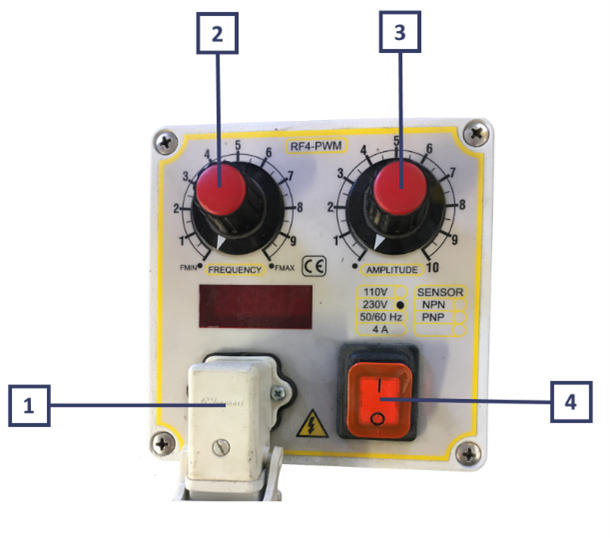
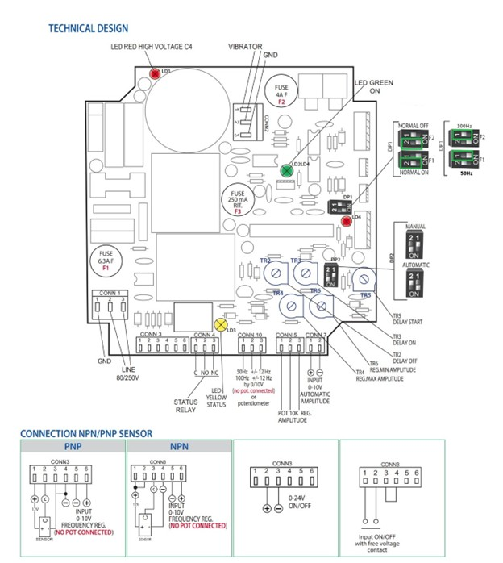
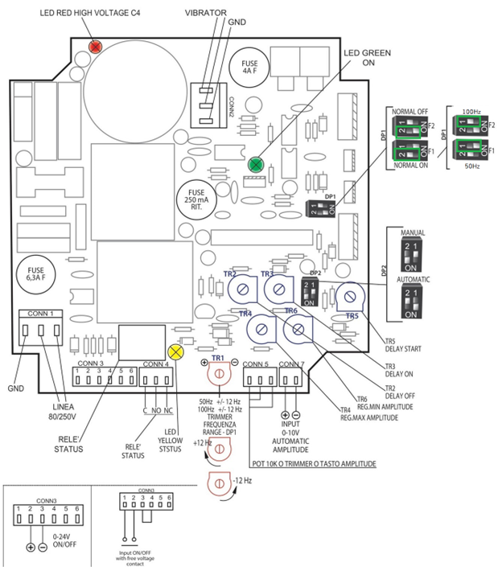

# **Controller e Cablaggio**

La macchina, durante il funzionamento, non necessita della presenza continua di un operatore.

:::{attention}
Utilizzare la macchina per scopo diverso da quello previsto dal Costruttore potrebbe causare gravi danni alle persone e/o cose e/o animali.
La società ARS S.r.l. non risponde per danni causati da un uso improprio della macchina.
:::

## Descrizione Controller 

Il **Controller digitale** è dotato di un microprocessore con visualizzazione della frequenza. È possibile impostare un ritardo all’avvio o all’arresto del vibratore, tramite **sensore PNP/NPN** o tramite un **contatto meccanico** fino a un massimo di 6 secondi regolabili.

### Dati Tecnici Controller 

| Caratteristica tecnica | Specifica / Valore |
| :--- | :--- |
| **Alimentazione elettrica** | 85 / 250 V |
| **Frequenza / Fase** | 50/60 Hz / monofase |
| **Consumo** | 1,5 W max |
| **Corrente Max** | 5 A (RMS) |
| **Fusibili** | Doppio 5A F 250V 5x20 H 1500A |
| **Carico Minimo** | 50 mA (RMS) |
| **On/Off** | Contatto pulito - Segnale in tensione 0-24 Vcc |
| **Reg. Di Frequenza Vibratore** | 50 ÷ 100 Hz +/- 12 Hz |
| **Ingresso Sensore** | NPN/PNP - contatto meccanico |
| **Ritardo ON/OFF** | 0 / 6 secondi |
| **Temperatura di Funzionamento** | -15 °C / +45 °C |
| **Norme Europee** | EMC CE |
| **Grado di Protezione** | IP65 in cassetta |

:::{attention}
È possibile integrare controller diversi da quello fornito dal Costruttore purché quest’ultimo ne abbia preliminarmente validato le caratteristiche tecniche. La società ARS s.r.l. non risponde per danni causati dall’utilizzo di un controller non validato o non compatibile con la macchina.
:::

## Procedure di utilizzo

### Verifiche preliminari

Prima di procedere con la messa in funzione della macchina, occorre eseguire le seguenti verifiche:

  

    

      
Stabilità

      
Controllare che la macchina sia posizionata su un piano in grado di sostenere il peso.

    

  

  

    

       
Sicurezza

      
Controllare il funzionamento dei dispositivi di sicurezza e assicurarsi che tutti i ripari apribili siano ben chiusi.

    

  

  

    

      
Spazio Operativo

      
 Controllare che lo spazio attorno alla macchina sia libero da ingombri e/o trabocchetti.

    

  

  

    

     
Alimentazione

      
Controllare che la macchina sia stata collegata alla rete elettrica e che le fasi di alimentazione siano corrette.

    

  

  

    

       
Meccanica

      
Controllare che la vasca sia completamente libera di vibrare.

    

  

  

    

      
Stato Macchina

      
Controllare che la macchina non si trovi in stato di “Manutenzione”.

    

  

### Controller standard

#### Connessioni elettriche e setup controller

:::{attention}
Prima di accendere il controller collegare la spina Schuko nella presa di corrente verificando che l’impianto abbia un adeguato sistema di messa a terra.
:::

Per eseguire l’avviamento, procedere come descritto:

  

    
1

    

      Collegare il cavo della base lineare al connettore di uscita del controller (collegare quindi il vibratore al connettore di uscita <strong>(1)</strong>).
    

  

  

    
2

    

      Ruotare la manopola di regolazione frequenza <strong>(2)</strong> e di regolazione di ampiezza <strong>(3)</strong> del controller sulla posizione “•”.
    

  

  

    
3

    

      Accendere il controller con il pulsante ON/OFF (pulsante su posizione 1 <strong>(4)</strong>).
    

  

  

    
4

    

      Ruotare lentamente le manopole di regolazione <strong>(2 e 3)</strong>. Prima di portare la vibrazione al massimo (Potenziometro Amplitude <strong>(3)</strong>) si consiglia di cercare con il potenziometro Frequency <strong>(2)</strong>, la frequenza di risonanza corretta (50 Hertz).
    

  

Per rispetto della normativa EMC il circuito è dotato di filtro con correnti di perdita verso terra inferiore a 1mA. Il circuito fornisce al vibratore un segnale di comando modulato in larghezza di impulsi (PWM) regolabile sia in Ampiezza che in Frequenza. Tale segnale è compensato nei confronti delle variazioni della tensione di linea.

Il circuito è controllato da microprocessore ed è dotato di limitazione della corrente in uscita tramite fusibile 4A (F4). 

**Protezioni tramite fusibili:**
* **F1 (6,3A):** sull’ingresso di linea.
* **F3 (250mA):** sull’ingresso di ON/OFF (limita la corrente disponibile per il sensore NPN/PNP e un'eventuale elettrovalvola).
* **F4 (4A):** sull’uscita del vibratore. 

**Indicatori LED interni alla scheda:**
* **LED verde (LD2):** acceso indica la presenza di tensione nel circuito di controllo. È spento se sono rotti F1 e/o F2 e/o F3.
* **LED rosso (LD1):** acceso indica la presenza di alta tensione sui condensatori di filtraggio (sino a oltre 300V con 230V di linea).

:::{attention}
Evitare assolutamente di toccare il circuito con il led rosso acceso.
:::

* **LED verde (LD3):** acceso indica l’avvenuta commutazione del relè di ON/OFF in concomitanza con la marcia/arresto del vibratore.
* **LED giallo (LD4):** acceso indica la commutazione del relè per avvenuto superamento del tempo di mancanza pezzi. Tali relè hanno in corrispondenza dei connettori (**CONN4 - CONN5**) la possibilità di prelevare il loro contatto in scambio e quindi attivare un eventuale modulo in cascata (**CONN4**) o un allarme di flusso pezzi (**CONN5**). 

Tutta la sezione di controllo è isolata galvanicamente dalla sezione di potenza. All’accensione il circuito attende qualche secondo prima di abilitare il vibratore. Il circuito è in grado di compensare le variazioni della tensione di linea mantenendo costante la tensione sul vibratore. 

È possibile eseguire le seguenti operazioni: 
* Regolare il tempo di ritardo alla partenza del vibratore con il trimmer **TR3** (0/10 sec) o di ritardo al fermo del vibratore con il trimmer **TR2** (0/10 sec). 
* Regolare con **TR4** l’ampiezza massima. 
* Regolare con **TR5** il ritardo in avvio. 
* Regolare con **TR6** l’ampiezza minima.
* Bloccare e fare ripartire il vibratore con un comando esterno proveniente sia da contatto pulito che da sensore NPN o PNP oppure da una uscita 0/24V, inserendo o meno i ritardi sopra menzionati (vedi particolare **CONN3**). Con **DP1** si può selezionare la logica diritta o negata del segnale di ON/OFF proveniente dal sensore o dal contatto collegati a **CONN3**.

Il Relè ON/OFF (**CONN4**) commuta ogni qualvolta viene a mancare la tensione in uscita sul vibratore. Tale contatto serve anche per il pilotaggio in cascata delle varie unità vibranti nei sistemi di caricamento multipli.

**Configurazione standard consigliata da ARS:**
* **DP1:** entrambi gli switch in posizione **ON**.
* **DP2:** switch 2 in posizione **ON** e switch 1 in posizione **OFF**.
* **TR2 e TR3:** ruotare la vite di regolazione in senso antiorario fino a fine corsa.
* **CONN3:** start a tramoggia con contatto pulito.

---

### Controller analogico

#### Connessioni elettriche e setup controller

Per eseguire l’avviamento, procedere come descritto e fare riferimento all’immagine a fine paragrafo:

  

    
1

    

      Collegare l’alimentazione 80/250 Vac al connettore <strong>CONN 1</strong>.
    

  

  

    
2

    

      Collegare il cavo proveniente dalla base vibrante al connettore <strong>CONN 2</strong>.
    

  

  

    
3

    

      Collegare il comando di azionamento sul connettore <strong>CONN 3</strong>.
    

  

  

    
4

    

      Collegare l’ingresso analogico al connettore <strong>CONN 7</strong>.
    

  

  

    
5

    

      Regolare il trimmer <strong>TR1</strong> affinché la frequenza sia pari a 50 Hertz.
    

  

Per rispetto della normativa EMC il circuito è dotato di filtro con correnti di perdita verso terra inferiore a 1mA. Il circuito fornisce al vibratore un segnale di comando modulato in larghezza di impulsi (PWM) regolabile sia in Ampiezza (tramite segnale analogico) che in Frequenza tramite trimmer **TR1**. Tale segnale è compensato nei confronti delle variazioni della tensione di linea.

Il circuito è controllato da microprocessore ed è dotato di limitazione della corrente in uscita tramite fusibile 4A (F4).

**Protezioni tramite fusibili:**
* **F1-F2 (6,3A):** sull’ingresso di linea.
* **F3 (250mA):** sull’ingresso di ON/OFF (limita la corrente disponibile per il sensore NPN/PNP e un'eventuale elettrovalvola).
* **F4 (4A):** sull’uscita del vibratore.

**Indicatori LED interni alla scheda:**
* **LED verde (LD2):** acceso indica la presenza di tensione nel circuito di controllo. È spento se sono rotti F1 e/o F2 e/o F3.
* **LED rosso (LD1):** acceso indica la presenza di alta tensione sui condensatori di filtraggio (sino a oltre 300V con 230V di linea).

:::{attention}
Evitare assolutamente di toccare il circuito con il led rosso acceso.
:::

* **LED verde (LD3):** acceso indica l’avvenuta commutazione del relè di ON/OFF in concomitanza con la marcia/arresto del vibratore.
* **LED giallo (LD4):** acceso indica la commutazione del relè per avvenuto superamento del tempo di mancanza pezzi. Tali relè hanno in corrispondenza dei connettori (**CONN4 - CONN5**) la possibilità di prelevare il loro contatto in scambio e quindi attivare un eventuale modulo in cascata (**CONN4**) o un allarme di flusso pezzi (**CONN5**).

Tutta la sezione di controllo è isolata galvanicamente dalla sezione di potenza. All’accensione il circuito attende qualche secondo prima di abilitare il vibratore. Il circuito è in grado di compensare le variazioni della tensione di linea mantenendo costante la tensione sul vibratore. 

È possibile eseguire le seguenti operazioni tramite regolazioni dedicate:
* Regolare il tempo di ritardo alla partenza del vibratore con il trimmer **TR3** (0/10 sec) o di ritardo al fermo del vibratore con il trimmer **TR2** (0/10 sec).
* Regolare con **TR4** il tempo di ritardo oltre il quale scatta l’allarme mancanza pezzi (0/10 sec).
* Regolare con **TR5** il tempo aggiuntivo di attivazione dell'elettrovalvola di soffio aria una volta arrestato il vibratore (0/3 sec).
* Regolare con **TR6** la rampa all’accensione del vibratore (0/3 sec).
* Regolare con **TR7** la massima ampiezza sul vibratore.
* Bloccare e fare ripartire il vibratore con un comando esterno proveniente sia da contatto pulito che da sensore NPN o PNP oppure da una uscita 0/24V, inserendo o meno i ritardi sopra menzionati (vedi particolare **CONN3**).
* Tramite il **DP1** si può selezionare la logica NC o NO del segnale di ON/OFF proveniente dal sensore o dal contatto collegati a **CONN3**.
* Impostare la tensione analogica in base alla vibrazione necessaria.

Il Relè ON/OFF (**CONN4**) commuta ogni qualvolta viene a mancare la tensione in uscita sul vibratore. Tale contatto serve anche per il pilotaggio in cascata delle varie unità vibranti nei sistemi di caricamento multipli.

**Configurazione standard consigliata da ARS:**
* **DP1:** entrambi gli switch in posizione **ON**.
* **DP2:** switch 1 in posizione **ON** e switch 2 in posizione **OFF**.
* **TR2 e TR3:** ruotare la vite di regolazione in senso antiorario fino a fine corsa.
* **CONN3:** start a tramoggia con contatto pulito.

 
 
