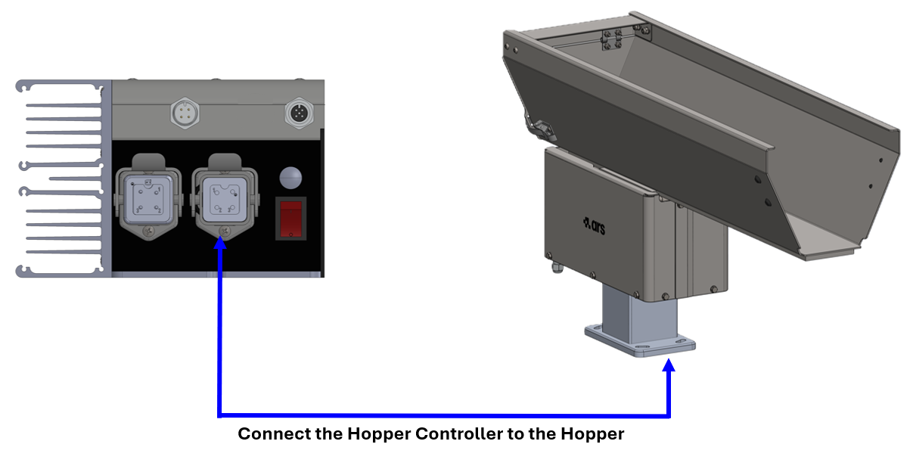
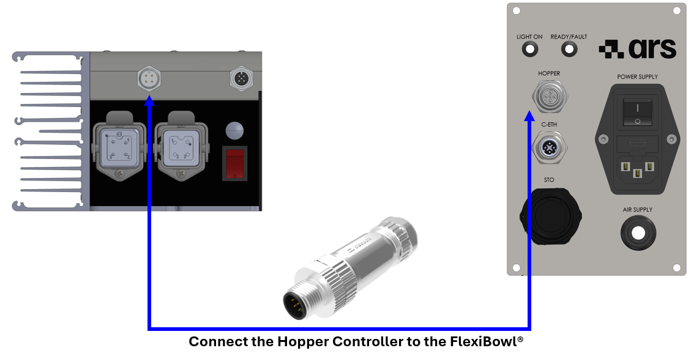
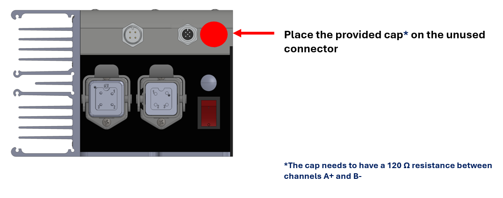
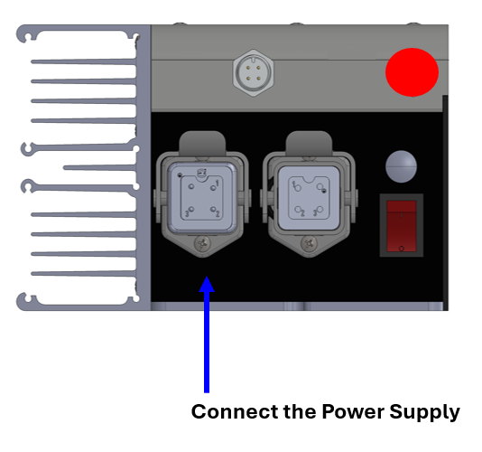
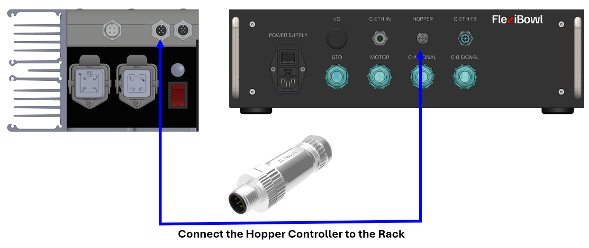
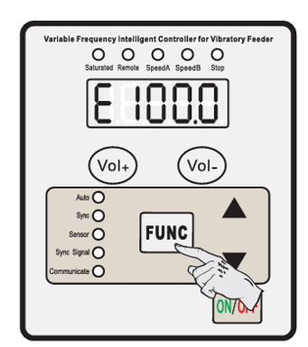
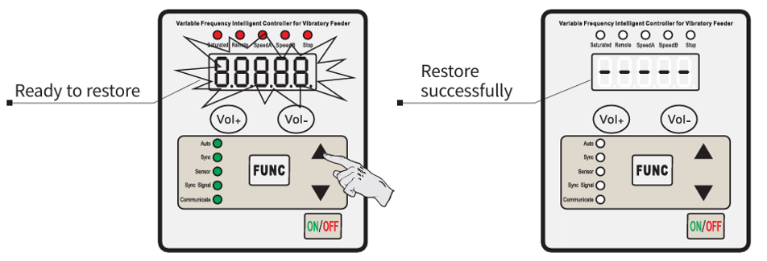
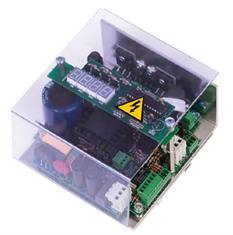

# **[ELE]** Controller e Cablaggio

La macchina, durante il funzionamento, non necessita della presenza continua di un operatore.

:::{attention}
Utilizzare la macchina per scopo diverso da quello previsto dal Costruttore potrebbe causare gravi danni alle persone e/o cose e/o animali.
La società ARS S.r.l. non risponde per danni causati da un uso improprio della macchina.
:::

## Descrizione Controller 

Il **Controller digitale** è dotato di un microprocessore con visualizzazione della frequenza. È possibile impostare un ritardo all'avvio o all'arresto del vibratore, tramite **sensore PNP/NPN** o tramite un **contatto meccanico** fino a un massimo di 6 secondi regolabili.

### Dati Tecnici Controller 

| Caratteristica tecnica | Specifica / Valore |
| :--- | :--- |
| **Alimentazione elettrica** | 85 / 250 V |
| **Frequenza / Fase** | 50/60 Hz / monofase |
| **Consumo** | 1,5 W max |
| **Corrente Max** | 5 A (RMS) |
| **Fusibili** | Doppio 5A F 250V 5x20 H 1500A |
| **Carico Minimo** | 50 mA (RMS) |
| **On/Off** | Contatto pulito - Segnale in tensione 0-24 Vcc |
| **Reg. Di Frequenza Vibratore** | 50 ÷ 100 Hz +/- 12 Hz |
| **Ingresso Sensore** | NPN/PNP - contatto meccanico |
| **Ritardo ON/OFF** | 0 / 6 secondi |
| **Temperatura di Funzionamento** | -15 °C / +45 °C |
| **Norme Europee** | EMC CE |
| **Grado di Protezione** | IP65 in cassetta |

:::{attention}
È possibile integrare controller diversi da quello fornito dal Costruttore purché quest'ultimo ne abbia preliminarmente validato le caratteristiche tecniche. La società ARS s.r.l. non risponde per danni causati dall'utilizzo di un controller non validato o non compatibile con la macchina.
:::

#### Comandi del pannello frontale

```{image} ../../../../../_shared/media/images/controller_digitale_pannello.jpeg
:alt: Pannello frontale controller digitale CUH SDVC34-XLRH
:width: 90%
:align: center
```

| Elemento | Funzione |
|---|---|
| **Display LED** | Visualizza il parametro corrente e il relativo valore |
| **Indicatore Saturated** | Segnala la saturazione del segnale di uscita |
| **Indicatore Remote** | Segnala il controllo da remoto attivo |
| **Indicatori Speed A / Speed B** | Segnalano la velocità/uscita attiva |
| **Indicatore Stop** | Segnala lo stato di arresto |
| **Pulsanti Vol+ / Vol-** | Regolano i **Parametri Comuni** (vedi sotto), in qualunque momento |
| **Pulsante FUNC** | Ingresso/uscita e navigazione tra i **Parametri Base** |
| **Pulsanti ▲ / ▼** | Incrementano/decrementano il valore del parametro selezionato |
| **Indicatori Auto / Sync / Sensor / Sync Signal / Communicate** | Stato del funzionamento e della comunicazione RS485 |
| **Pulsante ON/OFF** | Accensione/spegnimento del controller |

#### Connettori sul retro

```{image} ../../../../../_shared/media/images/controller_digitale_connettori.png
:alt: Pannello connettori posteriore controller digitale
:width: 85%
:align: center
```

| Connettore | Pin | Funzione |
|---|---|---|
| **Mains Power** (alimentazione) | PE-PE, 1-L, 2-N, 3-NC | Alimentazione di rete |
| **Connettore 5 pin** (comunicazione) | 1-A+, 2-NC, 3-B-, 4-GND, 5-NC | Comunicazione RS485 (A+/B-) |
| **Power Output to Feeder** (uscita verso vibratore) | PE-PE, 1-output, 2-output, 3-NC | Alimentazione verso la base vibrante |
| **Power Switch** | — | Interruttore di accensione/spegnimento |

## Procedure di utilizzo

### Verifiche preliminari

Prima di procedere con la messa in funzione della macchina, occorre eseguire le seguenti verifiche:

<div class="isw-symbol-grid">
  <div class="isw-symbol-item">
    <div>
      <div class="isw-symbol-label">Stabilità</div>
      <div class="isw-symbol-desc">Controllare che la macchina sia posizionata su un piano in grado di sostenere il peso.</div>
    </div>
  </div>
  <div class="isw-symbol-item">
    <div>
       <div class="isw-symbol-label">Sicurezza</div>
      <div class="isw-symbol-desc">Controllare il funzionamento dei dispositivi di sicurezza e assicurarsi che tutti i ripari apribili siano ben chiusi.</div>
    </div>
  </div>
  <div class="isw-symbol-item">
    <div>
      <div class="isw-symbol-label">Spazio Operativo</div>
      <div class="isw-symbol-desc"> Controllare che lo spazio attorno alla macchina sia libero da ingombri e/o trabocchetti.</div>
    </div>
  </div>
  <div class="isw-symbol-item">
    <div>
     <div class="isw-symbol-label">Alimentazione</div>
      <div class="isw-symbol-desc">Controllare che la macchina sia stata collegata alla rete elettrica e che le fasi di alimentazione siano corrette.</div>
    </div>
  </div>
  <div class="isw-symbol-item">
    <div>
       <div class="isw-symbol-label">Meccanica</div>
      <div class="isw-symbol-desc">Controllare che la vasca sia completamente libera di vibrare.</div>
    </div>
  </div>
  <div class="isw-symbol-item">
    <div>
      <div class="isw-symbol-label">Stato Macchina</div>
      <div class="isw-symbol-desc">Controllare che la macchina non si trovi in stato di "Manutenzione".</div>
    </div>
  </div>
</div>

### Sequenza di collegamento elettrico

Indipendentemente dal tipo di controller utilizzato (standard, analogico o digitale), il collegamento elettrico tra tramoggia, controller e FlexiBowl® segue una sequenza precisa. La sequenza differisce leggermente in base al modello: i **FlexiBowl® 500/650/8 00/1200** dispongono di un pannello standard con connettore HOPPER integrato, mentre i **FlexiBowl® 200/350** utilizzano un rack esterno dotato di proprio connettore HOPPER.

#### FlexiBowl® 500 / 600 / 900 / 1200 — pannello standard

<div style="display: flex; flex-direction: column; gap: 12px; margin: 20px 0;">
  <div style="display: flex; background-color: #f8f9fa; border-radius: 6px; border: 1px solid #e9ecef; overflow: hidden;">
    <div style="background-color: #0f766e; color: #ffffff; display: flex; align-items: center; justify-content: center; width: 45px; font-weight: bold; flex-shrink: 0;">1</div>
    <div style="padding: 12px 15px; color: #2c3e50; font-size: 0.95em;">
      Collegare il <strong>Controller</strong> alla <strong>tramoggia</strong> (base vibrante).
    </div>
    
  </div>
  <div style="display: flex; background-color: #f8f9fa; border-radius: 6px; border: 1px solid #e9ecef; overflow: hidden;">
    <div style="background-color: #0f766e; color: #ffffff; display: flex; align-items: center; justify-content: center; width: 45px; font-weight: bold; flex-shrink: 0;">2</div>
    <div style="padding: 12px 15px; color: #2c3e50; font-size: 0.95em;">
      Collegare il <strong>Controller</strong> al connettore <strong>HOPPER</strong> sul pannello standard del FlexiBowl®.
    </div>
    
  </div>
  <div style="display: flex; background-color: #f8f9fa; border-radius: 6px; border: 1px solid #e9ecef; overflow: hidden;">
    <div style="background-color: #0f766e; color: #ffffff; display: flex; align-items: center; justify-content: center; width: 45px; font-weight: bold; flex-shrink: 0;">3</div>
    <div style="padding: 12px 15px; color: #2c3e50; font-size: 0.95em;">
      Se il connettore Hopper del FlexiBowl® non viene utilizzato, inserire l'apposito <strong>cappuccio di terminazione</strong>*.
    </div>
    
  </div>
  <div style="display: flex; background-color: #f8f9fa; border-radius: 6px; border: 1px solid #e9ecef; overflow: hidden;">
    <div style="background-color: #0f766e; color: #ffffff; display: flex; align-items: center; justify-content: center; width: 45px; font-weight: bold; flex-shrink: 0;">4</div>
    <div style="padding: 12px 15px; color: #2c3e50; font-size: 0.95em;">
      Collegare il cavo di <strong>alimentazione</strong> al Controller, verificando che l'interruttore di accensione sia in posizione <strong>OFF</strong>.
    </div>
    
  </div>
  <div style="display: flex; background-color: #f8f9fa; border-radius: 6px; border: 1px solid #e9ecef; overflow: hidden;">
    <div style="background-color: #0f766e; color: #ffffff; display: flex; align-items: center; justify-content: center; width: 45px; font-weight: bold; flex-shrink: 0;">5</div>
    <div style="padding: 12px 15px; color: #2c3e50; font-size: 0.95em;">
      Collegare la spina del cavo di alimentazione alla <strong>presa di corrente</strong>, solo dopo aver confermato che l'interruttore del controller sia su OFF.
    </div>
  </div>
</div>

:::{attention}
*Il cappuccio deve garantire una resistenza di **120 Ω** tra i canali A+ e B-.
:::

:::{important}
Collegare sempre **prima il lato controller** del cavo di alimentazione, e solo dopo inserire la spina nella presa di corrente.
:::

```{image} ../../../../../_shared/media/images/controller_side.png
:alt: Collegare sempre prima il lato controller
:width: 70%
:align: center
```

```{image} ../../../../../_shared/media/images/power_outlet.png
:alt: Collegamento della spina alla presa di corrente
:width: 70%
:align: center
```

#### **Collegamento in cascata di più tramogge**

Sui modelli con pannello standard è possibile collegare più unità Hopper Controller in cascata, alimentando ciascun controller singolarmente e collegando i connettori tra un'unità e la successiva.

```{image} ../../../../../_shared/media/images/daisy_chain.png
:alt: Collegamento in cascata di più Hopper Controller
:width: 100%
:align: center
```

#### FlexiBowl® 200 / 350 — pannello rack

<div style="display: flex; flex-direction: column; gap: 12px; margin: 20px 0;">
  <div style="display: flex; background-color: #f8f9fa; border-radius: 6px; border: 1px solid #e9ecef; overflow: hidden;">
    <div style="background-color: #0f766e; color: #ffffff; display: flex; align-items: center; justify-content: center; width: 45px; font-weight: bold; flex-shrink: 0;">1</div>
    <div style="padding: 12px 15px; color: #2c3e50; font-size: 0.95em;">
      Collegare il <strong>Controller</strong> alla <strong>tramoggia</strong> (base vibrante).
    </div>
    
  </div>
  <div style="display: flex; background-color: #f8f9fa; border-radius: 6px; border: 1px solid #e9ecef; overflow: hidden;">
    <div style="background-color: #0f766e; color: #ffffff; display: flex; align-items: center; justify-content: center; width: 45px; font-weight: bold; flex-shrink: 0;">2</div>
    <div style="padding: 12px 15px; color: #2c3e50; font-size: 0.95em;">
      Collegare il <strong>Controller</strong> al connettore <strong>HOPPER</strong> sul pannello del <strong>rack</strong>.
    </div>
    
  </div>
  <div style="display: flex; background-color: #f8f9fa; border-radius: 6px; border: 1px solid #e9ecef; overflow: hidden;">
    <div style="background-color: #0f766e; color: #ffffff; display: flex; align-items: center; justify-content: center; width: 45px; font-weight: bold; flex-shrink: 0;">3</div>
    <div style="padding: 12px 15px; color: #2c3e50; font-size: 0.95em;">
      Se il connettore Hopper del rack non viene utilizzato, inserire l'apposito <strong>cappuccio di terminazione</strong>*.
    </div>
    
  </div>
  <div style="display: flex; background-color: #f8f9fa; border-radius: 6px; border: 1px solid #e9ecef; overflow: hidden;">
    <div style="background-color: #0f766e; color: #ffffff; display: flex; align-items: center; justify-content: center; width: 45px; font-weight: bold; flex-shrink: 0;">4</div>
    <div style="padding: 12px 15px; color: #2c3e50; font-size: 0.95em;">
      Collegare il cavo di <strong>alimentazione</strong> al Controller, verificando che l'interruttore di accensione sia in posizione <strong>OFF</strong>.
    </div>
    
  </div>
  <div style="display: flex; background-color: #f8f9fa; border-radius: 6px; border: 1px solid #e9ecef; overflow: hidden;">
    <div style="background-color: #0f766e; color: #ffffff; display: flex; align-items: center; justify-content: center; width: 45px; font-weight: bold; flex-shrink: 0;">5</div>
    <div style="padding: 12px 15px; color: #2c3e50; font-size: 0.95em;">
      Collegare la spina del cavo di alimentazione alla <strong>presa di corrente</strong>, solo dopo aver confermato che l'interruttore del controller sia su OFF.
    </div>
  </div>
</div>

:::{attention}
*Il cappuccio deve garantire una resistenza di **120 Ω** tra i canali A+ e B-.
:::

:::{important}
Collegare sempre **prima il lato controller** del cavo di alimentazione, e solo dopo inserire la spina nella presa di corrente.
:::

```{image} ../../../../../_shared/media/images/controller_side.png
:alt: Collegare sempre prima il lato controller
:width: 70%
:align: center
```

```{image} ../../../../../_shared/media/images/power_outlet.png
:alt: Collegamento della spina alla presa di corrente
:width: 70%
:align: center
```

:::{note}
Alimentazione standard del controller: **115 Vac** oppure **230 Vac ±5%**. Verificare sempre che il conduttore di terra sia correttamente installato e integro prima di alimentare il sistema.
:::

---

#### Impostazione dell'indirizzo di comunicazione

Una volta completato il cablaggio elettrico, il passaggio successivo è impostare un **indirizzo di comunicazione univoco** su ciascun controller, tramite il parametro **Communication Address** (`r`).

:::{note}
Il parametro `r` rappresenta l'**ID del controller** sulla rete di comunicazione **RS485**. Quando più controller sono collegati sulla stessa rete (es. più tramogge), è **obbligatorio** assegnare a ciascuno un indirizzo diverso, nel range **1–31**, per poterli distinguere e controllare singolarmente.
:::

<div style="display: flex; flex-direction: column; gap: 12px; margin: 20px 0;">
  <div style="display: flex; background-color: #f8f9fa; border-radius: 6px; border: 1px solid #e9ecef; overflow: hidden;">
    <div style="background-color: #7c3aed; color: #ffffff; display: flex; align-items: center; justify-content: center; width: 45px; font-weight: bold; flex-shrink: 0;">1</div>
    <div style="padding: 12px 15px; color: #2c3e50; font-size: 0.95em;">
      Tenere premuto <strong>FUNC</strong> per 2 secondi per entrare in modalità di regolazione dei Parametri Base.
    </div>
  </div>
  <div style="display: flex; background-color: #f8f9fa; border-radius: 6px; border: 1px solid #e9ecef; overflow: hidden;">
    <div style="background-color: #7c3aed; color: #ffffff; display: flex; align-items: center; justify-content: center; width: 45px; font-weight: bold; flex-shrink: 0;">2</div>
    <div style="padding: 12px 15px; color: #2c3e50; font-size: 0.95em;">
      Premere <strong>FUNC</strong> ripetutamente per scorrere fino al parametro <code>r</code>.
    </div>
  </div>
  <div style="display: flex; background-color: #f8f9fa; border-radius: 6px; border: 1px solid #e9ecef; overflow: hidden;">
    <div style="background-color: #7c3aed; color: #ffffff; display: flex; align-items: center; justify-content: center; width: 45px; font-weight: bold; flex-shrink: 0;">3</div>
    <div style="padding: 12px 15px; color: #2c3e50; font-size: 0.95em;">
      Premere <strong>▲</strong> o <strong>▼</strong> per modificare il valore (1–31).
    </div>
  </div>
</div>

---

#### Interfaccia Software Hopper

Una volta assegnato l'indirizzo univoco a ciascun controller, le tramogge risultano **integrate nel software FlexiBowl®** e possono essere controllate direttamente dalla relativa interfaccia, senza necessità di agire manualmente sui singoli controller.

```{image} ../../../../../_shared/media/images/hopper.png
:alt: Interfaccia software FlexiBowl — gestione delle tramogge (Hopper 1–4)
:width: 100%
:align: center
```

Dall'interfaccia software è possibile, per ciascuna tramoggia collegata:

| Campo | Funzione |
|---|---|
| **ID** | Indirizzo di comunicazione del controller (deve corrispondere a quello impostato manualmente) |
| **ENABLE** | Abilita la tramoggia al funzionamento |
| **Set New ID** | Assegna un nuovo indirizzo di comunicazione dal software |
| **STATUS** | Stato corrente della tramoggia (es. Disabled) |
| **Amplitude** | Ampiezza di vibrazione |
| **Frequency** | Frequenza di vibrazione |
| **Activation Time** | Tempo di attivazione della tramoggia (ms) |
| **Start Hopper** | Avvia manualmente la tramoggia |

:::{note}
Tutte le regolazioni disponibili tramite l'interfaccia software possono essere eseguite anche **direttamente dal controller**, tramite i Parametri Comuni e Base descritti di seguito.
:::

---
#### Parametri Comuni

I **Parametri Comuni** sono regolabili in qualsiasi momento tramite i pulsanti **Vol+ / Vol-**, anche mentre sul display è visualizzato un altro parametro: al termine della regolazione, il controller torna automaticamente a visualizzare il parametro precedente.

```{image} ../../../../../_shared/media/images/controller_changing_common_parameters.png
:alt: Controller digitale — regolazione Parametri Comuni con Vol+/Vol-
:width: 50%
:align: center
```

| Definizione | Simbolo | Range | Default |
|---|---|---|---|
| Output Voltage (tensione di uscita) | `U` | 0–260 (V) | 50 |

#### Parametri Base

<div style="display: flex; flex-direction: column; gap: 12px; margin: 20px 0;">
  <div style="display: flex; background-color: #f8f9fa; border-radius: 6px; border: 1px solid #e9ecef; overflow: hidden;">
    <div style="background-color: #34495e; color: #ffffff; display: flex; align-items: center; justify-content: center; width: 45px; font-weight: bold; flex-shrink: 0;">1</div>
    <div style="padding: 12px 15px; color: #2c3e50; font-size: 0.95em;">
      Tenere premuto <strong>FUNC</strong> per 2 secondi per entrare in modalità di regolazione dei Parametri Base.
    </div>
  </div>
  <div style="display: flex; background-color: #f8f9fa; border-radius: 6px; border: 1px solid #e9ecef; overflow: hidden;">
    <div style="background-color: #34495e; color: #ffffff; display: flex; align-items: center; justify-content: center; width: 45px; font-weight: bold; flex-shrink: 0;">2</div>
    <div style="padding: 12px 15px; color: #2c3e50; font-size: 0.95em;">
      Premere <strong>FUNC</strong> ripetutamente per scorrere ciclicamente tra i diversi parametri.
    </div>
  </div>
  <div style="display: flex; background-color: #f8f9fa; border-radius: 6px; border: 1px solid #e9ecef; overflow: hidden;">
    <div style="background-color: #34495e; color: #ffffff; display: flex; align-items: center; justify-content: center; width: 45px; font-weight: bold; flex-shrink: 0;">3</div>
    <div style="padding: 12px 15px; color: #2c3e50; font-size: 0.95em;">
      Premere <strong>▲</strong> o <strong>▼</strong> per modificare il valore del parametro.
    </div>
  </div>
  <div style="display: flex; background-color: #f8f9fa; border-radius: 6px; border: 1px solid #e9ecef; overflow: hidden;">
    <div style="background-color: #34495e; color: #ffffff; display: flex; align-items: center; justify-content: center; width: 45px; font-weight: bold; flex-shrink: 0;">4</div>
    <div style="padding: 12px 15px; color: #2c3e50; font-size: 0.95em;">
      Tenere premuto nuovamente <strong>FUNC</strong> per 2 secondi per uscire dalla modalità di regolazione dei Parametri Base.
      
    </div>
  </div>
</div>

| Definizione | Simbolo | Range | Default |
|---|---|---|---|
| Output Frequency (frequenza di uscita) | `E` | 40,0–200,0 (Hz) | 100,0 |
| Max Adjustable Output Voltage (tensione massima regolabile) | `h` | 0–260 (V) | 260 |
| Communication Address (indirizzo RS485) | `r` | 1–31 | 1 |
| Communication Baud Rate (velocità di comunicazione) | `c` | 0,3–115,2 kbps | 115,2 |
| Controller Reset | `88888` | — | — |

#### Procedura di Controller Reset

<div style="display: flex; flex-direction: column; gap: 12px; margin: 20px 0;">
  <div style="display: flex; background-color: #f8f9fa; border-radius: 6px; border: 1px solid #e9ecef; overflow: hidden;">
    <div style="background-color: #7c3aed; color: #ffffff; display: flex; align-items: center; justify-content: center; width: 45px; font-weight: bold; flex-shrink: 0;">1</div>
    <div style="padding: 12px 15px; color: #2c3e50; font-size: 0.95em;">
      Tenere premuto <strong>FUNC</strong> per 2 secondi per entrare in modalità di regolazione dei Parametri Base.
    </div>
  </div>
  <div style="display: flex; background-color: #f8f9fa; border-radius: 6px; border: 1px solid #e9ecef; overflow: hidden;">
    <div style="background-color: #7c3aed; color: #ffffff; display: flex; align-items: center; justify-content: center; width: 45px; font-weight: bold; flex-shrink: 0;">2</div>
    <div style="padding: 12px 15px; color: #2c3e50; font-size: 0.95em;">
      Premere <strong>FUNC</strong> fino a visualizzare il parametro <code>88888</code> lampeggiante sul display.
    </div>
  </div>
  <div style="display: flex; background-color: #f8f9fa; border-radius: 6px; border: 1px solid #e9ecef; overflow: hidden;">
    <div style="background-color: #7c3aed; color: #ffffff; display: flex; align-items: center; justify-content: center; width: 45px; font-weight: bold; flex-shrink: 0;">3</div>
    <div style="padding: 12px 15px; color: #2c3e50; font-size: 0.95em;">
      Tenere premuto <strong>▲</strong> finché il display non mostra <code>-----</code> ("Ready to restore").
    </div>
  </div>
  <div style="display: flex; background-color: #f8f9fa; border-radius: 6px; border: 1px solid #e9ecef; overflow: hidden;">
    <div style="background-color: #7c3aed; color: #ffffff; display: flex; align-items: center; justify-content: center; width: 45px; font-weight: bold; flex-shrink: 0;">4</div>
    <div style="padding: 12px 15px; color: #2c3e50; font-size: 0.95em;">
      Rilasciare <strong>▲</strong> per completare il reset ("Restore successfully"): il display mostra <code>U 50</code> a conferma dell'avvenuto ripristino.
      
    </div>
  </div>
</div>

:::{warning}
Il **Controller Reset** riporta tutti i Parametri Comuni e Base ai valori di default (Output Voltage 50, Output Frequency 100,0 Hz, Max Output Voltage 260, Communication Address 1, Baud Rate 115,2 kbps). Utilizzarlo con cautela se sono presenti configurazioni personalizzate — in particolare l'indirizzo di comunicazione, che dovrà essere reimpostato.
:::


---

## **Messa in servizio della tramoggia**

:::{important}
- Se il sistema include **FlexiVision One**, la configurazione dei parametri della tramoggia è guidata nella sezione [Configurazione Tramoggia]().
- Altrimenti, fare riferimento alla sezione [Hopper](hopper) di questo manuale.
:::


 
 

### Controller standard

#### Connessioni elettriche e setup controller

:::{attention}
Prima di accendere il controller collegare la spina Schuko nella presa di corrente verificando che l'impianto abbia un adeguato sistema di messa a terra.
:::

Per eseguire l'avviamento, procedere come descritto:

<div style="display: flex; flex-direction: column; gap: 12px; margin: 20px 0;">
  <div style="display: flex; background-color: #f8f9fa; border-radius: 6px; border: 1px solid #e9ecef; overflow: hidden;">
    <div style="background-color: #34495e; color: #ffffff; display: flex; align-items: center; justify-content: center; width: 45px; font-weight: bold; flex-shrink: 0;">1</div>
    <div style="padding: 12px 15px; color: #2c3e50; font-size: 0.95em;">
      Collegare il cavo della base lineare al connettore di uscita del controller (collegare quindi il vibratore al connettore di uscita <strong>(1)</strong>).
    </div>
  </div>
  <div style="display: flex; background-color: #f8f9fa; border-radius: 6px; border: 1px solid #e9ecef; overflow: hidden;">
    <div style="background-color: #34495e; color: #ffffff; display: flex; align-items: center; justify-content: center; width: 45px; font-weight: bold; flex-shrink: 0;">2</div>
    <div style="padding: 12px 15px; color: #2c3e50; font-size: 0.95em;">
      Ruotare la manopola di regolazione frequenza <strong>(2)</strong> e di regolazione di ampiezza <strong>(3)</strong> del controller sulla posizione "•".
    </div>
  </div>
  <div style="display: flex; background-color: #f8f9fa; border-radius: 6px; border: 1px solid #e9ecef; overflow: hidden;">
    <div style="background-color: #34495e; color: #ffffff; display: flex; align-items: center; justify-content: center; width: 45px; font-weight: bold; flex-shrink: 0;">3</div>
    <div style="padding: 12px 15px; color: #2c3e50; font-size: 0.95em;">
      Accendere il controller con il pulsante ON/OFF (pulsante su posizione 1 <strong>(4)</strong>).
    </div>
  </div>
  <div style="display: flex; background-color: #f8f9fa; border-radius: 6px; border: 1px solid #e9ecef; overflow: hidden;">
    <div style="background-color: #34495e; color: #ffffff; display: flex; align-items: center; justify-content: center; width: 45px; font-weight: bold; flex-shrink: 0;">4</div>
    <div style="padding: 12px 15px; color: #2c3e50; font-size: 0.95em;">
      Ruotare lentamente le manopole di regolazione <strong>(2 e 3)</strong>. Prima di portare la vibrazione al massimo (Potenziometro Amplitude <strong>(3)</strong>) si consiglia di cercare con il potenziometro Frequency <strong>(2)</strong>, la frequenza di risonanza corretta (50 Hertz).
    </div>
  </div>
</div>


Per rispetto della normativa EMC il circuito è dotato di filtro con correnti di perdita verso terra inferiore a 1 mA.  
 Il circuito fornisce al vibratore un segnale PWM (modulazione in larghezza di impulso) regolabile in ampiezza e in frequenza, compensato rispetto alle variazioni della tensione di linea.  
  La sezione di controllo è isolata galvanicamente dalla sezione di potenza.  
   All'accensione il circuito attende qualche secondo prima di abilitare il vibratore.

Il circuito è controllato da microprocessore ed è dotato di limitazione della corrente in uscita tramite fusibile F4 (4 A).

**Protezioni tramite fusibili**

| Fusibile | Valore | Posizione |
| :--- | :--- | :--- |
| **F1** | 6,3 A | Ingresso di linea |
| **F3** | 250 mA | Ingresso ON/OFF — limita la corrente disponibile per il sensore NPN/PNP e l'eventuale elettrovalvola |
| **F4** | 4 A | Uscita vibratore |

**Indicatori LED interni alla scheda**

| LED | Colore | Stato: acceso |
| :--- | :--- | :--- |
| **LD1** | Rosso | Alta tensione presente sui condensatori di filtraggio (fino a oltre 300 V con 230 V di linea) |
| **LD2** | Verde | Tensione presente nel circuito di controllo. Spento se F1, F2 o F3 sono interrotti |
| **LD3** | Verde | Relè ON/OFF commutato — vibratore in marcia o in arresto |
| **LD4** | Giallo | Relè commutato per superamento del tempo di mancanza pezzi |

:::{attention}
Evitare assolutamente di toccare il circuito con il LED rosso (LD1) acceso.
:::

I relè associati a LD3 e LD4 espongono un contatto in scambio sui connettori **CONN4** e **CONN5**: **CONN4** consente il pilotaggio in cascata di un modulo aggiuntivo, **CONN5** l'attivazione di un allarme di flusso pezzi.

**Regolazioni disponibili**

I trimmer sulla scheda permettono di adattare il comportamento del vibratore all'applicazione:

- **TR2** — ritardo al fermo del vibratore (0 ÷ 10 sec)
- **TR3** — ritardo alla partenza del vibratore (0 ÷ 10 sec)
- **TR4** — ampiezza massima
- **TR5** — ritardo aggiuntivo in avvio
- **TR6** — ampiezza minima

Il vibratore può essere bloccato e riavviato tramite comando esterno su **CONN3**, compatibile con contatto pulito, sensore NPN/PNP o uscita 0–24 V, con o senza i ritardi configurati.  
 Tramite **DP1** è possibile selezionare la logica diritta o negata del segnale ON/OFF.

**Configurazione standard consigliata da ARS**

| Componente | Impostazione |
| :--- | :--- |
| **DP1** | Entrambi gli switch in posizione ON |
| **DP2** | Switch 2 ON — Switch 1 OFF |
| **TR2 e TR3** | Vite di regolazione in senso antiorario fino a fine corsa |
| **CONN3** | Start a tramoggia con contatto pulito |


---

### Controller analogico



#### Connessioni elettriche e setup controller

Per eseguire l'avviamento, procedere come descritto e fare riferimento all'immagine a fine paragrafo:

<div style="display: flex; flex-direction: column; gap: 12px; margin: 20px 0;">
  <div style="display: flex; background-color: #f8f9fa; border-radius: 6px; border: 1px solid #e9ecef; overflow: hidden;">
    <div style="background-color: #2980b9; color: #ffffff; display: flex; align-items: center; justify-content: center; width: 45px; font-weight: bold; flex-shrink: 0;">1</div>
    <div style="padding: 12px 15px; color: #2c3e50; font-size: 0.95em;">
      Collegare l'alimentazione 80/250 Vac al connettore <strong>CONN 1</strong>.
    </div>
  </div>
  <div style="display: flex; background-color: #f8f9fa; border-radius: 6px; border: 1px solid #e9ecef; overflow: hidden;">
    <div style="background-color: #2980b9; color: #ffffff; display: flex; align-items: center; justify-content: center; width: 45px; font-weight: bold; flex-shrink: 0;">2</div>
    <div style="padding: 12px 15px; color: #2c3e50; font-size: 0.95em;">
      Collegare il cavo proveniente dalla base vibrante al connettore <strong>CONN 2</strong>.
    </div>
  </div>
  <div style="display: flex; background-color: #f8f9fa; border-radius: 6px; border: 1px solid #e9ecef; overflow: hidden;">
    <div style="background-color: #2980b9; color: #ffffff; display: flex; align-items: center; justify-content: center; width: 45px; font-weight: bold; flex-shrink: 0;">3</div>
    <div style="padding: 12px 15px; color: #2c3e50; font-size: 0.95em;">
      Collegare il comando di azionamento sul connettore <strong>CONN 3</strong>.
    </div>
  </div>
  <div style="display: flex; background-color: #f8f9fa; border-radius: 6px; border: 1px solid #e9ecef; overflow: hidden;">
    <div style="background-color: #2980b9; color: #ffffff; display: flex; align-items: center; justify-content: center; width: 45px; font-weight: bold; flex-shrink: 0;">4</div>
    <div style="padding: 12px 15px; color: #2c3e50; font-size: 0.95em;">
      Collegare l'ingresso analogico al connettore <strong>CONN 7</strong>.
    </div>
  </div>
  <div style="display: flex; background-color: #f8f9fa; border-radius: 6px; border: 1px solid #e9ecef; overflow: hidden;">
    <div style="background-color: #2980b9; color: #ffffff; display: flex; align-items: center; justify-content: center; width: 45px; font-weight: bold; flex-shrink: 0;">5</div>
    <div style="padding: 12px 15px; color: #2c3e50; font-size: 0.95em;">
      Regolare il trimmer <strong>TR1</strong> affinché la frequenza sia pari a 50 Hertz.
    </div>
  </div>
</div>

Per rispetto della normativa EMC il circuito è dotato di filtro con correnti di perdita verso terra inferiore a 1 mA.  
 Il circuito fornisce al vibratore un segnale PWM regolabile in ampiezza tramite segnale analogico e in frequenza tramite il trimmer **TR1**.  
  Il segnale è compensato rispetto alle variazioni della tensione di linea. La sezione di controllo è isolata galvanicamente dalla sezione di potenza.  
   All'accensione il circuito attende qualche secondo prima di abilitare il vibratore.

Il circuito è controllato da microprocessore ed è dotato di limitazione della corrente in uscita tramite fusibile F4 (4 A).

**Protezioni tramite fusibili**

| Fusibile | Valore | Posizione |
| :--- | :--- | :--- |
| **F1–F2** | 6,3 A | Ingresso di linea |
| **F3** | 250 mA | Ingresso ON/OFF — limita la corrente disponibile per il sensore NPN/PNP e l'eventuale elettrovalvola |
| **F4** | 4 A | Uscita vibratore |

**Indicatori LED interni alla scheda**

| LED | Colore | Stato: acceso |
| :--- | :--- | :--- |
| **LD1** | Rosso | Alta tensione presente sui condensatori di filtraggio (fino a oltre 300 V con 230 V di linea) |
| **LD2** | Verde | Tensione presente nel circuito di controllo. Spento se F1, F2 o F3 sono interrotti |
| **LD3** | Verde | Relè ON/OFF commutato — vibratore in marcia o in arresto |
| **LD4** | Giallo | Relè commutato per superamento del tempo di mancanza pezzi |

:::{attention}
Evitare assolutamente di toccare il circuito con il LED rosso (LD1) acceso.
:::

I relè associati a LD3 e LD4 espongono un contatto in scambio sui connettori **CONN4** e **CONN5**: **CONN4** consente il pilotaggio in cascata di un modulo aggiuntivo, **CONN5** l'attivazione di un allarme di flusso pezzi.

**Regolazioni disponibili**

I trimmer sulla scheda permettono di adattare il comportamento del vibratore all'applicazione:

- **TR2** — ritardo al fermo del vibratore (0 ÷ 10 sec)
- **TR3** — ritardo alla partenza del vibratore (0 ÷ 10 sec)
- **TR4** — ritardo oltre il quale scatta l'allarme mancanza pezzi (0 ÷ 10 sec)
- **TR5** — tempo aggiuntivo di attivazione dell'elettrovalvola di soffio aria dopo l'arresto del vibratore (0 ÷ 3 sec)
- **TR6** — rampa all'accensione del vibratore (0 ÷ 3 sec)
- **TR7** — ampiezza massima sul vibratore

Il vibratore può essere bloccato e riavviato tramite comando esterno su **CONN3**, compatibile con contatto pulito, sensore NPN/PNP o uscita 0–24 V, con o senza i ritardi configurati.  
 Tramite **DP1** è possibile selezionare la logica NC o NO del segnale ON/OFF.    
 L'ampiezza di vibrazione si regola impostando la tensione analogica appropriata su **CONN7**.

**Configurazione standard consigliata da ARS**

| Componente | Impostazione |
| :--- | :--- |
| **DP1** | Entrambi gli switch in posizione ON |
| **DP2** | Switch 1 ON — Switch 2 OFF |
| **TR2 e TR3** | Vite di regolazione in senso antiorario fino a fine corsa |
| **CONN3** | Start a tramoggia con contatto pulito |


