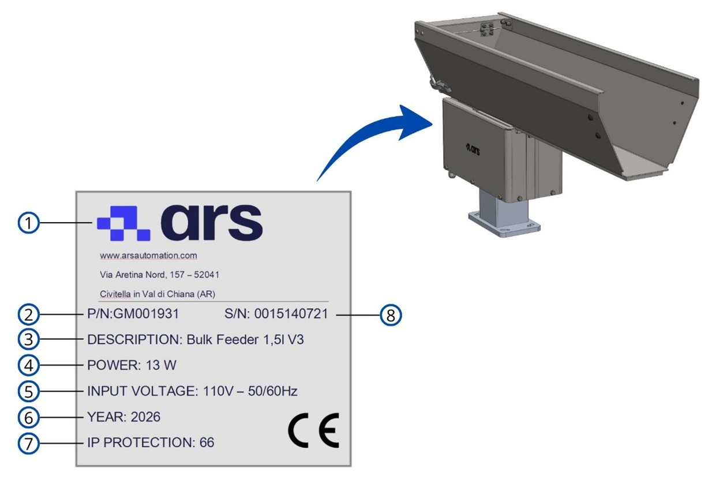

# **Informazioni Preliminari Generali**

Questa sezione contiene le informazioni identificative della macchina, le direttive applicabili, le informazioni legali e le avvertenze fondamentali per l’uso corretto e sicuro della Tramoggia.

```{important}
Prima di installare, utilizzare o effettuare manutenzione sulla macchina, leggere attentamente l’intero manuale e tutta la documentazione allegata.

Il mancato rispetto delle istruzioni riportate può causare:
- danni alla macchina;
- perdita delle condizioni di sicurezza;
- rischi per operatori e manutentori;
- decadenza della garanzia.
```

<script src="https://unpkg.com/@phosphor-icons/web"></script>

<div class="isw-page">
<style>
  /* ── Reset & Base Layout ── */
  .isw-page {  max-width: 860px; margin: 0 auto; padding: 0 0 3rem;  }
  .isw-page h1, .isw-page h2, .isw-page h3 { color: #1a3a52; font-weight: 700; }
  
  /* ── Quick Info Cards (Identificazione) ── */
  .isw-meta-grid {
    display: grid;
    grid-template-columns: repeat(auto-fit, minmax(280px, 1fr));
    gap: 1rem;
    margin: 1rem 0 2rem;
  }
  .isw-meta-card {
    padding: 1.2rem;
    border: 1.5px solid #d0e4f0;
    border-radius: 10px;
    background: #fff;
  }
  .isw-meta-title {
    font-size: 0.75rem;
    font-weight: 700;
    text-transform: uppercase;
    color: #2980b9;
    margin-bottom: 0.5rem;
    display: flex;
    align-items: center;
    gap: 0.4rem;
  }
  .isw-meta-content {
    font-size: 0.9rem;
    line-height: 1.5;
    color: #1a3a52;
  }

 

  /* ── CE Box ── */
  .isw-ce-box {
    background: #fafafa;
    border: 1px dashed #bcd6ec;
    border-radius: 8px;
    padding: 1.5rem;
    font-family: inherit;
    margin: 1.5rem 0;
  }
  .isw-ce-header {
    text-align: center;
    font-weight: 700;
    font-size: 1.1rem;
    color: #1a3a52;
    margin-bottom: 1.5rem;
    letter-spacing: 0.05em;
  }

</style>

## Identificazione

<div class="isw-meta-grid">
  <div class="isw-meta-card">
    <div class="isw-meta-title"><i class="ph ph-factory"></i> Costruttore</div>
    <div class="isw-meta-content">
      <strong>ARS S.r.l.</strong><br>
      Via Aretina Nord, 157<br>
      52041 – Pieve al Toppo (AR), Italia<br>
      Tel. +390575398611 - Fax +39 0575 398620<br>
      info@arsautomation.com - www.arsautomation.com
    </div>
  </div>
  <div style="margin-top: 2rem;"></div>
  <div class="isw-meta-card">
    <div class="isw-meta-title"><i class="ph ph-cpu"></i> Identificazione Macchina</div>
    <div class="isw-meta-content">
      <strong>Macchina:</strong> Tramoggia<br>
      <strong>Modello base:</strong> 1,5lt – 3lt - 5lt - 10lt - 20lt - 40lt<br><br>
      <small style="color: #7a9ab0; line-height: 1.2; display: block;">
        <em>Nota: In alcune applicazioni potrebbero esistere modelli personalizzati che differiscono da quelli di base. L’identificazione è definita dal progetto di riferimento.</em>
      </small>
    </div>
  </div>
</div>

### Targa di Identificazione

La macchina è dotata di una targa di identificazione posizionata sulla base vibrante. Sulla targhetta sono riportati gli estremi identificativi della macchina da citare in caso di necessità alla ARS S.r.l.



<div class="isw-ret">
<style>
.isw-ret table thead tr,
.isw-ret table thead tr th {
  background: #f0f4f8 !important;
  color: #1a3a52 !important;
  border-bottom: 2px solid #2980b9 !important;
}
</style>
<table style="width:100%; border-collapse:collapse; font-size:0.95rem; margin:0.75rem 0 1.5rem;">
  <thead>
    <tr>
      <th style="padding:0.6rem 0.9rem; text-align:left; font-weight:700; white-space:nowrap; width:100px;">Pos</th>
      <th style="padding:0.6rem 0.9rem; text-align:left; font-weight:700;">Elemento sulla targa</th>
    </tr>
  </thead>
  <tbody>
    <tr style="background:#fff;" onmouseover="this.style.background='#e8f4fc'" onmouseout="this.style.background='#fff'">
      <td style="padding:0.55rem 0.9rem; border-bottom:1px solid #e9f2f9; font-family:monospace; font-size:1.05rem; font-weight:700; color:#2980b9;">1</td>
      <td style="padding:0.55rem 0.9rem; border-bottom:1px solid #e9f2f9; color:#334e5e;">Logo Costruttore</td>
    </tr>
    <tr style="background:#f7fbfe;" onmouseover="this.style.background='#e8f4fc'" onmouseout="this.style.background='#f7fbfe'">
      <td style="padding:0.55rem 0.9rem; border-bottom:1px solid #e9f2f9; font-family:monospace; font-size:1.05rem; font-weight:700; color:#2980b9;">2</td>
      <td style="padding:0.55rem 0.9rem; border-bottom:1px solid #e9f2f9; color:#334e5e;">N° parte</td>
    </tr>
    <tr style="background:#fff;" onmouseover="this.style.background='#e8f4fc'" onmouseout="this.style.background='#fff'">
      <td style="padding:0.55rem 0.9rem; border-bottom:1px solid #e9f2f9; font-family:monospace; font-size:1.05rem; font-weight:700; color:#2980b9;">3</td>
      <td style="padding:0.55rem 0.9rem; border-bottom:1px solid #e9f2f9; color:#334e5e;">Modello Macchina</td>
    </tr>
    <tr style="background:#f7fbfe;" onmouseover="this.style.background='#e8f4fc'" onmouseout="this.style.background='#f7fbfe'">
      <td style="padding:0.55rem 0.9rem; border-bottom:1px solid #e9f2f9; font-family:monospace; font-size:1.05rem; font-weight:700; color:#2980b9;">4</td>
      <td style="padding:0.55rem 0.9rem; border-bottom:1px solid #e9f2f9; color:#334e5e;">Potenza</td>
    </tr>
    <tr style="background:#fff;" onmouseover="this.style.background='#e8f4fc'" onmouseout="this.style.background='#fff'">
      <td style="padding:0.55rem 0.9rem; border-bottom:1px solid #e9f2f9; font-family:monospace; font-size:1.05rem; font-weight:700; color:#2980b9;">5</td>
      <td style="padding:0.55rem 0.9rem; border-bottom:1px solid #e9f2f9; color:#334e5e;">Tensione di Alimentazione</td>
    </tr>
    <tr style="background:#fff;" onmouseover="this.style.background='#e8f4fc'" onmouseout="this.style.background='#fff'">
      <td style="padding:0.55rem 0.9rem; border-bottom:1px solid #e9f2f9; font-family:monospace; font-size:1.05rem; font-weight:700; color:#2980b9;">6</td>
      <td style="padding:0.55rem 0.9rem; border-bottom:1px solid #e9f2f9; color:#334e5e;">Anno di Costruzione</td>
    </tr>
    <tr style="background:#fff;" onmouseover="this.style.background='#e8f4fc'" onmouseout="this.style.background='#fff'">
      <td style="padding:0.55rem 0.9rem; border-bottom:1px solid #e9f2f9; font-family:monospace; font-size:1.05rem; font-weight:700; color:#2980b9;">7</td>
      <td style="padding:0.55rem 0.9rem; border-bottom:1px solid #e9f2f9; color:#334e5e;">Grado di protezione IP</td>
    </tr>
    <tr style="background:#fff;" onmouseover="this.style.background='#e8f4fc'" onmouseout="this.style.background='#fff'">
      <td style="padding:0.55rem 0.9rem; border-bottom:1px solid #e9f2f9; font-family:monospace; font-size:1.05rem; font-weight:700; color:#2980b9;">8</td>
      <td style="padding:0.55rem 0.9rem; border-bottom:1px solid #e9f2f9; color:#334e5e;">N° matricola</td>
    </tr>
  </tbody>
</table>
</div>


```{warning}
**ATTENZIONE!**

È assolutamente vietato:
- asportare la targa identificativa CE;
- sostituirla con altre targhe non autorizzate.

Qualora, per motivi accidentali, la targa venisse danneggiata o asportata, il cliente deve obbligatoriamente informare il Costruttore.
```

---

## Dichiarazione di Conformità CE (Copia)

<div class="isw-ce-box">
  <div class="isw-ce-header">"CE" DECLARATION OF CONFORMITY</div>
  <div class="isw-meta-content" style="font-size: 0.85rem;">
    <strong>We:</strong> ARS S.r.l. – Via Aretina Nord, 157 – 52041 – Pieve al Toppo (AR), Italia<br><br>
    Declare under our exclusive responsibility that the Product:<br>
    <strong>BULK FEEDER 1,5lt / 3lt / 5lt / 10lt / 20lt / 40lt</strong><br><br>
    This declaration refers to, compliant with the following standards or with other regulations:<br>
    <ul>
      <li>DLGS 17/2010</li>
      <li>2006/42/EC: “Partly completed machinery”</li>
    </ul>
    In compliance with the directive 17/2010 including the use of 2006/42/EC.<br><br>
    We also hereby declare that the machinery described above is intended to be incorporated into other machinery and must not be put into service until the relevant machinery into which it is to be incorporated has been declared in conformity with the essential health and safety requirements of Council Directive 2006/42/EC.<br><br>
    <table style="width: 100%; margin-top: 1.5rem; border: none; font-size: 0.85rem;">
      <tr style="background: none;"><td style="border: none; padding: 0;"><strong>Place:</strong> Arezzo</td><td style="border: none; padding: 0;"><strong>Signature:</strong> [Firmato]</td></tr>
      <tr style="background: none;"><td style="border: none; padding: 0; padding-top: 0.5rem;"><strong>Date:</strong> 01-FEB-2019</td><td style="border: none; padding: 0; padding-top: 0.5rem;"><strong>Full Name:</strong> Marco Mazzini</td></tr>
    </table>
  </div>
</div>

---

## Direttive di Riferimento

La macchina fornita da ARS S.r.l. non rientra nelle categorie di macchine elencate nell’allegato IV della Direttiva Macchine; pertanto, ARS S.r.l. applica la procedura di valutazione della conformità con **controllo interno sulla fabbricazione** (Allegato VIII).

Il fascicolo tecnico di costruzione è stato realizzato conformemente a quanto previsto dall’allegato VII della Direttiva 2006/42/CE ed è disponibile alla verifica degli organi di vigilanza dietro domanda motivata.

ARS S.r.l. provvede all’immissione sul mercato della macchina corredata di:
- Marcatura CE
- Dichiarazione CE di Conformità
- Manuale di istruzioni e avvertenze *(redatto secondo il punto 1.7.4 della Direttiva Macchine 2006/42/CE)*

La macchina è stata progettata in conformità alle seguenti Direttive:

| Direttiva | Descrizione / Ambito |
|------------|----------------------|
| **2006/42/CE** | Direttiva Macchine |
| **2014/30/UE** | Direttiva per la Compatibilità Elettromagnetica |

---


## Destinatari

Il manuale è destinato agli operatori incaricati di utilizzare e gestire la macchina in tutte le sue fasi di vita tecnica. Riporta i temi necessari al mantenimento delle caratteristiche funzionali e qualitative del sistema, unitamente alle avvertenze per un uso in totale sicurezza.

Il manuale, unitamente al certificato di conformità CE, è **parte integrante della macchina** e deve accompagnarla in ogni spostamento o rivendita. È compito dell’utilizzatore mantenere tale documentazione integra per permetterne la consultazione durante tutto l’arco di vita del sistema.

## Fornitura e Conservazione

Il manuale è fornito in formato elettronico. Tutta la documentazione aggiuntiva (schemi elettrici, manuali sub-fornitori) viene fornita in allegato. 
Conservare il manuale a corredo della macchina in modo che possa essere facilmente accessibile e consultato dall'operatore.

- **Integrità:** Deve essere conservato integro. In caso di smarrimento o danneggiamento, richiederne immediatamente copia al Costruttore.
- **Passaggi di proprietà:** Deve seguire la macchina fino alla demolizione (spostamenti, vendita, noleggio, affitto).
- **Allegati:** I manuali allegati sono parte costitutiva di questa documentazione; si applicano le medesime prescrizioni.

:::{attention}
La Ditta Costruttrice declina ogni responsabilità per uso improprio della macchina e/o per danni causati in seguito ad operazioni non contemplate nella documentazione tecnica.*
:::

## Aggiornamenti

Qualora la macchina necessiti di modifiche o sostituzioni funzionali, la revisione o l’aggiornamento del manuale è a carico del Costruttore, il quale si occupa della consegna dei contenuti aggiornati.
L’utilizzatore ha la responsabilità di assicurarsi che solo le versioni aggiornate del manuale siano effettivamente presenti e distribuite nei punti di utilizzo.

## Lingua

Il manuale originale è stato redatto in **lingua italiana**. Eventuali traduzioni in lingue aggiuntive devono essere effettuate partendo dalle istruzioni originali. In caso di incongruenze, è necessario attenersi al testo in lingua originale o contattare l'Ufficio Documentazione Tecnica del Costruttore.

---

## Profili degli Operatori e Qualifiche

| Profilo | Definizione e Competenze Tecniche |
|----------|-----------------------------------|
| **Operatore** | Personale dell’utilizzatore addestrato e abilitato alla conduzione della macchina ai fini produttivi. Esegue le operazioni necessarie al buon funzionamento e alla propria incolumità. Ha comprovata esperienza e formazione specifica. In caso di dubbi, segnala le anomalie al superiore.<br><br>**Nota:** non è autorizzato ad effettuare alcuna attività di manutenzione. |
| **Manutentore Meccanico** | Tecnico qualificato per attività preventiva/correttiva su parti meccaniche. Ha accesso a tutte le parti della macchina per analisi visiva, regolazione e taratura. Conduce la macchina come l'operatore, interviene sui gruppi meccanici, legge schemi pneumatici/oleodinamici, disegni tecnici e liste ricambi. In casi straordinari, opera con sicurezze ridotte.<br><br>**Nota:** non è abilitato ad intervenire su impianti elettrici sotto tensione. |
| **Manutentore Elettrico** | Tecnico qualificato per manutenzione preventiva/correttiva sull'impianto elettrico. Conduce la macchina come l'operatore, interviene sulle regolazioni, legge gli schemi elettrici e verifica i cicli funzionali.<br><br>**Può operare sotto tensione all'interno dei quadri elettrici solo se in possesso di idoneità PEI (Normativa EN50110-1).**<br><br>Non esegue programmazione software (PLC o logiche di sicurezza) e non modifica le password. |
| **Tecnico esperto software** | Tecnico del Costruttore con comprovata esperienza su sistemi basati su PLC/PC e azionamenti. Esegue modifiche ai dati macchina, creazione di programmi di lavoro e regolazione dei parametri drive.<br><br>Può operare all'interno dei quadri elettrici sotto tensione solo se soggetto idoneo **PEI (EN50110-1)**. |
| **Tecnico del Costruttore** | Tecnico specializzato e qualificato direttamente dal Costruttore (o dal distributore) per operazioni ad elevata complessità, conoscendo nel dettaglio il ciclo costruttivo della macchina. Interviene su richiesta specifica dell'utilizzatore con competenze di tipo prevalentemente meccanico. |

Le qualifiche sopra riportate rientrano obbligatoriamente all'interno della categoria di **"Persona Addestrata"**:

<div class="isw-meta-card">
 <div class="isw-meta-title"> Persona Addestrata </div>
  <div class="isw-meta-content">
      Soggetto informato, istruito ed addestrato sul lavoro e sui pericoli derivanti da un uso improprio. Conosce l’importanza dei dispositivi di sicurezza, le norme antinfortunistiche e le condizioni operative per il lavoro in sicurezza.
    </div>
</div>

---

## Simbologia di Sicurezza Utilizzata

::::{list-table}
:widths: 15 85
:header-rows: 1 

* - Simbolo 
  - Significato e Descrizione 

* - :::{image} ../../../../../_shared/media/images/simbolo_avvertenza.png
    :width: 60px
    :align: center
    ::: 
  - Identifica avvertenze cruciali per la sicurezza dell'operatore e/o per l'integrità della macchina. 

* - :::{image} ../../../../../_shared/media/images/simbolo_elettrico.png
    :width: 60px
    :align: center
    ::: 
  - Segnala pericoli e rischi di natura elettrica (presenza di tensione).

* - :::{image} ../../../../../_shared/media/images/obbligo_info.png
    :width: 60px
    :align: center
    ::: 
  - Identifica informazioni di particolare importanza all'interno del manuale relative alla gestione operativa del sistema.
::::

---

## Glossario Tecnico

| Termine | Definizione Tecnica |
|----------|---------------------|
| **Accessori di sollevamento** | Componenti o attrezzature non collegate alle macchine che consentono la presa del carico, disposti tra la macchina e il carico (incluse imbracature e loro componenti). |
| **Avaria** | Guasto di vario genere che impedisce il normale funzionamento di un macchinario o di un impianto. |
| **Catene, funi o cinghie** | Elementi progettati e costruiti a fini del sollevamento come parte integrante di macchine o accessori di sollevamento. |
| **Danno** | Qualunque conseguenza negativa derivante dal verificarsi di un evento pericoloso. |
| **D.P.I.** | Dispositivo di Protezione Individuale: prodotti atti a salvaguardare la salute e la sicurezza dei lavoratori che li indossano. |
| **Macchina** | Insieme equipaggiato (o destinato ad esserlo) di un sistema di azionamento, composto di parti di cui almeno una mobile, collegate per un'applicazione determinata. |
| **Malfunzionamento** | Funzionamento difettoso o inadeguato di una macchina o di un suo elemento nell'eseguire una specifica funzione. |
| **Pericolo** | Potenziale sorgente di danno che, se non evitato, comporta un rischio per la sicurezza e la salute. |
| **Protezione** | Difesa interposta contro ciò che può causare danno. Può essere **Attiva** (azionata dall'operatore, es. arresti di emergenza) o **Passiva** (interviene senza comando umano). |
| **Riparo** | Barriera fisica, progettata come parte strutturale della macchina, per fornire protezione. |
| **Rischio** | Combinazione della probabilità e della gravità di una lesione o di un danno per la salute in una situazione pericolosa. |
| **Rischio residuo** | Rischio che permane anche dopo l'adozione delle misure di protezione e prevenzione in fase di progetto. |
| **Uso previsto** | Uso della macchina in totale conformità alle informazioni fornite nelle istruzioni d'uso. |
| **Uso scorretto prevedibile** | Uso della macchina in un modo non previsto dal progettista, derivante da un comportamento umano facilmente prevedibile. |

---

## Dispositivi di Protezione Individuale (D.P.I.) Obbligatori

Nelle fasi di prossimità alla macchina (montaggio, manutenzione, regolazione), attenersi alle norme generali antinfortunistiche e impiegare i DPI indicati:

::::{list-table}
:widths: 15 85
:header-rows: 1 

* - Simbolo 
  - Prescrizione d'uso obbligatoria 

* - :::{image} ../../../../../_shared/media/images/obbligo_guanti.png
    :width: 60px
    :align: center
    ::: 
  - **Guanti protettivi:** Obbligo di utilizzare guanti protettivi o isolanti a protezione delle mani. Indica una prescrizione per il personale di utilizzare guanti protettivi o isolanti.

* - :::{image} ../../../../../_shared/media/images/obbligo_occhiali.png
    :width: 60px
    :align: center
    :::
  - **Occhiali di protezione:** Obbligo di utilizzare occhiali protettivi per la salvaguardia degli occhi. Indica una prescrizione per il personale di utilizzare occhiali protettivi per occhi.

* - :::{image} ../../../../../_shared/media/images/obbligo_antiinf.png
    :width: 60px
    :align: center
    :::
  - **Scarpe infortunistiche:** Obbligo di calzare scarpe antinfortunistiche per la protezione dei piedi. Indica una prescrizione per il personale di utilizzare scarpe antinfortunistiche a protezione dei piedi.

* - :::{image} ../../../../../_shared/media/images/obbligo_rumore.png
    :width: 60px
    :align: center
    :::
  - **Protezione dal rumore:** Obbligo di utilizzare cuffie o tappi auricolari per la protezione dell'udito. Indica una prescrizione per il personale di utilizzare cuffie o tappi a protezione dell’udito.

* - :::{image} ../../../../../_shared/media/images/obbligo_indumenti.png
    :width: 60px
    :align: center
    :::
  - **Indumenti protettivi:** Obbligo di indossare gli specifici indumenti di lavoro protettivi. Indica una prescrizione per il personale di indossare gli specifici indumenti protettivi.

* - :::{image} ../../../../../_shared/media/images/obbligo_manuale.png
    :width: 60px
    :align: center
    :::
  - **Consultazione Manuale:** Obbligo di consultare e comprendere le istruzioni d'uso prima di eseguire qualsiasi attività. Indica una prescrizione per il personale di consultare (e comprendere) le istruzioni d’uso e di avvertenza della macchina prima di operare con essa.

* - :::{image} ../../../../../_shared/media/images/obbligo_casco.png
    :width: 60px
    :align: center
    :::
  - **Casco di Protezione:** Obbligo ad utilizzare il casco di protezione. Indica una prescrizione per il personale di indossare il casco protettivo a protezione del capo.
::::

```{warning}
**ABBIGLIAMENTO DI SICUREZZA**

L’abbigliamento del personale deve essere conforme ai requisiti essenziali di sicurezza previsti dal **Regolamento UE 2016/425** e alle leggi vigenti nel Paese di installazione.

Il mancato rispetto di tali requisiti può compromettere la sicurezza dell’operatore e delle persone esposte durante le attività di utilizzo, installazione e manutenzione della macchina.
```

---

## Mappatura delle Aree di Sicurezza

| Zona | Descrizione e Restrizioni di Accesso |
|------|--------------------------------------|
| **Zone di comando** | Aree in cui l'operatore esegue il controllo delle funzioni cicliche ("postazione di guida"), sia in modalità automatica che semiautomatica tramite i pannelli dedicati. |
| **Zone di manutenzione / regolazione** | Aree accessibili solo ai manutentori meccanici ed elettrici qualificati per operazioni di settaggio. Sono considerate zone a rischio e rimangono interdette durante il ciclo produttivo standard. |
| **Zone pericolose** | Aree interne o perimetrali alla macchina caratterizzate da rischi residui. **È categoricamente vietato l'accesso a chiunque quando la macchina è in funzione**. |

```{warning}
**ACCESSO A ZONE PERICOLOSE**

I rischi presenti nelle zone della macchina sono protetti tramite:
- ripari fisici (carter, portelli);
- dispositivi elettrici interbloccati (sensori, microinterruttori).

Quando il sistema è attivo è severamente vietato:
- scavalcare le protezioni;
- bypassare i dispositivi di sicurezza;
- intervenire all’interno delle aree protette.

La rimozione o l’elusione dei sistemi di sicurezza può causare gravi lesioni a persone e danni alla macchina.
```

---

## Condizioni e Limiti della Garanzia

Le clausole complete sono stabilite nel contratto di vendita, le cui condizioni hanno sempre la priorità rispetto a quanto riportato in questo manuale.

**La validità della garanzia è strettamente legata alle seguenti condizioni:**
- Apertura imballi eseguita con mezzi idonei senza danneggiare i sistemi.
- Installazione ed avviamento eseguiti alla presenza di tecnici abilitati e formati secondo le prescrizioni del manuale.
- Utilizzo della macchina entro i limiti nominali dichiarati nel contratto.
- Manutenzione eseguita nei tempi prestabiliti ricorrendo esclusivamente a **ricambi originali ARS S.r.l.** affidati a personale qualificato.

**La garanzia decade immediatamente in caso di:**
- Mancato rispetto delle norme di sicurezza e inosservanza parziale o totale delle istruzioni.
- Installazione o impiego in ambienti non idonei.
- Rimozione, elusione o manomissione dei dispositivi di controllo e sicurezza (ripari, fotocellule, microinterruttori).
- Rimozione o alterazione della targa identificativa CE o dei pittogrammi di sicurezza.
- Modifiche non autorizzate al software di gestione (PLC, logiche di controllo) o alle password di sistema.
- Uso improprio o affidamento della macchina a personale non istruito/autorizzato.
- Modifiche meccaniche, elettriche o pneumatiche senza esplicita autorizzazione scritta del Costruttore.
- Carenze o anomalie nell'erogazione dell'energia di alimentazione (elettricità, aria compressa).
- Mancata attuazione sistematica del piano di manutenzione programmata.
- Smaltimento finale della macchina eseguito in violazione delle norme ambientali vigenti.

## Sicurezze 

### Rumore 
Le misurazioni di rumorosità sono state effettuate in accordo con quanto stabilito dalle norme UNI EN 11200 e UNI EN ISO 3746. Durante i cicli di funzionamento l’esposizione al rumore del personale è pari a 90 dB.  
Il livello di rumore effettivo della macchina installata durante il funzionamento presso il sito in un processo produttivo è diverso da quello rilevato poiché il rumore è influenzato da alcuni fattori quali:  
•	tipo e caratteristiche del sito;  
•	tipologia della macchina su cu la tramoggia lineare è installata;  
•	altre macchine adiacenti in funzione.  

:::{attention}
**OBBLIGO!**
È obbligatorio utilizzare gli appositi dispositivi di protezione individuale.
:::

### Vibrazioni 
Le vibrazioni prodotte dalla macchina, in funzione delle modalità di conduzione della stessa, non sono pericolose alla salute degli operatori.

:::{attention}
Un’ eccessiva vibrazione può solo essere causata da un guasto meccanico che deve essere immediatamente segnalato ed eliminato, per non pregiudicare la sicurezza della linea e degli operatori.
:::

### Compatibilità Elettromagnetica 
La macchina fornita contiene componenti elettronici soggetti alle normative sulla Compatibilità Elettromagnetica, condizionati da emissioni condotte e irradiate.  
I valori delle emissioni rientrano nelle esigenze normative grazie all’impiego di componenti conformi alla direttiva Compatibilità Elettromagnetica, collegamenti idonei e installazione di filtri dove necessario.  
La macchina risulta quindi conforme alla direttiva sulla Compatibilità Elettromagnetica (EMC).  

:::{attention}
Eventuali attività manutentive sull’apparecchiatura elettrica realizzate in modo non conforme o sostituzioni errate di componenti possono compromettere l’efficienza delle soluzioni adottate.
:::

### Rischi Residui 

La progettazione della macchina è stata eseguita in modo da garantire i requisiti essenziali di sicurezza per l’operatore.  
La sicurezza, per quanto possibile, è stata integrata nel progetto e nella costruzione della macchina; tuttavia, permangono rischi dai quali gli operatori devono essere protetti soprattutto in fase di:  
•	trasporto e installazione;  
•	funzionamento normale;  
•	regolazione e messa a punto,  
•	manutenzione e pulizia;  
•	smontaggio e smantellamento.  
Di seguito per ogni rischio residuo viene fornita una descrizione, la zona o parte di macchina oggetto del rischio (a meno che non ne sia oggetto tutta la macchina) e le informazioni procedurali su come poterlo evitare:  

::::{list-table}
:widths: 15 25 60
:header-rows: 1 

* - Simbolo
  - Rischio 
  - Descrizione ed informazioni procedurali 

* - :::{image} ../../../../../_shared/media/images/simbolo_avvertenza.png
    :width: 60px
    :align: center
    :::
    :::{image} ../../../../../_shared/media/images/pericolo_movimento.png
    :width: 60px
    :align: center
    :::
    :::{image} ../../../../../_shared/media/images/pericolo_spazi.png
    :width: 60px
    :align: center
    :::
  - **PERICOLI DOVUTI ALLA MOVIMENTAZIONE**
  - Le procedure di movimentazione sono descritte al capitolo “Trasporto e installazione” del presente manuale d’istruzioni.
    
    **Rischio residuo:** 
    
    Le operazioni di:
    
    * scarico degli imballi
    * apertura degli imballi
    * movimentazione della macchina
    
    espongono gli operatori al rischio di carichi sospesi e schiacciamento.
    Tali operazioni devono essere svolte esclusivamente da personale specializzato nella conduzione di mezzi di sollevamento e che sia stato opportunamente addestrato allo scopo.

* - :::{image} ../../../../../_shared/media/images/simbolo_avvertenza.png
    :width: 60px
    :align: center
    :::
    :::{image} ../../../../../_shared/media/images/simbolo_elettrico.png
    :width: 60px
    :align: center
    :::
  - **PERICOLO ELETTRICO**
  - Le operazioni di accesso e manutenzione della macchina espongono gli operatori al rischio elettrico. Gli interventi sulle apparecchiature sotto tensione devono essere effettuati esclusivamente da personale esperto e qualificato.
    
    Si raccomandano le seguenti misure di sicurezza:
    
    * prestare la massima attenzione ai pittogrammi di sicurezza relativi al rischio elettrico;
    * non effettuare interventi di manutenzione senza aver preventivamente sezionato l’energia elettrica;
    * consultare i manuali delle attrezzature commerciali per eventuali raccomandazioni specifiche;
    * ispezionare periodicamente il circuito di protezione equipotenziale, verificando che non ci siano discontinuità e serrando le viti di giunzione dei collegamenti.

* - :::{image} ../../../../../_shared/media/images/simbolo_avvertenza.png
    :width: 60px
    :align: center
    :::
  - **PERICOLO DERIVANTE DA POLVERI, SCHEGGE, ECC.**
  - Al termine del ciclo di lavoro potrebbero restare sulla superficie della macchina una serie di residui delle parti alimentate o accumuli di polveri.
    
    Procedere ad un’accurata pulizia della superficie vibrante dopo ogni utilizzo, come descritto all’interno del cap.7 del presente manuale.
::::

:::{attention}
Non effettuare attività di manutenzione e pulizia se prima non si è provveduto a de-energizzare le energie presenti.
:::

:::{attention}
È assolutamente vietato rimuovere le protezioni di sicurezza installate sulla macchina o aprire i ripari fissi senza prima aver sezionato l’alimentazione elettrica e pneumatica della macchina.
:::

Sarà cura dell’utilizzatore provvedere a:  
•	analizzare i rischi che potrebbero verificarsi durante una fase di movimentazione e di installazione all’interno della propria sede (le analisi fatte sulla movimentazione della macchina sono state fatte solo in considerazioni delle caratteristiche della stessa);  
•	sensibilizzare ed istruire il personale addetto alle operazioni sulle postazioni di lavoro e il personale addetto alla conduzione della macchina;  
•	applicare le segnaletiche visive di sicurezza nell’ambiente di lavoro dopo aver valutato i rischi all’interno delle aree di transito o di comando.  


</div>