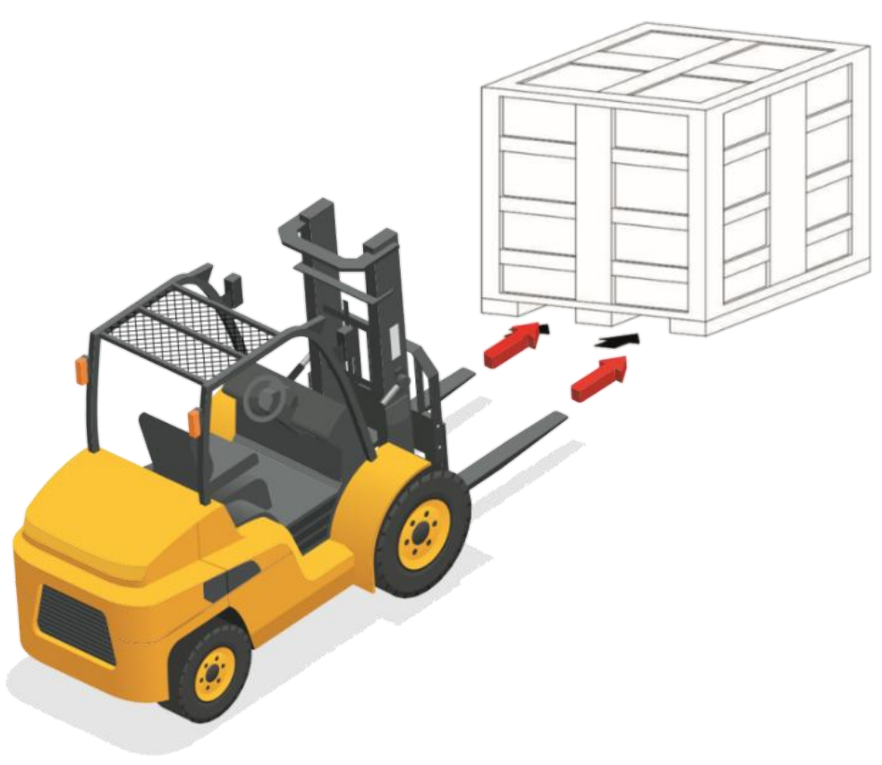
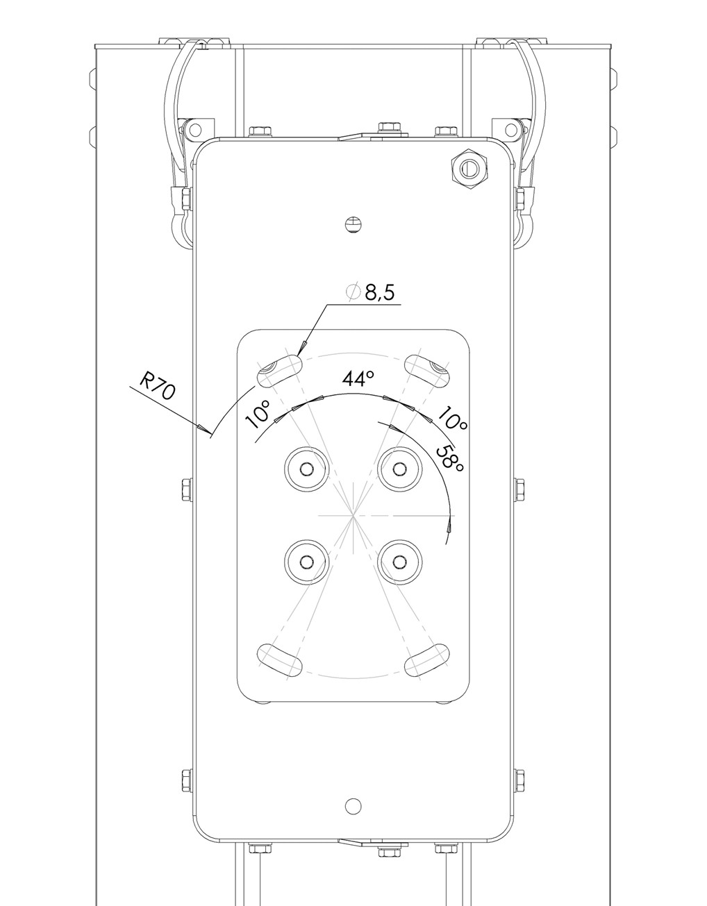

# **Trasporto e Installazione**

:::{important}
Le operazioni di sollevamento e movimentazione devono essere eseguite esclusivamente da personale specializzato ed istruito avente le idoneità a svolgere tali attività.
:::

La macchina è stata progettata in modo che nelle fasi di imballo, trasporto e montaggio sia necessario l’uso di un carrello elevatore di portata adeguata. La macchina non dispone di attacchi (esempio: golfari) per il sollevamento.

## Imballo 

La macchina è spedita a cura di ARS s.r.l. dallo stabilimento di produzione a quello del Cliente utilizzatore.
In funzione della distanza del trasporto, dalle richieste specifiche del Cliente, e dal tempo di permanenza del carico nell’imballo, la spedizione della macchina avviene nei seguenti modi: 
•	imballo protettivo normale per corte e medie distanze;
•	imballo protettivo speciale per lunghe distanze.
La spedizione deve essere effettuata con mezzi di trasporto coperti o telonati in dipendenza del tipo di carico.
Alla ricezione della macchina il cliente deve obbligatoriamente verificare che non ci siano danni causati dalle modalità di trasporto o dal personale incaricato delle operazioni specifiche.
•	Nel caso vengano accertati dei danni, lasciare l’imballo in questione nello stato trovato e richiedere immediatamente l’accertamento del danno da parte dell’impresa di spedizioni competente, dopodiché comunicare con un certificato di avaria il danno rilevato all’assicurazione di trasporto competente e al punto vendita.
•	Se la macchina viene consegnata in cassa su bancale o staffe di legno con eventuale protezione in cellophane termoretraibile, provvedere inizialmente alla rimozione dell’imballo o dell’eventuale copertura. Per liberare completamente la macchina, rimuovere le viti e la reggettatura metallica. Successivamente sollevare la macchina tramite gru o carrello sollevatore come descritto nell’apposita tabella e rimuovere il bancale utilizzato per il trasporto.

### Tabella divisione gruppi e pesi - con imballo 

Seguire la seguente tabella per pesi e dimensioni comprensivi di imballo.  

:::{attention}
Nel caso di modelli personalizzati i valori potrebbero differire da quelli indicati. Per modelli di questo genere fare riferimento alla documentazione di progetto.
:::

### Movimentazione con imballo 

| MOVIMENTAZIONE DEL CORPO MACCHINA CON IMBALLO | |
|-----------------------------------------------|--|
| Qualifica operatore | Conduttore di mezzi di sollevamento |
| DPI necessari |  |
| Mezzo di sollevamento | Carrello elevatore di portata non inferiore a 50 kg |

:::{attention}
Utilizzare solo idonei ed omologati mezzi di sollevamento; compatibili per le dimensioni e il peso della macchina. 
:::

:::{attention}
Accertarsi che nessuno sosti sotto e nel raggio d’azione del mezzo di sollevamento.  
:::

Per la movimentazione del corpo macchina con imballo, procedere come descritto:  
| Passo | Azione |
|-------|---------|
| 1 | Posizionare le forche del carrello elevatore sotto alla cassa di legno in cui è riposta la macchina. |
| 2 | Assicurarsi che le forche fuoriescano dalla parte anteriore del carico (almeno 5 cm), per una lunghezza sufficiente ad eliminare eventuali rischi di ribaltamento della parte trasportata. |
| 3 | Sollevare le forche fino al contatto col carico.    **Nota:** se necessario fissare il carico alle forche con morsetti o dispositivi similari. |
| 4 | Sollevare lentamente il carico di qualche decina di centimetri e verificarne la stabilità facendo attenzione che il baricentro del carico sia posizionato al centro delle forche di sollevamento. |
| 5 | Inclinare il montante all’indietro (verso il posto guida) per avvantaggiare il momento ribaltante e garantire una maggiore stabilità del carico durante il trasporto. |
| 6 | Adeguare la velocità di trasporto in base alla pavimentazione ed al tipo di carico, evitando manovre brusche. |

:::{attention}
Posizionare le forche del carrello elevatore come indicato in figura
:::

### Rimozione imballo   
Per la rimozione dell’imballo, procedere come descritto:  
| Passo | Azione |
|-------|---------|
| 1 | Posizionare la macchina nel luogo ad essa destinato. |
| 2 | Rimuovere la reggettatura dalla base della cassa in legno usata per la spedizione. |
| 3 | Afferrare la tramoggia dalla sua base, non dalla vasca, per sollevarla e rimuoverla dalla cassa. |  

:::{attention}
Per l’operazione di sollevamento manuale dalla cassa di legno della tramoggia è necessaria la presenza di n°2 operatori.
:::  

Per la movimentazione della macchina e/o delle sue parti, fare riferimento al paragrafo “Trasporto e movimentazione”.  

### Smaltimento imballo 

L’imballaggio è parte integrante della fornitura e non viene ritirato, per cui lo smaltimento del suddetto è a carico dell’acquirente.
L’eventuale smaltimento o distruzione deve avvenire nel rispetto delle normative vigenti nel paese dell’utilizzatore, tenendo conto della natura dei materiali:  
•	legname per le casse;  
•	film di materia plastica per la protezione della macchina e nastri adesivi per il fissaggio degli stessi;   
•	sacchetti di sostanza assorbente per l’umidita;  
•	ecc.  

## Trasporto e Moviumentazione 

ARS s.r.l. in funzione delle modalità di trasporto utilizza imballi e fissaggi adeguati a garantire l’integrità e la conservazione durante il trasporto.
Al ricevimento della macchina, verificare che nessuna parte abbia subito danni durante il trasporto e/o la movimentazione.
Nel caso si riscontrassero danni è obbligatorio segnalarli immediatamente al Costruttore.
Le attività di movimentazione descritte in questo paragrafo devono essere effettuate da personale qualificato per tali operazioni: personale appositamente addestrato per eseguire in tutta sicurezza le operazioni di carico, scarico e movimentazione mediante mezzi di sollevamento, e che sia a conoscenza delle regole di prevenzione degli infortuni.

:::{attention}
Non sollevare mai l’unità tramite la vasca o la parte mobile in quanto oltre a stararsi potrebbe anche subire deformazioni o rotture.
:::

:::{attention}
ARS S.r.l. non risponde dei danni, a cose o a persone, causati da incidenti provocati dal mancato rispetto delle istruzioni riportate nel presente manuale.
:::

## Assemblaggio 
Dopo il disimballo, la tramoggia si presenta già assemblata.
Procedere con il fissaggio sulla seguente staffa con viti M8:

:::{attention}
Nel caso di modelli personalizzati i gruppi potrebbero differire, parzialmente o totalmente, da quelli base. Per modelli di questo genere fare riferimento al disegno costruttivo di progetto.
:::

## Installazione 

### Predisposizioni a carico del cliente 
Fatti salvi eventuali accordi contrattuali diversi è normalmente a carico del Cliente la predisposizione di:  
•	locali (comprese opere murarie, come fondazioni o canalizzazioni eventualmente richieste, illuminazione);  
•	impianti elettrici fino ai punti di alimentazione della macchina, in conformità alle norme vigenti nel paese di installazione e/o richiesti dal Costruttore della macchina. Tutte le specifiche tecniche richieste dal Costruttore sono contenute nel contratto di vendita. Il Costruttore declina ogni responsabilità se il cliente non riuscisse a garantire le caratteristiche tecniche dell’impianto elettrico richieste nel contratto di vendita.  
•	l’alimentazione elettrica per la macchina, compreso il conduttore di messa a terra, secondo le caratteristiche e tolleranze richieste e specificate nel presente manuale.  
•	servizi ausiliari adeguati alle esigenze della macchina;  
•	utensili e materiali di consumo occorrenti per il montaggio e installazione;  
•	lubrificanti necessari per la messa in moto della macchina;  
•	l’alimentazione pneumatica per la macchina adeguata come da specifica presente al paragrafo “Dati tecnici”;  
•	mezzi di sollevamento e movimentazione adeguati.  

### Condizioni ambientali ammesse 

L’ambiente in cui la macchina viene installata e utilizzata è interno, al riparo da agenti atmosferici quali: pioggia, grandine, neve, nebbia, polveri in sospensione, polveri combustibili, al riparo da agenti aggressivi quali vapori corrosivi o sorgenti di calore eccessiva e non deve essere classificato ATEX.
L’impiego della macchina, dei sistemi di controllo associati e delle apparecchiature di azionamento in condizioni diverse da quelle elencate non è consentito.
In particolare, l’ambiente di installazione e utilizzo non deve presentare:  
•	Esposizione a fumi corrosivi;  
•	Esposizione ad umidità eccessiva (superiori all’85 %) e rapidi cambiamenti di umidità relativa (superiori a 0,005 p.u./h);   
•	Esposizione a polvere eccessiva;  
•	Esposizione a polvere abrasiva;  
•	Esposizione a vapori oleosi;  
•	Esposizione a miscele esplosive di polveri o di gas;  
•	Esposizione all’aria salmastra;  
•	Esposizione a vibrazioni, urti o scosse anomali;  
•	Esposizioni ad intemperie fuori dai limiti permessi o sgocciolamento;  
•	Esposizione a condizioni non usuali di trasporto o immagazzinamento;  
•	Esposizione a variazioni termiche elevate o rapide (superiori a 5K/h);  
•	Presenza di radiazioni nucleari.  
La macchina è progettata e costruita per funzionare, in sicurezza, nelle seguenti condizioni ambientali:  

| Condizioni ambientali ammesse | |
|--------------------------------|----------------|
| Temperatura ambiente | 5 ÷ 40 °C |
| Range di umidità | 5 - 90 % (senza condensa) |
| Illuminazione ambiente | Luce a neon |

:::{attention}
Condizioni ambientali diverse da quelle specificate possono causare gravi danni alla macchina.
Il posizionamento della macchina in ambienti non corrispondenti a quanto indicato fa decadere la garanzia per gli organi da sostituire.
:::

:::{important}
La superficie di lavoro deve essere sufficientemente illuminata. Nel caso in cui sul posto di lavoro si riscontrino zone d’ombra o dislivelli, sarà cura dell’utente predisporre dispositivi di illuminazione adeguati.  
Se non vengono rispettate queste prescrizioni il Costruttore declina ogni responsabilità.
:::

### Area di Installazione 

:::{attention}
Non sollevare mai l’unità tramite l’equipaggio mobile, in quanto il vibratore è stato tarato dalla fabbrica in base alle vostre specifiche esigenze e potrebbe subire starature.
:::

L’unità non deve essere installata laddove il canale possa venire in contatto con qualsiasi oggetto rigido o superficie adiacente, mantenere quindi un gioco di circa 3-5 cm tra la parte vibrante e le parti statiche adiacenti.
Le tramogge possono sopportare un carico massimo come riportato nella tabella successiva ed è quindi importante dimensionare il supporto che dovrà sostenere, in sicurezza, il peso complessivo del sistema sotto carico vibrante.

| Modello | Carico massimo ammissibile | Produzione (T/h) |
|---------|-----------------------------|------------------|
| 1,5lt | 1 kg | 0,6 |
| 3lt | 1,5 kg | 0,6 |
| 5lt | 3 kg | 2 |
| 10lt | 3 kg | 2 |
| 20lt | 3 kg | 2 |
| 40lt | 7,5 kg | 5 |

Il gruppo di controllo dovrà essere installato il più possibile vicino alla tramoggia, in luogo asciutto, pulito e privo di vibrazioni.

### Posizionamento tramoggia

| Passo | Azione |
|-------|---------|
| 1 | Posizionare la tramoggia su un piano stabile.    **Nota:** se la tramoggia viene installata sulla piattaforma di una macchina (sensibile a vibrazioni), posizionare del materiale isolante e anti-vibrazione fra la piattaforma e la tramoggia. |
| 2 | Fissare la tramoggia attraverso gli appositi fori.    **Nota:** la tramoggia standard presenta 4 fori per vite M8 alla sua base per consentire il fissaggio ad una superficie. |
| 3 | Procedere con gli allacciamenti necessari (fare riferimento al paragrafo “Allacciamenti”). |

:::{attention}
Nel caso di modelli personalizzati il carico massimo ammissibile e la produzione potrebbero differire dai valori indicati. Per modelli di questo genere il Costruttore mette a disposizione i dati in esame.
:::

:::{attention}
Assicurarsi che la superficie di appoggio della macchina sia piana ed orizzontale e sia idonea a sostenerne il peso.
:::

## Allacciamenti 
Per la messa in funzione della macchina devono essere assicurati i necessari allacciamenti e collegamenti alle reti locali:  
•	allacciamento elettrico (comprensivo della connessione della messa a terra),  
È responsabilità dell’utilizzatore garantire le caratteristiche di allacciamento richieste.  

:::{attention}
Gli allacciamenti richiesti devono essere effettuati da personale qualificato ed autorizzato. 
:::

### Allacciamento Elettrico 

:::{attention}
Prima di eseguire qualsiasi operazione di allacciamento elettrico, è importante controllare che la macchina sia spenta. 
:::

:::{attention}
Assicurarsi che la linea di alimentazione elettrica cliente sia stata preventivamente sezionata.
:::

La conformità del collegamento tra macchina ed impianto di messa a terra è a cura dell’acquirente  

:::{attention}
L’operazione deve essere eseguita esclusivamente da personale specializzato ed autorizzato (manutentore elettrico).
:::

Prima di procedere con l’allacciamento elettrico verificare che:  
•	il manutentore sia a conoscenza delle normative vigenti nel paese d’installazione;  
•	i valori della frequenza e della tensione di alimentazione della macchina corrispondano ai valori della rete di alimentazione;  
•	la sezione dei cavi elettrici utilizzati sia adeguata all’assorbimento;  
•	la linea di alimentazione elettrica sia adeguata a sopportare i massimi assorbimenti della macchina;  
•	la messa a terra del circuito sia conforme alle norme EN 60204-1;  
•	i materiali impiegati nell’impianto di messa a terra abbiano adeguata solidità o adeguata protezione meccanica.  

:::{attention}
Non operare con mani ed oggetti umidi. In caso di incendio non utilizzare acqua sui componenti elettrici.
:::

| ALLACCIAMENTO ELETTRICO - AC | |
|------------------------------|------------------------------|
| Qualifica operatore | Manutentore elettrico |  

Per l’allacciamento alla rete elettrica - AC, procedere come descritto di seguito:  

| Passo | Azione |
|-------|---------|
| 1 | Connettere il sistema all’alimentazione. |
| 2 | Controllare che la messa a terra sia correttamente installata. |  

:::{important}
L’alimentazione è 115 VAC o 230 VAC +/-5% (115 VAC su richiesta).
:::

:::{attention}
Un' alimentazione errata può causare problemi al sistema ed impedire che operi correttamente
:::
